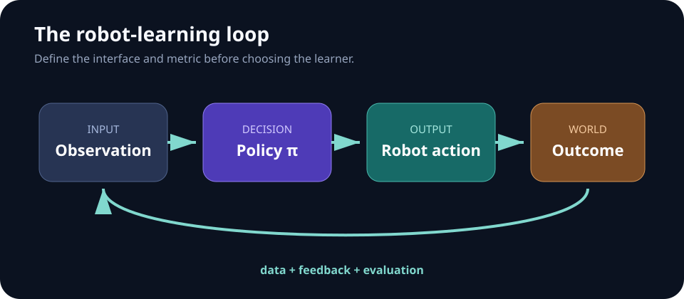

# Week 01 — Introduction to Robot Learning

[← Curriculum](README.md) · **Week 1 of 11** · [Next: Control and MDPs →](week-02-control-and-mdps.md)

## Complete lecture deck



## Outcomes

- Distinguish model-based control, imitation learning, reinforcement learning, and generalist-policy training.
- Write an unambiguous robot-learning task contract.
- Separate training objectives from evaluation metrics.

## Method map

| Available signal | Natural starting point | Central risk |
| --- | --- | --- |
| Known dynamics and objective | Feedback control or planning | Model mismatch |
| Expert actions | Behavior cloning | Compounding errors |
| Online rewards | Reinforcement learning | Unsafe, expensive exploration |
| Fixed reward-labeled logs | Offline RL | Unsupported actions |
| Mixed vision, language, and action data | Generalist/VLA pretraining | Dataset and embodiment mismatch |

## Core notes

Robot learning sits at the intersection of perception, decision-making, and control. A policy maps the information available to the robot—state, observations, language, history, or all four—to an action or action sequence. Learning is useful when writing that mapping by hand is brittle, when demonstrations contain valuable behavior, or when interaction can improve a policy.

The method should follow the supervision available:

- **Control/model-based planning:** dynamics and objectives are known well enough to optimize directly.
- **Imitation learning:** an expert provides observation-action examples.
- **Reinforcement learning:** interaction provides rewards rather than correct actions.
- **Offline or foundation-model training:** heterogeneous logged data provides scale, but creates distribution and embodiment mismatches.

Before choosing an algorithm, define the task. Specify observations, actions, control frequency, horizon, reset rules, success criteria, safety limits, and the training/evaluation distributions. “It looks good” is not a metric. Report success rate, time-to-success, violations, and resource cost separately.

## The task contract

A reproducible task can be written as

> **Task = interface + distribution + objective + protocol.**

- **Interface:** sensor inputs, action parameterization, control rate, and history.
- **Distribution:** training scenes, evaluation scenes, object variation, and disturbances.
- **Objective:** success and safety metrics; the reward is only a training signal.
- **Protocol:** reset, termination, seed policy, episode count, and compute budget.

Keep the deployment loop explicit: observe → infer → apply an action → measure → repeat. A model that performs well on stored frames may still fail when its own actions change the next observation.

## Failure modes to watch

- The task leaks privileged simulator state into training but not deployment.
- Training and evaluation use the same object instances or initial states.
- A shaped reward improves while actual task success remains flat.
- Results omit the controller frequency, reset policy, or safety violations.

## Concept checks

1. A robot has thousands of demonstrations but cannot collect new data. Which learning regimes remain feasible, and what distribution-shift risk dominates?
2. Why can a lower training loss produce a worse closed-loop policy?

## Build milestone

Create a one-page task card for a simulated reach, push, or pick task. Include a scripted/random baseline, three seeds, a success metric, a safety metric, and one out-of-distribution split. No learning is required this week.

## Evaluation checklist

- [ ] One non-learning baseline
- [ ] At least three seeds where practical
- [ ] In-distribution and shifted evaluation sets
- [ ] Success, safety, latency, and data/compute cost reported separately

---

[← Curriculum](README.md) · [Next: Control and MDPs →](week-02-control-and-mdps.md)
