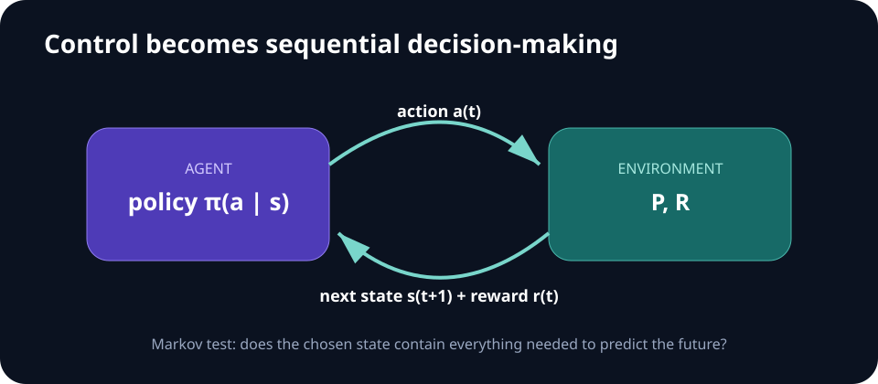

# Week 02 — Robot Control and MDPs

[← Introduction](week-01-introduction.md) · **Week 2 of 11** · [Next: Imitation Learning →](week-03-imitation-learning.md)

## Optional slide gallery



## Outcomes

- Connect feedback control to sequential decision-making.
- Define an MDP and identify when the chosen state is not Markov.
- Implement a control baseline and a tabular planning baseline.

## Quick reference

| Symbol | Meaning |
| --- | --- |
| `sₜ, aₜ` | State and action at time `t` |
| `P(s′│s,a)` | Transition distribution |
| `R(s,a,s′)` | Immediate reward |
| `γ` | Discount factor in `[0,1)` |
| `π(a│s)` | Policy |
| `Vπ(s), Qπ(s,a)` | State and action value under `π` |

## Core notes

Classical feedback control chooses actions from the current error. A proportional controller reacts to present error; integral action corrects persistent bias; derivative action damps fast change. This is often the strongest first baseline for a low-level robot task.

An MDP is described by states, actions, transitions, rewards, and a discount or finite horizon. A policy induces trajectories; the return aggregates future rewards; value functions predict expected return. Bellman equations express a value as immediate reward plus the value of the next state. Dynamic programming repeatedly applies this structure through policy evaluation, policy iteration, or value iteration.

The Markov assumption is a modeling decision, not a property guaranteed by the environment. A single camera frame may hide velocity, contact state, or intent. Frame stacking, recurrence, state estimation, or belief-state methods can repair missing information.

Rewards are specifications and can be exploited. Keep the true evaluation metric outside the shaped training reward, test simple pathological policies, and log individual reward terms.

## Key relations

> **Return:** `Gₜ = rₜ + γrₜ₊₁ + γ²rₜ₊₂ + …`
>
> **Bellman optimality:** `V*(s) = maxₐ E[r + γV*(s′) │ s,a]`

Value iteration alternates one operation: replace every state's value with the best one-step lookahead using the previous value table. Stop when the largest update is below a tolerance, then choose the maximizing action in each state.

## Control baseline

For error `e(t) = target - measurement`, a PID command combines present, accumulated, and changing error:

> `u(t) = Kₚe(t) + Kᵢ∫e(τ)dτ + K_d de(t)/dt`

Tune with actuator limits and sampling time in the loop. Add anti-windup for saturated integral action and filter noisy derivative estimates. A learned policy should beat this baseline on a reason the task actually values—robustness, adaptation, or a harder observation interface—not merely because the PID was untuned.

## Common modeling mistakes

- Calling an observation “state” when it omits velocity or contact history.
- Comparing discounted training return with undiscounted success inconsistently.
- Allowing terminal transitions to bootstrap from a nonexistent next value.
- Shaping rewards so strongly that the agent avoids completing the task.

## Paper discussion

Use [random search for RL](https://arxiv.org/abs/1803.07055) and [Deep RL Doesn't Work Yet](https://www.alexirpan.com/2018/02/14/rl-hard.html) to ask: how strong must a baseline be before a learned controller is convincing?

## Build milestone

Implement a PID controller for one continuous task and value iteration for one tiny discrete MDP. Plot tracking error for the controller and verify the Bellman residual for the MDP solution.

Report rise time, steady-state error, overshoot, return, success rate, and the final Bellman residual. Perturb one physical parameter to test robustness.

---

[← Introduction](week-01-introduction.md) · [Next: Imitation Learning →](week-03-imitation-learning.md)
