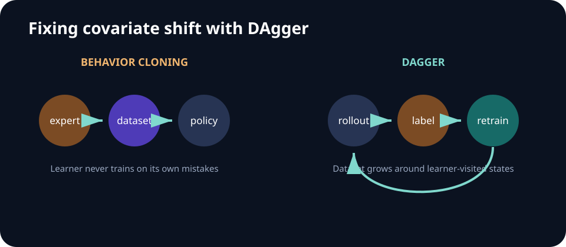

# Week 03 — Imitation Learning

[← Control and MDPs](week-02-control-and-mdps.md) · **Week 3 of 11** · [Next: Reinforcement Learning I →](week-04-reinforcement-learning-i.md)

## Complete lecture deck



## Outcomes

- Explain why supervised accuracy is insufficient for closed-loop imitation.
- Compare behavior cloning, DAgger, and sequence/action-chunking policies.
- Diagnose covariate shift and causal confusion.

## Quick reference

| Method | Data collection | Strength | Main limitation |
| --- | --- | --- | --- |
| Behavior cloning | Expert trajectories once | Simple and stable | Learner-state shift |
| DAgger | Iterative learner rollouts + expert relabeling | Recovery-state coverage | Requires repeated expert access |
| Action chunking | Demonstrations with sequence targets | Temporal coherence | Slower feedback for long chunks |
| Generative policy | Demonstrations with multimodal targets | Represents alternatives | More complex inference |

## Core notes

Behavior cloning fits a policy to expert observation-action pairs. It is simple and stable, but the learned policy changes which states it visits. Small errors move the robot away from the demonstration distribution; unfamiliar states cause more errors, and mistakes compound over the horizon.

DAgger addresses this by rolling out the learner, querying the expert on states the learner actually visits, aggregating those labels, and retraining. It trades expert effort for better coverage of recovery states. When online relabeling is impossible, dataset diversity, perturbation/recovery demonstrations, conservative deployment, and uncertainty-aware fallback become important.

Robotic behavior is often multimodal: several actions can be correct in the same observation. A mean-squared-error policy may average them into an invalid action. Discrete bins, mixture models, energy-based models, diffusion policies, or action chunks can represent alternatives. Chunking also reduces the effective decision horizon, but long chunks reduce feedback frequency.

Causal confusion appears when a policy uses a correlate that predicts expert actions in the dataset but does not cause success. Evaluate under interventions: change backgrounds, object arrangements, demonstrator artifacts, or history while holding the task fixed.

## Objectives and compounding error

Behavior cloning minimizes supervised negative log-likelihood:

> `L_BC(θ) = - E_(o,a)~D [log πθ(a│o)]`

This expectation is over the expert dataset, while deployment observations come from the learner-induced distribution. A small per-step mistake probability can therefore produce a much larger trajectory-level failure rate over a long horizon.

DAgger closes the loop:

1. Train on the current aggregated dataset.
2. Roll out the learner, optionally mixed with the expert for safety.
3. Ask the expert what action should have been taken at visited states.
4. Add those pairs to the dataset and repeat.

## Dataset and architecture decisions

- Store observation timestamps, action timestamps, control frequency, and episode boundaries.
- Split by trajectory or scene—not individual frames—to avoid leakage.
- Normalize actions with training-set statistics and record the inverse transform.
- Choose whether the policy sees a frame, stacked frames, or recurrent history.
- For visual policies, compare frozen pretrained features with end-to-end training.

## Failure modes

- Validation loss falls while closed-loop success collapses.
- Mean regression averages two valid modes into an invalid motion.
- The policy keys on gripper state, background, or demonstrator artifacts.
- Demonstrations show success paths but no recovery behavior.

## Paper discussion

Contrast the diagnosis in [Causal Confusion in Imitation Learning](https://arxiv.org/abs/1905.11979) with the empirical case for pretrained visual representations in [Pari et al.](https://arxiv.org/abs/2112.01511).

## Build milestone

Collect or synthesize demonstrations, train behavior cloning, then introduce initial-state noise. Add either DAgger or recovery data and compare closed-loop success—not just validation loss—over three seeds.

Plot performance against perturbation magnitude and dataset size. Include the expert, a random policy, and behavior cloning before claiming the interactive method helps.

---

[← Control and MDPs](week-02-control-and-mdps.md) · [Next: Reinforcement Learning I →](week-04-reinforcement-learning-i.md)
