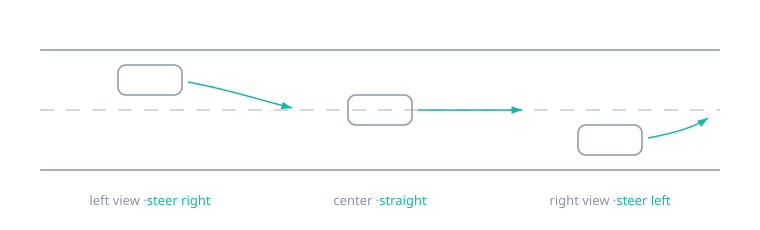
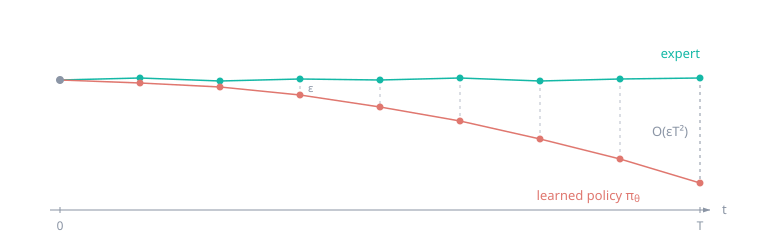
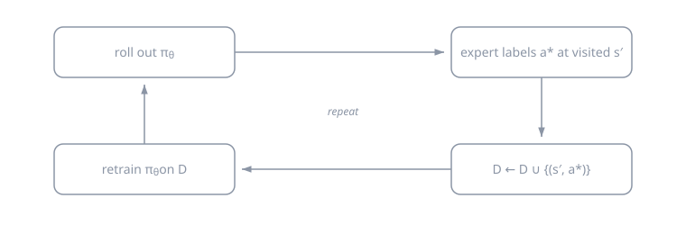
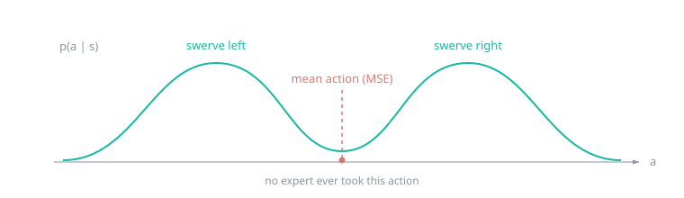

# Week 03 — Imitation Learning

[← Control and MDPs](week-02-control-and-mdps.md) · **Week 3 of 11** · [Next: Reinforcement Learning I →](week-04-reinforcement-learning-i.md)

## Outcomes

- Explain why supervised accuracy is insufficient for closed-loop imitation.
- Compare behavior cloning, DAgger, and expressive multimodal policies.
- Diagnose distribution shift, mode averaging, and causal confusion.

## Prerequisites: notation

Notation for imitation learning (and intelligent/learning systems in general):

| Symbol | Meaning |
| --- | --- |
| $a_t$ | Action at time $t$ |
| $o_t$ | Observation at time $t$ |
| $s_t$ | State at time $t$ |
| $\tau$ | Trajectory: $\tau = (s_1, a_1, s_2, a_2, \ldots, s_T)$ |
| $r(s, a)$ | Reward |

**Example:** for a self-driving car, $o_t$ is the camera image, $s_t$ is the car's pose and velocity, $a_t$ is the steering/throttle command, and $\tau$ is one full drive.

## What is imitation learning?

Given a set of trajectories collected by an **expert**, called **demonstrations**:

$$
\mathcal{D} = \{ (s_1, a_1, \ldots, s_T) \}
$$

the goal is to learn a policy $\pi$ that imitates the expert's behaviour.

## Behaviour cloning

The simplest approach — treat imitation as supervised learning. Given $\mathcal{D} = \{(s_1, a_1, \ldots, s_T)\}$, for a deterministic policy, regress onto the expert's actions:

$$
\min_\theta \; \frac{1}{|\mathcal{D}|} \sum_{(s, a) \in \mathcal{D}} \lVert a - \hat{a} \rVert^2, \qquad \hat{a} = \pi_\theta(s)
$$

then deploy $\pi_\theta$ on the robot.

### Does it work?

Sometimes, yes — see [*End to End Learning for Self-Driving Cars*](https://arxiv.org/abs/1604.07316) (Bojarski et al., 2016), which trained a CNN to map raw camera pixels directly to steering commands.

### Trick: "data augmentation"

Bojarski et al. add **fake data that illustrates corrections**, using side-facing cameras: the left/right camera views look like the car has drifted off-centre, so they are relabelled with the corrective steering command.

## The upper bound of behaviour cloning

The policy makes a small mistake ($\epsilon$ per step), lands in a state the expert never demonstrated, and makes a bigger mistake there. Over a time horizon $T$, this **distribution shift** causes the error to compound **quadratically**:

$$
\mathbb{E}[\text{cost}] \in O(\epsilon T^2)
$$

See [*A Reduction of Imitation Learning and Structured Prediction to No-Regret Online Learning*](https://arxiv.org/abs/1011.0686) (Ross et al., 2011).

## Addressing compounding error: DAgger

How can we make $p_{\text{expert}}(s) = p_{\pi}(s)$ — i.e. states visited by the expert $=$ states visited by the policy?

Idea: instead of being clever about the policy, be clever about the **data** — make the dataset cover the states the policy actually visits.

1. **Roll out** $\pi_\theta$ on the robot.
2. **Query the expert:** label the visited states $s'$ with expert actions $a^*$.
3. **Aggregate** the corrections with the existing data: $\mathcal{D} \leftarrow \mathcal{D} \cup \{(s', a^*)\}$.
4. **Update the policy:** $\theta \leftarrow \arg\min_\theta L(\pi_\theta, \mathcal{D})$, and repeat.

### The good

- Lets the human take control — the true expert.
- Paradox: it works *better* if the data contains more mistakes and recoveries.
- Hence the algorithm converges: $p_\pi(s) = p_{\text{expert}}(s)$.
- Achieves $O(\epsilon T)$ error instead of behaviour cloning's $O(\epsilon T^2)$.

### The bad

- How do we detect when an intervention is needed?
- Hindsight labelling and expert queries are difficult — this is not ideal in practice.

**Example:** Waymo self-driving safety drivers (teleoperators) take over when needed, and those interventions become labelled recovery data.

## Why might we still fail to mimic the expert?

- The policy's action depends only on the **current** observation, but human behaviour may be affected by past observations, emotions, privileged information, etc. (non-Markovian behaviour).
- Human observations $\neq$ robot camera observations — the expert may see and sense things the robot cannot.
- The expert's action distribution is **multimodal**, and an MSE policy averages the modes — see below.

## Why the MSE policy fails: mode averaging

Demonstrations are multimodal: faced with a tree, half the experts swerve left and half swerve right, so the true action distribution $p(a \mid s)$ has several modes. Minimizing MSE is maximum likelihood under a *single* Gaussian, so the optimal prediction is the conditional mean:

$$
\pi_\theta(s) = \mathbb{E}[a \mid s]
$$

and the mean of "left" and "right" is "straight into the tree" — an action no expert ever took.

Concretely, if the expert's actions follow a mixture of Gaussians,

$$
p(a \mid s) = \sum_{i=1}^{k} w_i(s)\, \mathcal{N}\big(a;\ \mu_i(s), \Sigma_i(s)\big),
$$

the MSE-optimal policy outputs $\sum_i w_i \mu_i$ — which can land in a near-zero-probability valley *between* the modes.

## Expressive policies

Fix: replace the implicit unimodal Gaussian with a distribution class that can represent multiple modes.

- **Diffusion policies:** start from Gaussian noise and iteratively denoise it into an action, conditioning every step on $s$. Extremely expressive; the cost is inference-time compute — many denoising steps per action. ([Diffusion Policy](https://arxiv.org/abs/2303.04137), Chi et al., 2023)
- **Autoregressive discretization:** discretize each action dimension into bins and predict one dimension at a time with a softmax — a language model over action tokens: $\pi_\theta(a \mid s) = \prod_d \pi_\theta(a_d \mid s, a_{1:d-1})$. A categorical can put mass on any bins (arbitrarily multimodal), and autoregression keeps the bin count linear in the action dimension instead of exponential. Costs resolution to the binning. (e.g. [RT-1](https://arxiv.org/abs/2212.06817))
- **Latent variable models (CVAE):** feed noise through the network, $a = \pi_\theta(s, z)$ with $z \sim \mathcal{N}(0, I)$ — different samples of $z$ select different modes; trained with a variational lower bound. (e.g. [ACT](https://arxiv.org/abs/2304.13705))
- **Mixture of Gaussians (MDN):** the network outputs $k$ weights, means, and covariances: $\pi_\theta(a \mid s) = \sum_{i=1}^{k} w_i(s)\, \mathcal{N}\big(a; \mu_i(s), \Sigma_i(s)\big)$. Simple and expressive, but you must **predefine** the number of modes $k$.

## Scaling control to "any" task

How do we go from one policy per task to one policy for any task?

1. **Single task:** $\pi_\theta(a \mid s)$ — one policy per task, nothing shared.
2. **Task-conditioned:** $\pi_\theta(a \mid s, z_{\text{task}})$ — condition on a task ID (one-hot, or a language embedding). One network, data shared across tasks — but only for a *predefined* list of tasks.
3. **Goal-conditioned:** $\pi_\theta(a \mid s, g)$ — condition on a **goal state** $g$ (e.g. an image of the desired outcome). "Any task" becomes "reach any goal state". Bonus: **hindsight relabelling** — whatever state a trajectory actually ended in is a valid goal for that trajectory, so every trajectory supervises goal-reaching for free.

Caveat: goal-conditioning only covers tasks expressible as reaching a state — "wave hello" or "keep the cup upright while moving" don't map cleanly to a single goal state.

## Dataset and architecture decisions

- Store observation timestamps, action timestamps, control frequency, and episode boundaries.
- Split by trajectory or scene—not individual frames—to avoid leakage.
- Normalize actions with training-set statistics and record the inverse transform.
- Choose whether the policy sees a frame, stacked frames, or recurrent history.
- For visual policies, compare frozen pretrained features with end-to-end training.

## Failure modes

- Validation loss falls while closed-loop success collapses.
- Mean regression averages two valid modes into an invalid motion.
- The policy keys on gripper state, background, or demonstrator artifacts.
- Demonstrations show success paths but no recovery behavior.

## Paper discussion

Contrast the diagnosis in [Causal Confusion in Imitation Learning](https://arxiv.org/abs/1905.11979) with the empirical case for pretrained visual representations in [Pari et al.](https://arxiv.org/abs/2112.01511).

## Build milestone

Collect or synthesize demonstrations, train behavior cloning, then introduce initial-state noise. Add either DAgger or recovery data and compare closed-loop success—not just validation loss—over three seeds.

Plot performance against perturbation magnitude and dataset size. Include the expert, a random policy, and behavior cloning before claiming the interactive method helps.

---

[← Control and MDPs](week-02-control-and-mdps.md) · [Next: Reinforcement Learning I →](week-04-reinforcement-learning-i.md)
