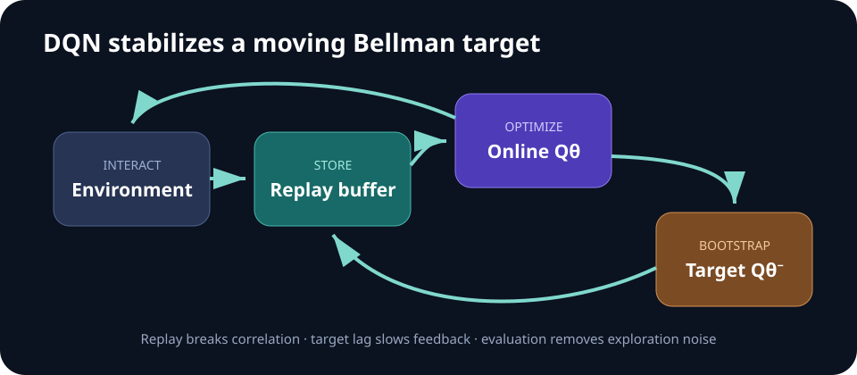

# Week 04 — Reinforcement Learning I

[← Imitation Learning](week-03-imitation-learning.md) · **Week 4 of 11** · [Next: Reinforcement Learning II →](week-05-reinforcement-learning-ii.md)

## Optional slide gallery



## Outcomes

- Derive the role of bootstrapping in value-based RL.
- Explain replay buffers, target networks, and exploration in DQN.
- Build an evaluation protocol that does not hide RL instability.

## Value-learning ladder

| Method | Target | Data regime |
| --- | --- | --- |
| Monte Carlo | Complete sampled return | On-policy episodes |
| TD(0) | `r + γV(s′)` | Online bootstrapping |
| Q-learning | `r + γ maxₐ′ Q(s′,a′)` | Off-policy transitions |
| DQN | Q-learning target with neural networks | Replay + target network |

## Core notes

Reinforcement learning optimizes expected return from interaction. Monte Carlo targets use complete sampled returns and can have high variance. Temporal-difference methods bootstrap from an estimate of the next state's value, reducing target horizon while introducing bias and moving-target instability.

Q-learning learns the value of taking an action and then acting optimally. With function approximation, DQN stabilizes training using replayed transitions and a slower target network. Replay improves data reuse and weakens temporal correlation; the target network stops every update from immediately changing its own target.

The central practical loop is: collect transitions, store them, sample a batch, construct a Bellman target, minimize prediction error, and periodically update the target network. Exploration must be stated explicitly; epsilon-greedy is a baseline, not a universal solution.

RL results are distributions. Report learning curves, final performance, seed count, environment steps, wall-clock cost, and evaluation without exploration noise. Compare against random, scripted, and classical-control baselines where applicable.

## DQN objective

For a replayed transition `(s,a,r,s′,done)`, construct

> `y = r + γ(1-done) maxₐ′ Qθ⁻(s′,a′)`
>
> `L(θ) = E[(Qθ(s,a) - y)²]`

The online parameters `θ` receive gradient updates. The target parameters `θ⁻` are copied or slowly averaged from the online network. The `done` mask prevents bootstrapping beyond a true terminal state; time-limit truncation may need separate treatment.

## Minimal training loop

1. Select an action with an explicit exploration policy.
2. Step the environment and store the transition.
3. Sample a random replay batch after a warm-up period.
4. Compute masked targets with the target network.
5. Update the online Q network and periodically update the target.
6. Evaluate in separate episodes without exploration noise.

## Diagnostics

- Log Q-value scale, TD-error distribution, gradient norm, replay age, and episode return.
- Compare Double DQN targets when maximization bias is visible.
- Check whether reward clipping changes the meaning of the task.
- Plot all seeds rather than only a mean with an invisible failure seed.

## Paper discussion

Compare gradient-free [evolution strategies](https://arxiv.org/abs/1703.03864) with value-based learning. Which method is easier to parallelize, and which uses each transition more efficiently?

## Build milestone

Solve a tabular task with value iteration, then train DQN on a small discrete-control task. Add an ablation removing either replay or the target network and explain the resulting curve.

Use the same evaluation seeds for every checkpoint, but keep them out of training. Report sample efficiency and wall-clock efficiency separately.

---

[← Imitation Learning](week-03-imitation-learning.md) · [Next: Reinforcement Learning II →](week-05-reinforcement-learning-ii.md)
