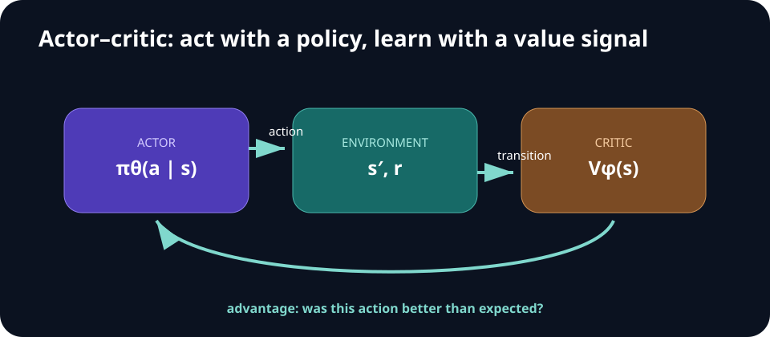

# Week 05 — Reinforcement Learning II

[← Reinforcement Learning I](week-04-reinforcement-learning-i.md) · **Week 5 of 11** · [Next: Generative Models →](week-06-generative-models.md)

## Optional slide gallery



## Outcomes

- Explain the policy-gradient estimator and the purpose of a baseline.
- Contrast on-policy PPO with off-policy SAC.
- Identify when offline RL or human-in-the-loop correction is appropriate.

## Algorithm map

| Method | Policy/data regime | Practical signature |
| --- | --- | --- |
| REINFORCE | On-policy | Simple, high-variance returns |
| PPO | On-policy actor-critic | Clipped policy-ratio updates |
| SAC | Off-policy actor-critic | Replay, twin critics, entropy |
| Offline RL | Fixed logged data | Conservative or behavior-aware objectives |

## Core notes

Policy-gradient methods optimize a parameterized policy directly. The score-function estimator weights the gradient of an action's log probability by its return. Subtracting a baseline leaves the estimator unbiased while reducing variance; actor-critic methods learn a value function for this role.

PPO is an on-policy method that limits how far the policy moves on a batch of recent experience, usually through a clipped probability-ratio objective. It is comparatively straightforward but discards data quickly. SAC is off-policy: it reuses replay data, learns critics, and adds entropy to encourage diverse behavior. It is often attractive for continuous control but is sensitive to critic errors and data quality.

Offline RL learns from a fixed dataset. The main danger is evaluating actions not supported by that dataset: an inaccurate critic may assign them unrealistically high value. Conservative objectives, behavior constraints, uncertainty, and careful dataset coverage help. Human intervention can supply corrective data near failures, but the intervention policy and safety boundary become part of the system.

## Policy gradient and advantage

> `∇θJ(θ) = E[Σₜ ∇θ log πθ(aₜ│sₜ) Aₜ]`

The advantage `Aₜ` asks whether an action was better than expected at that state. Generalized advantage estimation trades bias against variance using a decay parameter `λ`. Normalize advantages per batch only with a clear implementation convention.

PPO compares the new policy with the behavior policy that collected the batch:

> `rₜ(θ) = πθ(aₜ│sₜ) / π_old(aₜ│sₜ)`

Its clipped objective discourages an update from changing action probability too far in one step. Track approximate KL divergence, clip fraction, policy entropy, value loss, and explained variance; reward alone cannot reveal a broken critic.

SAC optimizes return plus entropy. Twin critics reduce positive bias, replay improves reuse, and a learned temperature can target an entropy level. Check action squashing and log-probability corrections carefully for bounded continuous actions.

## PPO versus SAC

- Prefer PPO when parallel simulation is plentiful and implementation simplicity matters.
- Prefer SAC when real interaction is expensive and replay efficiency matters.
- Prefer offline methods when no new interaction is allowed, but state the dataset support assumptions.
- Use human intervention when a reliable safety operator and intervention protocol exist.

## Concept checks

1. Why does reusing an old batch violate the simplest on-policy gradient derivation?
2. When can entropy improve robustness, and when can it harm a precision task?

## Build milestone

Train PPO or SAC on the same task contract used earlier. Compare it with the non-learning controller and behavior-cloning policy using equal evaluation episodes. Report environment steps and wall-clock time.

Ablate one stabilization choice: advantage normalization, entropy bonus, replay ratio, or target-network update rate. Explain the mechanism before interpreting the curve.

---

[← Reinforcement Learning I](week-04-reinforcement-learning-i.md) · [Next: Generative Models →](week-06-generative-models.md)
