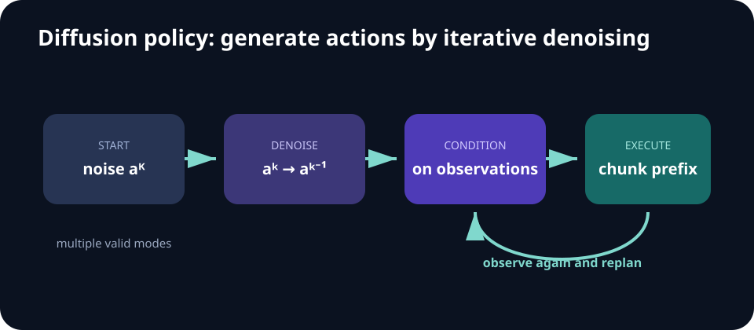

# Week 06 — Generative Models for Control

[← Reinforcement Learning II](week-05-reinforcement-learning-ii.md) · **Week 6 of 11** · [Next: Sequence Modeling →](week-07-sequence-modeling.md)

## Outcomes

- Explain why robot action distributions are often multimodal.
- Compare explicit, implicit, and diffusion policy objectives.
- Evaluate generated action sequences in closed loop.

## Policy families

| Policy head | Represents modes? | Inference |
| --- | --- | --- |
| Gaussian regression | Weakly | One forward pass |
| Mixture density | Yes, with fixed components | Sample or choose a component |
| Energy-based | Yes | Optimize/sample low-energy actions |
| Diffusion | Yes | Iterative conditional denoising |

## Core notes

A deterministic regressor assumes one preferred action for each input. Robotics often violates that assumption: an object can be grasped from several sides, an obstacle can be passed on either side, and demonstrations can contain distinct styles. Averaging modes can create an action no expert would take.

Generative policies model a distribution over actions or trajectories. Energy-based policies learn a compatibility score and select low-energy actions through optimization or sampling. Diffusion policies learn to denoise a corrupted action sequence conditioned on observations, turning iterative denoising into conditional trajectory generation. Both can represent multiple valid solutions, but inference is more expensive than one forward pass.

Generating an action chunk provides temporal coherence and reduces the number of policy queries. Receding-horizon execution restores feedback: predict a chunk, execute only its first portion, observe again, and replan. Important design choices include action horizon, observation history, normalization, noise schedule, sampler steps, and the fraction of each chunk executed.

Evaluate more than imitation loss. Measure task success, inference latency, smoothness, constraint violations, robustness to observation changes, and diversity only when diversity is actually useful.

## Conditional denoising objective

Training samples a clean action sequence `a⁰`, noise `ε`, and a diffusion step `k`. After corrupting the actions into `aᵏ`, the network predicts the noise while conditioning on observation history `o`:

> `L(θ) = E[‖ε - εθ(aᵏ, k, o)‖²]`

At inference, begin with noise and apply the learned reverse steps. The final sequence is an action proposal, not a guarantee of feasibility. Receding-horizon execution lets fresh observations correct it.

## Design decisions

- **Prediction horizon:** how far the generated chunk extends.
- **Execution horizon:** how much of that chunk runs before replanning.
- **Observation horizon:** how much recent state or image history conditions the policy.
- **Sampler:** number and type of denoising steps, which controls latency.
- **Action representation:** joint targets, velocities, deltas, poses, or normalized commands.

## Failure modes

- Too few sampler steps erase useful modes or produce jerky actions.
- Too many steps miss the real-time control budget.
- Long open-loop chunks fail after small contacts or perturbations.
- A visually diverse policy generates unsafe or unreachable action modes.
- Dataset imbalance causes rare tasks to disappear during denoising.

## Paper discussion

Compare planning-as-denoising in [Diffuser](https://arxiv.org/abs/2205.09991) with action selection in [Implicit Behavioral Cloning](https://arxiv.org/abs/2109.00137).

## Build milestone

Construct a toy two-mode action dataset. Compare mean regression with a mixture, energy-based, or diffusion model. Visualize whether generated actions cover both valid modes and whether closed-loop execution remains stable.

Sweep execution horizon and sampler steps. Report both success and median inference latency on the target hardware.

---

[← Reinforcement Learning II](week-05-reinforcement-learning-ii.md) · [Next: Sequence Modeling →](week-07-sequence-modeling.md)
