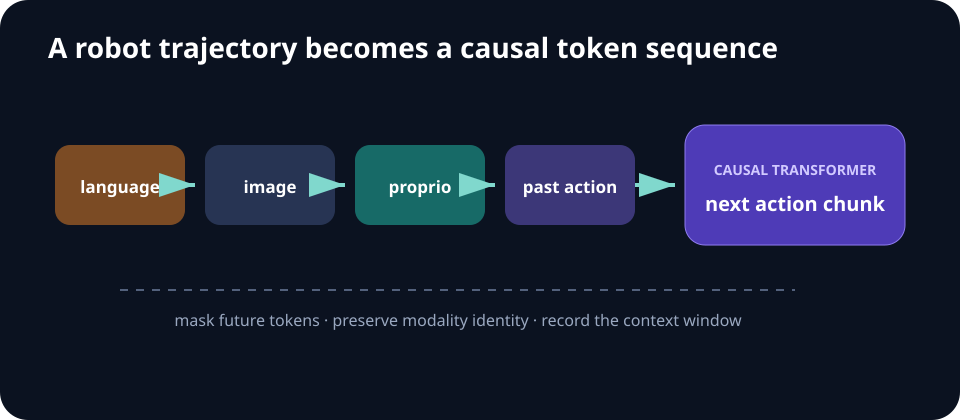

# Week 07 — Sequence Modeling and Transformers

[← Generative Models](week-06-generative-models.md) · **Week 7 of 11** · [Next: World Models →](week-08-world-models.md)

## Optional slide gallery



## Outcomes

- Represent trajectories as sequences for causal prediction.
- Explain attention, positional information, and causal masking in a robot policy.
- Choose a tokenization and action-chunking scheme.

## Sequence design choices

| Choice | Question to answer |
| --- | --- |
| Token order | Which modalities and time steps can attend to which others? |
| Position encoding | How is time/order represented? |
| Action representation | Continuous vector, bins, codebook, or chunk? |
| Context length | What history is useful within the latency/memory budget? |
| Objective | Next action, masked token, return-conditioned action, or trajectory? |

## Core notes

Sequence models replace a hand-designed fixed state with a learned function of history. A transformer embeds tokens, mixes information through self-attention, and predicts under a causal mask so future tokens cannot leak into the current decision. Robot tokens may represent images, proprioception, language, rewards, returns, or discretized/continuous actions.

Decision Transformer casts offline RL as conditional sequence modeling: predict actions from past context and a desired return. This avoids an explicit Bellman objective, but performance depends on dataset coverage and whether the conditioning signal identifies achievable behavior. It does not automatically solve out-of-distribution action selection.

Action chunking predicts several future controls per query. It can model temporally coherent motions and shorten the effective horizon, which is valuable for high-frequency manipulation. The tradeoff is responsiveness. Temporal ensembling or receding-horizon execution can combine overlapping chunks.

Architecture choices must preserve causality and modality identity. Record token order, attention mask, context length, image encoder, action representation, normalization, and inference rate. A silent mask error can produce excellent offline metrics and an unusable deployed policy.

## Attention and causal masking

Scaled dot-product attention computes

> `Attention(Q,K,V) = softmax((QKᵀ / √d) + M)V`

For causal control, mask `M` makes future tokens impossible to attend to. Inputs that are already known at decision time—such as the full language instruction—can be made visible according to the chosen architecture, but future actions and observations must remain hidden.

## Decision Transformer view

A trajectory can be serialized as return-to-go, state, action triples. Training predicts the dataset action autoregressively. At deployment, the requested return is updated as rewards arrive. This is supervised sequence modeling over offline data; it does not perform online policy improvement unless new data and training are added.

## Deployment checklist

- Verify the training and inference attention masks are identical.
- Measure control latency at the chosen context length and image resolution.
- Reset or roll the context correctly across episode boundaries.
- Test temporal misalignment by shifting action timestamps.
- Compare one-step prediction with short action chunks under perturbation.

## Paper discussion

Contrast return-conditioned control in [Decision Transformer](https://arxiv.org/abs/2106.01345) with action chunking in [ALOHA](https://arxiv.org/abs/2304.13705).

## Build milestone

Train a small causal transformer to predict action sequences from state history. Compare single-step actions with short chunks at equal parameter count. Measure success, latency, and recovery after a mid-episode perturbation.

Visualize the attention mask itself and add a unit test that changing a future token cannot change an earlier prediction.

---

[← Generative Models](week-06-generative-models.md) · [Next: World Models →](week-08-world-models.md)
