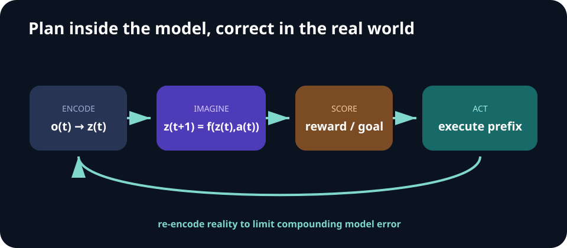

# Week 08 — World Models

[← Sequence Modeling](week-07-sequence-modeling.md) · **Week 8 of 11** · [Next: Generalist Policies →](week-09-generalist-policies.md)

## Optional slide gallery



## Outcomes

- Separate representation, dynamics, reward, and policy components.
- Explain latent rollout and model-predictive control.
- Measure when a learned model is useful for decisions rather than pixels.

## Component map

| Component | Role | Useful diagnostic |
| --- | --- | --- |
| Encoder | Compress observation into latent state | Linear probes / reconstruction only if needed |
| Dynamics | Predict next latent under an action | Multi-step rollout error |
| Reward/termination head | Predict task outcome | Calibration and rare-event recall |
| Planner or actor | Choose actions using imagined futures | Real-environment return |

## Core notes

A world model predicts how relevant aspects of the environment evolve under actions. A typical system encodes observations into a latent state, predicts future latents conditioned on actions, and optionally predicts rewards, terminations, or observations. A policy can then learn inside imagined rollouts or choose actions by planning through the model.

The model need not reconstruct every pixel. Decision-relevant representations should preserve objects, geometry, contact, controllability, and uncertainty. Pixel quality can be visually impressive while action consequences are wrong. Evaluate multi-step state or reward prediction, planning performance, and calibration under interventions.

Model-predictive control samples or optimizes candidate action sequences, scores predicted outcomes, executes a short prefix, and replans from the next real observation. Frequent replanning limits accumulated model error. The remaining failure modes include compounding rollout error, exploitation of model mistakes, partial observability, and uncertainty far from the training distribution.

Video generation can provide a useful behavioral prior or goal-conditioned prediction, but converting visual futures into executable, embodiment-specific actions remains a central interface problem.

## Learning and planning

A compact deterministic sketch is

> `zₜ = e(oₜ)`
>
> `ẑₜ₊₁ = f(zₜ, aₜ)`
>
> `r̂ₜ = g(zₜ, aₜ)`

Real systems often model stochasticity or maintain a belief over latent state. Training may combine representation consistency, reward prediction, reconstruction, contrastive prediction, and regularization. Weight each loss by its effect on downstream control, not by visual appeal.

Model-predictive control then:

1. Samples or optimizes candidate action sequences.
2. Rolls each candidate forward in the learned model.
3. Scores predicted reward, goal distance, uncertainty, and constraints.
4. Executes only a short prefix of the best sequence.
5. Observes the real world and replans.

## Model exploitation tests

- Optimize action sequences longer than those seen in training and inspect unrealistic states.
- Compare prediction error on planner-selected versus random actions.
- Penalize or reject high-uncertainty imagined states.
- Evaluate planning performance as model rollout horizon grows.
- Keep a model-free or true-simulator oracle comparison where possible.

## Paper discussion

Ask whether [text-guided video policies](https://arxiv.org/abs/2302.00111) and [World Action Models](https://dreamzero0.github.io/DreamZero.pdf) are best understood as planners, policies, or representation learners—and what evidence would distinguish those roles.

## Build milestone

Learn a one-step dynamics model in a compact state space, roll it out for increasing horizons, and plot prediction error. Use it in a short-horizon planner and compare task return with random shooting in the real simulator.

Ablate replan frequency and uncertainty penalty. The useful model is the one that improves real decisions, not necessarily the one with the sharpest reconstruction.

---

[← Sequence Modeling](week-07-sequence-modeling.md) · [Next: Generalist Policies →](week-09-generalist-policies.md)
