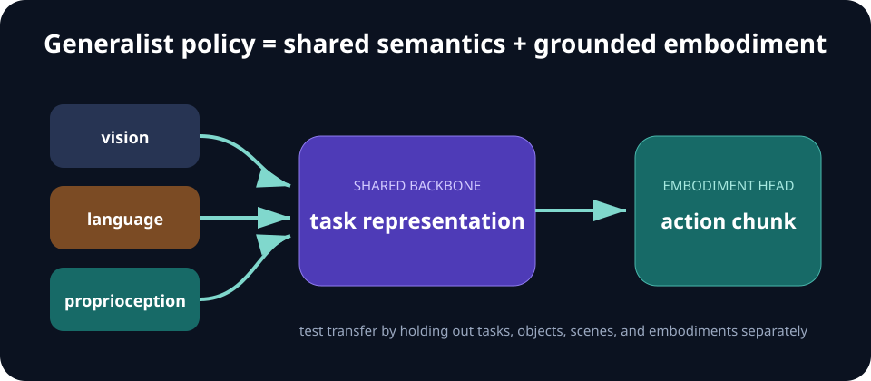

# Week 09 — Generalist Robot Policies

[← World Models](week-08-world-models.md) · **Week 9 of 11** · [Next: Embodied Reasoning →](week-10-embodied-reasoning.md)

## Optional slide gallery



## Outcomes

- Describe the data and interfaces needed by a multi-task robot policy.
- Separate semantic planning from embodiment-specific control.
- Evaluate transfer across tasks, environments, and robot bodies.

## System layers

| Layer | Typical responsibility |
| --- | --- |
| Vision encoder | Objects, geometry, scene context |
| Language/task encoder | Instruction and semantic intent |
| Temporal backbone | Fuse history and modalities |
| Action head | Produce embodiment-specific controls or chunks |
| Data adapter | Normalize cameras, rates, frames, and action conventions |

## Core notes

A generalist policy shares parameters across tasks and often across embodiments. Inputs may include images, language, proprioception, task identifiers, and history; outputs may be continuous controls, discrete action tokens, waypoints, or action chunks. Scale can create transfer, but only when data and interfaces make tasks mutually intelligible.

Language supplies a flexible task interface and connects robot data to pretrained vision-language representations. It does not by itself provide accurate geometry, contact dynamics, or calibration. Many systems therefore combine a broad semantic backbone with an embodiment-specific action head or adapter.

Dataset composition is as important as architecture. Record task definitions, success labels, control rates, camera conventions, action normalization, robot morphology, and data provenance. Large datasets can still be narrow if they repeat the same scene or demonstrator policy.

Generalization claims need explicit axes. Hold out object instances, layouts, instructions, tasks, environments, or embodiments separately. Compare a shared model with per-task specialists under the same data and compute budget. Track negative transfer, not just mean success.

## Data unification

Cross-robot training fails quietly when action and observation conventions are underspecified. A useful record includes:

- robot, joint ordering, coordinate frames, gripper convention, and control mode;
- camera intrinsics/extrinsics, image transforms, and timestamps;
- language source, task taxonomy, success label, and episode boundaries;
- action rate, latency, normalization statistics, and missing-sensor mask;
- dataset license, collection policy, operator identity policy, and provenance.

An embodiment adapter can translate a shared representation into robot-specific action space. Alternatives include common end-effector deltas, discretized tokens, learned codebooks, or separate heads. Each choice encodes what transfer is expected.

## Evaluation matrix

Report a grid, not one mean:

| Split | What it tests |
| --- | --- |
| Seen task, new object | Visual/object transfer |
| New instruction, seen behavior | Language robustness |
| New task composition | Compositionality |
| New environment | Scene robustness |
| New embodiment | Interface and dynamics transfer |

Compare the shared model with specialists, a frozen-backbone adapter, and a data-matched baseline. State whether extra pretraining data gives the generalist an unequal advantage.

## Paper discussion

Use [language-conditioned imitation](https://arxiv.org/abs/2005.07648) and [Gato](https://arxiv.org/abs/2205.06175) to compare task conditioning, action representation, and the evidence offered for generality.

## Build milestone

Design a common schema for two tasks or embodiments. Train a shared conditioned policy and two specialists. Report per-task success, parameter count, data volume, and any negative transfer.

Add one held-out axis and one deliberately conflicting task pair. Inspect whether shared training improves transfer or causes interference.

---

[← World Models](week-08-world-models.md) · [Next: Embodied Reasoning →](week-10-embodied-reasoning.md)
