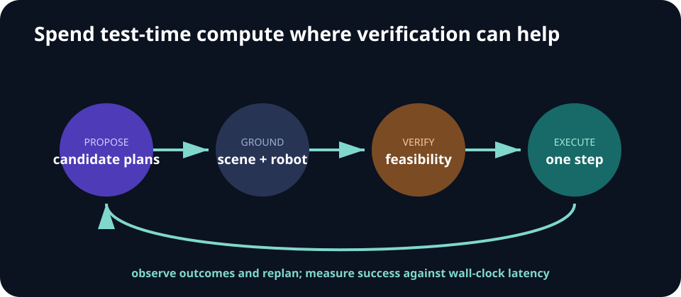

# Week 10 — Embodied Reasoning and Test-time Scaling

[← Generalist Policies](week-09-generalist-policies.md) · **Week 10 of 11** · [Next: Frontiers →](week-11-frontiers.md)

## Optional slide gallery



## Outcomes

- Identify tasks that benefit from extra inference-time computation.
- Design candidate generation, verification, and replanning loops.
- Distinguish verbal plausibility from grounded task progress.

## Test-time compute options

| Mechanism | Added capability | Typical risk |
| --- | --- | --- |
| Multiple samples | Alternative plans/actions | Correlated candidates |
| Search | Multi-step lookahead | Branching and latency |
| Verifier/value model | Rank candidates | Reward hacking or miscalibration |
| Tools/simulator | Ground facts and consequences | Tool-model mismatch |
| Replanning | Recover from execution mismatch | Control delay |

## Core notes

Some robot tasks require more than a single reactive policy pass: long-horizon instructions, tool choice, recovery, spatial constraints, or unfamiliar combinations. Test-time scaling spends additional computation to sample plans, search a tree, critique candidates, use tools, simulate outcomes, or replan after new observations.

The useful pattern is **propose → ground → verify → execute → observe → replan**. A language model may propose subgoals, but grounded modules must connect them to visible objects, reachable poses, controller capabilities, and safety constraints. Verification can use a value model, learned world model, geometric checker, simulator, or explicit predicate tests.

More inference is not automatically better. Candidate samples may be correlated, verifiers may reward polished explanations instead of feasible actions, and latency may exceed the control budget. Compare against an equal-latency reactive baseline and report accuracy or success as a function of samples, search depth, and wall-clock time.

In-context imitation provides another route: condition on example trajectories and predict the next action without updating weights. The key test is whether the policy recombines task structure or merely matches surface similarity.

## A grounded inference loop

1. Parse the instruction into candidate subgoals and constraints.
2. Ground referenced objects and relations in the current observation.
3. Filter candidates through reachability, collision, and skill-availability checks.
4. Score surviving plans with a verifier or world model.
5. Execute the smallest useful step and collect fresh evidence.
6. Replan when predicates fail, uncertainty rises, or the scene changes.

The verifier should consume grounded state—not only the model's own explanation. Useful checks include geometric feasibility, resource preconditions, predicted task predicates, safety constraints, and calibrated uncertainty.

## Scaling curves

For each test-time budget `B`, record:

> `utility(B) = task success(B) - λ · latency(B) - μ · safety cost(B)`

Sweep candidate count or search depth and compare against a reactive baseline given the same latency. Stop scaling when marginal success no longer justifies compute or control delay.

## Adversarial checks

- A fluent but impossible plan references an occluded or absent object.
- The verifier prefers verbose plans regardless of feasibility.
- All candidates share the same mistaken assumption.
- Search succeeds in the learned model but exploits its dynamics error.
- Replanning oscillates between two subgoals without progress.

## Paper discussion

Compare embodied learning from examples in [In-Context Imitation Learning](https://arxiv.org/abs/2408.15980) with iterative skill acquisition in [Voyager](https://arxiv.org/abs/2305.16291).

## Build milestone

Add candidate generation and a simple verifier to a multi-step task. Sweep the number of candidates and plot success versus latency. Include at least one adversarial case where the verifier selects a bad plan.

Report verifier accuracy separately from end-to-end task success. Include the cost of perception, candidate generation, verification, and control.

---

[← Generalist Policies](week-09-generalist-policies.md) · [Next: Frontiers →](week-11-frontiers.md)
