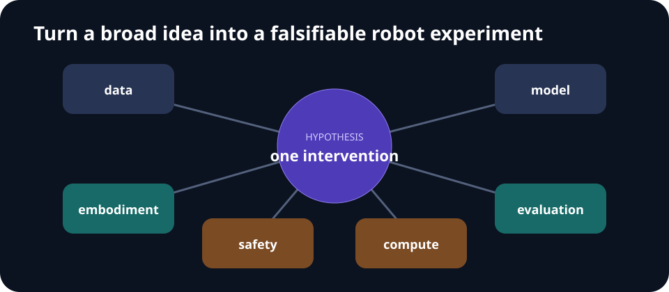

# Week 11 — Frontiers and Open Problems

[← Embodied Reasoning](week-10-embodied-reasoning.md) · **Week 11 of 11** · [Curriculum index →](README.md)

## Outcomes

- Turn a broad robotics idea into a falsifiable research question.
- Locate bottlenecks in data, objectives, embodiment, evaluation, and safety.
- Design a capstone with a credible baseline and stop condition.

## Open-problem map

| Bottleneck | Research question |
| --- | --- |
| Data | Which interaction or demonstration is worth collecting next? |
| Representation | What state preserves control-relevant information? |
| Dynamics | How should uncertainty and long horizons be modeled? |
| Transfer | What is shared across tasks and embodiments? |
| Evaluation | Which split predicts deployment reliability? |
| Safety | How can the system fail without causing damage? |

## Core notes

Modern robot learning still faces a gap between benchmark competence and dependable autonomy. Important bottlenecks include scarce high-quality interaction data, inconsistent embodiment interfaces, long-tail failures, partial observability, weak causal understanding, unsafe exploration, and evaluation that is too small or too forgiving.

Three useful research instincts pull in different directions:

- The **Bitter Lesson** favors scalable learning and computation over hand-built domain structure.
- **Intelligence without Representation** emphasizes situated interaction and cautions against unnecessary internal abstractions.
- World-model and joint-embedding proposals argue that predictive internal state is necessary for planning and abstraction.

Treat these as competing design hypotheses, not slogans. Ask what information, compute, and environment each approach assumes; what measurable capability it predicts; and what experiment could prove it wrong.

A good capstone is narrow. State one intervention and one primary metric. Freeze the task, data budget, compute budget, and baseline before running. Include an ablation, expected failure mode, and stop condition. A negative result with a trustworthy protocol is more useful than an unmeasured demo.

## From idea to experiment

Rewrite “Can world models improve robotics?” as something falsifiable:

> On a fixed planar-pushing task and dataset, does uncertainty-penalized model-predictive control improve held-out-layout success over unpenalized MPC at equal planning latency?

The refined version names the task, data, intervention, baseline, metric, split, and budget. It can fail cleanly.

## One-page capstone specification

1. **Question and hypothesis:** one causal intervention and predicted effect.
2. **Task contract:** observations, actions, distributions, resets, safety limits.
3. **Baseline:** simplest credible comparator, fixed before experiments.
4. **Method:** only the component needed to test the hypothesis.
5. **Primary metric:** chosen before observing final results.
6. **Budget:** data, environment steps, seeds, hardware, and wall-clock limit.
7. **Ablations:** remove the claimed mechanism and match capacity/compute.
8. **Failure analysis:** at least one taxonomy and representative trajectories.
9. **Stop condition:** when to conclude the idea is not working.

## Reproducibility gate

- [ ] One setup command and one experiment command
- [ ] Pinned environment and exact commit
- [ ] Fixed task/evaluation seeds published
- [ ] Per-seed results and uncertainty shown
- [ ] Data and checkpoint licenses recorded
- [ ] Negative results and excluded runs explained

## Paper discussion

Triangulate [A Path Towards Autonomous Machine Intelligence](https://openreview.net/forum?id=BZ5a1r-kVsf), [The Bitter Lesson](http://www.incompleteideas.net/IncIdeas/BitterLesson.html), and [Intelligence without Representation](https://people.csail.mit.edu/brooks/papers/representation.pdf). Which claims conflict, and which operate at different layers?

## Build milestone

Present a one-page proposal: question, hypothesis, baseline, intervention, task/data, primary metric, seed/compute budget, two ablations, safety constraints, and stop condition. Another team must be able to reproduce the plan without asking you questions.

End the session with a pre-mortem: list the three most likely ways the project will produce an uninterpretable result, then change the protocol to prevent them.

## Primary material

- [Official slides](https://cvg.ethz.ch/lectures/Robot-Learning/lectures/lecture11_frontiers.pdf)
- [Lecture recording](https://youtu.be/eL4lcy1KNzE)

---

[← Embodied Reasoning](week-10-embodied-reasoning.md) · [Curriculum index →](README.md)
