# Week 02 - Robot Control and MDPs: OCR transcript

[← Course home](../README.md) · **Default OCR view** · [Open optional slide gallery →](../curriculum/week-02-control-and-mdps.md)

> This is an automated OCR transcript generated from the locally rendered slide images. Use the image as the source of truth for equations, diagrams, citations, and small text.

## Slide 1

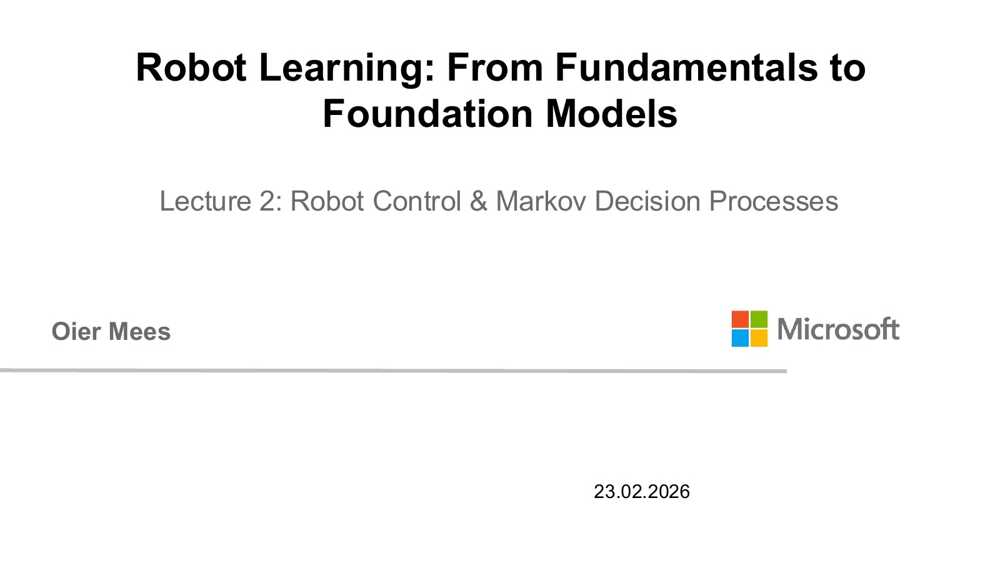

```text
Robot Learning: From Fundamentals to
Foundation Models

Lecture 2: Robot Control & Markov Decision Processes

Oier Mees BE Microsoft

23.02.2026
```

## Slide 2


```text
Feedback - Actions

Extended deadline for 1st homework to March 5th
Created a moodle forum for QA
Linked Course Website in MyStudies

Made slides & recordings available
® login: [REDACTED]

=" pwd: [REDACTED]

Instructions for Paper Discussion
```

## Slide 3

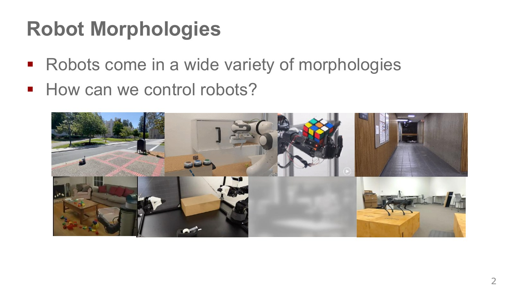

```text
Robot Morphologies

= Robots come in a wide variety of morphologies
= How can we control robots?
```

## Slide 4

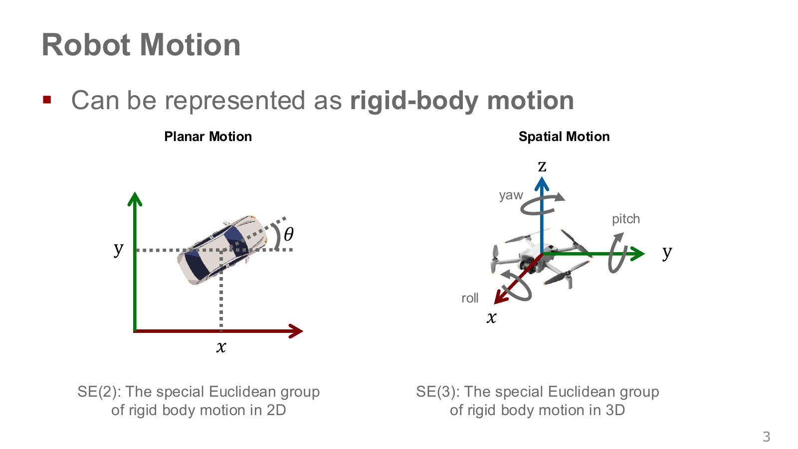

```text
Robot Motion

=" Can be represented as rigid-body motion

Planar Motion Spatial Motion
Z
yaw A,
co
pitch
y
: >
x
SE(2): The special Euclidean group SE(3): The special Euclidean group

of rigid body motion in 2D of rigid body motion in 3D
```

## Slide 5

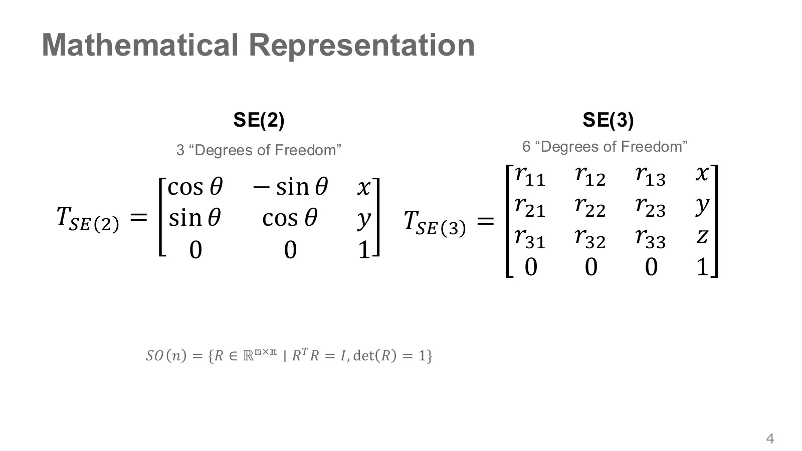

```text
Mathematical Representation

SE(2)
3 “Degrees of Freedom”
cos@ -sin@ x
TSE (2) = |sind cos 9 y

Tse(3) =
0 0 1

SO(n) = {R € R™™ | R™R = I, det(R) = 1}

SE(3)

6 “Degrees of Freedom”
M11 %2 3
T21 122 123
T31 132 133

0 0 0

PN? Rk
```

## Slide 6

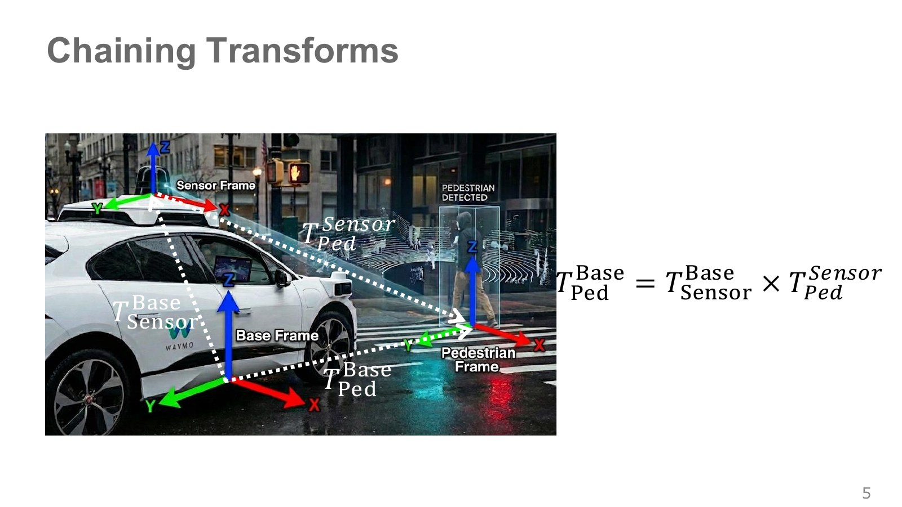

```text
Chaining Transforms

PEDESTRIAN
DETECTED

Base _ 7~Base Sensor
Ped ~- Sensor * | ped

.
aeeee
```

## Slide 7

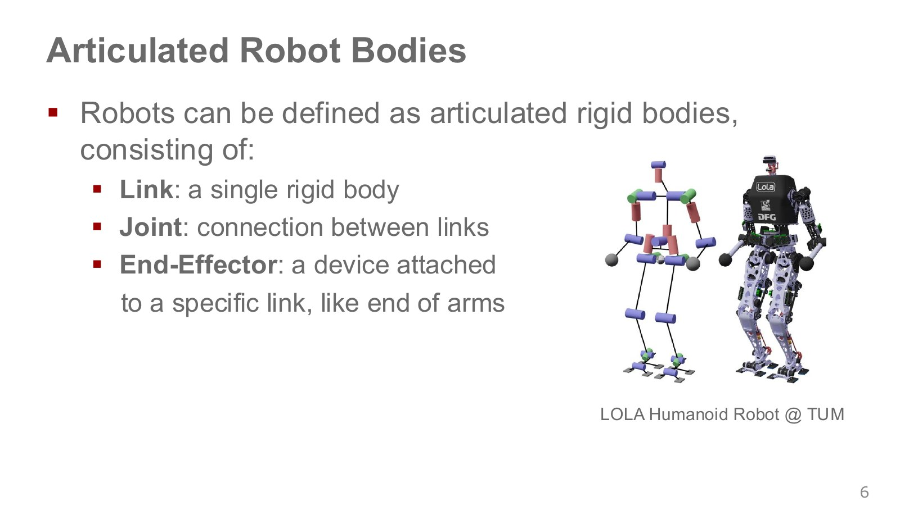

```text
Articulated Robot Bodies

« Robots can be defined as articulated rigid bodies,
consisting of:
« Link: a single rigid body
= Joint: connection between links
« End-Effector: a device attached
to a specific link, like end of arms

LOLA Humanoid Robot @ TUM
```

## Slide 8

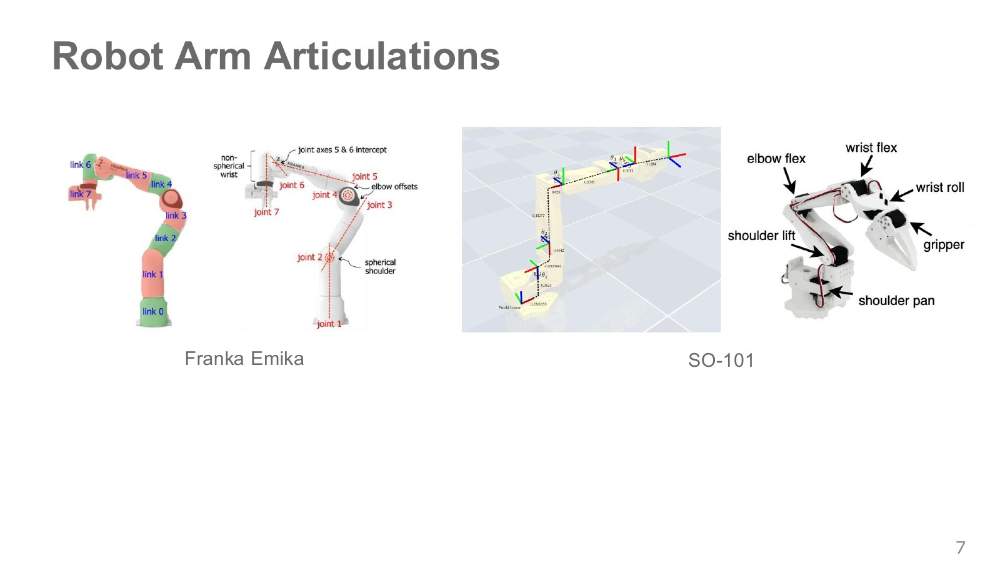

```text
Robot Arm Articulations

joint axes 5 & 6 intercept
tin spherical =
wet "oe a a
joint 6 offsets

jon 7

Franka Emika

wrist flex

a9) ac wrist roll
Wr
a

elbow flex

shoulder lift

shoulder pan

SO-101
```

## Slide 9

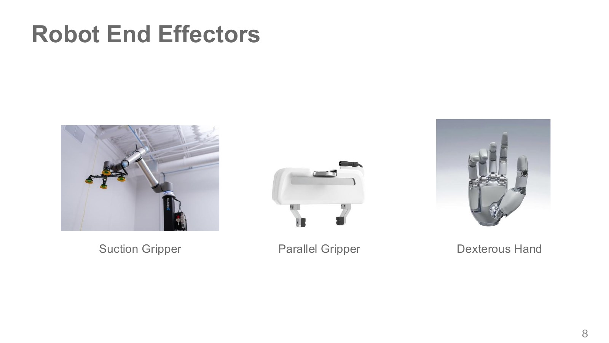

```text
Robot End Effectors

Suction Gripper Parallel Gripper Dexterous Hand
```

## Slide 10

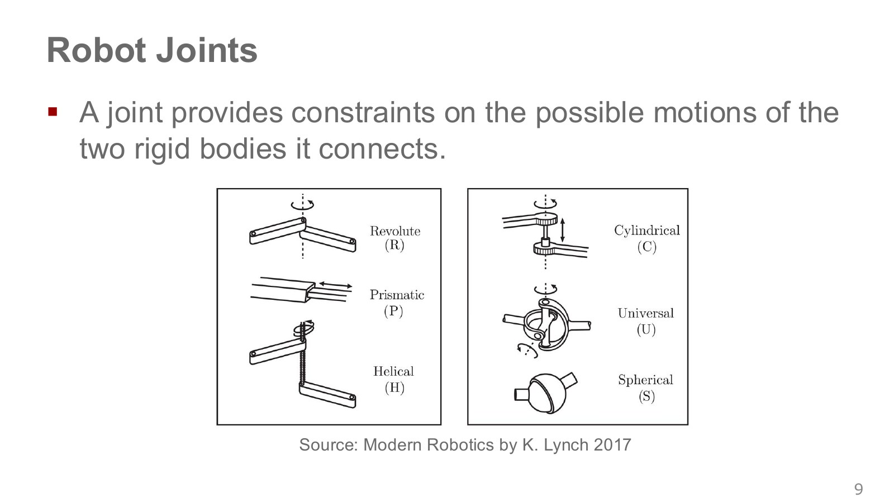

```text
Robot Joints

» A joint provides constraints on the possible motions of the
two rigid bodies it connects.

----- Revolute

: (R)
--

== Prismatic

Cylindrical
(©)

Universal

Helical

(H)

-s
(P) “@) ve
WY

Spherical

(Ss)

Source: Modern Robotics by K. Lynch 2017
```

## Slide 11

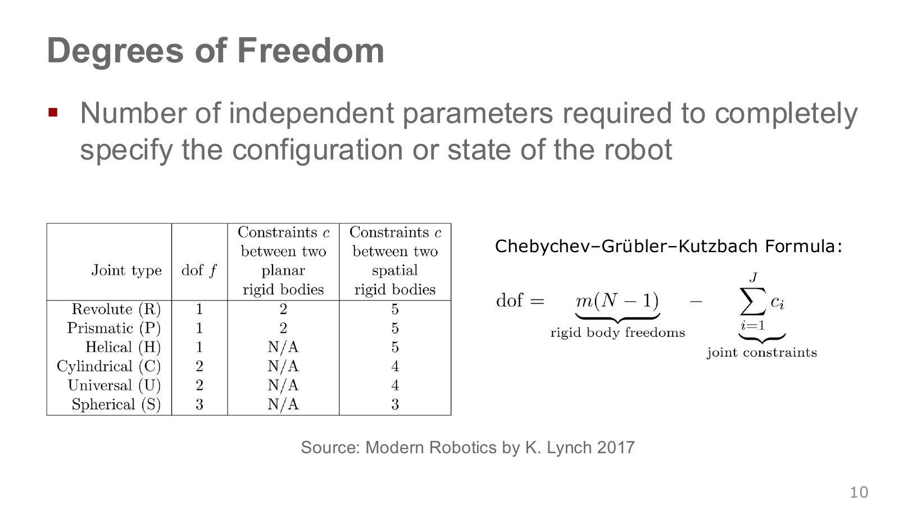

```text
Degrees of Freedom

=» Number of independent parameters required to completely
specify the configuration or state of the robot

Constraints c
between two

Constraints c
between two

Joint type | dof f planar spatial
rigid bodies rigid bodies

Revolute (R) i 2 6
Prismatic (P) 1 2 5
Helical (H) 1 N/A 5
Cylindrical (C) 2 N/A 4
Universal (U) 2 N/A 4
Spherical (S) 3 N/A 3

Chebychev-Griibler-Kutzbach Formula:

J

dof = m(N-1) - Sa
sang eee, . i=1

rigid body freedoms ‘ ,

joint constraints

Source: Modern Robotics by K. Lynch 2017

10
```

## Slide 12

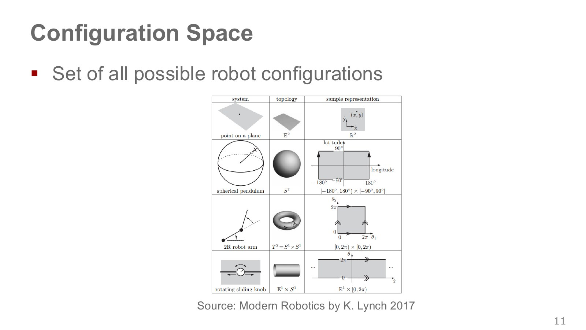

```text
Configuration Space

« Set of all possible robot configurations

system topology ‘sample representation
Co)
p> ye
se
point on a plane E? R?
latitude
A) -
© longitude
-139° 90 180°
spherical pendulum: ce [-180°, 180°) x [-90°, 90°]
9
2a
‘ 0 Qn 61

2Rrobot arm _| T?=S'xS (0.2m) x [0, 2x)
é
eT
ES - .
ea | ce
*
rotating sliding knob | _E! x S? R! x (0,27)

Source: Modern Robotics by K. Lynch 2017

11
```

## Slide 13

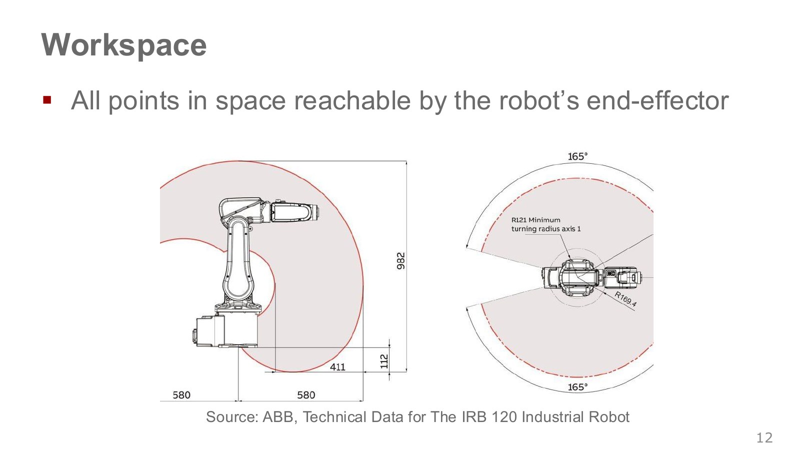

```text
Workspace

« All points in space reachable by the robot’s end-effector

=)

982

112

4i1

580 580
Source: ABB, Technical Data for The IRB 120 Industrial Robot
```

## Slide 14

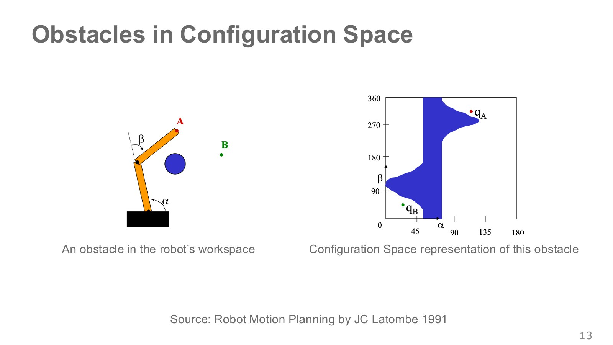

```text
Obstacles in Configuration Space

360

2705

907

0
45 90 135 180

An obstacle in the robot’s workspace Configuration Space representation of this obstacle

Source: Robot Motion Planning by JC Latombe 1991

13
```

## Slide 15

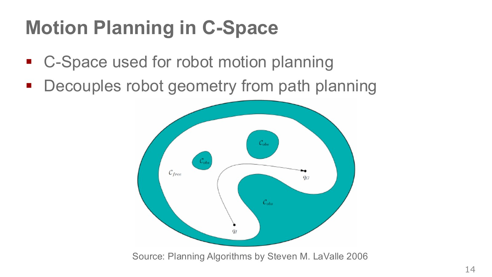

```text
Motion Planning in C-Space

« C-Space used for robot motion planning
«" Decouples robot geometry from path planning

Source: Planning Algorithms by Steven M. LaValle 2006

14
```

## Slide 16

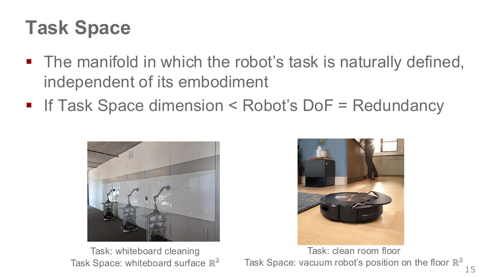

```text
Task Space

« The manifold in which the robot’s task is naturally defined,
independent of its embodiment

« If Task Space dimension < Robot’s DoF = Redundancy

Task: whiteboard cleaning Task: clean room floor
Task Space: whiteboard surface R Task Space: vacuum robot's position on the floor R” a
```

## Slide 17

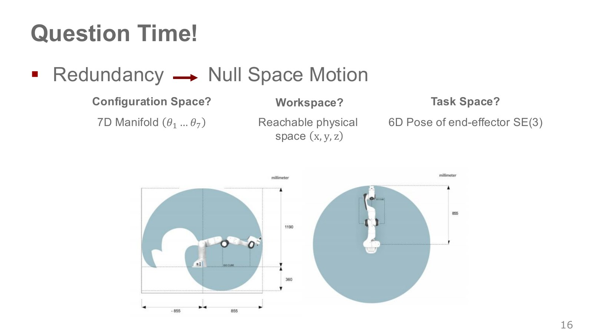

```text
Question Time!

" Redundancy -» Null Space Motion

Configuration Space? Workspace?

7D Manifold (6, ... 67) Reachable physical
space (x, y, z)

Task Space?
6D Pose of end-effector SE(3)

16
```

## Slide 18

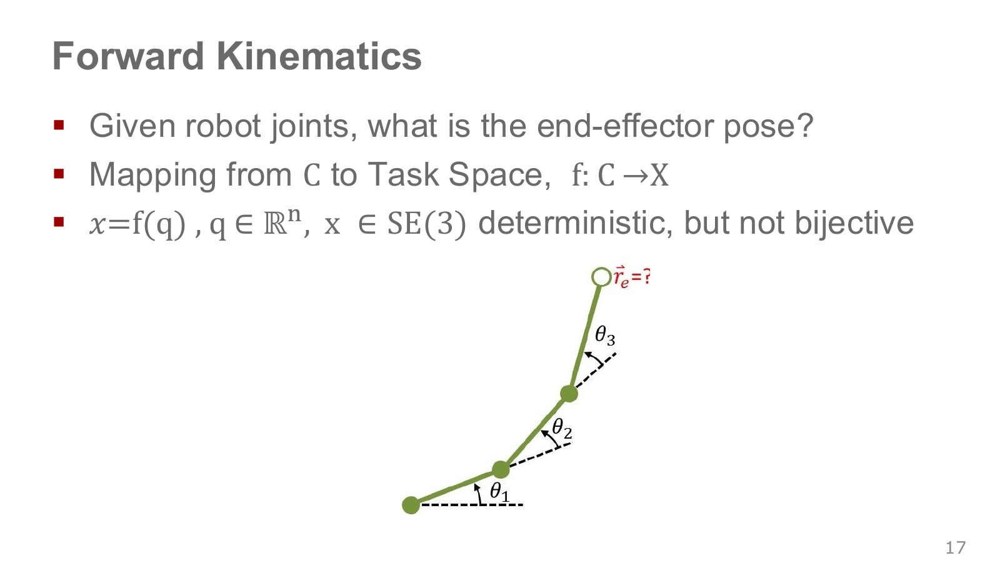

```text
Forward Kinematics

« Given robot joints, what is the end-effector pose?
« Mapping from C to Task Space, f: C >X
" x=f(q),q€ IR”, x € SE(3) deterministic, but not bijective

17
```

## Slide 19

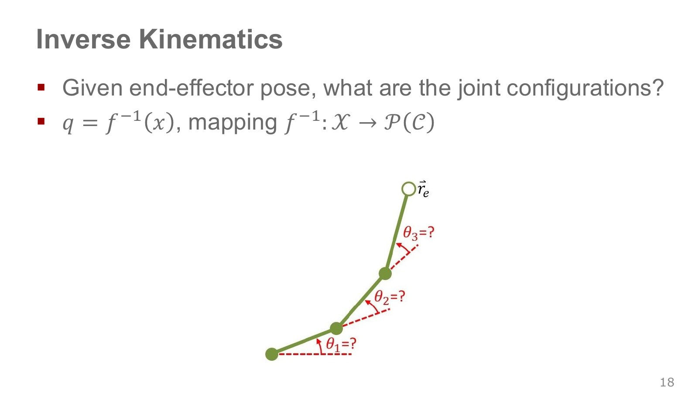

```text
Inverse Kinematics

« Given end-effector pose, what are the joint configurations?
= q=f~*(x), mapping f~*:X > P(C)

18
```

## Slide 20

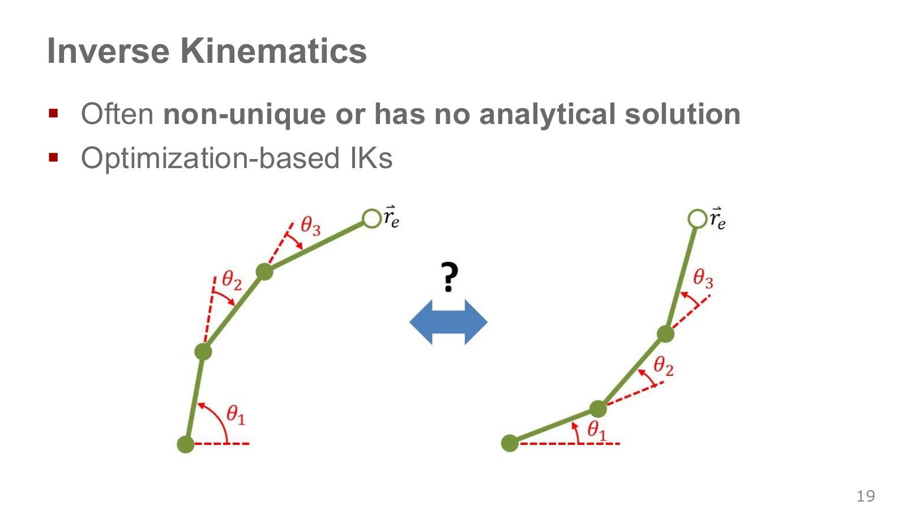

```text
Inverse Kinematics

« Often non-unique or has no analytical solution
= Optimization-based IKs

19
```

## Slide 21

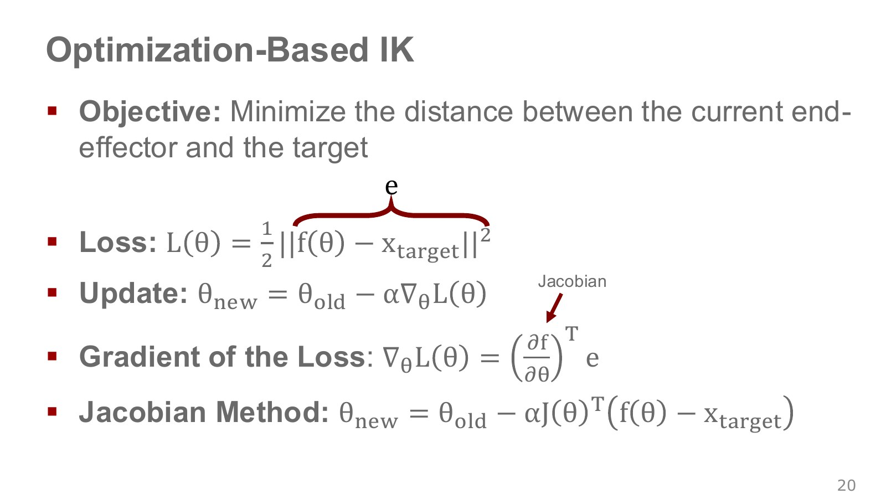

```text
Optimization-Based IK

= Objective: Minimize the distance between the current end-

effector and the target

1
« Loss: L(6) = LO) = Keepeall|
. Update: Bnew - Bola _ aVoL(@) va

. af\!
« Gradient of the Loss: VoL(8) = (=) e

= Jacobian Method: Onew = 91a - @J(8)"(f(®) - Xtarget)

20
```

## Slide 22

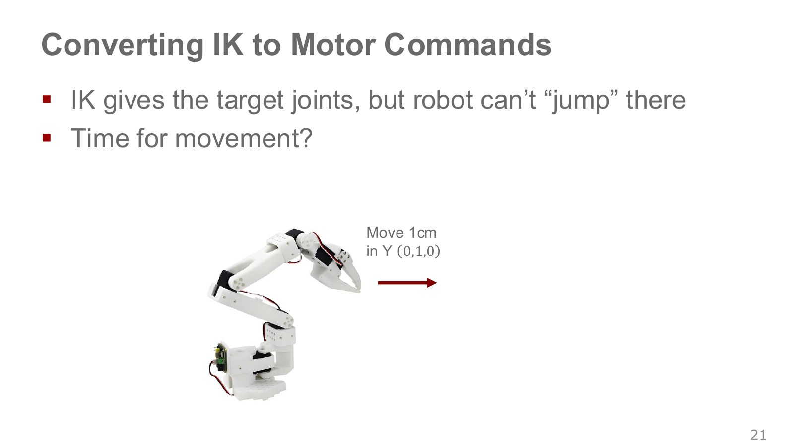

```text
Converting IK to Motor Commands

« IK gives the target joints, but robot can’t “jump” there
= Time for movement?

Move 1cm
Za in Y (0,1,0)

21
```

## Slide 23

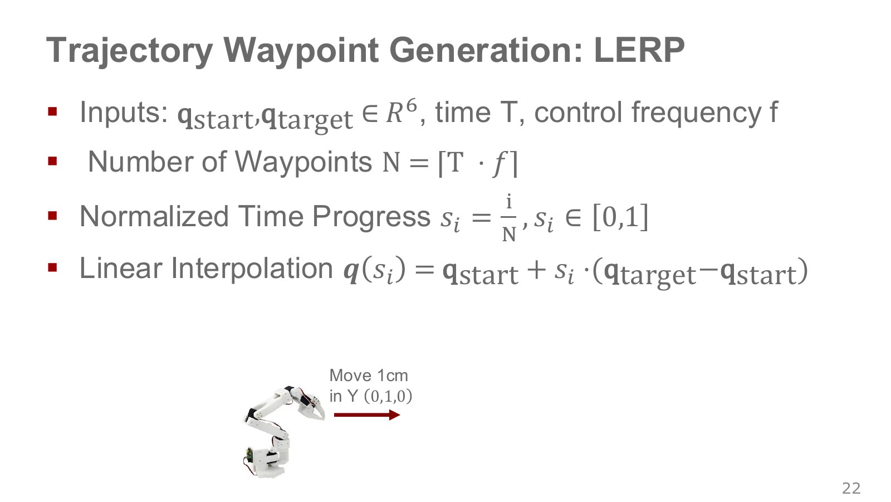

```text
Trajectory Waypoint Generation: LERP

= Inputs: qstart-Itarget © R®, time T, control frequency f
= Number of Waypoints N = [T - f]

= Normalized Time Progress s; = 5 Si € [0,1]

= Linear Interpolation q(s;) = qstart + Si ‘(dtarget-start)

Move 1cm
~My in Y (0,1,0)

ae

22
```

## Slide 24

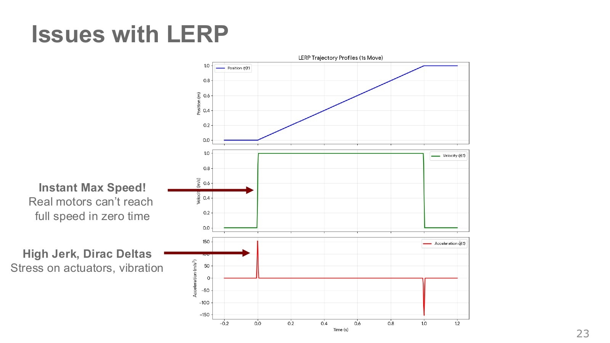

```text
Issues with LERP

LERP Trajectory Profiles (1s Move)

Postion q(t)

Position (rm)
°
8g £ & &

2
8

fo

- Vetocity (0)

2

06

Instant Max Speed!
Real motors can’t reach
full speed in zero time

Velociff (rvs)

04

02

00

150 - Acceleration {t)

High Jerk, Dirac Delta >
Stress on actuators, vibration

8

°

‘Acceleration (mis?)
8

100

150

02 00 02 o4 06 08 10 2
Time (s)
```

## Slide 25

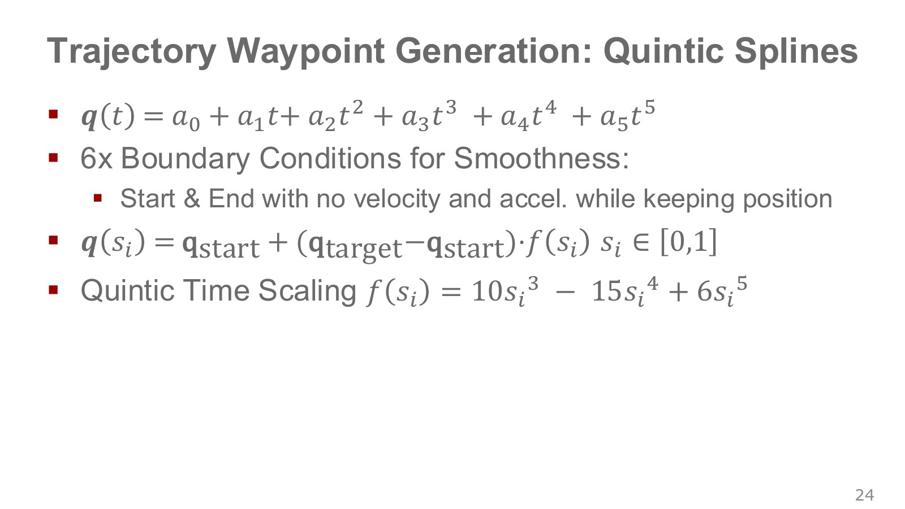

```text
Trajectory Waypoint Generation: Quintic Splines

q(t) =dap taytt+ ant? +a3t? +a,t* +ast?
6x Boundary Conditions for Smoothness:
= Start & End with no velocity and accel. while keeping position
q(si) = Qstart + (Atarget-start) f (si) si € [0,1]
Quintic Time Scaling f(s;) = 10s;3 - 15s;* + 6s,°

24
```

## Slide 26

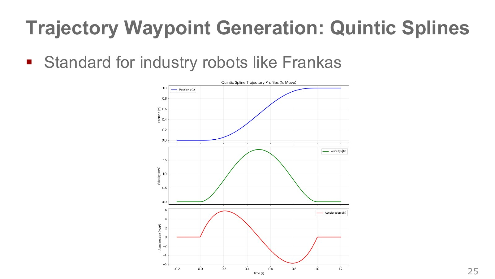

```text
Trajectory Waypoint Generation: Quintic Splines

= Standard for industry robots like Frankas

Quintic Spline Trajectory Profiles (1s Move)
```

## Slide 27

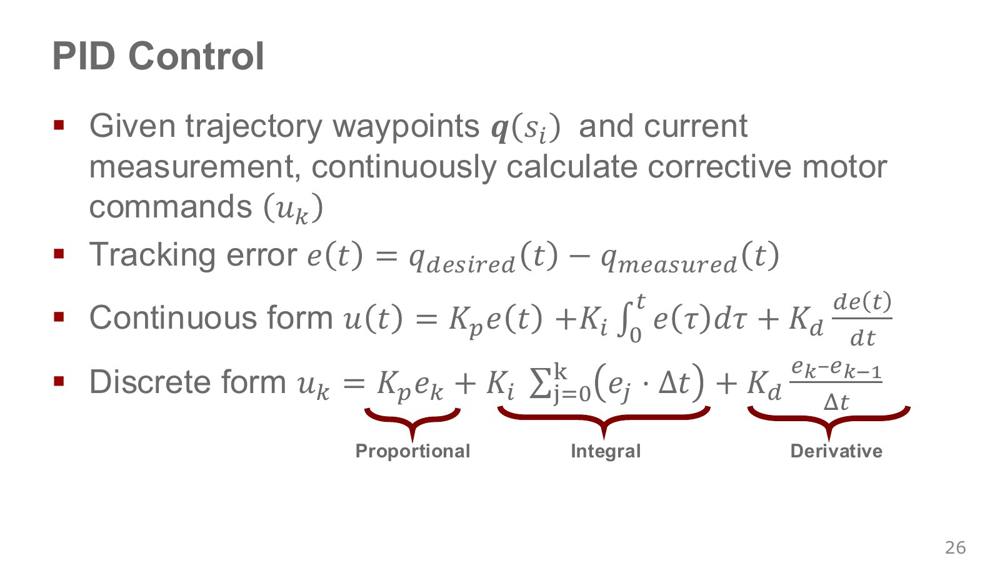

```text
PID Control

Given trajectory waypoints q(s;) and current
measurement, continuously calculate corrective motor
commands (u,)

Tracking error e(t) = qaesirea(t) - Imeasurea(t)

Continuous form u(t) = Kye(t) +K; i e(t)dt+ Kg oe

Discrete form u;, = K. pee + K; ys L(G - At) + Kq “ he :

Proportional Integral Derivative

26
```

## Slide 28

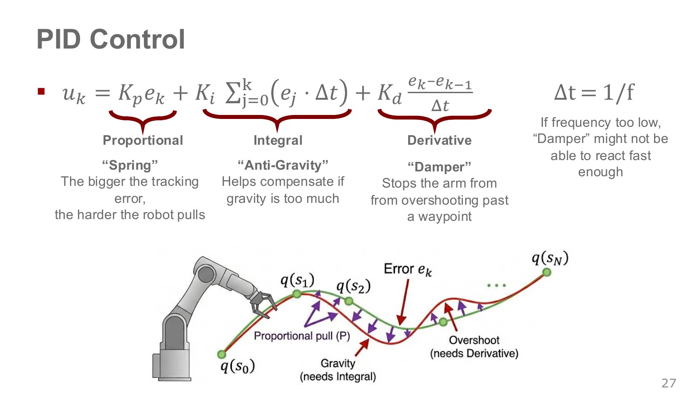

```text
PID Control

_ k Ck-Ck-1 _
™ UR = Ky ex + K; Deol e; - At) + Kg Re At= 1/f
If frequency too low,
Proportional Integral Derivative “Damper” might not be
het on ces sey able to react fast
Spring Anti-Gravity “Damper” enough
The bigger the tracking Helps compensate if Stops the arm from
error, gravity is too much from overshooting past
the harder the robot pulls a waypoint

q(sw)

Overshoot
(needs Derivative)

Gravity

(needs Integral) 27
```

## Slide 29

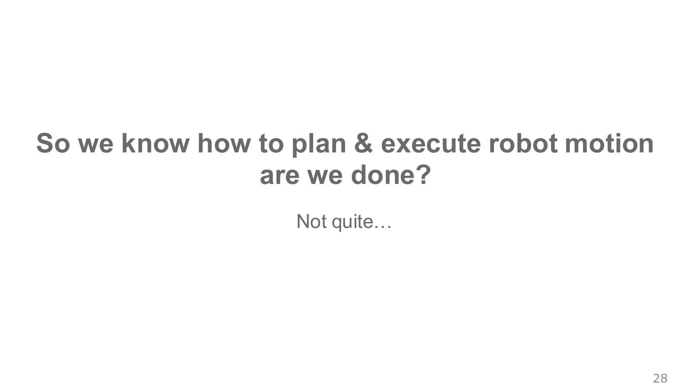

```text
So we know how to plan & execute robot motion
are we done?

Not quite...

28
```

## Slide 30

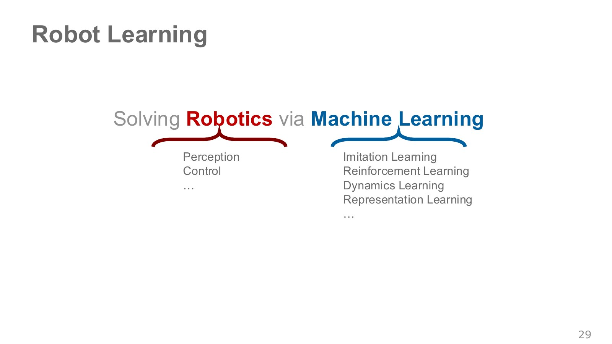

```text
Robot Learning

Solving Robotics via M

Perception
Control

achine Learning

-_-~

Imitation Learning
Reinforcement Learning
Dynamics Learning
Representation Learning

29
```

## Slide 31

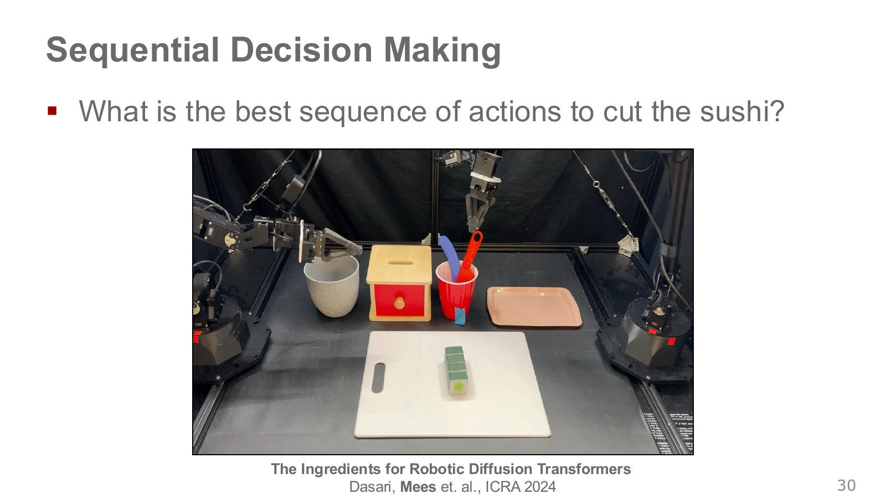

```text
Sequential Decision Making

«» What is the best sequence of actions to cut the sushi?

The Ingredients for Robotic Diffusion Transformers
Dasari, Mees et. al., ICRA 2024

30
```

## Slide 32

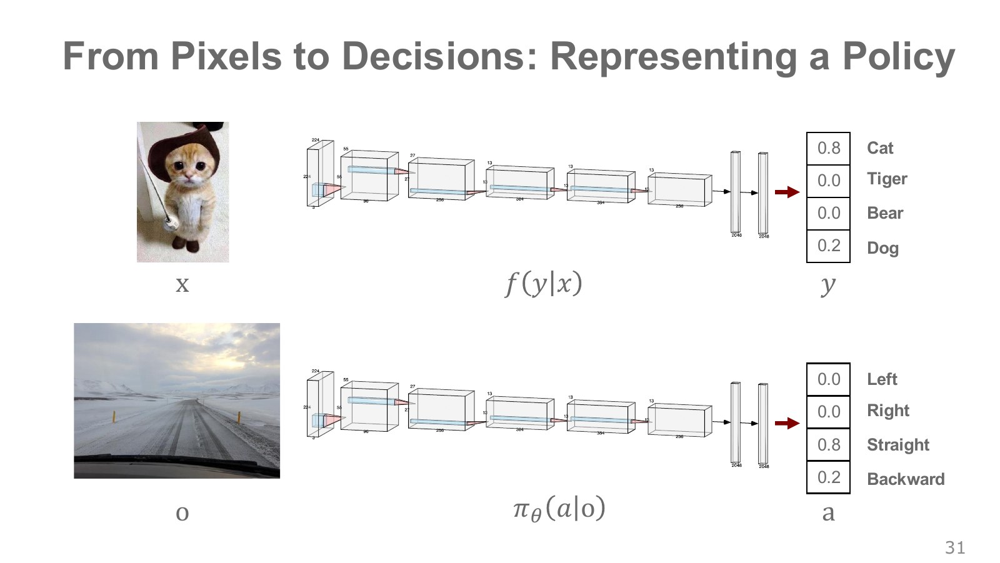

```text
From Pixels to Decisions: Representing a Policy

Cat

Tiger

Bear

Dog

Left
Right

Straight

Backward

31
```

## Slide 33

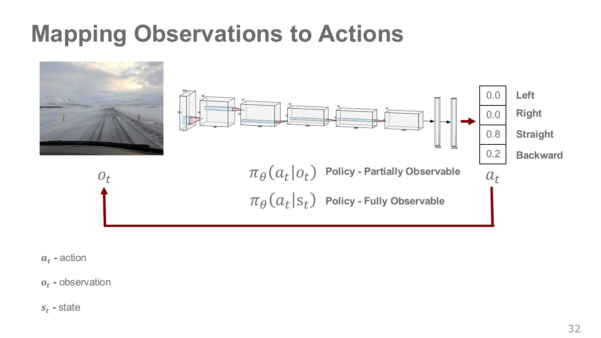

```text
Mapping Observations to Actions

Tl (a; Jo.) Policy - Partially Observable

Tg (a; | St) Policy - Fully Observable

0.0

0.0

0.8

0.2

at

a, - action
0, - observation

S, - State

Left
Right
Straight

Backward

32
```

## Slide 34

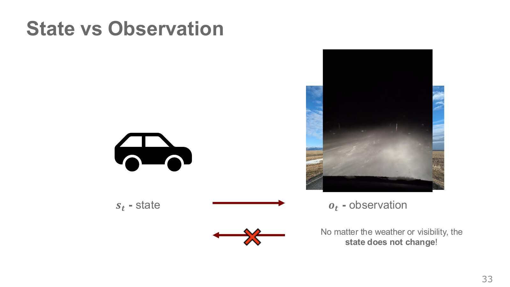

```text
State vs Observation

Ca

S,- state -_-_-_-_-, 0; - observation

- . No matter the weather or visibility, the
state does not change!
```

## Slide 35

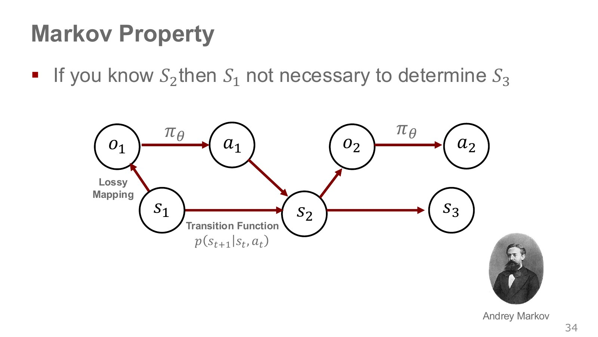

```text
Markov Property

« If you know S,then S, not necessary to determine S3

a YS

Transition Function
P(Sta11Se, Ae)

Lossy
Mapping

Andrey Markov
34
```

## Slide 36

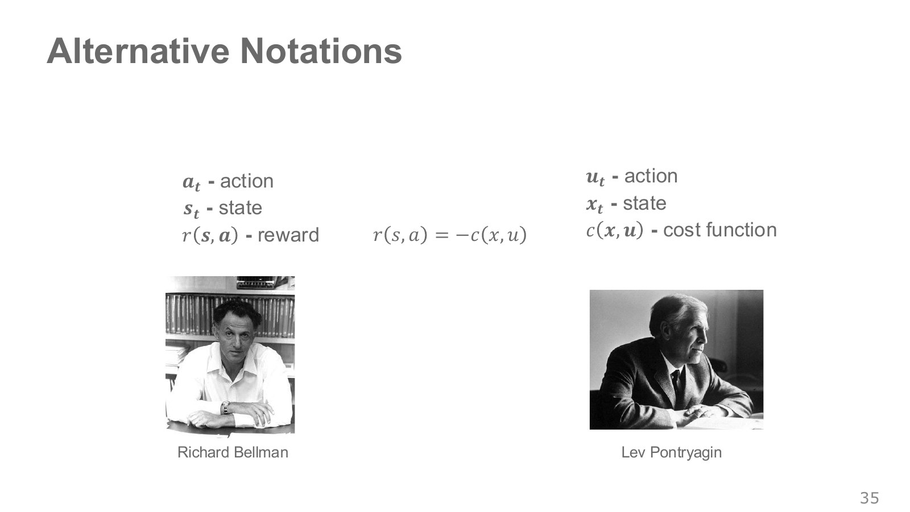

```text
Alternative Notations

a, - action uy - action
Ss, - State x, - State
r(s, a) - reward r(s,a) = -c(x,u) c(x, u) - cost function

A
\ i »

Vy

Richard Bellman Lev Pontryagin

35
```

## Slide 37

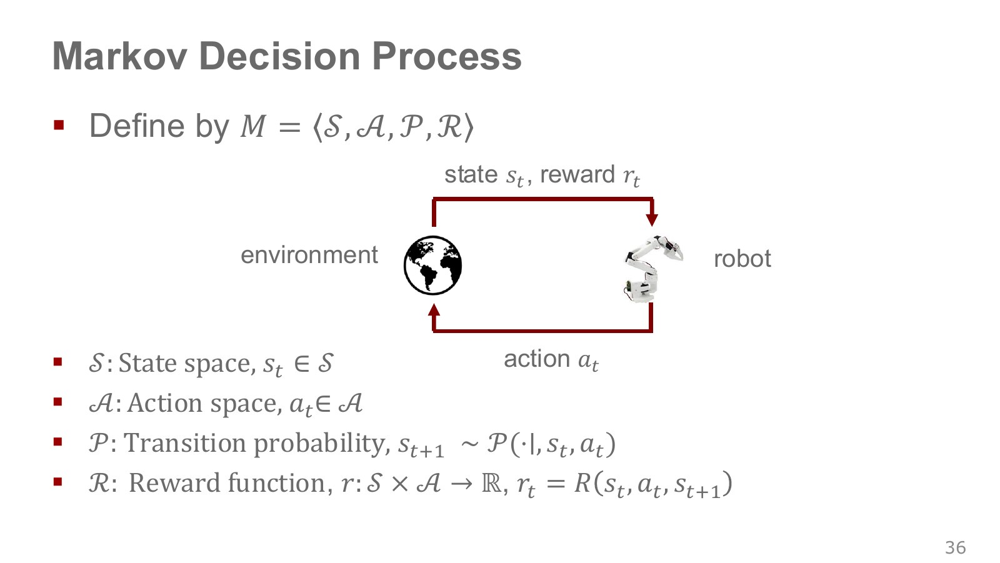

```text
Markov Decision Process

= Define by M = (S,A,P,R)
state s,, reward %

I y

environment 65 ey robot
Ae
|

t

S: State space, s, € S action a;

A: Action space, ar€ A

Pf: Transition probability, s.4, ~ PCI, Sz, at)
R: Reward function, r:S xX A > R, % = R(Sz, Gp, St44)

36
```

## Slide 38

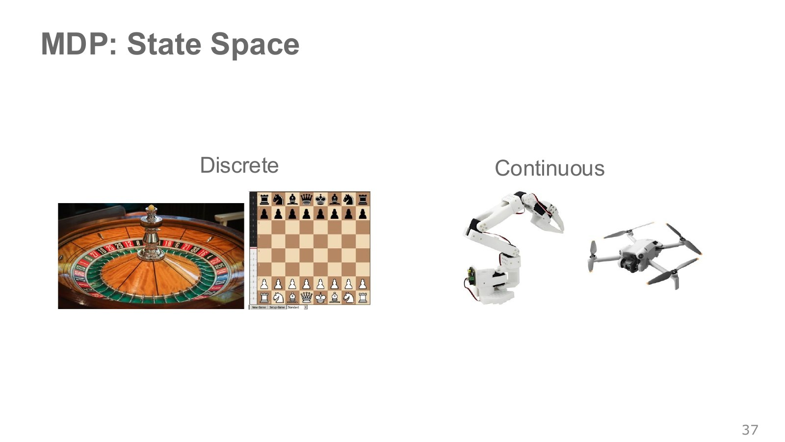

```text
MDP:

State Space

Discrete

rae

Continuous

>
~

=~

=

ae

37
```

## Slide 39

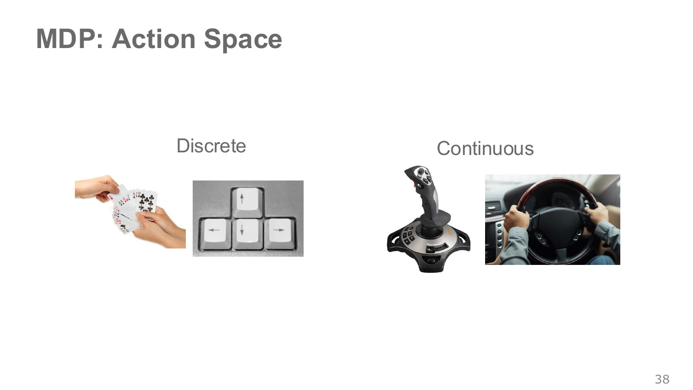

```text
MDP: Action Space

Discrete

Continuous

38
```

## Slide 40

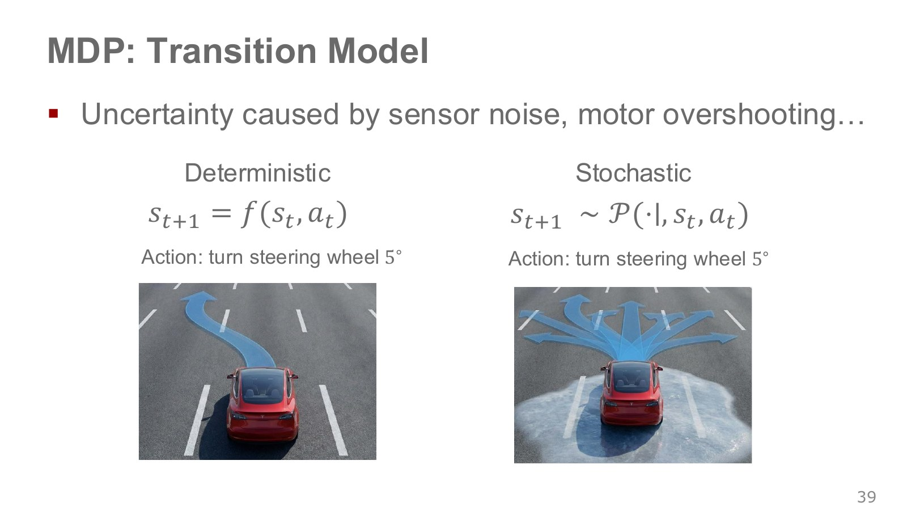

```text
MDP: Transition Model

» Uncertainty caused by sensor noise, motor overshooting...

Deterministic Stochastic

Star = f (St, A) St41 ~ PCL St, ae)

Action: turn steering wheel 5° Action: turn steering wheel 5°

39
```

## Slide 41

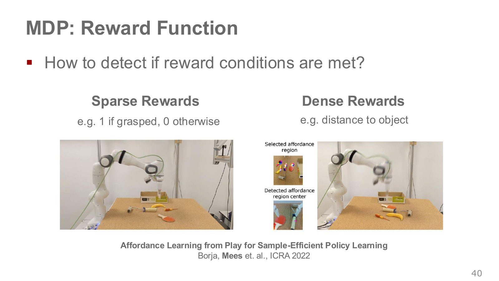

```text
MDP: Reward Function

= How to detect if reward conditions are met?

Sparse Rewards Dense Rewards
e.g. 1 if grasped, 0 otherwise e.g. distance to object

Selected affordance
region

ks
Detected affordance
region center

Affordance Learning from Play for Sample-Efficient Policy Learning
Borja, Mees et. al., ICRA 2022

40
```

## Slide 42

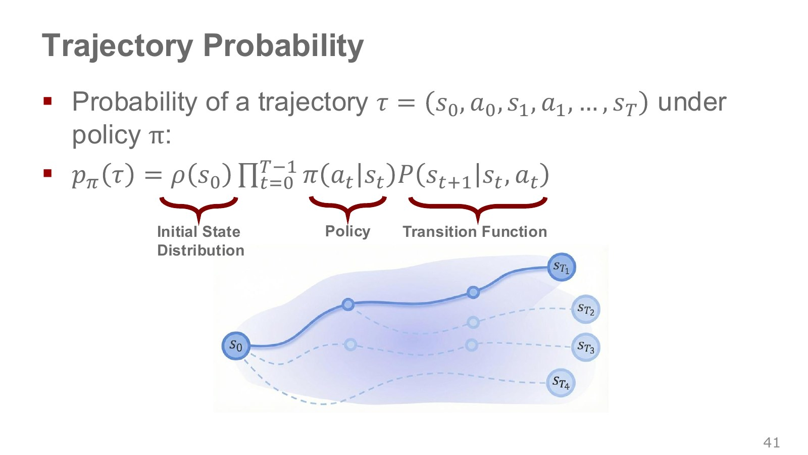

```text
Trajectory Probability

« Probability of a trajectory t = (so, do, 51, Q4, ..., Sp) Under
policy 1:

" pz(T) = p(So) Ifo T(A¢|S¢)P(St411S¢, Ae)

Initial State Balicy Transition Function

Distribution

41
```

## Slide 43

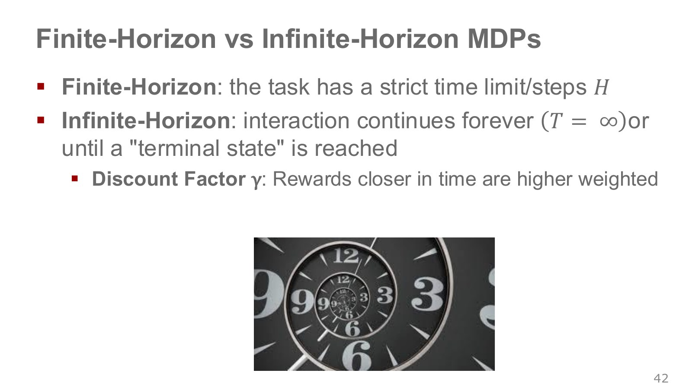

```text
Finite-Horizon vs Infinite-Horizon MDPs

= Finite-Horizon: the task has a strict time limit/steps H

# Infinite-Horizon: interaction continues forever (T = ©o)or
until a "terminal state" is reached

=" Discount Factor y: Rewards closer in time are higher weighted

42
```

## Slide 44

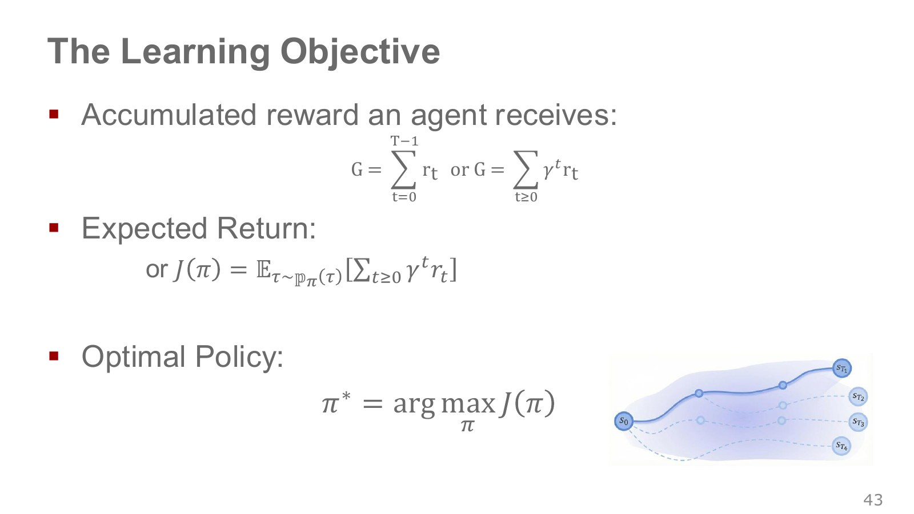

```text
The Learning Objective

» Accumulated reward an agent receives:

=" Expected Return:
or J (zr) = E,W~p,(t) [Zeeo yr]

" Optimal Policy:

m* = argmax/](z)
TT

43
```

## Slide 45


```text
Thank you for your attention
```

## Slide 46

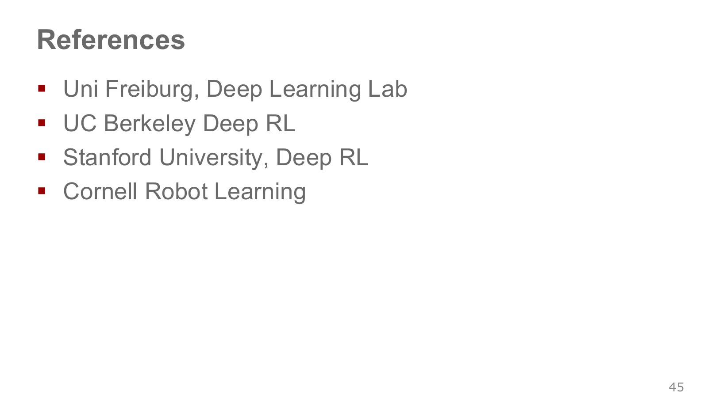

```text
References

# Uni Freiburg, Deep Learning Lab
«" UC Berkeley Deep RL

« Stanford University, Deep RL

« Cornell Robot Learning

45
```

---

[← Course home](../README.md) · [Open optional slide gallery →](../curriculum/week-02-control-and-mdps.md)
