# Week 03 - Imitation Learning: OCR transcript

[← Course home](../README.md) · **Default OCR view** · [Open optional slide gallery →](../curriculum/week-03-imitation-learning.md)

> This is an automated OCR transcript generated from the locally rendered slide images. Use the image as the source of truth for equations, diagrams, citations, and small text.

## Slide 1

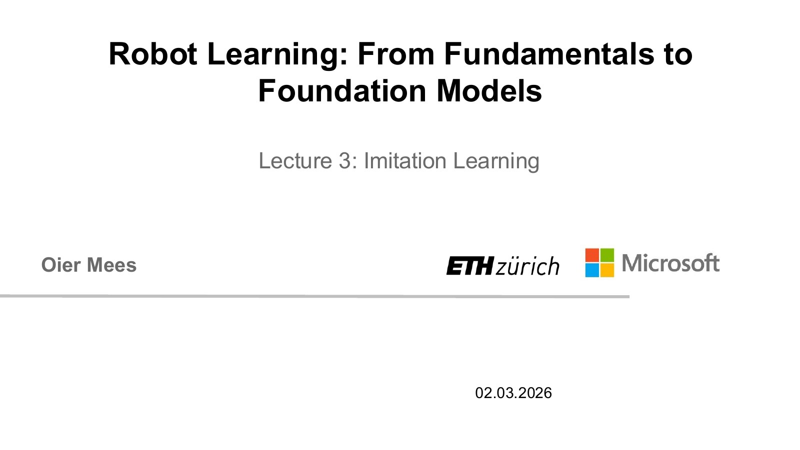

```text
Robot Learning: From Fundamentals to
Foundation Models

Lecture 3: Imitation Learning

Oier Mees ETHzirich §® Microsoft

02.03.2026
```

## Slide 2

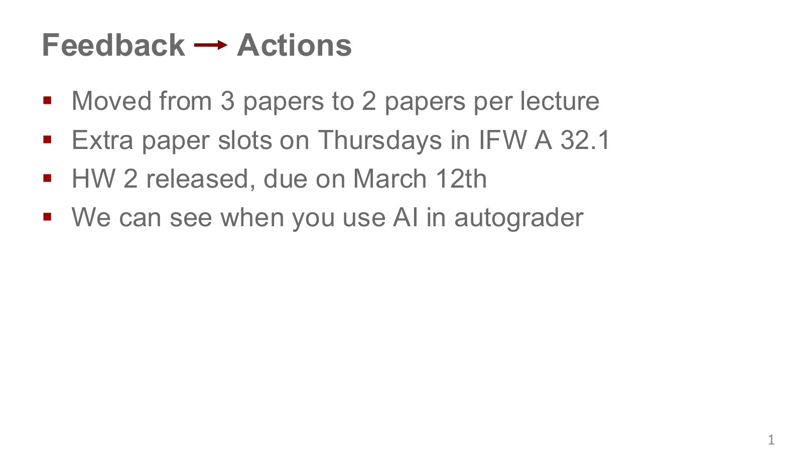

```text
Feedback - Actions

« Moved from 3 papers to 2 papers per lecture
» Extra paper slots on Thursdays in IFW A 32.1
» HW 2 released, due on March 12th

=» We can see when you use Al in autograder
```

## Slide 3

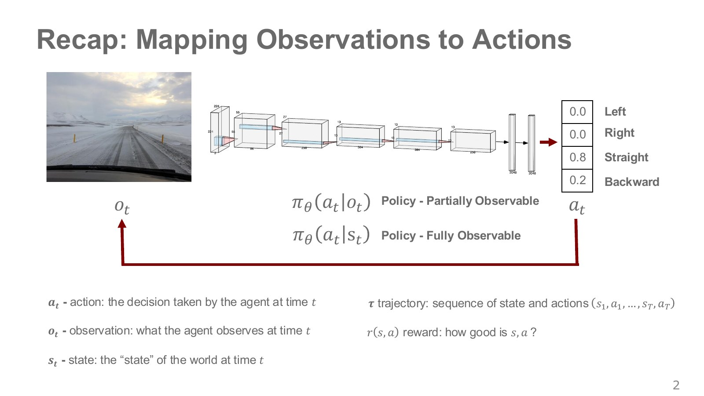

```text
Recap: Mapping Observations to Actions

0.0 | Left
0.0 | Right
0.8 | Straight
0.2 | Backward
Or Tl (a; Jo.) Policy - Partially Observable at
t Tg (a; | St) Policy - Fully Observable
a, - action: the decision taken by the agent at time t tT trajectory: sequence of state and actions (s,, a1,..., Sr, ar)
0, - observation: what the agent observes at time t r(s, a) reward: how good is s,a?

S, - State: the “state” of the world at time t
```

## Slide 4

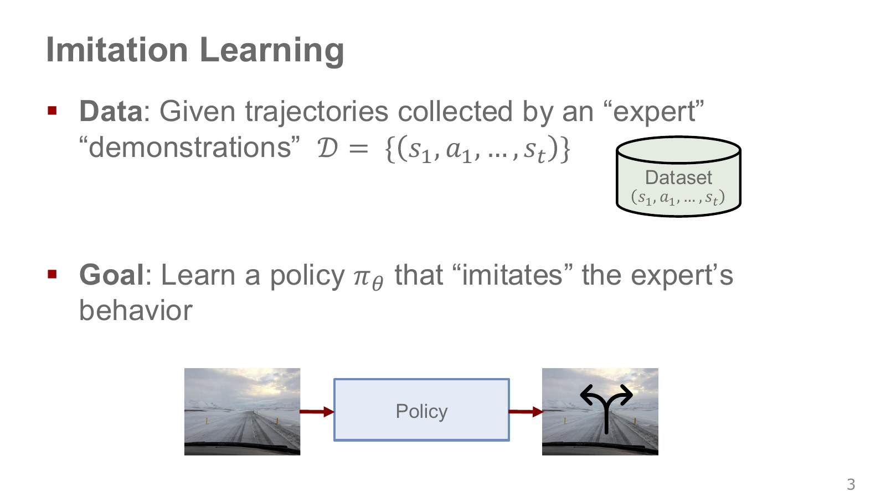

```text
Imitation Learning

« Data: Given trajectories collected by an “expert”
“demonstrations” D = {(s;,q,,...,S)} (>

Dataset
(Sy, ay, S¢)

« Goal: Learn a policy zz that “imitates” the expert’s

behavior

Policy
```

## Slide 5

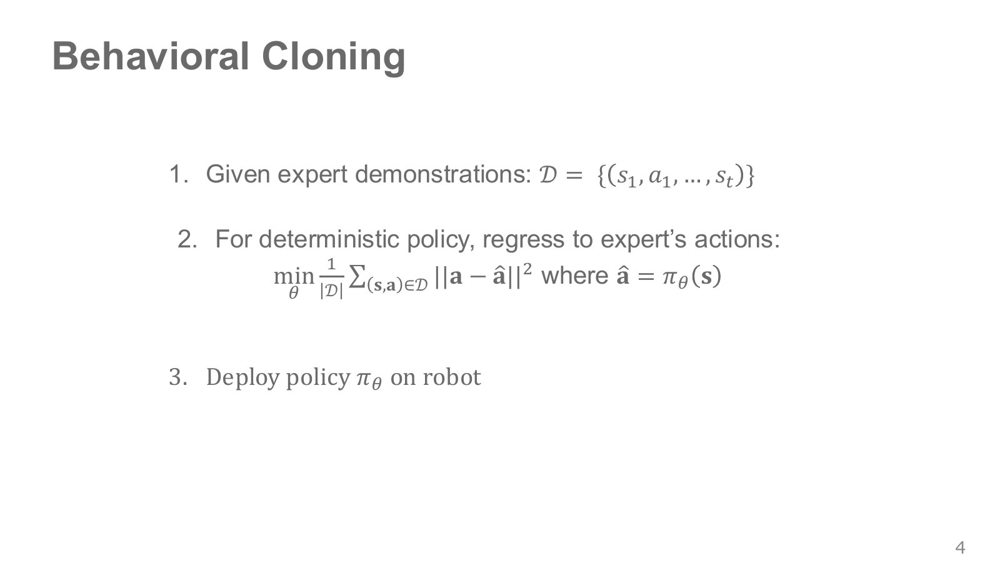

```text
Behavioral Cloning

1. Given expert demonstrations: D = {(s;, a4, ..-,5,)}

2. For deterministic policy, regress to expert’s actions:

4 1 A A
min = Lae ||a - a||? where 4 = mg(s)

3. Deploy policy zg on robot
```

## Slide 6

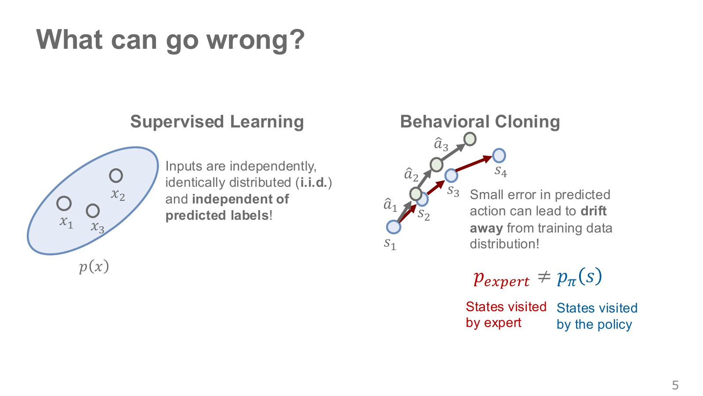

```text
What can go wrong?

p(x)

Supervised Learning

Inputs are independently,
identically distributed (i.i.d.)
and independent of
predicted labels!

Behavioral Cloning

ag
ay es
~ 53 Small error in predicted
a” action can lead to drift
away from training data
Sy distribution!

Pexpert + Px (s)

States visited States visited
by expert by the policy
```

## Slide 7

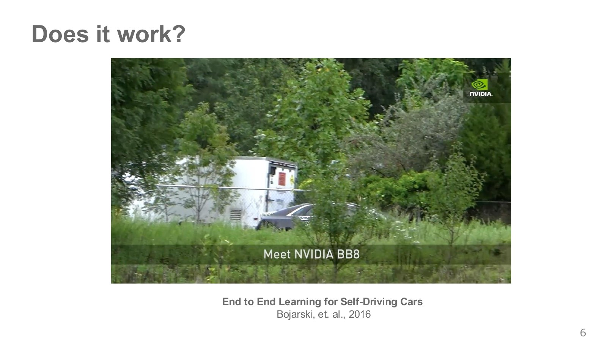

```text
Does it work?

NVIDIA.

Meet NVIDIA BB8

End to End Learning for Self-Driving Cars
Bojarski, et. al., 2016
```

## Slide 8

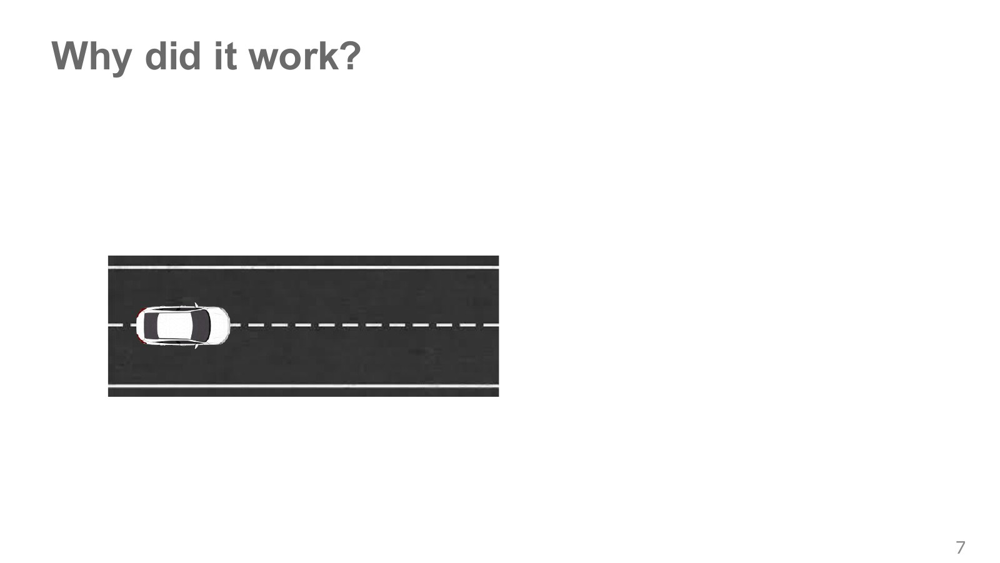

```text
Why did it work?
```

## Slide 9

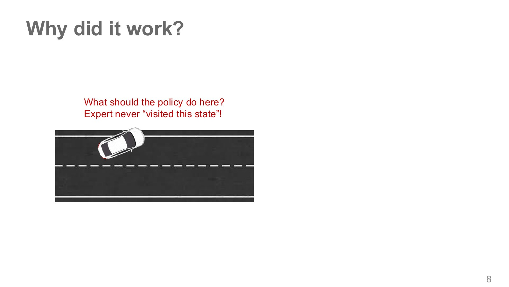

```text
Why did it work?

What should the policy do here?
Expert never “visited this state”!
```

## Slide 10

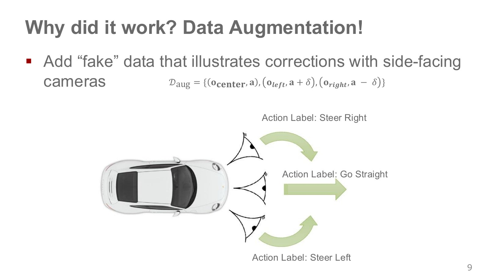

```text
Why did it work? Data Augmentation!

« Add “fake” data that illustrates corrections with side-facing
cameras Daug = {(Ocenter, a), (rest, + 5), (Orignt,a - 5)}

Action Label: Steer Right

Action Label: Go Straight

Action Label: Steer Left

So

(2)
```

## Slide 11

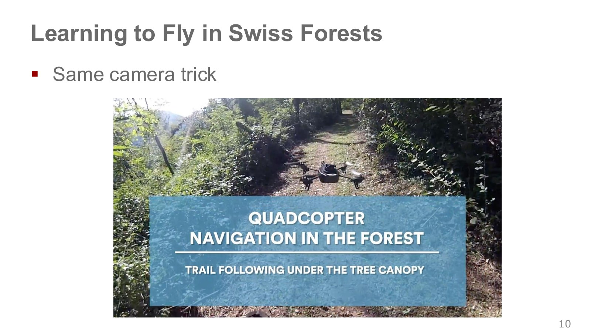

```text
Learning to Fly in Swiss Forests

» Same camera trick

- -QUADCOPTEF
NAVIGATION IN THE FOREST

_ TRAILFOLLOWING UNDER THE TREE CANOPY

10
```

## Slide 12

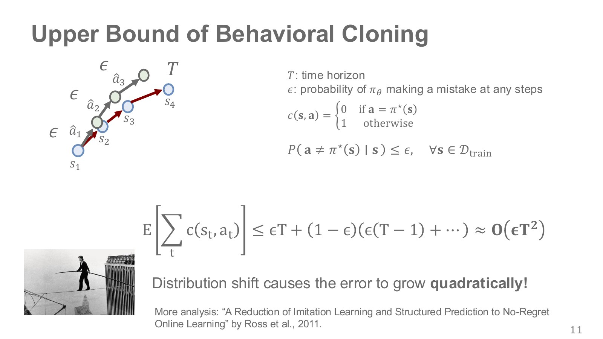

```text
Upper Bound of Behavioral Cloning

T: time horizon
€: probability of 7g making a mistake at any steps

_j0 ifa=m*(s)
ah) {° otherwise

P(a#m*(s)|s) <6, VS € Dirain

t

E ce ar)| < eT + (1 -©)(€(T - 1) ++) = O(eT?)

Distribution shift causes the error to grow quadratically!

More analysis: “A Reduction of Imitation Learning and Structured Prediction to No-Regret

Online Learning” by Ross et al., 2011. 11
```

## Slide 13

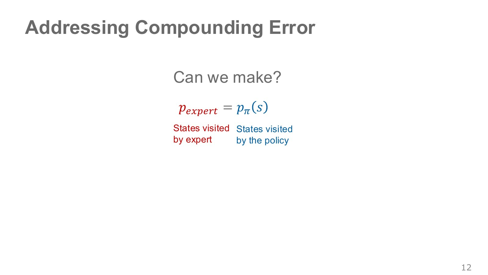

```text
Addressing Compounding Error

Can we make?

Pexpert = Px (s)

States visited States visited
by expert by the policy

12,
```

## Slide 14

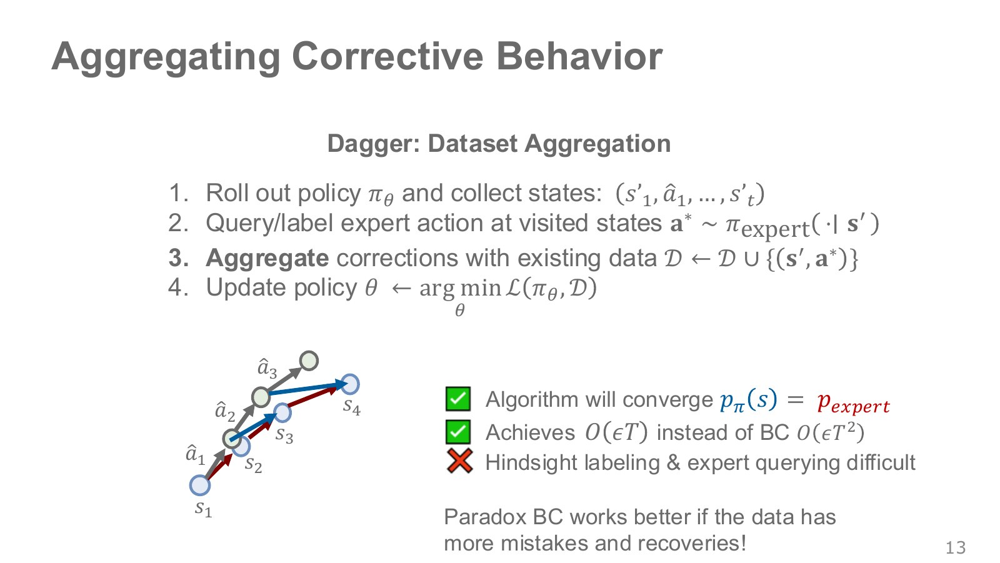

```text
Aggregating Corrective Behavior

Dagger: Dataset Aggregation

Roll out policy zg and collect states: (s’,, Gy, ...,5’¢)
Query/label expert action at visited states a* ~ texpert(-| s’)
Aggregate corrections with existing data D «+ D U {(s’,a*)}
Update policy 9 < arg min L(m9,D)

6

Pons

a, Sy Algorithm will converge Pz(s) = Pexpert
. S3 Achieves O(eéT) instead of BC O(eT?)
Lv Sz x Hindsight labeling & expert querying difficult
Sy

Paradox BC works better if the data has
more mistakes and recoveries! 13
```

## Slide 15

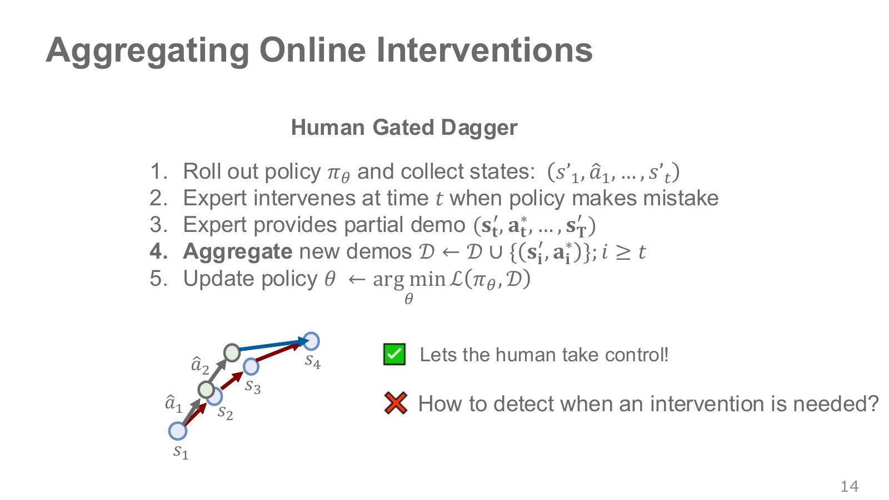

```text
Aggregating Online Interventions

Human Gated Dagger

1. Roll out policy zg and collect states: (s’,, @,...,5’¢)
2. Expert intervenes at time t when policy makes mistake
3. Expert provides partial demo (sj, aj, ..., s7)
4. Aggregate new demos D< Du {(si,aj)};i=t
5. Update policy 6 < arg min L(g, D)
6
a, S4 Lets the human take control!
A's
L So ° 3% How to detect when an intervention is needed?
Sy

14
```

## Slide 16

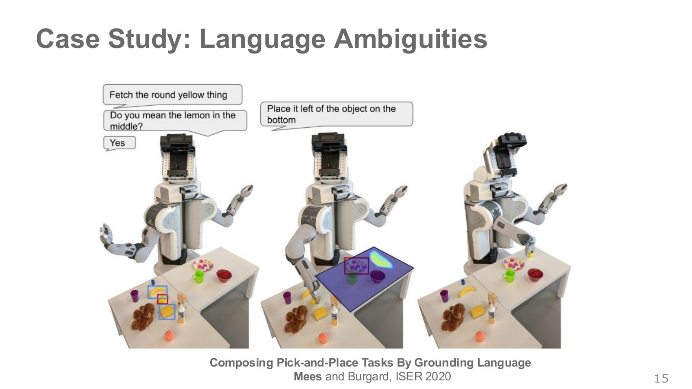

```text
Case Study: Language Ambiguities

Fetch the round yellow thing |

Place it left of the object on the ]

| Do you mean the lemon in the bottom
middle?

Composing Pick-and-Place Tasks By Grounding Language
Mees and Burgard, ISER 2020

15
```

## Slide 17

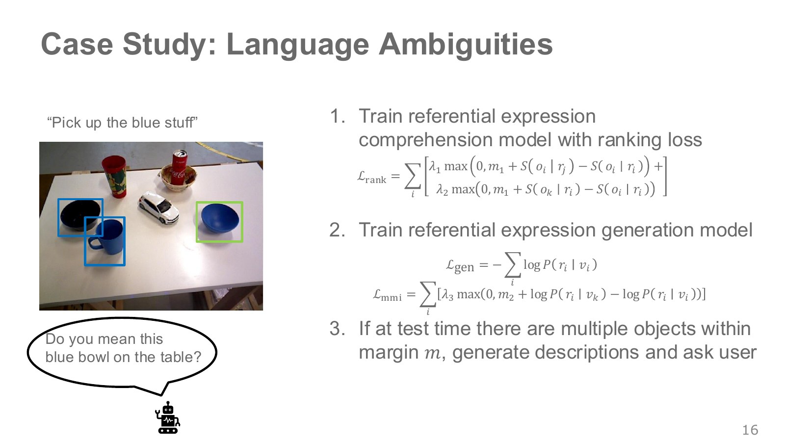

```text
Case Study: Language Ambiguities

“Pick up the blue stuff’

Do you mean this
blue bowl on the table?

. Train referential expression

comprehension model with ranking loss

-y pant 0,m, + S( 0; | 4) - SCo; In))+
“eat Az max(0,my + SC ox | 7) - SCo; | 7;))

. Train referential expression generation model

L£gen = - Plog PCr | v;,)

i
Lmmi = yls max(0, m2 + log P(%; | vz.) - log P(% 1% ))]
t

If at test time there are multiple objects within
margin m, generate descriptions and ask user

16
```

## Slide 18

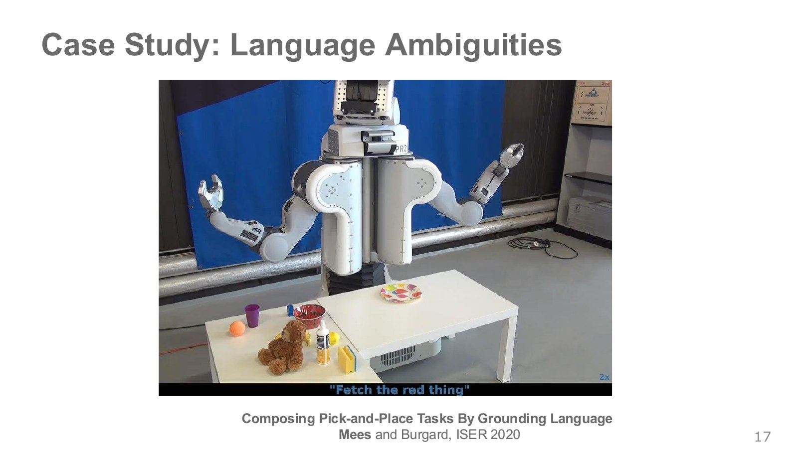

```text
Case Study:

Language Ambiguities

Composing Pick-and-Place Tasks By Grounding Language
Mees and Burgard, ISER 2020

17
```

## Slide 19

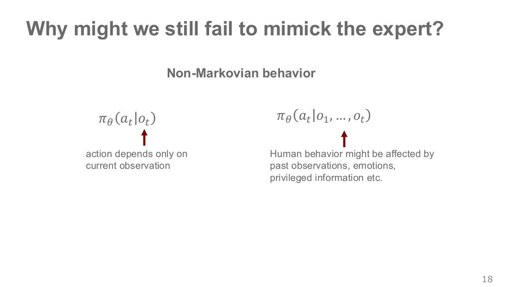

```text
Why might we still fail to mimick the expert?

Non-Markovian behavior

19 (a lor) Tg (Az | 04, -», O¢)
action depends only on Human behavior might be affected by
current observation past observations, emotions,

privileged information etc.

18
```

## Slide 20

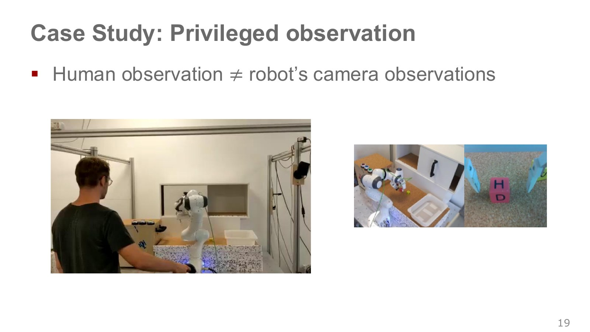

```text
Case Study: Privileged observation

"= Human observation + robot’s camera observations

19
```

## Slide 21

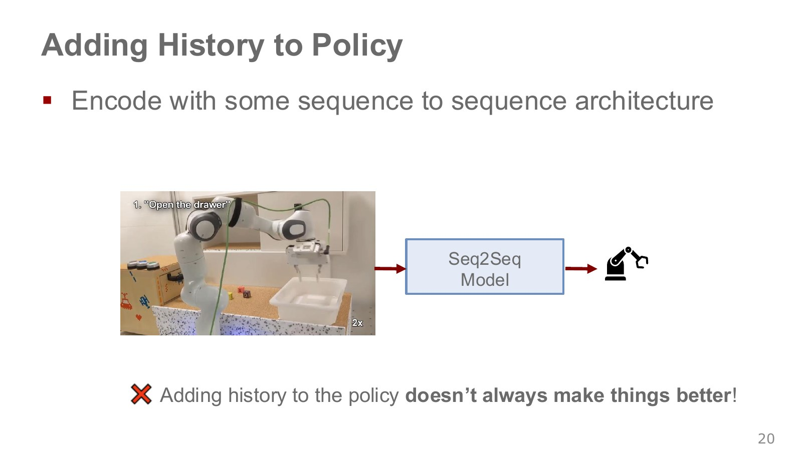

```text
Adding History to Policy

» Encode with some sequence to sequence architecture

~
iOpen) theydrawer ”

Seq2Seq Chae
Model -

% Adding history to the policy doesn’t always make things better!

20
```

## Slide 22

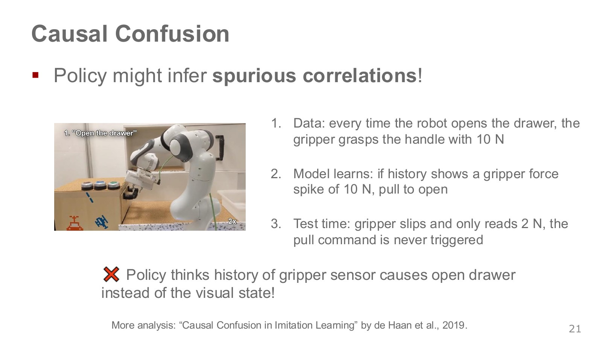

```text
Causal Confusion

= Policy might infer spurious correlations!

1. Data: every time the robot opens the drawer, the
gripper grasps the handle with 10 N

2. Model learns: if history shows a gripper force
spike of 10 N, pull to open

3. Test time: gripper slips and only reads 2 N, the
pull command is never triggered

% Policy thinks history of gripper sensor causes open drawer
instead of the visual state!

More analysis: “Causal Confusion in Imitation Learning” by de Haan et al., 2019. 21
```

## Slide 23

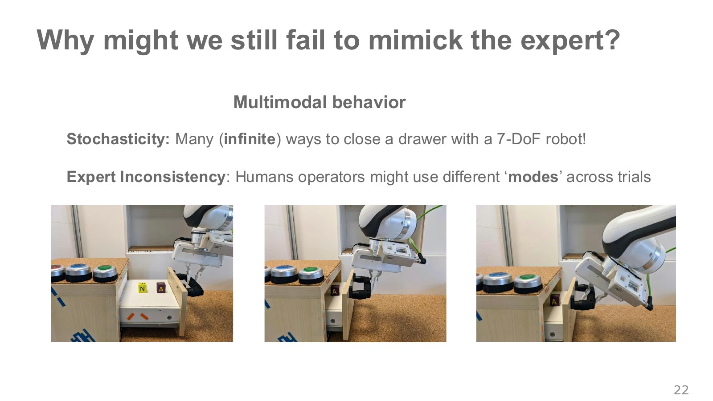

```text
Why might we still fail to mimick the expert?

Multimodal behavior

Stochasticity: Many (infinite) ways to close a drawer with a 7-DoF robot!

Expert Inconsistency: Humans operators might use different ‘modes’ across trials

22
```

## Slide 24

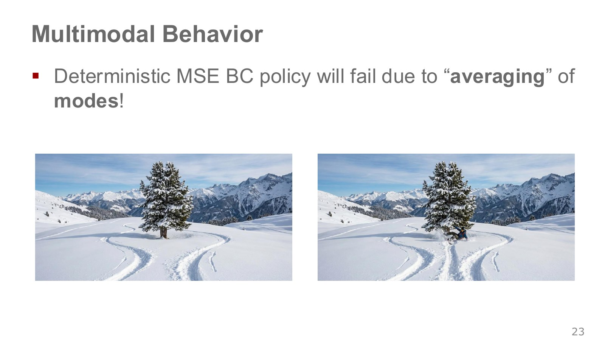

```text
Multimodal Behavior

" Deterministic MSE BC policy will fail due to “averaging” of
modes!

23
```

## Slide 25

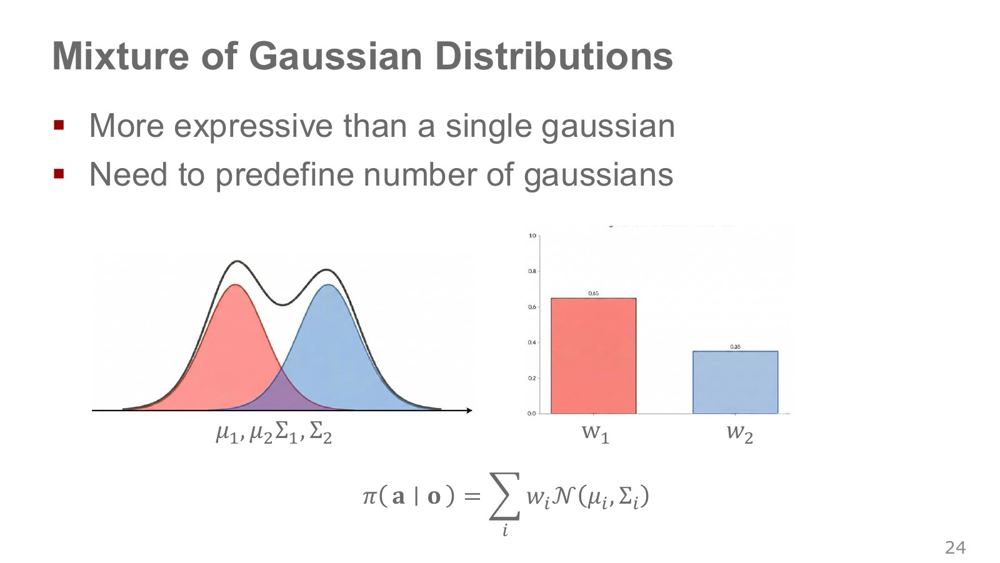

```text
Mixture of Gaussian Distributions

=" More expressive than a single gaussian
« Need to predefine number of gaussians

on

24
```

## Slide 26

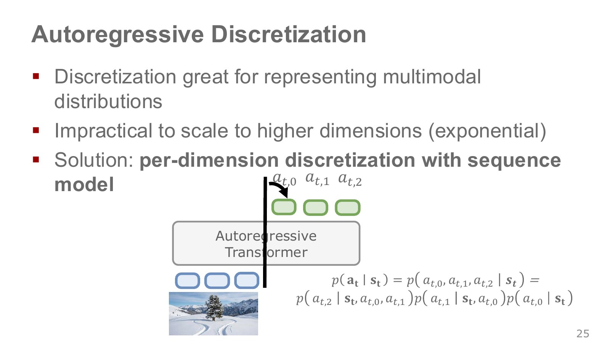

```text
Autoregressive Discretization

Discretization great for representing multimodal
distributions

Impractical to scale to higher dimensions (exponential)

Solution: per-dimension discretization with sequence
model a
en en kes)

| Autoregressive ]

Transformer

play | se) = p( Qt,0) At,1 At,2 | St) =
p( at2 | Sp, Ato, 4,1 )r( Qe | Se, a0 )r( ato | St)

O00

25
```

## Slide 27

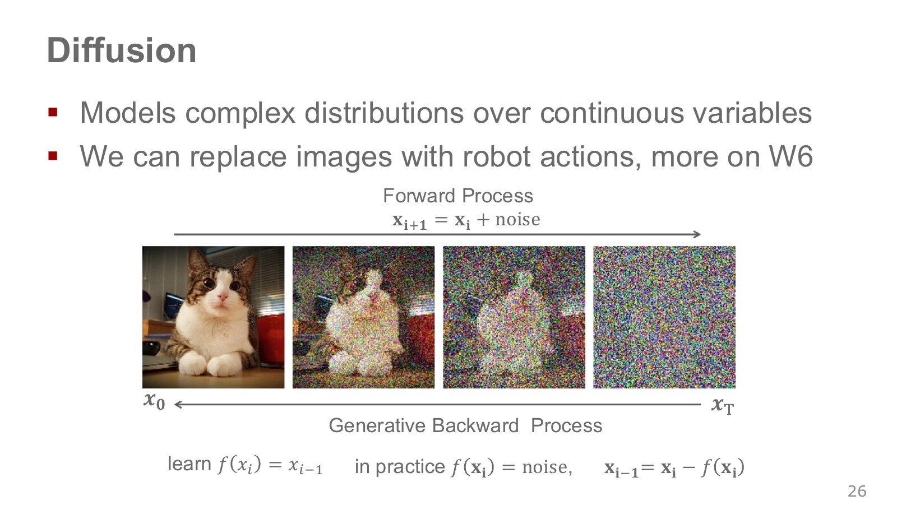

```text
Diffusion

» Models complex distributions over continuous variables
» We can replace images with robot actions, more on W6

Forward Process
Xi41 = Xj + noise

xT

Generative Backward Process

learn f(x) =x;-1 in practice f(x;) = noise, x,_4= x; - f(x)
26
```

## Slide 28

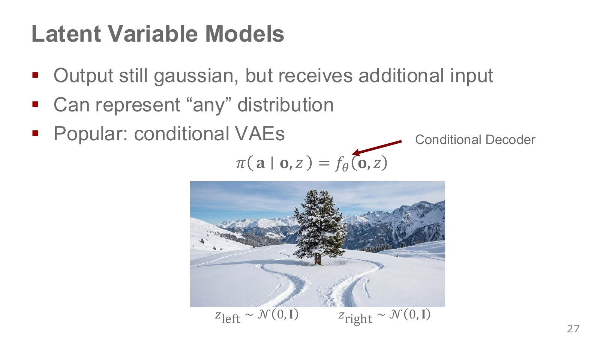

```text
Latent Variable Models

= Output still gaussian, but receives additional input
=" Can represent “any” distribution
# Popular: conditional VAEs

Conditional Decoder
n(alo,z) = foto)

27
```

## Slide 29

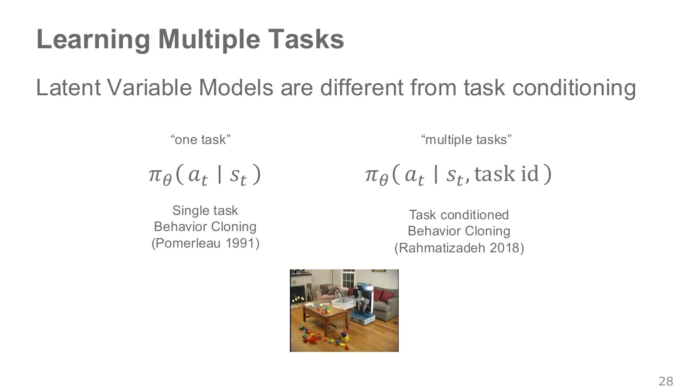

```text
Learning Multiple Tasks

Latent Variable Models are different from task conditioning

“one task” “multiple tasks”
Tg (az | st ) Tg (az | Sz, task id )
Single task Task conditioned
Behavior Cloning Behavior Cloning
(Pomerleau 1991) (Rahmatizadeh 2018)

28
```

## Slide 30

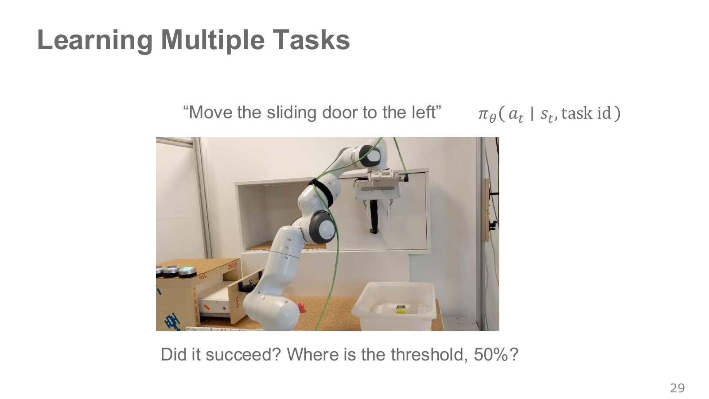

```text
Learning Multiple Tasks

“Move the sliding door to the left” Tg ( a; | s;, task id)

Did it succeed? Where is the threshold, 50%?

29
```

## Slide 31

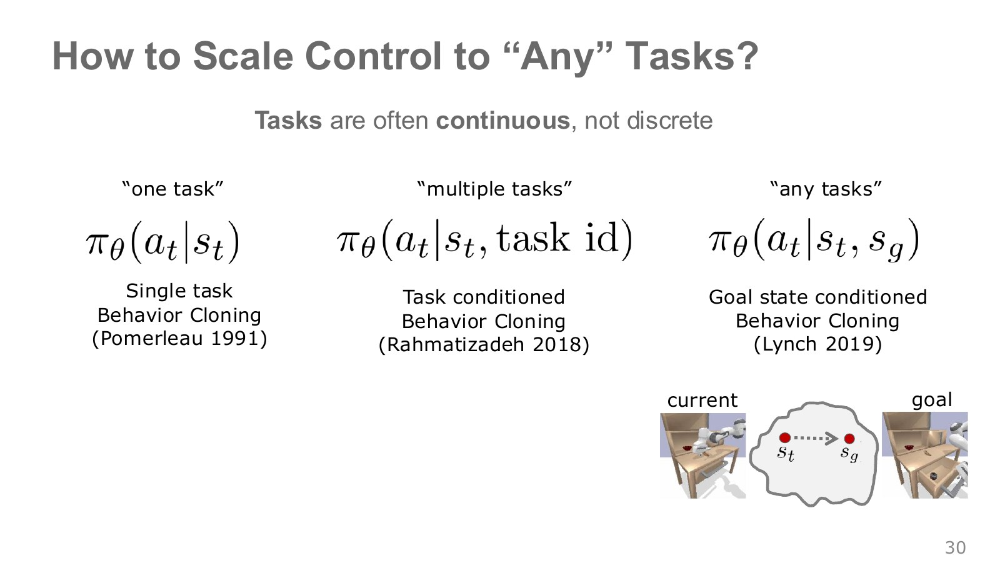

```text
How to Scale Control to “Any” Tasks?

Tasks are often continuous, not discrete

“one task” “multiple tasks” “any tasks”
To(at|S¢) To(az|sz, task id) - 7 9(ae|5¢, Sg)
Single task Task conditioned Goal state conditioned
Behavior Cloning Behavior Cloning Behavior Cloning
(Pomerleau 1991) (Rahmatizadeh 2018) (Lynch 2019)
current

S

30
```

## Slide 32

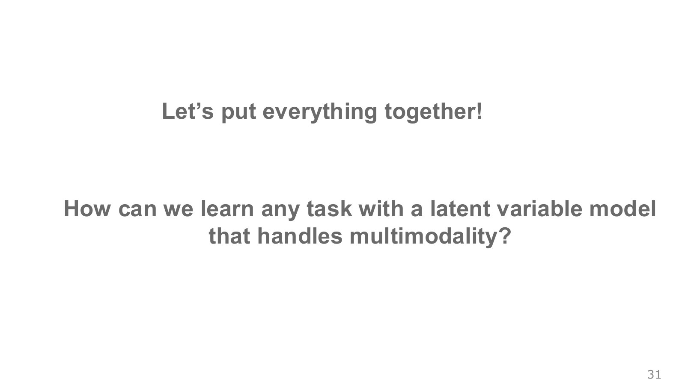

```text
Let’s put everything together!

How can we learn any task with a latent variable model
that handles multimodality?

31
```

## Slide 33

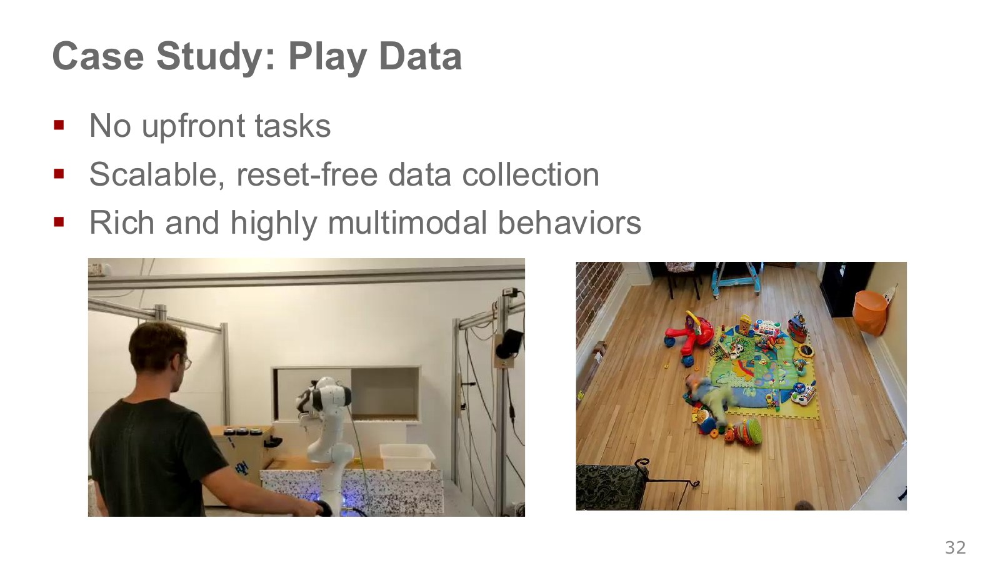

```text
Case Study: Play Data

= No upfront tasks
= Scalable, reset-free data collection
# Rich and highly multimodal behaviors

32
```

## Slide 34

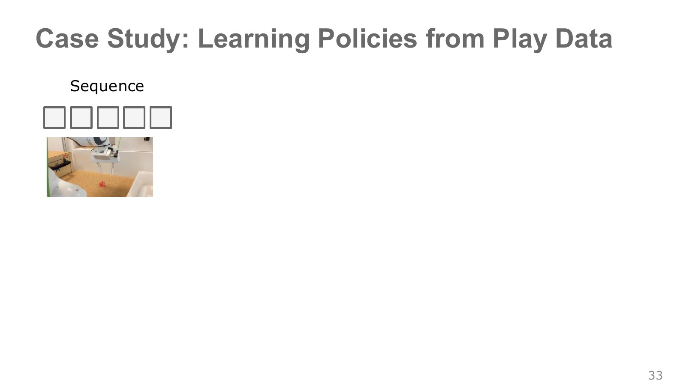

```text
Case Study: Learning Policies from Play Data

Sequence

33
```

## Slide 35

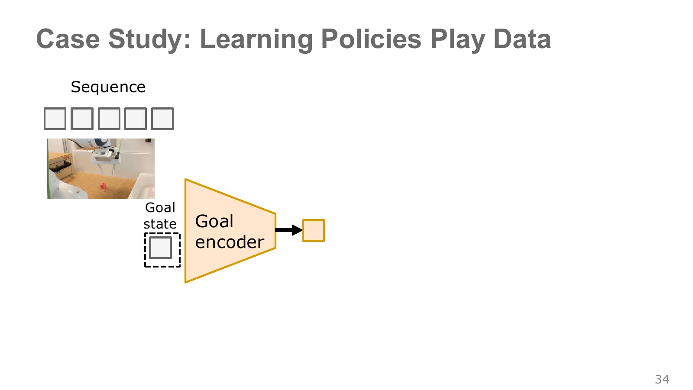

```text
Case Study: Learning Policies Play Data

Sequence

state | Goal
encoder

34
```

## Slide 36

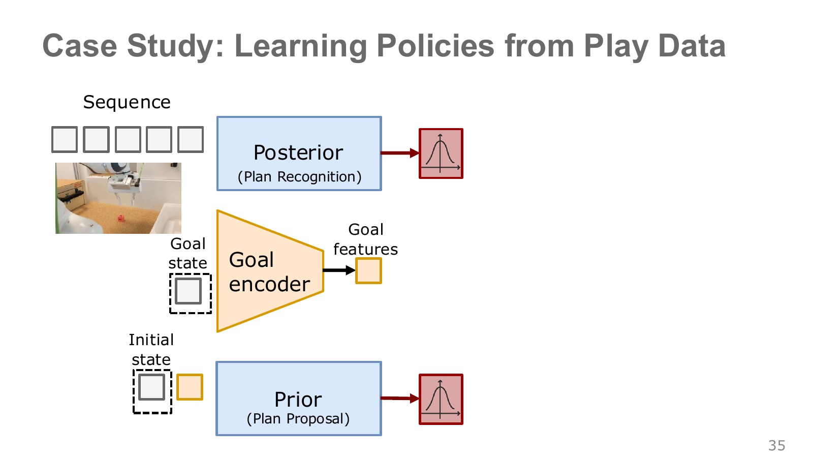

```text
Case Study: Learning Policies from Play Data

Sequence

Initial
state

Posterior Th
(Plan Recognition)

Goal
features

Goal
encoder

Prior 1A]
(Plan Proposal)

35
```

## Slide 37

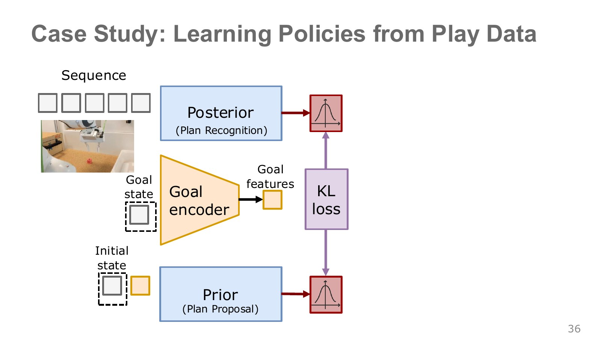

```text
Case Study: Learning Policies from Play Data

Sequence

Initial
state

Posterior
(Plan Recognition)

Goal
features

Goal
encoder

Prior
(Plan Proposal)

KL
loss

36
```

## Slide 38

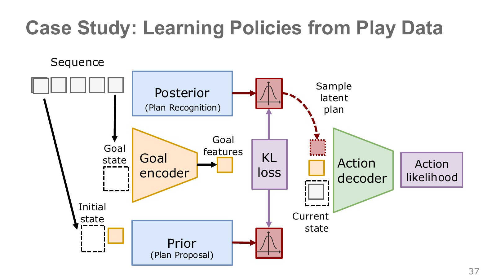

```text
Case Study: Learning Policies from Play Data

O

Sequence

Posterior
(Plan Recognition)

Goal
state

ror
14
Ceo
Initial
state

Goal
features

Goal
encoder

ei |
I I
i ot
|

Prior
(Plan Proposal)

KL
loss

Sample
SS. latent

Action

----, | decoder

Current
state

Action
likelihood

37
```

## Slide 39

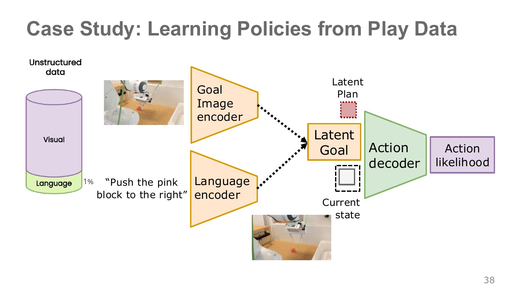

```text
Case Study: Learning Policies from Play Data

Unstructured
data

\ tenguage 1% “Push the pink

block to the right”

Goal
Image
encoder

Language
encoder

Latent
Plan

*+4| Latent
a Goal

o mors

ee |

Current
== state

Action

decoder

Action
likelihood

38
```

## Slide 40

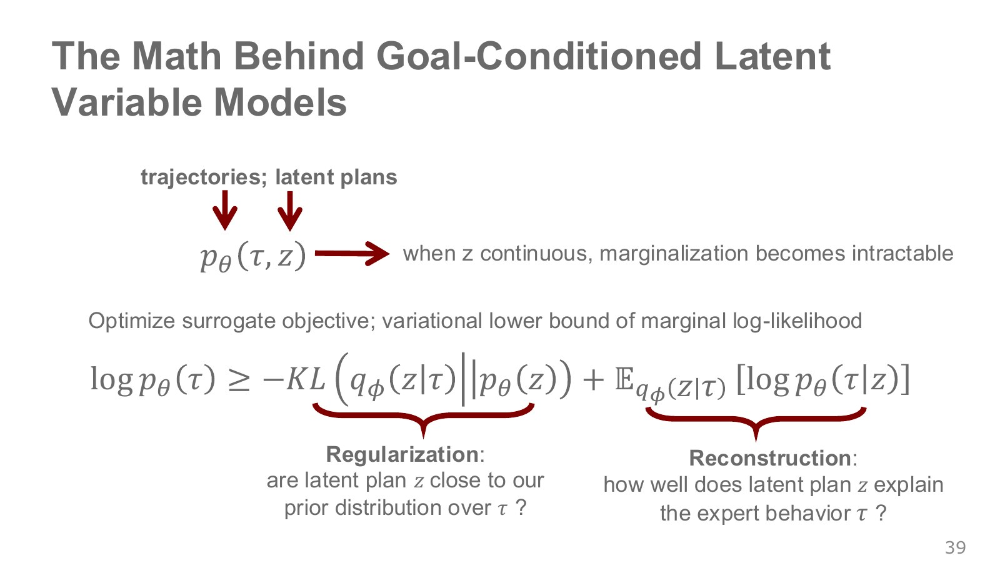

```text
The Math Behind Goal-Conditioned Latent
Variable Models

trajectories; latent plans

Po (t, Z) -- > when z continuous, marginalization becomes intractable

Optimize surrogate objective; variational lower bound of marginal log-likelihood

log pe (t) = -KL (ag(zlz)

[po (z)) + Eqg(zity [log pe (lz)]

Regularization: Reconstruction:
are latent plan z close to our how well does latent plan z explain
prior distribution over t ? the expert behavior T ?

39
```

## Slide 41

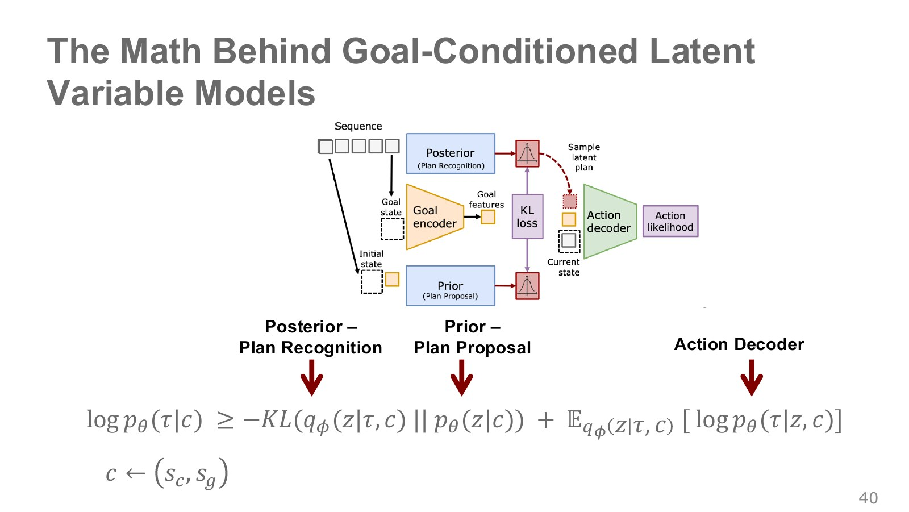

```text
The Math Behind Goal-Conditioned Latent
Variable Models

Sequence

DOO | posterior Ah. ale
| (Plan Recognition) ‘, plan
:
1
Goal
Goal
state Goal a Ae a Action Action
H f GN Hoss ,| decoder likelihood
Initial s-s-<i-ssssS wh
state Current
cr state
H ja Prior -{A]
aan (Plan Proposal)
Posterior - Prior -
Plan Recognition Plan Proposal Action Decoder

Vv v v

logpe(tlc) = -KL(qg(zlt,¢) ll Pe(Zle)) + Egyczit,c Llogpe(tlz,c)]

ce (s., Sg)
```

## Slide 42

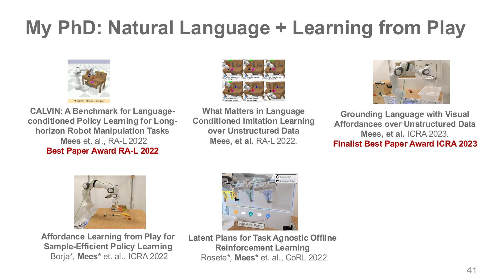

```text
My PhD: Natural Language + Learning from Play

Bee i
CALVIN: A Benchmark for Language- What Matters in Language Grounding Language with Visual
conditioned Policy Learning forLong- Conditioned Imitation Learning Affordances over Unstructured Data
horizon Robot Manipulation Tasks over Unstructured Data Mees, et al. ICRA 2023.
Mees et. al., RA-L 2022 Mees, et al. RA-L 2022. Finalist Best Paper Award ICRA 2023
Best Paper Award RA-L 2022

Affordance Learning from Play for _ Latent Plans for Task Agnostic Offline
Sample-Efficient Policy Learning Reinforcement Learning
Borja‘, Mees* et. al., ICRA 2022 Rosete*, Mees* et. al., CoRL 2022

41
```

## Slide 43

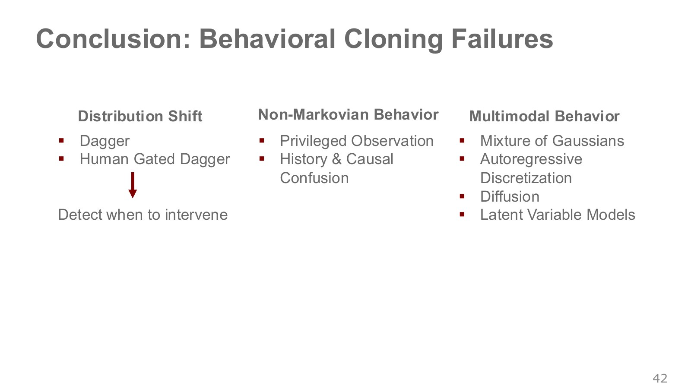

```text
Conclusion: Behavioral Cloning Failures

Distribution Shift Non-Markovian Behavior Multimodal Behavior
=" Dagger = Privileged Observation = Mixture of Gaussians
= Human Gated Dagger « History & Causal = Autoregressive
| Confusion Discretization
= Diffusion
Detect when to intervene = Latent Variable Models

42
```

## Slide 44


```text
Thank you for your attention
```

## Slide 45


```text
References

# Uni Freiburg, Deep Learning Lab
«" UC Berkeley Deep RL

« Stanford University, Deep RL

« Cornell Robot Learning

44
```

---

[← Course home](../README.md) · [Open optional slide gallery →](../curriculum/week-03-imitation-learning.md)
