# Week 04 - Reinforcement Learning I: OCR transcript

[← Course home](../README.md) · **Default OCR view** · [Open optional slide gallery →](../curriculum/week-04-reinforcement-learning-i.md)

> This is an automated OCR transcript generated from the locally rendered slide images. Use the image as the source of truth for equations, diagrams, citations, and small text.

## Slide 1

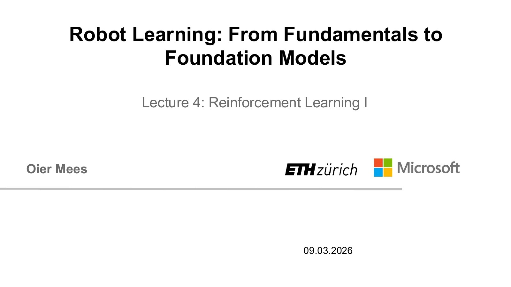

```text
Robot Learning: From Fundamentals to
Foundation Models

Lecture 4: Reinforcement Learning |

Oier Mees ETHzirich §® Microsoft

09.03.2026
```

## Slide 2

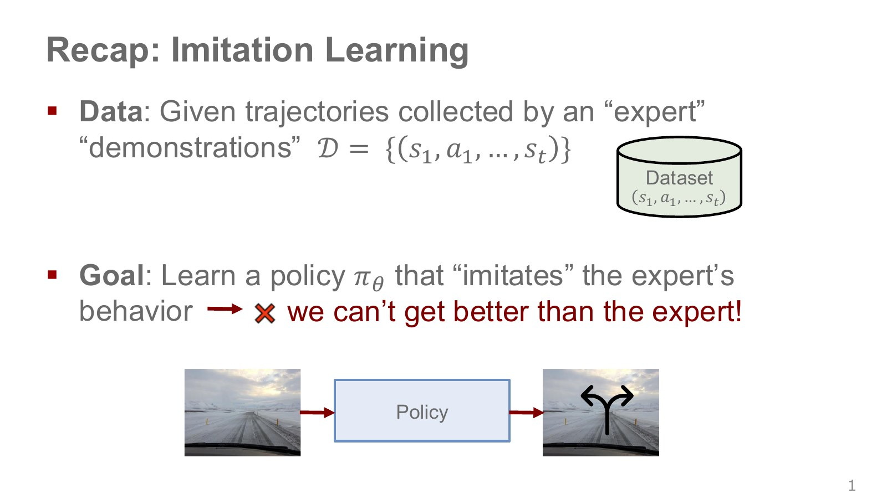

```text
Recap: Imitation Learning

« Data: Given trajectories collected by an “expert”
“demonstrations” D = {(s;,q,,...,S)} (>

Dataset
(51, Ay, -..) St)

" Goal: Learn a policy zz that “imitates” the expert’s
behavior - & we can’t get better than the expert!

-.
Policy

F
```

## Slide 3

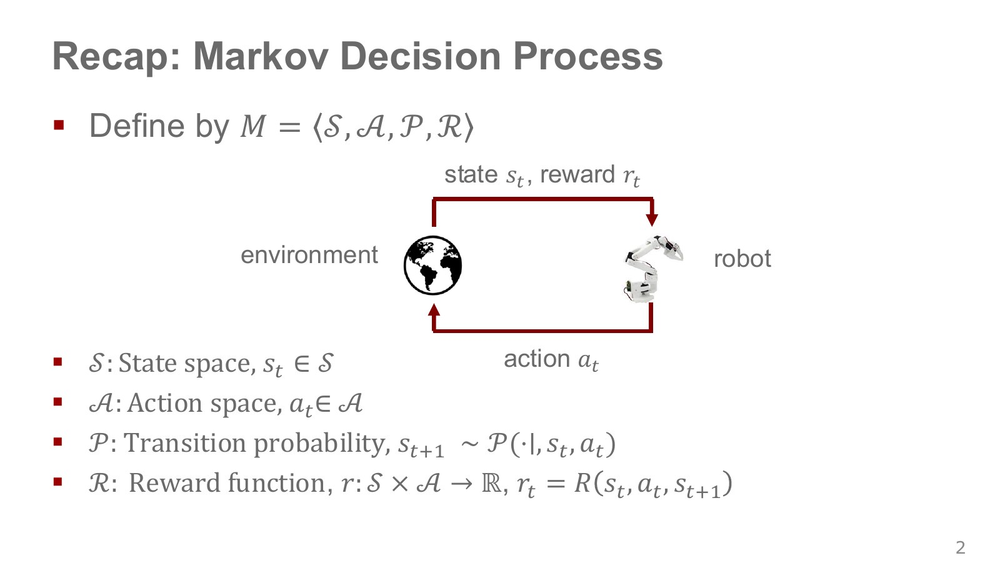

```text
Recap: Markov Decision Process

= Define by M = (S,A,P,R)
state s,, reward %

I y

environment 65 ey robot
Ae
|

t

S: State space, s, € S action a;

A: Action space, ar€ A

Pf: Transition probability, s.4, ~ PCI, Sz, at)
R: Reward function, r:S xX A > R, % = R(Sz, Gp, St44)
```

## Slide 4

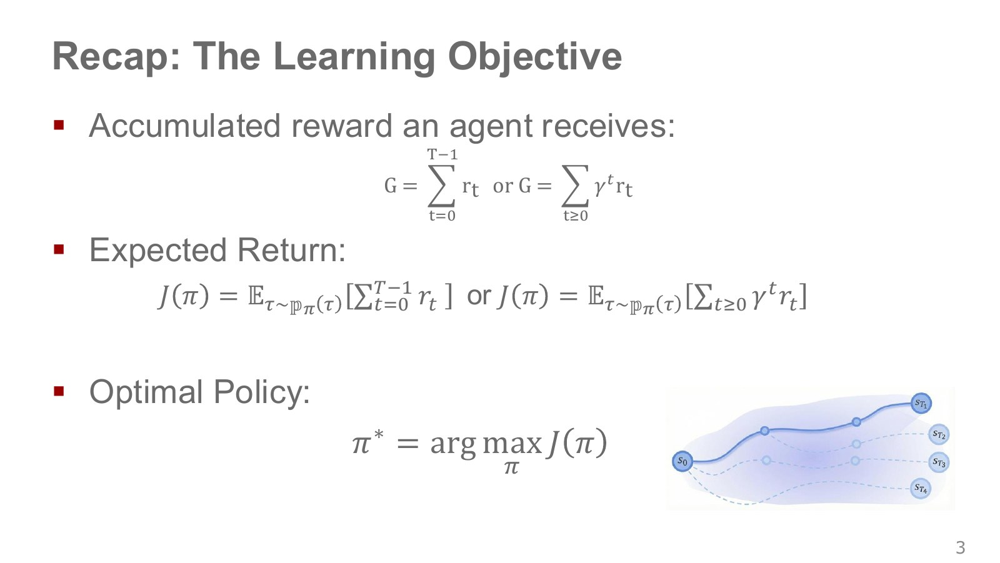

```text
Recap: The Learning Objective

» Accumulated reward an agent receives:

= Expected Return:
J (a) E~pq(t)l t=0 r, | or J (zz) = E,W p(t) [Xeeo y']

" Optimal Policy:

m* = argmax/](z)
T
```

## Slide 5

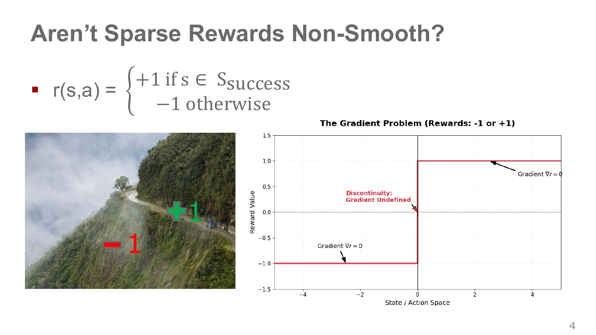

```text
Aren’t Sparse Rewards Non-Smooth?

_ J+1ifs € Ssuccess
= (S,a) = :
sia) -1 otherwise

The Gradient Problem (Rewards: -1 or +1)

15

10
Gradient Vr=

05
Discontinuity:
Gradient Undefined

0.0

Reward Value

lS.

-1.0

hs:

0 2 4
State / Action Space
```

## Slide 6

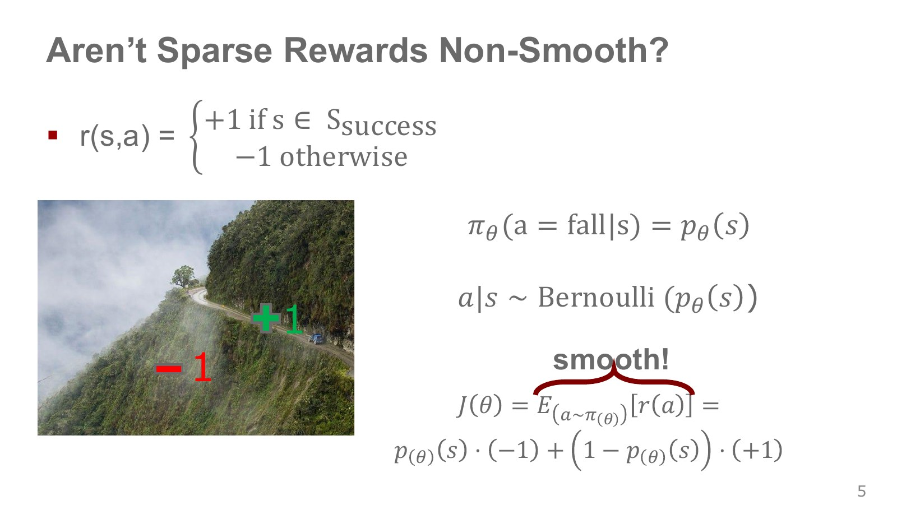

```text
Aren’t Sparse Rewards Non-Smooth?

+1 ifs E Ssuccess
= (S,a) = .
isi) -1 otherwise

1g (a = fall|s) = pe(s)
a|s ~ Bernoulli (pg(s))

smooth!
19) = E(ang)lr@] =

peoy(s) - (-1) + (1 = pey(s)) (40)
```

## Slide 7

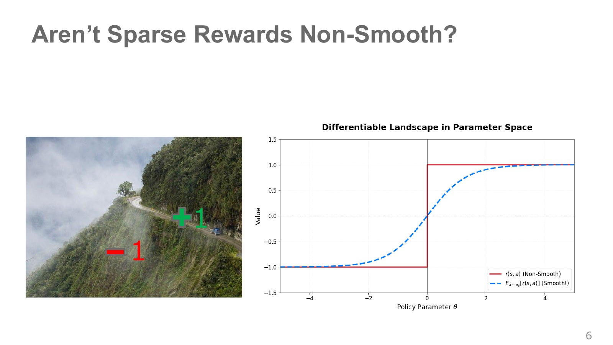

```text
Aren’t Sparse Rewards Non-Smooth?

Differentiable Landscape in Parameter Space

===
--

- 1(s, a) (Non-Smooth)
== E,~n[rs,a)] (Smooth!)

-4

2 0
Policy Parameter @

2

4
```

## Slide 8

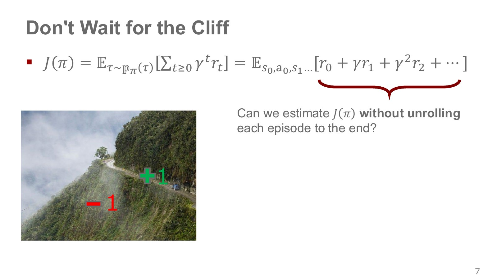

```text
Don't Wait for the Cliff

= J@)= E,~p,(t) [Meso yr] = Eg. ,ag,s1..L70 Fyn + Y?r +++]

a ae

Can we estimate /(7) without unrolling
each episode to the end?
```

## Slide 9

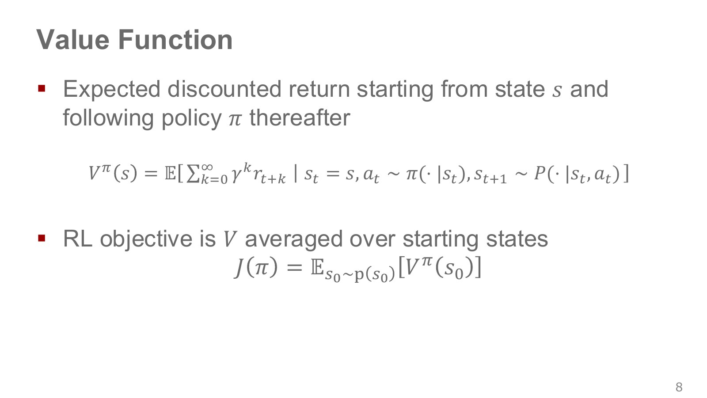

```text
Value Function

« Expected discounted return starting from state s and
following policy z thereafter

V"™(s) = EL Yio V Tek | Sp = S,Q_ ~ TC |St), Star ~ PC |St,ae) |

= RL objective is V averaged over starting states
J (tt) = Es,~p(s,) lV” (so)]
```

## Slide 10

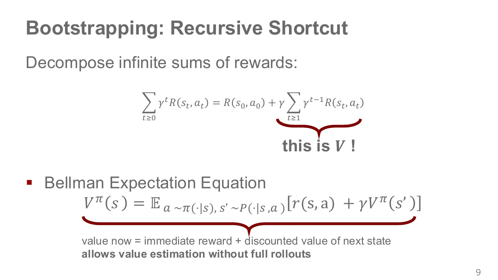

```text
Bootstrapping: Recursive Shortcut

Decompose infinite sums of rewards:

> 7'R(.40) = R(S,a) + vy», y'*R(Sp at)

t20 t21

this is V !

" Bellman Expectation Equation
V"(s) = Eq~x¢4s),s’~P¢ls,aylr(s,a) + yV"(s' )]

value now = immediate reward + W ccounted value of next state

allows value estimation without full rollouts
```

## Slide 11

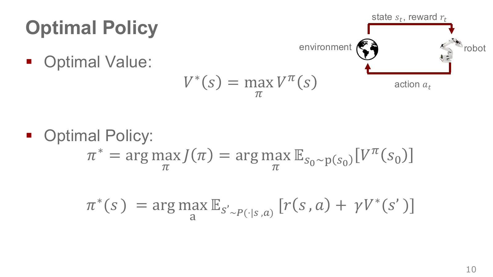

```text
state s,, reward r;,

Optimal Policy a |
environment a oe robot
= Optimal Value: , 4
V*(s) = maxV™(s) action a,
TT

" Optimal Policy:
™* = arg max (7) = arg max E5,~p(sy) LV” (so)]

1*(s) = arg max E_ pels, w Ir(s,a) + yV*(s’ J]

10
```

## Slide 12

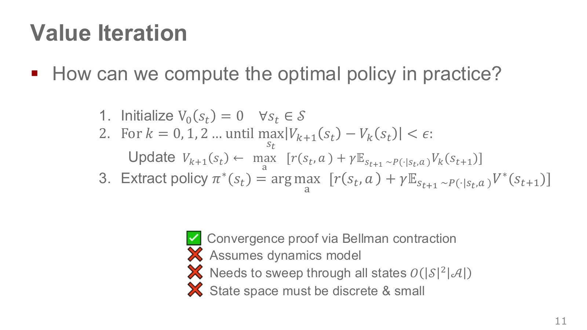

```text
Value Iteration

= How can we compute the optimal policy in practice?

1. Initialize Vo(s,)=0 VWs, ES
2. Fork = 0,1,2... until max|V;.41(s,) -Ve(sp)| <e
St
Update V;.41(s-) - max [r(spa) + vEs.,, ~P(-lspa) Vk (Sta1)]
3. Extract policy m*(s,) = arg max [r(sp,@) + VEs,.., ~PC-lspa)V* (St41)]

Convergence proof via Bellman contraction
x Assumes dynamics model

x Needs to sweep through all states O(|S|?|Al)
x State space must be discrete & small

11
```

## Slide 13

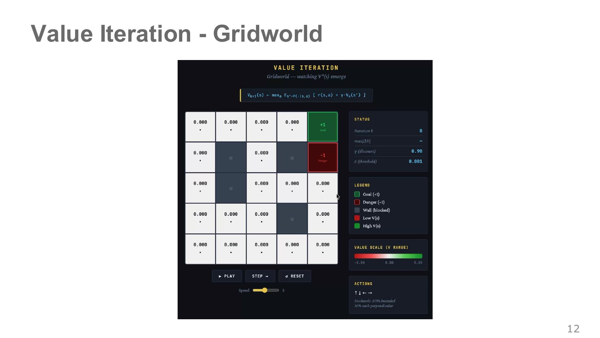

```text
Value Iteration - Gridworld

VALUE ITERATION

STATUS

Leceno

oal (+)
Danger (
Wall (blocked)
Low Vis)

High V(6)

VALUE SCALE (V RANGE)

ACTIONS.

thes

12
```

## Slide 14

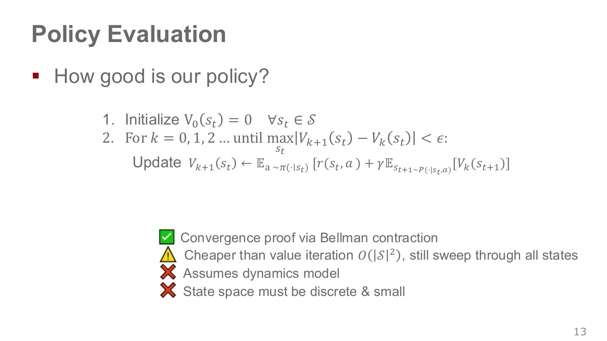

```text
Policy Evaluation
= How good is our policy?

1. Initialize Vo(s,)=0 VWs, ES
2. Fork = 0,1,2... until max|V;.41(s,) -Ve(sp)| <e
St

Update V;.41(s¢) - Ea ~m(-lsp) [r(sp,a) + VES... Pcs_a) Vie (Se41)]

Convergence proof via Bellman contraction

Cheaper than value iteration O(|S|7), still sweep through all states
x Assumes dynamics model
x State space must be discrete & small

13
```

## Slide 15

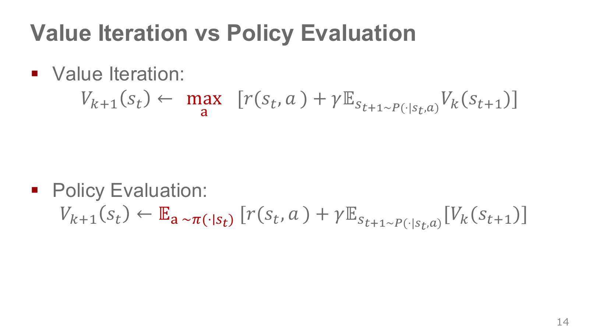

```text
Value Iteration vs Policy Evaluation

» Value Iteration:
Vers (Se) © max [r(Sp4) + VE soo pcjspaYe(Se41)]

# Policy Evaluation:
Viewi St) <= E, ~T(-ISt) [r(st, a) VES 1~PClspa) [Vie (St41)]

14
```

## Slide 16

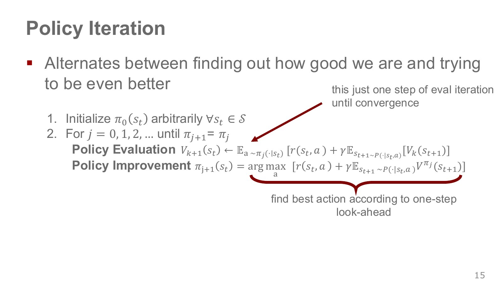

```text
Policy Iteration

« Alternates between finding out how good we are and trying
to be even better this just one step of eval iteration

until convergence
1. Initialize my (s,) arbitrarily Vs, € S
2. For j = 0,1,2,... until Tj41= 1;

Policy Evaluation V,,,(s;) < Ea ~nj(-ise) (St @) + VEse44-p¢spay Ve (Se+1)]
Policy Improvement 7;,,(s;) = argmax [r(s;,a) + VEs,,, ~P(-s,a)V™ (Se41)]
a

find best action according to one-step
look-ahead

15
```

## Slide 17

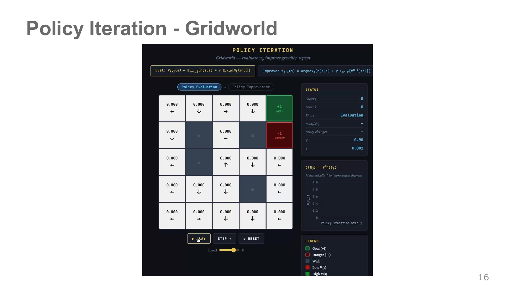

```text
Policy Iteration - Gridworld

POLICY ITERATION

(Policy Evaluation )

0.900 6.980
© v

0.088

3(M3) = v"¢S9)

STEP +

a

16
```

## Slide 18

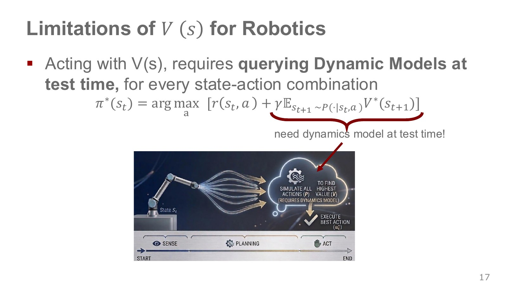

```text
Limitations of V (s) for Robotics

# Acting with V(s), requires querying Dynamic Models at
test time, for every state-action combination
1° (St) = arg cas [r(st, a) + VES ~P(-|spayV (Sta1)]

need dyna mick model at test time!

~- Sc
@ SENSE & PLANNING act

‘START END

17
```

## Slide 19

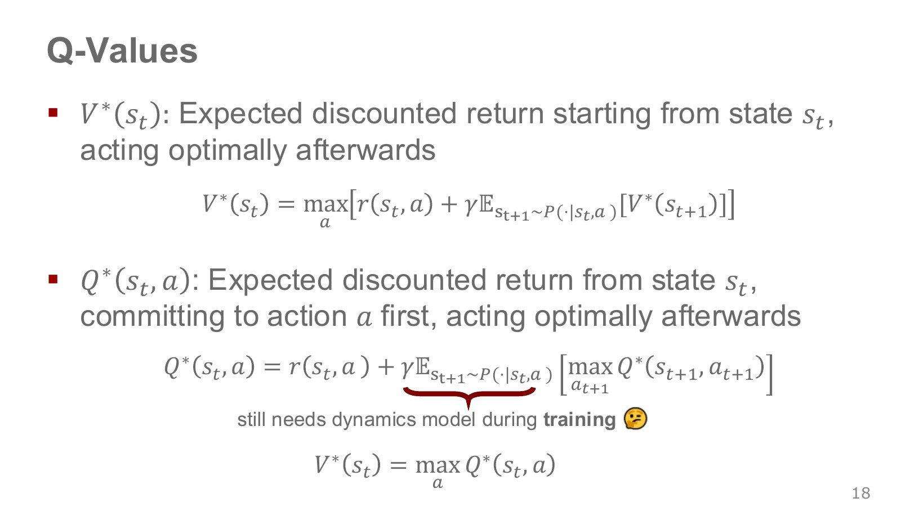

```text
Q-Values

= V*(s,): Expected discounted return starting from state s,,
acting optimally afterwards

V*(s,) = max[r(s,, a) + VEs.44~P(-lspa) lV *(St41)]]

" Q*(s;,a): Expected discounted return from state s;,
committing to action a first, acting optimally afterwards

Q*(s,,a) = r(sy,a) + VES. 4 4~PClsea) bea (Stan 43)

still needs dynamics model during training 1)

v* (sz) = max Q* (sz, a)
a 18
```

## Slide 20

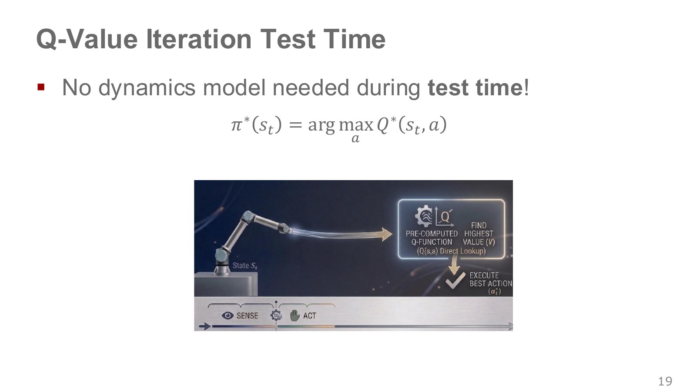

```text
Q-Value Iteration Test Time

= No dynamics model needed during test time!

m*(s¢) = arg max Q"(s;, a)
a

FIND.

19
```

## Slide 21

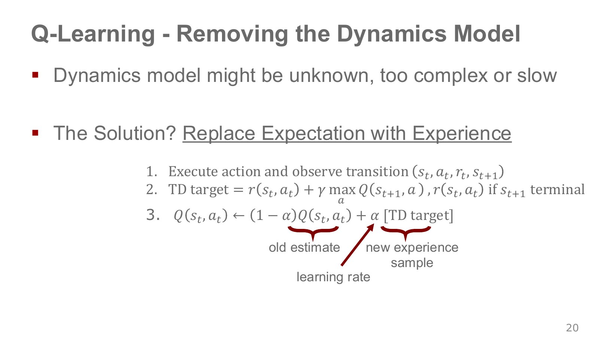

```text
Q-Learning - Removing the Dynamics Model

» Dynamics model might be unknown, too complex or slow

# The Solution? Replace Expectation with Experience

1. Execute action and observe transition (s;, a;, 7; St44)
2. TD target = r(s;,a;,) + y max Q(s;¢41,a),7(Sz, a) if sp, terminal
a

3. Q(sz,a,) - A - a) Q(sz, a) + a [TD target]

=-”

old estimate new experience
sample
learning rate

20
```

## Slide 22

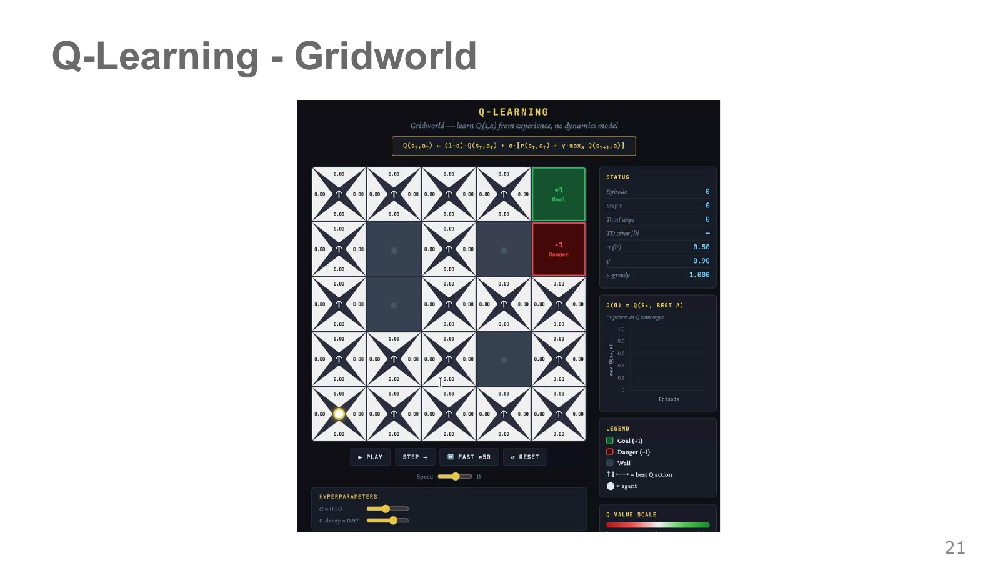

```text
Q-Learning - Gridworld

21
```

## Slide 23

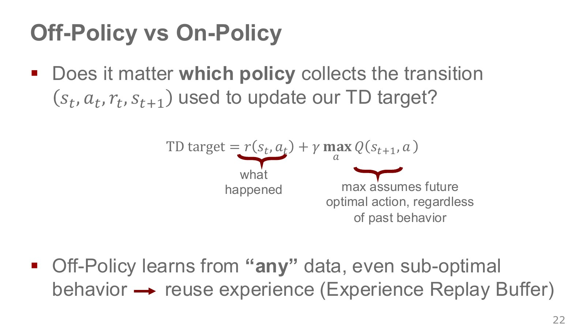

```text
Off-Policy vs On-Policy

" Does it matter which policy collects the transition
(St, App St41) USed to update our TD target?

TD target = r(s;,a,) + y max Q(s;41,@)
a

what
happened max assumes future

optimal action, regardless
of past behavior

= Off-Policy learns from “any” data, even sub-optimal
behavior -» reuse experience (Experience Replay Buffer)

22
```

## Slide 24

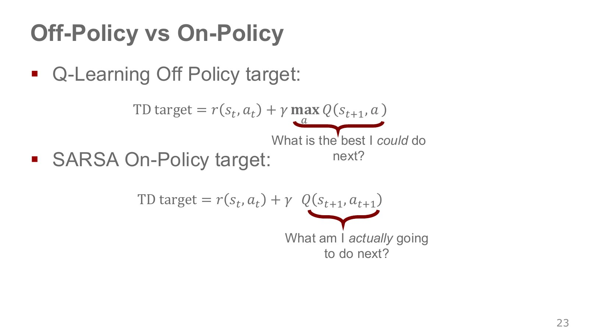

```text
Off-Policy vs On-Policy
« Q-Learning Off Policy target:

TD target = r(s;,a;) + ymax Q(s;44,@)
a

What is the best | could do

# SARSA On-Policy target: next?

TD target = r(s,,Q,) +Y Q(Se41, 4t41)

What am | actually going
to do next?

23
```

## Slide 25

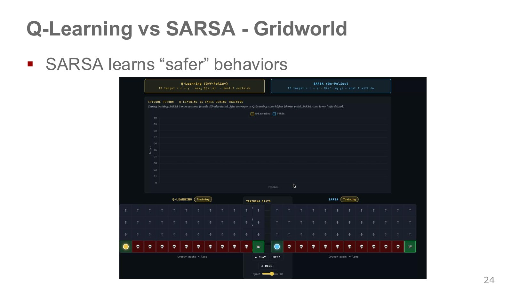

```text
Q-Learning vs SARSA - Gridworld

» SARSA learns “safer” behaviors

24
```

## Slide 26

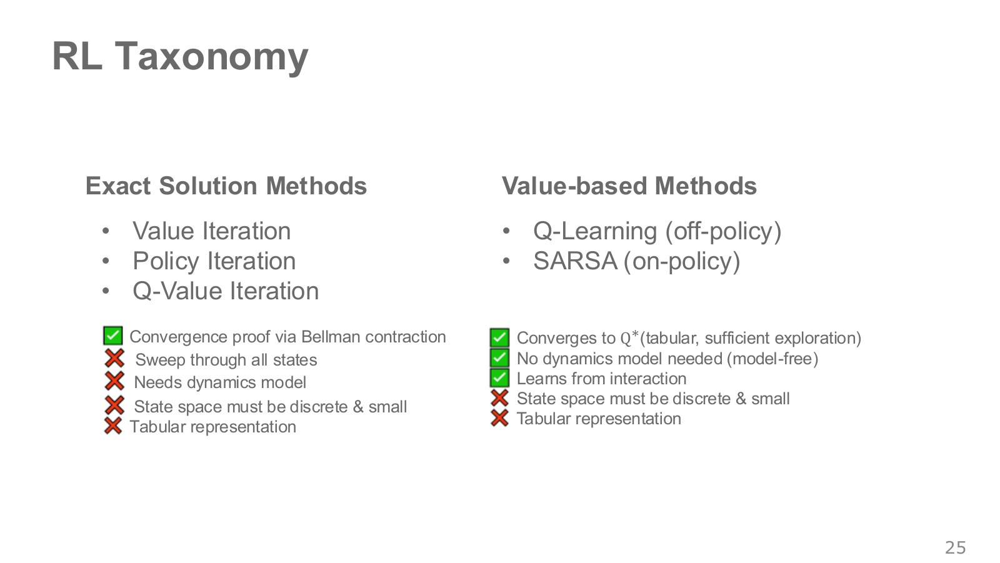

```text
RL Taxonomy

Exact Solution Methods

¢ Value Iteration
¢ Policy Iteration
¢ Q-Value Iteration

Convergence proof via Bellman contraction
> 4 Sweep through all states
x Needs dynamics model

x State space must be discrete & small
%& Tabular representation

Value-based Methods

¢ Q-Learning (off-policy)
¢ SARSA (on-policy)

<4 No dynamics model needed (model-free)
<4 Learms from interaction

%€ State space must be discrete & small

%€ Tabular representation

Converges to Q*(tabular, sufficient exploration)

25
```

## Slide 27

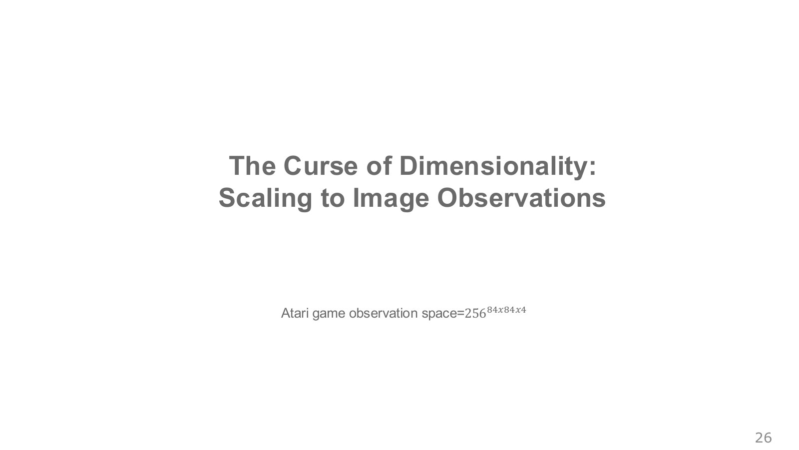

```text
The Curse of Dimensionality:
Scaling to Image Observations

Atari game observation space=256°**84*4

26
```

## Slide 28

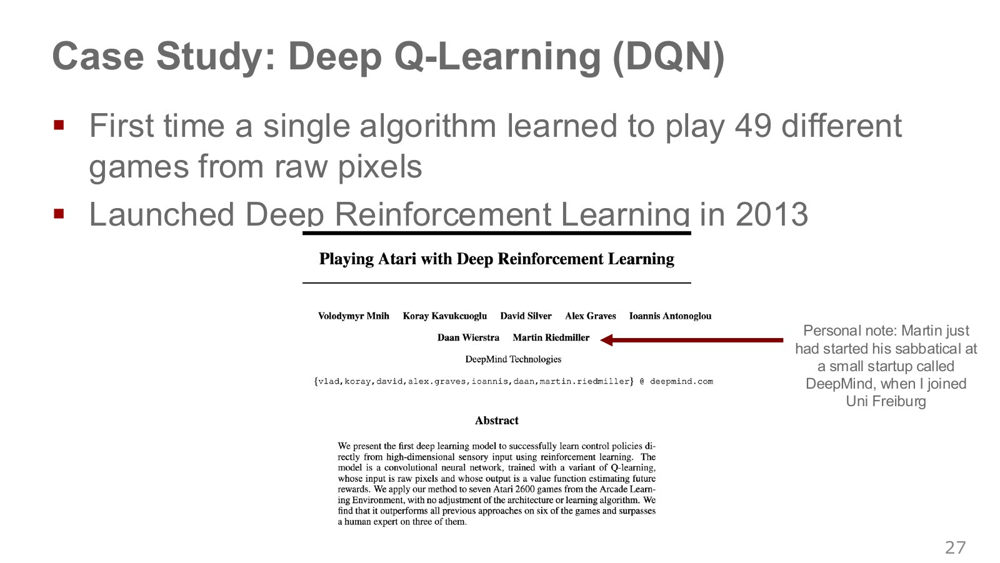

```text
Case Study: Deep Q-Learning (DQN)

« First time a single algorithm learned to play 49 different
games from raw pixels

=» Launched Deep Reinforcement Learnina in 2013

Playing Atari with Deep Reinforcement Learning

Volodymyr Mnih_ Koray Kavukeuoglu David Silver Alex Graves Ioannis Antonoglou

Daan Wierstra Martin Ricdmiller <q Personal note: Martin just

had started his sabbatical at

Mind Technologi
DeepMind Technologies a small startup called
{vlad, koray, david, alex.graves, ioannis,daan,martin.riedmiller} @ deepmind.com DeepMind when | joi ned
Uni Freiburg
Abstract

‘We present the first deep learning model to successfully learn control policies di-
rectly from high-dimensional sensory input using reinforcement learning. ‘The
model is a convolutional neural network, trained with a variant of Q-learning,
whose input is raw pixels and whose output is a value function estimating future
rewards. We apply our method to seven Atari 2600 games from the Arcade Learn-
ing Environment, with no adjustment of the architecture or learning algorithm. We
find that it outperforms all previous approaches on six of the games and surpasses
a human expert on three of them.

27
```

## Slide 29

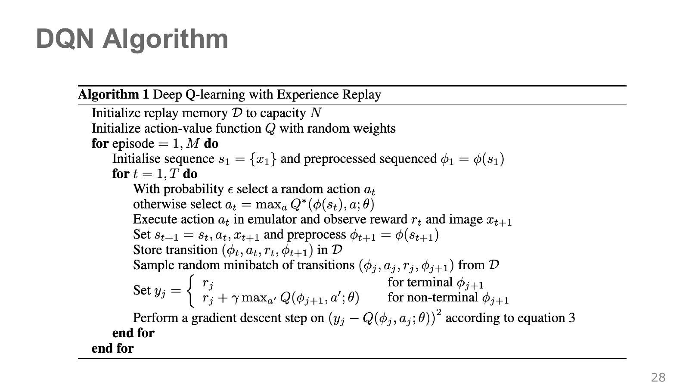

```text
DQN Algorithm

Algorithm 1 Deep Q-learning with Experience Replay
Initialize replay memory D to capacity NV
Initialize action-value function Q with random weights
for episode = 1, M do
Initialise sequence s; = {x1} and preprocessed sequenced ¢; = ¢(s1)
fort = 1,T do
With probability € select a random action a,
otherwise select a, = max, Q*($(sz), a; 9)
Execute action a; in emulator and observe reward r; and image 7441
Set 5441 = Sz, Qt, Z¢41 and preprocess $141 = $(S¢41)
Store transition (2, a, Tt, 6441) in D
Sample random minibatch of transitions (¢;,a;,7;,¢;+1) from D

Saag,-a) 7 for terminal $;1
ys = rj + ymaxg Q(o;41, 4’; 9) for non-terminal $541
Perform a gradient descent step on (y; - Q(0;, a53 6))? according to equation 3
end for
end for

28
```

## Slide 30

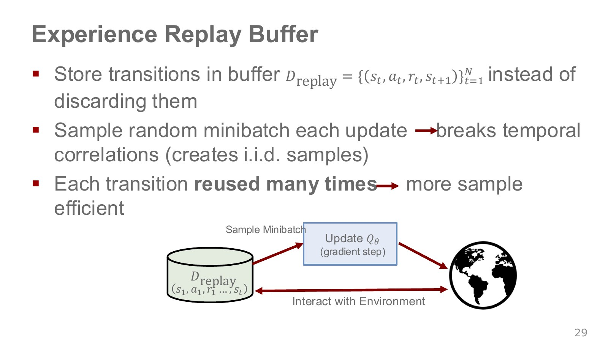

```text
Experience Replay Buffer

= Store transitions in buffer Dreplay = (St: Qt Tt Stes) HL instead of
discarding them

= Sample random minibatch each update -breaks temporal
correlations (creates i.i.d. samples)

= Each transition reused many times- more sample
efficient

Sample Minibatc
Update Qg
D
repla
(s1, a1, TP ys \<- - _ ->

Interact with Environment

29
```

## Slide 31

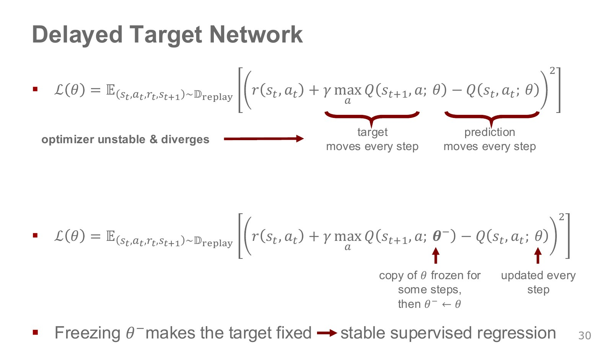

```text
Delayed Target Network

2.
= L)= E(s,,at.7eSt41)~Dreplay (vc a) + y max Q(st+1, a; 8) - Q(z, ae; 0) |

target prediction

optimizer unstable & diverges --_-_-_-_-_-_-----">
moves every step moves every step

2
= £6) = E(s.,a¢.rt5t41)~Dreplay (rc. a,) + y max Q(S¢41, a; 87) - Q(s¢, a; 0) |

t t

copy of 6 frozen for updated every
some steps, step
then@~ <- 6

" Freezing 6” makes the target fixed -> stable supervised regression 30
```

## Slide 32

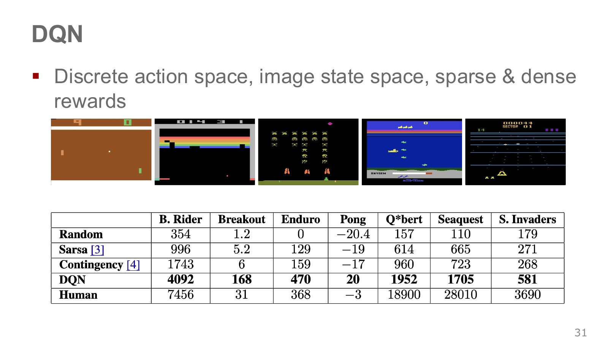

```text
DQN

» Discrete action space, image state space, sparse & dense

rewards

B. Rider | Breakout | Enduro | Pong | Q*bert | Seaquest | S. Invaders
Random 354 1.2 0 -20.4 157 110 179
Sarsa [3] 996 5.2 129 -19 614 665 271
Contingency [4] 1743 6 159 -17 960 723 268
DQN 4092 168 470 20 1952 1705 581
Human 7456 31 368 -3 18900 28010 3690
```

## Slide 33

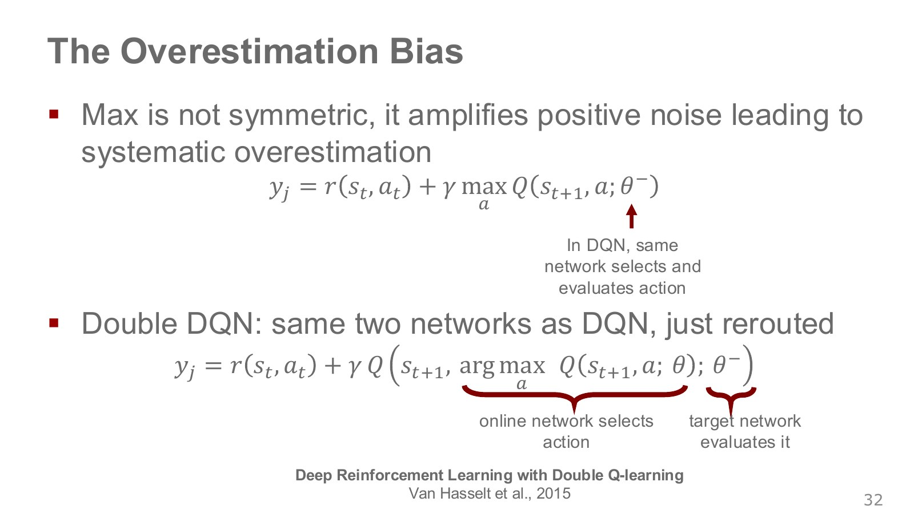

```text
The Overestimation Bias

" Max is not symmetric, it amplifies positive noise leading to
systematic overestimation
Vj =7 (SpA) +7 mg Q(St41,4; 07)

t

In DQN, same
network selects and
evaluates action

= Double DQN: same two networks as DQN, just rerouted

Vi= r(sp,a.) +7 Q (Seas, arg max Q(Sr41,4; 8); a~)
online network selects targel network

action evaluates it

Deep Reinforcement Learning with Double Q-learning
Van Hasselt et al., 2015 32
```

## Slide 34

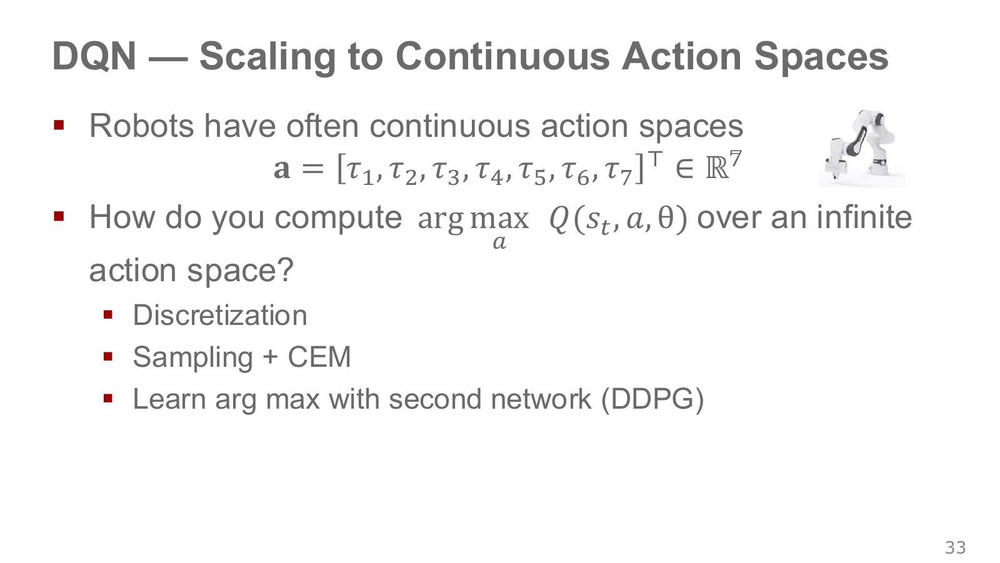

```text
DQN - Scaling to Continuous Action Spaces

= Robots have often continuous action spaces Z

a= [r4;T5; Fay Tay Te; Te Tz |’ CR’ ” &
=" How do you compute arg max Q(s;, a, 9) over an infinite
action space?
« Discretization
» Sampling + CEM
« Learn arg max with second network (DDPG)

33
```

## Slide 35

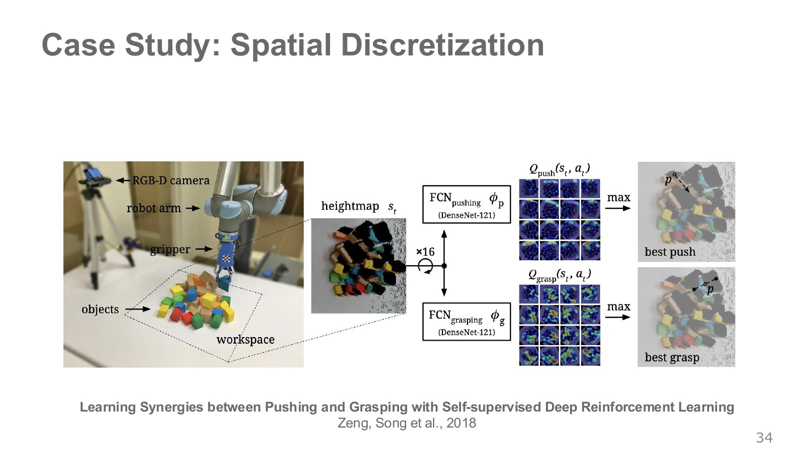

```text
Case Study: Spatial Discretization

QyusnlS, is a,)

FCNpusning Pp

(DenseNet-121)

heightmap s,

bestpush

ile max

wenn LECN gassing Oy | MSE -
ie = ee (DenseNet-121) Bees “1
Sia fees ; [orl Pe] best grasp

Learning Synergies between Pushing and Grasping with Self-supervised Deep Reinforcement Learning
Zeng, Song et al., 2018
34
```

## Slide 36

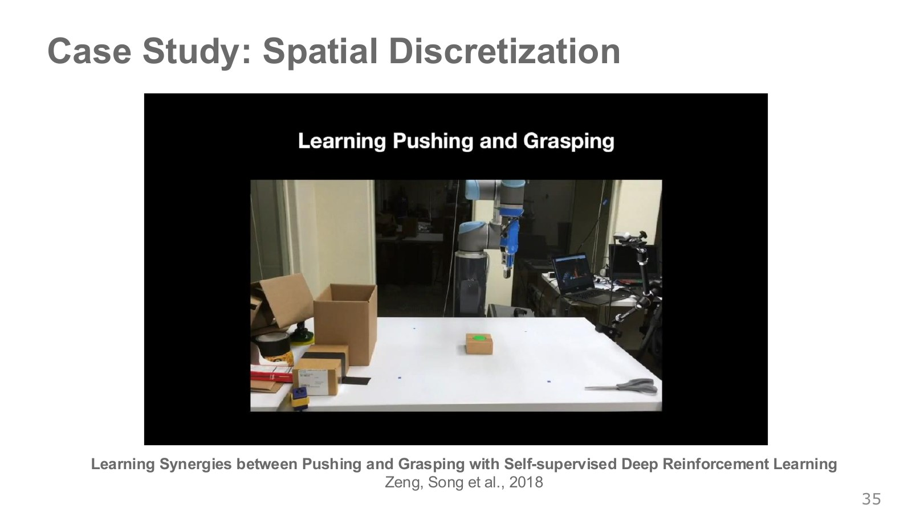

```text
Case Study: Spatial Discretization

Learning Pushing and Grasping

Learning Synergies between Pushing and Grasping with Self-supervised Deep Reinforcement Learning
Zeng, Song et al., 2018
```

## Slide 37

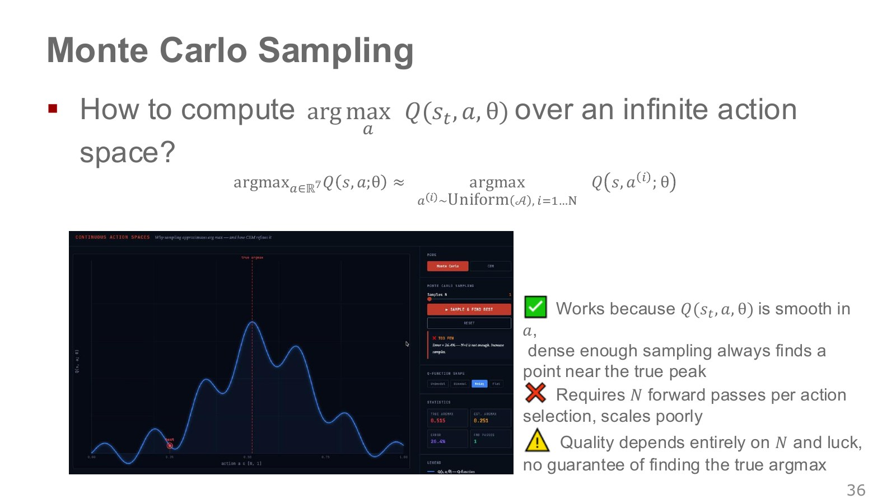

```text
Monte Carlo Sampling

= How to compute argmax Q(s;,a,0) over an infinite action
a
space?

argmax,cp7Q(s,a;0) = argmax Q(s, a). 0)
a®~Uniform(.4), i=1...N

M4 Works because Q(s;,a, 8) is smooth in
a,

dense enough sampling always finds a
point near the true peak

x Requires N forward passes per action
selection, scales poorly

A Quality depends entirely on N and luck,
no guarantee of finding the true argmax
```

## Slide 38

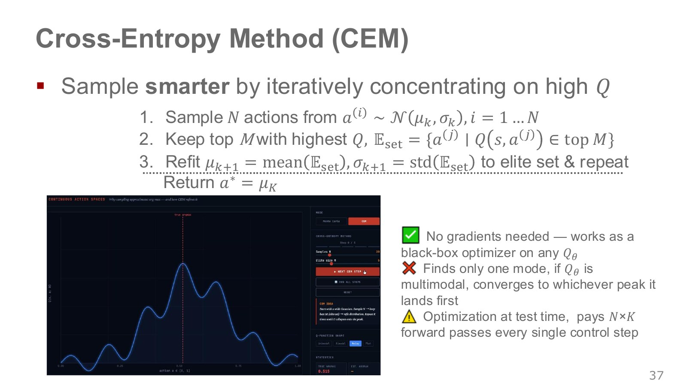

```text
Cross-Entropy Method (CEM)

=" Sample smarter by iteratively concentrating on high Q

1. Sample N actions from a® ~ N (uz, 6%), i = 1...N
2. Keep top Mwith highest Q, Eset = {a | Q(s,a) € top M}
3. Refit up4; = mean(Ese;), 0x41 = Std(E,¢,) to elite set & repeat

No gradients needed - works as a
black-box optimizer on any Qg

X Finds only one mode, if Qo is
multimodal, converges to whichever peak it
lands first

A Optimization at test time, pays NxK
forward passes every single control step
```

## Slide 39

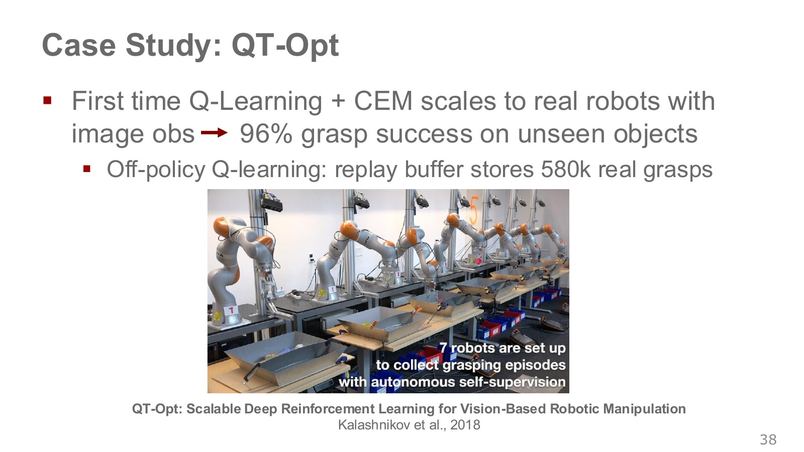

```text
Case Study: QT-Opt

« First time Q-Learning + CEM scales to real robots with
image obs > 96% grasp success on unseen objects

" Off-policy Q-learning: replay buffer stores 580k real grasps

|i l
4 th Ht } ||

7 robots‘are set up
to colle¢t grasping episodes
with autgnomous self-supéfrvision

QT-Opt: Scalable Deep Reinforcement Learning for Vision-Based Robotic Manipulation
Kalashnikov et al., 2018
38
```

## Slide 40

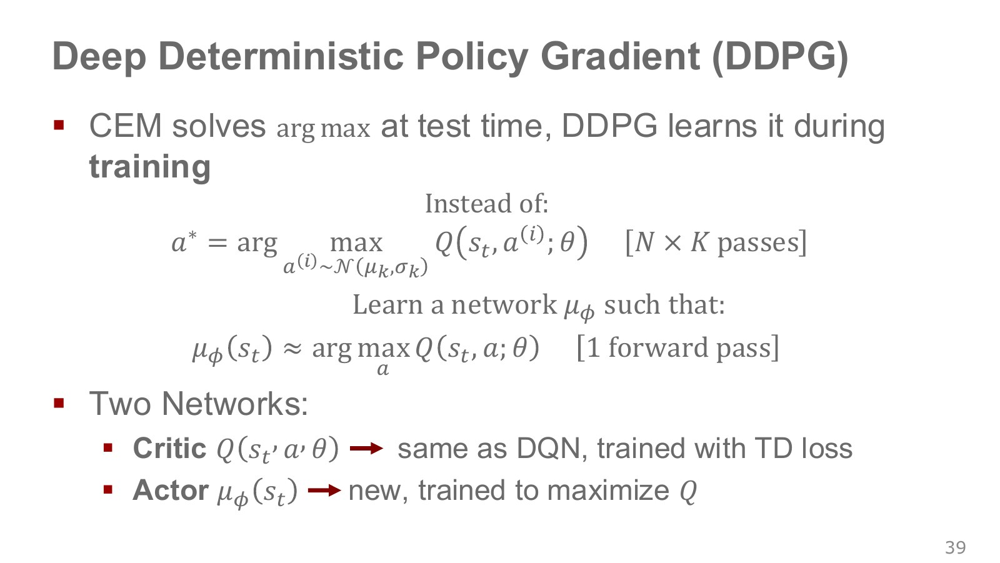

```text
Deep Deterministic Policy Gradient (DDPG)

=" CEM solves arg max at test time, DDPG learns it during
training
Instead of:

* (i).
a =ar max S+,a :6 N X K passes
gs O-~N in, 5 ols ) [ p |

Learn a network fg such that:

Ug (S¢) ¥ argmaxQ(s;,a;@) [1 forward pass]
a

= Two Networks:
" Critic Q(s,a 6) - same as DQN, trained with TD loss
= Actor uy (s;) - new, trained to maximize Q

39
```

## Slide 41

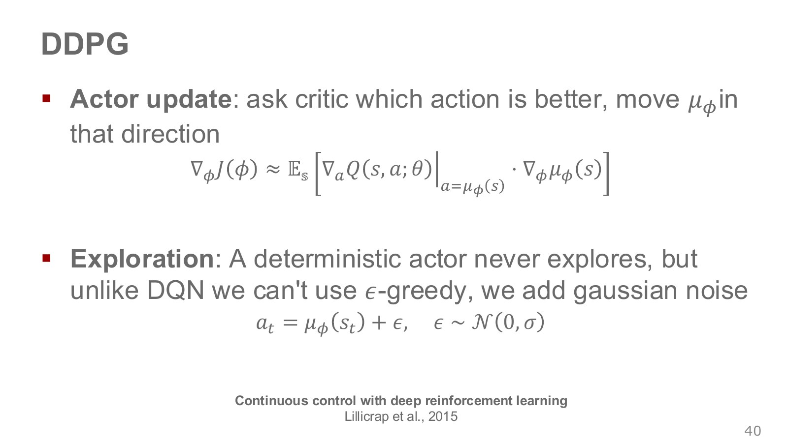

```text
DDPG

= Actor update: ask critic which action is better, move gin
that direction

Vol () ~ Es [7a26s, a; 0) sual) Vlg (s)

» Exploration: A deterministic actor never explores, but
unlike DQN we can't use e-greedy, we add gaussian noise
a =Ug(S) +e, €~ N(0,0)

Continuous control with deep reinforcement learning
Lillicrap et al., 2015
40
```

## Slide 42

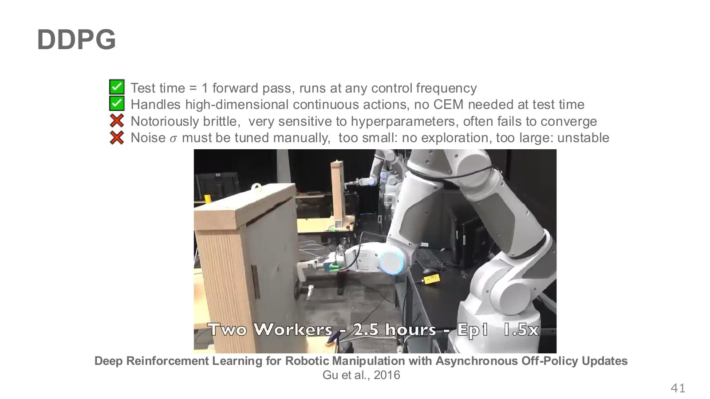

```text
DDPG

Test time = 1 forward pass, runs at any control frequency

Handles high-dimensional continuous actions, no CEM needed at test time

%€ Notoriously brittle, very sensitive to hyperparameters, often fails to converge
X€ Noise o must be tuned manually, too small: no exploration, too large: unstable

=

Two) Workers -285shours--¢

Wh al \ q a
Deep Reinforcement Learning for Robotic Manipulation with Asynchronous Off-Policy Updates
Gu et al., 2016
41
```

## Slide 43

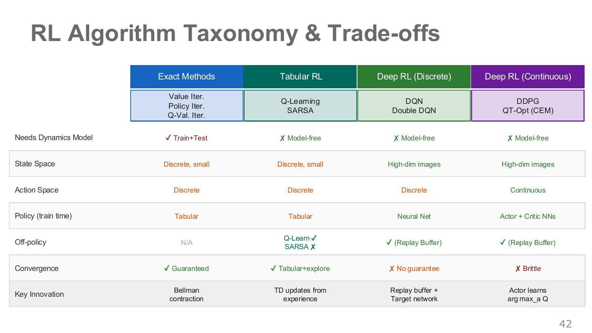

```text
RL Algorithm Taxonomy & Trade-offs

Needs Dynamics Model

State Space

Action Space

Policy (train time)

Off-policy

Convergence

Key Innovation

Deep RL (Continuous)

aie me Q-Leaming DON DDPG
Q-Val. Iter. SARSA Double DQN QT-Opt (CEM)
¥ Train+Test X Model-free X Model-free X Model-free
Discrete, small Discrete, small High-dim images High-dim images
Discrete Discrete Discrete Continuous
Tabular Tabular Neural Net Actor + Critic NNs
N/A eer ¥ (Replay Buffer) ¥ (Replay Buffer)

v Guaranteed

Bellman
contraction

¥ Tabular+explore

TD updates from
experience

X No guarantee

Replay buffer +
Target network

X Brittle

Actor learns
argmax_aQ

42
```

## Slide 44


```text
Thank you for your attention
```

## Slide 45

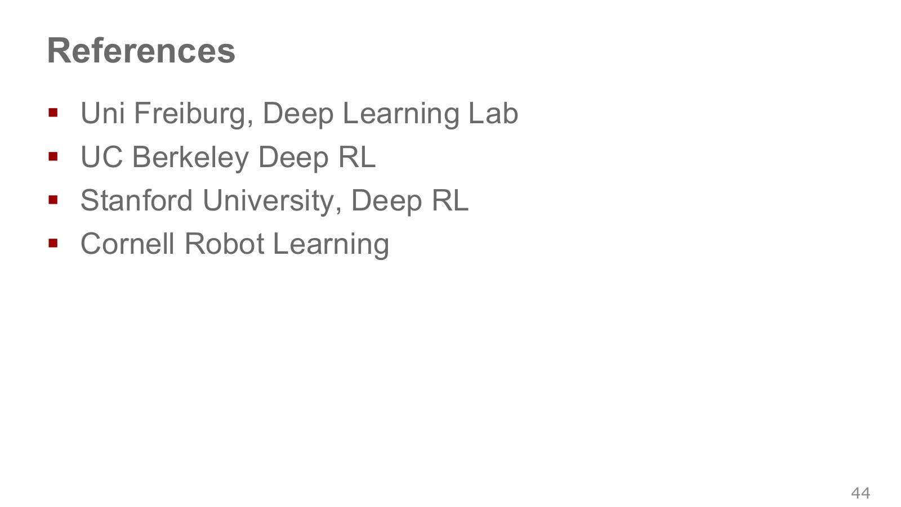

```text
References

# Uni Freiburg, Deep Learning Lab
«" UC Berkeley Deep RL

« Stanford University, Deep RL

« Cornell Robot Learning

44
```

---

[← Course home](../README.md) · [Open optional slide gallery →](../curriculum/week-04-reinforcement-learning-i.md)
