# Week 05 - Reinforcement Learning II: OCR transcript

[← Course home](../README.md) · **Default OCR view** · [Open optional slide gallery →](../curriculum/week-05-reinforcement-learning-ii.md)

> This is an automated OCR transcript generated from the locally rendered slide images. Use the image as the source of truth for equations, diagrams, citations, and small text.

## Slide 1

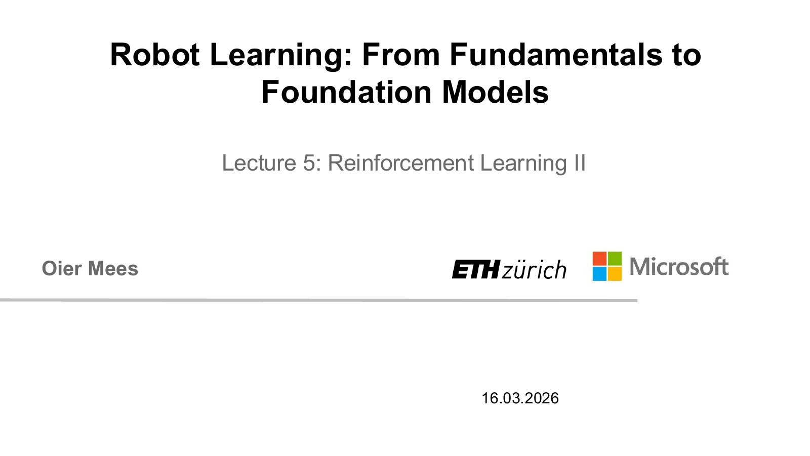

```text
Robot Learning: From Fundamentals to
Foundation Models

Lecture 5: Reinforcement Learning II

Oier Mees ETHzirich §® Microsoft

16.03.2026
```

## Slide 2

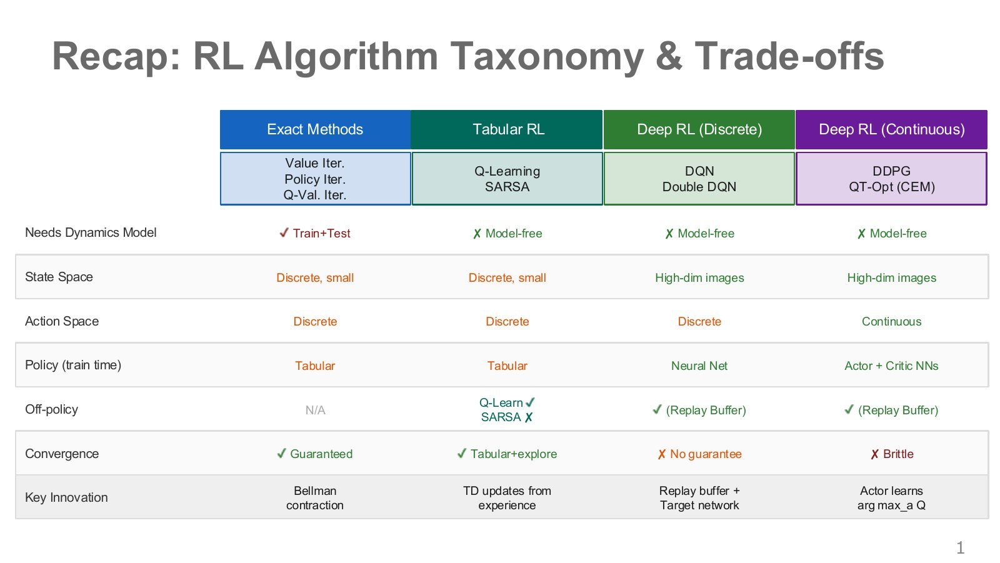

```text
Recap: RL Algorithm Taxonomy & Trade-offs

Needs Dynamics Model

State Space

Action Space

Policy (train time)

Off-policy

Convergence

Key Innovation

Exact Methods Tabular RL Deep RL (Discrete)

Deep RL (Continuous)

aie me Q-Leaming DON DDPG
Q-Val. Iter. SARSA Double DQN QT-Opt (CEM)
¥ Train+Test X Model-free X Model-free X Model-free
Discrete, small Discrete, small High-dim images High-dim images
Discrete Discrete Discrete Continuous
Tabular Tabular Neural Net Actor + Critic NNs
N/A eer ¥ (Replay Buffer) ¥ (Replay Buffer)

v Guaranteed

Bellman
contraction

¥ Tabular+explore

TD updates from
experience

X No guarantee

Replay buffer +
Target network

X Brittle

Actor learns
argmax_aQ
```

## Slide 3

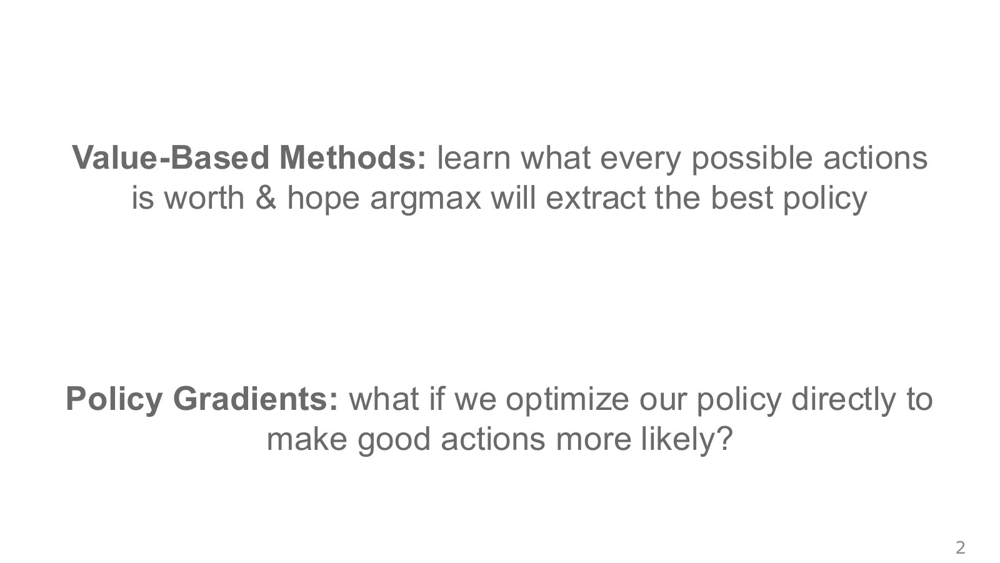

```text
Value-Based Methods: learn what every possible actions
is worth & hope argmax will extract the best policy

Policy Gradients: what if we optimize our policy directly to
make good actions more likely?
```

## Slide 4

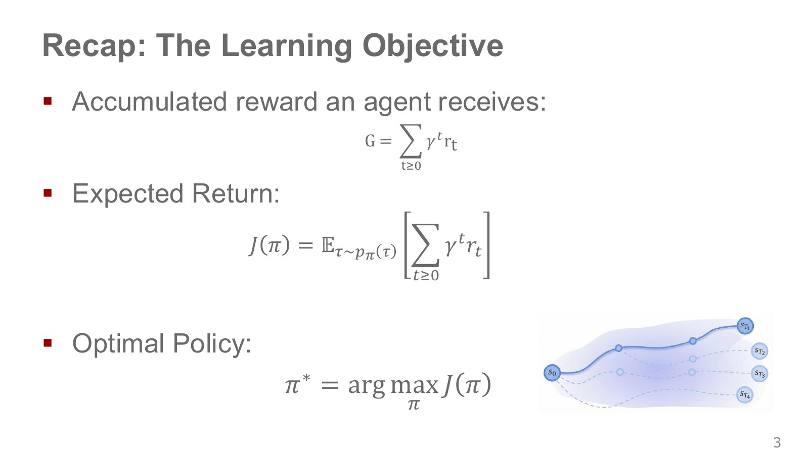

```text
Recap: The Learning Objective

» Accumulated reward an agent receives:

= Expected Return:

J(1) = E,~p_(t) ») r|

t20

" Optimal Policy:

m* = argmax/](z)
T
```

## Slide 5

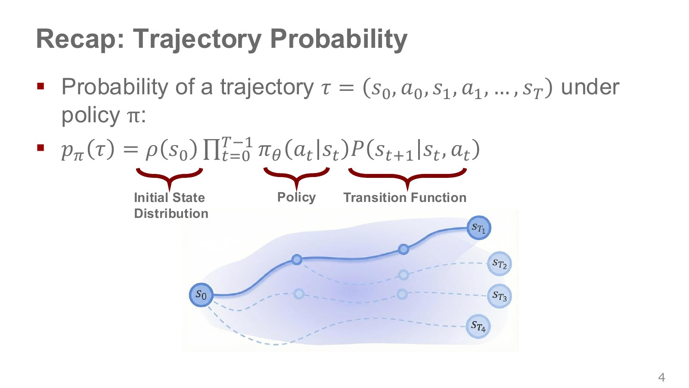

```text
Recap: Trajectory Probability

« Probability of a trajectory t = (so, do, 51, Q4, ..., Sp) Under
policy 1:

" pz(T) = p(So) [lize 6 (aelse)P(Se411S¢, ar)

Initial State Balicy Transition Function

Distribution
```

## Slide 6

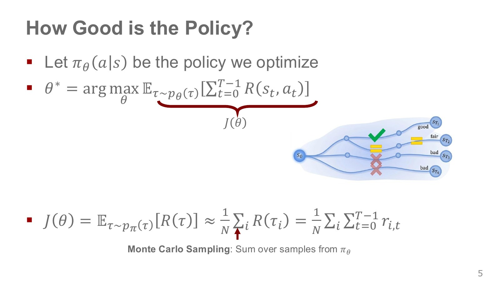

```text
How Good is the Policy?

« Let zg(a|s) be the policy we optimize
»@= = arg max E, ~pelt) Lae = R(sp, az) |

J(9)

© J(6) = Expy RO] ~ y Ei RG) = Li Lesa Ne

Monte Carlo Sampling: Sum over samples from mg
```

## Slide 7

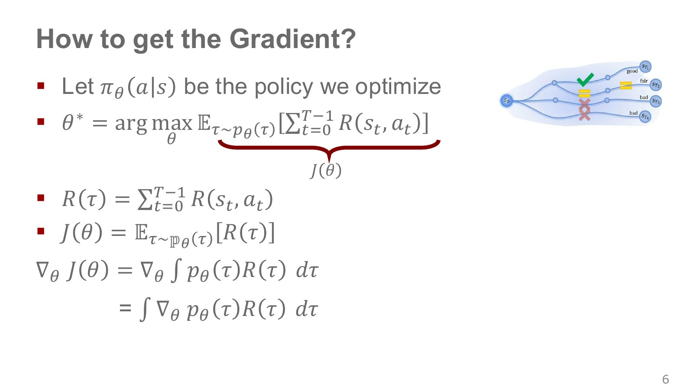

```text
How to get the Gradient?

« Let 7g(a|s) be the policy we optimize
J(8)
" R(t)= yt26 R(S¢t, az)
= J@)= ELL pe(t) [R(r)]
Vo J(O) = Vo J pe(@)R() dt
= [Vo pe(t)R(t) dt
```

## Slide 8

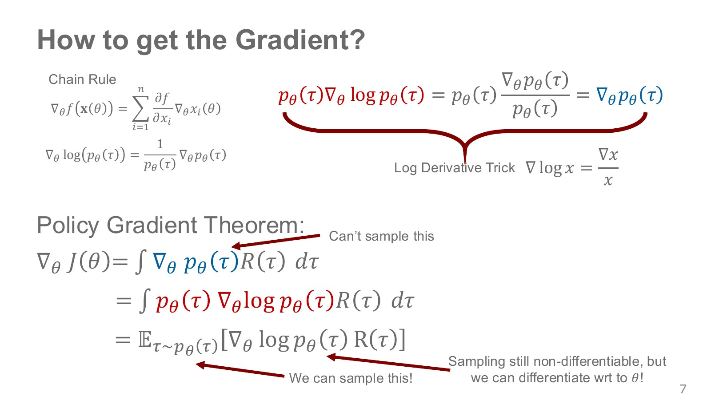

```text
How to get the Gradient?

Chain Rule (2)V1 () = pol ) Vara(®) = Vopo(t)
vor (x(0) = YA vox(o) Po (tg lO Pat) = Po.) - Cy” = VoRalt

é Xi 2
1
Vope(t) . F Vx
Po (t) Log Derivative Trick Vlogx = -
x

Vo log(pa(t)) =

Policy Gradient Theorem:

Vo J(@)= J Vo pa(t)R() dt
= J pe(t) Velog pg(t)R(t) dt
= E,W p,4(1) Vo log pa (tz) R(t) ]

-__ _-___Sampling still non-differentiable, but
We can sample this! we can differentiate wrt to 6!

Can’t sample this
```

## Slide 9

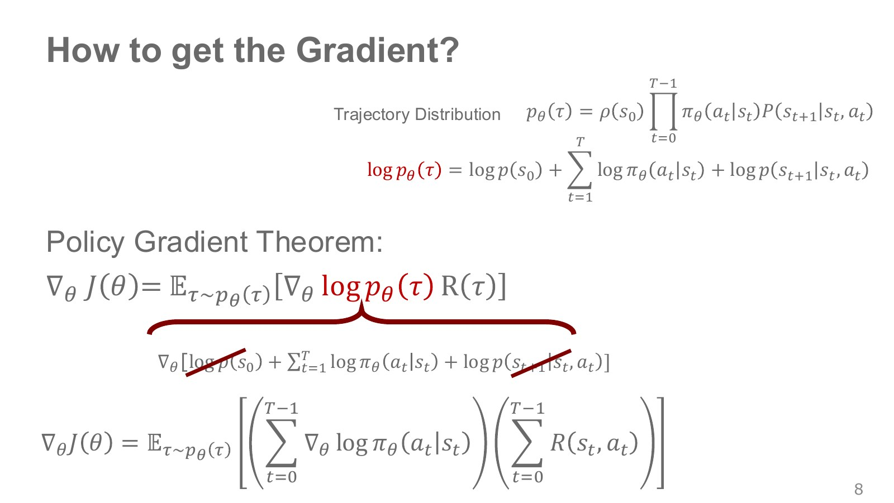

```text
How to get the Gradient?

T-1,

Trajectory Distribution Poe (t) = p(So) I] Tg (el Se) P(St41lSe, ae)
> t=0

log pe (2) = logp(s) + ) log o(arls:) + logp(Sesalse, ae)

Policy Gradient Theorem:
Vo J(O)= E,~p9 (x) Vo log pg (t) R()]

Vo lloeCSo) + Eis log (arls:) + log pr SpetS, a1)]

T-1 T-1
VoJ(@) = EL Wp 9(t) (3 Vo log 6 ou » R(st, -
t=0 t=0
```

## Slide 10

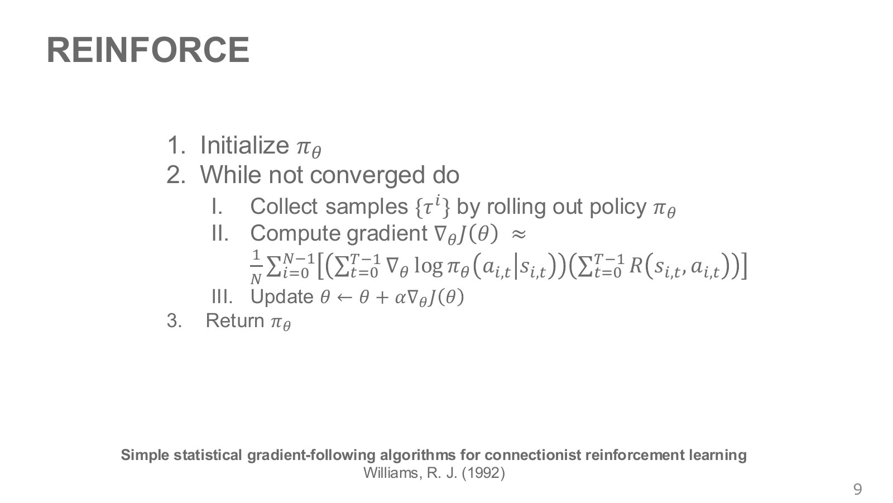

```text
REINFORCE

1. Initialize 7g
2. While not converged do
|. Collect samples {z*} by rolling out policy mg
Il. Compute gradient VgJ/(@) =
~ M0 [(Xi=6 Vo log ro (ai el5ie)) (Dio (sie 2e))]
lll. Update @ - 6 + aVgJ(@)
3. Return mg

Simple statistical gradient-following algorithms for connectionist reinforcement learning
Williams, R. J. (1992)
```

## Slide 11

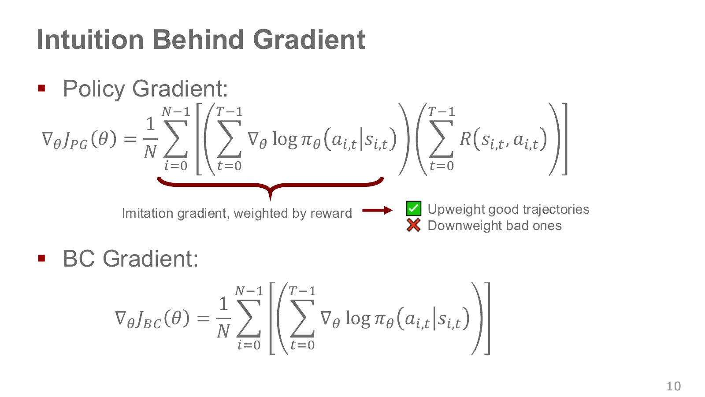

```text
Intuition Behind Gradient

» Policy Gradient:

I(d Vo log 9 (a; si, , » R(sit, ~)}

Volec(@) = nD
t=0

Imitation gradient, weighted by reward => Upweight good trajectories
%€ Downweight bad ones

= BC Gradient:

-1

Ly
Né
i=0

Volec(@) =

(> Vo log tg (aj, tsi, >}

10
```

## Slide 12

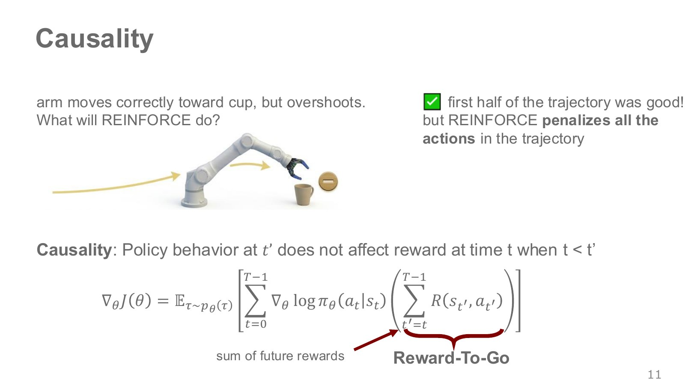

```text
Causality

arm moves correctly toward cup, but overshoots. first half of the trajectory was good!
What will REINFORCE do? but REINFORCE penalizes all the

actions in the trajectory

Causality: Policy behavior at t’ does not affect reward at time t when t < t’

TH=1 T-1
Vol (0) = EL po(t) ». Vo log a) (a,|sz) > R(sp, ay)
t=0

t'=t

sum of future rewards Reward-To-Go
11
```

## Slide 13

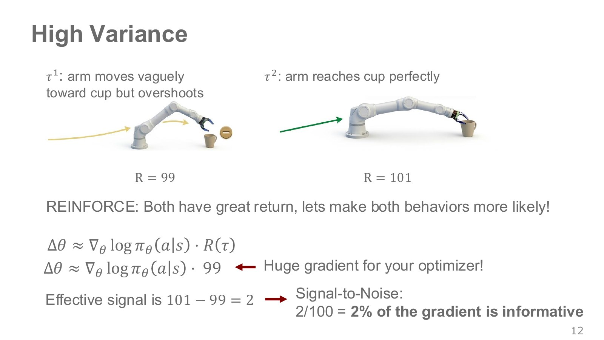

```text
High Variance

t! arm moves vaguely t*: arm reaches cup perfectly
toward cup but overshoots

-- a
aca Ee e° --fP “>
R=99 R=101
REINFORCE: Both have great return, lets make both behaviors more likely!
A@ Vo log me (als) - R(t)
A@ = Vg logg(als) - 99 = Huge gradient for your optimizer!
Effective signal is 101-99 = 2 -» Signal-to-Noise:

2/100 = 2% of the gradient is informative
12
```

## Slide 14

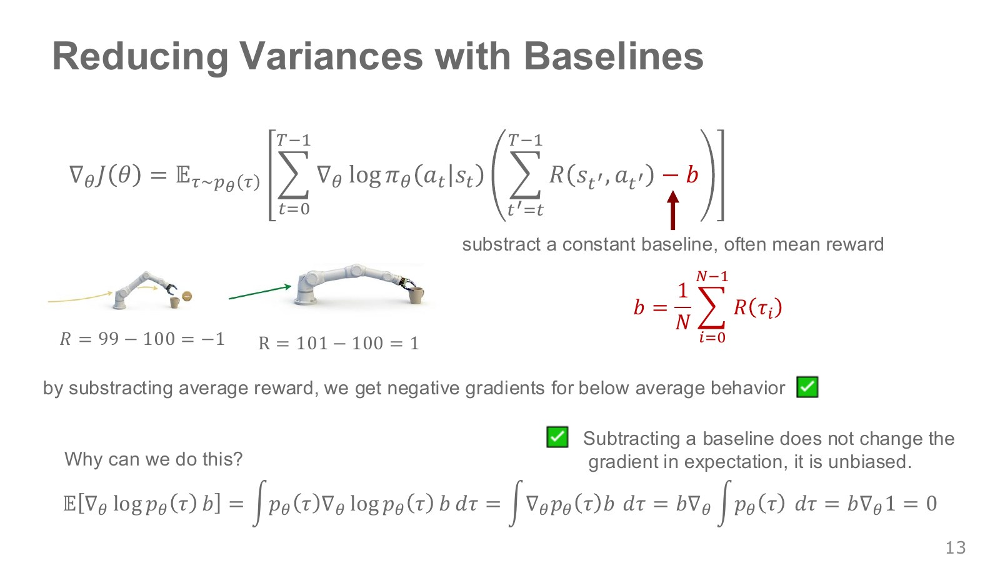

```text
Reducing Variances with Baselines

T-1., T=1
Vol (6) = Expote)| >, Vo logmo(arls:)| Y R(sy, ay) = b
t=0

t'=t

substract a constant baseline, often mean reward
our - 1
ees °
. b=-) RD
R=99-100=-1 R=101-100=1 i=0
by substracting average reward, we get negative gradients for below average behavior

Subtracting a baseline does not change the
Why can we do this? gradient in expectation, it is unbiased.

EV log pg(t) b] = [rove log pe(t) bdt = [ voro oo dt = bVg [roe dt = bVg1=0

13
```

## Slide 15

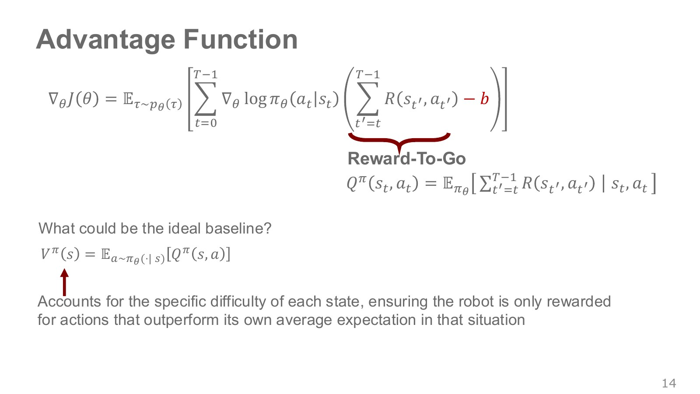

```text
Advantage Function

Vo] (0) = FE, pair) ) Vea log mg (a¢lsz) y R(Sp1, 1) -

t'=t

Rewa Md-To- Go

Q™ (se, a) = Ex, wr R(sp ae) | St a; |

What could be the ideal baseline?

vV"(s)= Eg~mg(-|s) [Q"(s,a)]

Accounts for the specific difficulty of each state, ensuring the robot is only rewarded
for actions that outperform its own average expectation in that situation

14
```

## Slide 16

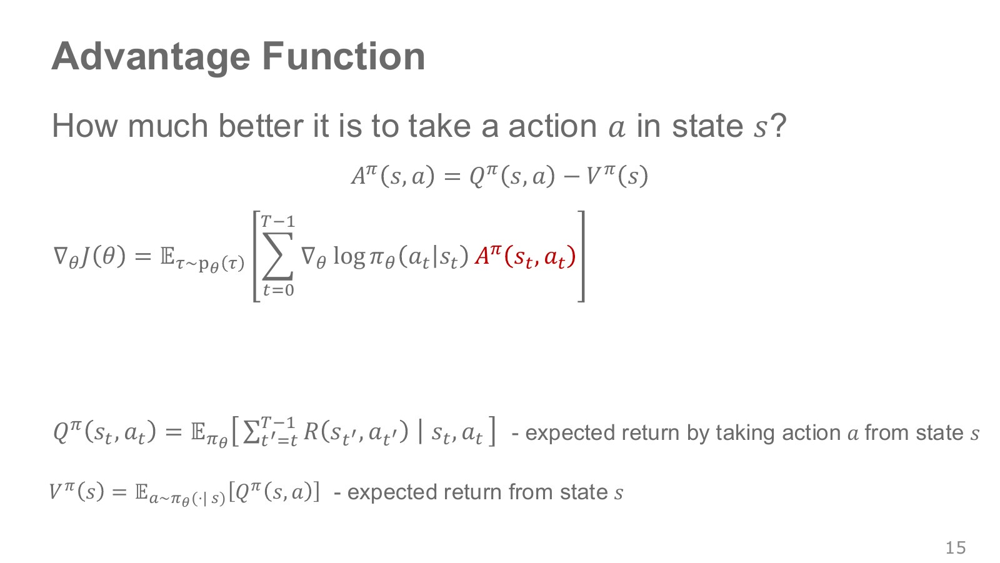

```text
Advantage Function

How much better it is to take a action a in state s?
A™(s,a) = Q™(s,a) -V™(s)

T-1

VeJ(@) = ErR~pg(t) ». Vo log tg (a; |s¢) A” (St, At)

t=0

Q” (sz, at) = Ex, [yr R(spr, a4") | St, a; | - expected return by taking action a from state s
V™(s) = Eqvmg(.| s)[Q"(s,a)] - expected return from state s

15
```

## Slide 17

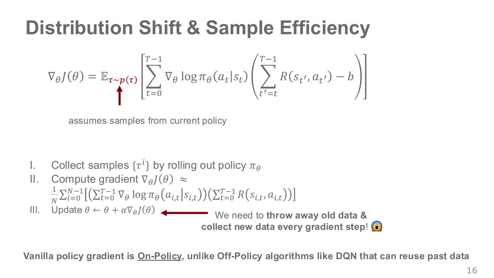

```text
Distribution Shift & Sample Efficiency

Tot r=1
VoJ(8) = Ex-pce)| >, Vo logra(aelse){ >. R(ser ay") -b
t=0

=e

assumes samples from current policy

|. Collect samples {r‘} by rolling out policy zg
ll. Compute gradient VgJ(@) ~
lon = =
hizo [Zio Vo log mg (ai¢lsie)) COT (sit, air))]
Ill. Update @< 8 + a¥oJ() qm We need to throw away old data &
collect new data every gradient step! @

Vanilla policy gradient is On-Policy, unlike Off-Policy algorithms like DQN that can reuse past data
16
```

## Slide 18

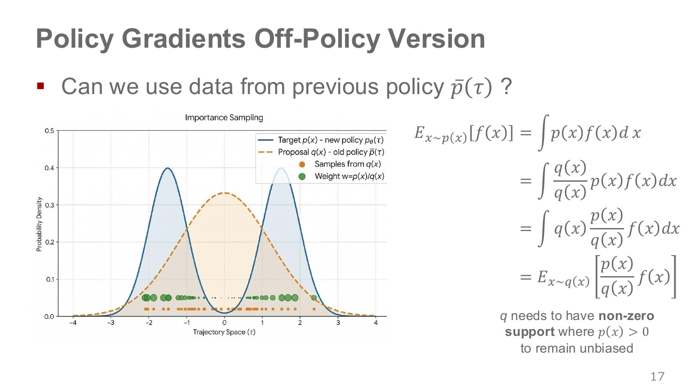

```text
Policy Gradients Off-Policy Version

=" Can we use data from previous policy p(t) ?

Importance Sampling
7 - Target p(x) - new policy pe(t) Ey p(x) [f(x)] = [roreod x
-=- Proposal q(x) - old policy p(t)
O4 e@ Samples from q(x) q (x)
@ Weight w=p(x)/q(x) = | p ( x) f ( x) dx

» q(x a
@ 03
: = [aco pooux
8 02

4 = Ex q(x) = (x pf
q needs to have non-zero
Trajectory Space (7) support where p(x) > 0

to remain unbiased

0.0

17
```

## Slide 19

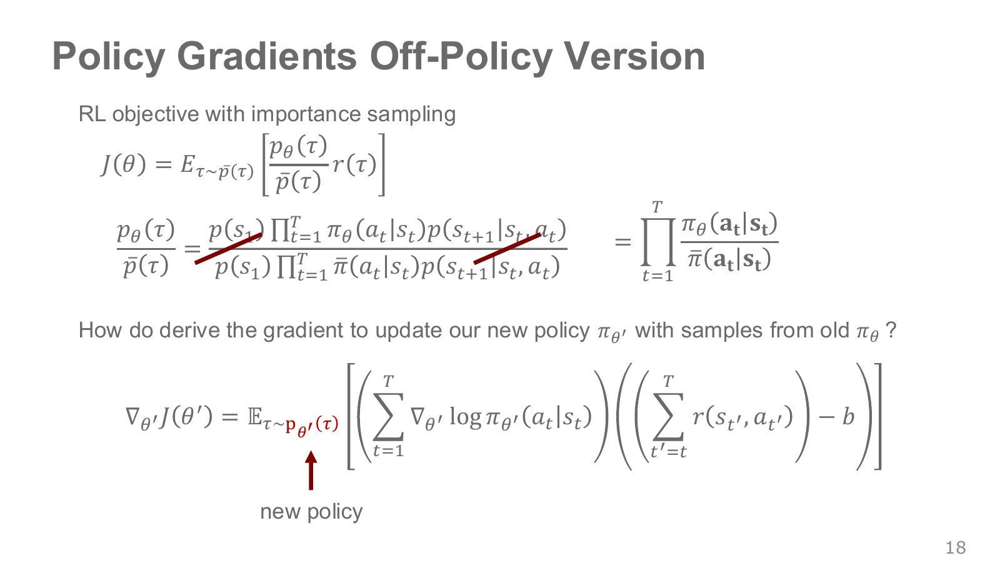

```text
Policy Gradients Off-Policy Version

RL objective with importance sampling

(t)
JO) = E,~5() a r(o|
T
Do (T) _ D (Sud [Tis To (Ge 5¢)PCSe41|Sp8te) = To (alse)
PO) p(s) Mh HAelse)P (Ses, ae) np Bylsy)

How do derive the gradient to update our new policy zg: with samples from old 19 ?

T T
Vo (0') = Ep~p y(t) » Var eno (> r(ser, “| -b |
t t=1 t'=t

new policy
18
```

## Slide 20

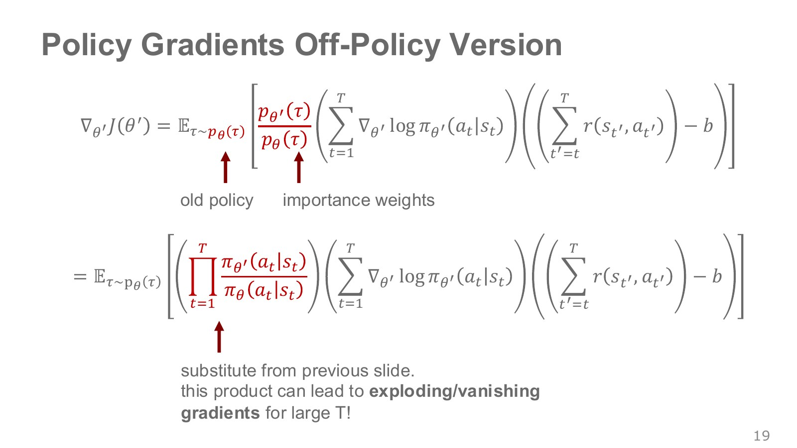

```text
Policy Gradients Off-Policy Version

T T
Vor] (8") = Ex~o(z) =p) Vor vere (> r(spr, “| -b
t=1

old policy importance weights

T T T
(az |s¢)
= Ey Ape (zr) T] a » Vor ene (> (Spr, Apr)

t=1 t'=t

substitute from previous slide.
this product can lead to exploding/vanishing
gradients for large T!

js

19
```

## Slide 21

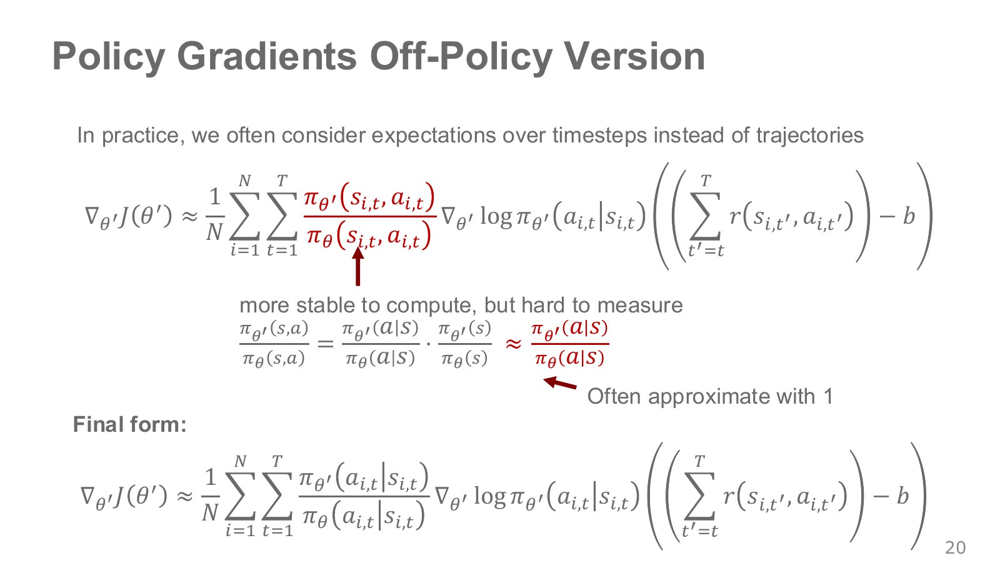

```text
Policy Gradients Off-Policy Version

In practice, we often consider expectations over timesteps instead of trajectories

T

N T
Sj +,
Va) (0") = We 9! (Sit Tat(Sier Git) o 109 ego(a;e|si4) YC: ie")
i=1 t=1 i t’=t

more stable to compute, but hard to measure
Tet(sa) _ Ter(AlS) tyr(s) - Wer(Als)

m9(s,a) me(AlS) mg(s) m@(als)

Often approximate with 1
Final form:

>) Straus) 1 (a; |s; ) y
V Q')x- a \Git [Sit Vor] ; ; 1, d;
a ( ) N aL mo (aizlsit) Q! og T9'(ait|Si.t) 2G a; <1)
20
```

## Slide 22

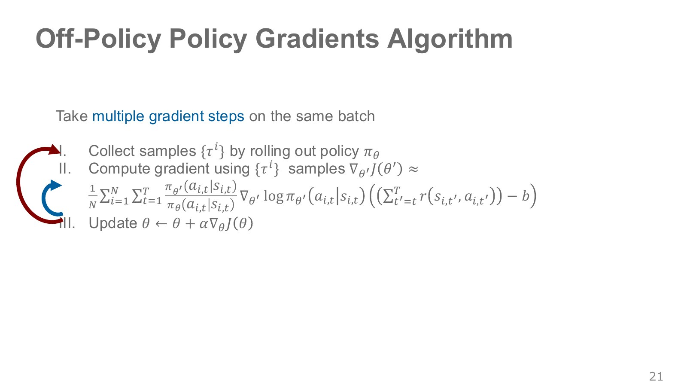

```text
Off-Policy Policy Gradients Algorithm

Take multiple gradient steps on the same batch

Collect samples {r"} by rolling out policy 79

Compute gradient using {t'} samples V,g/J(0’) =

1 Tot (Ai t|Sit)

patel wat padi rlSi) Ve" log m9" (a;¢|six) (Gre aj t')) - b)
Update 6 - 6 + aVogJ(@)

21
```

## Slide 23

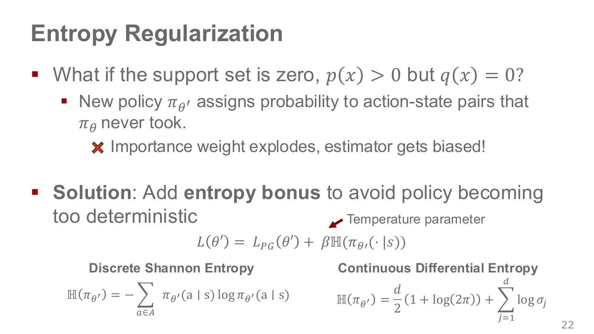

```text
Entropy Regularization

« What if the support set is zero, p(x) > 0 but q(x) = 0?

= New policy zg: assigns probability to action-state pairs that
7g never took.

% Importance weight explodes, estimator gets biased!

* Solution: Add entropy bonus to avoid policy becoming

too deterministic uw lemperature parameter
L(0") = Lpg(6') + BH(t9,(- |s))
Discrete Shannon Entropy Continuous Differential Entropy
d
d
Gee) = =D) mor(@ 18) logrer(a ls) Hg!) = 5 (1 + log(2m)) + Y log,

acA -
=1
J 22
```

## Slide 24

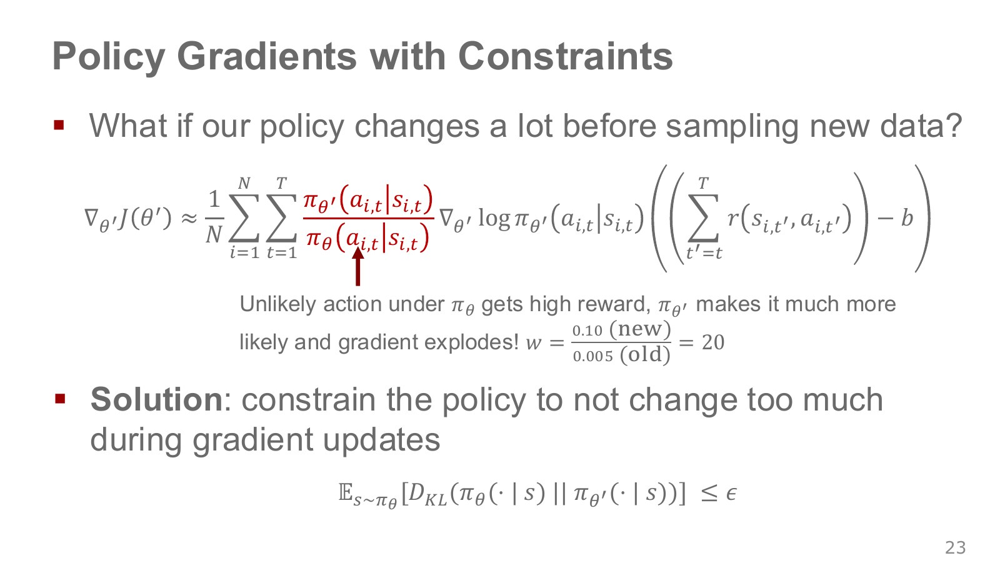

```text
Policy Gradients with Constraints

« What if our policy changes a lot before sampling new data?

T
1 Tg! Qj ¢|S
Vol (0') = rapa ala, s,,) ie) Vg! log t9'(ait|Sit) ~e r(sie ~)) -b

t'=t

Unlikely ol under 7tg gets high reward, zg: makes it much more
0.10 10 (new) ~ 20
05 (old) -

likely and gradient explodes! w =

# Solution: constrain the policy to not change too much
during gradient updates

Es~rg Dkr (ToC 15) II ter 1 5))] Se

23
```

## Slide 25

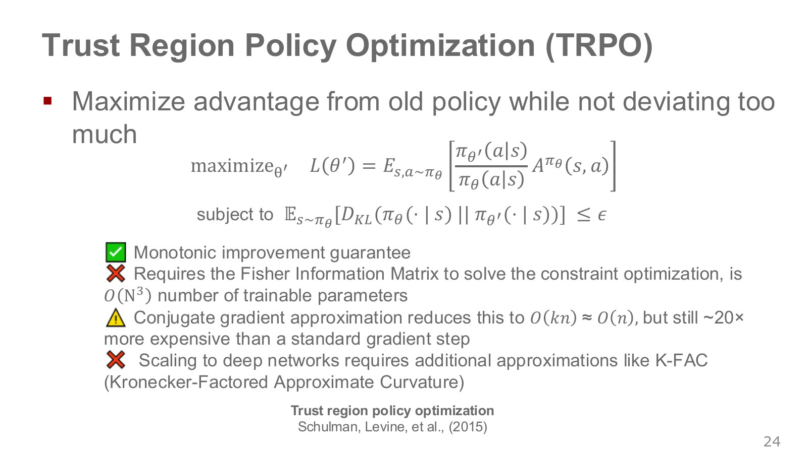

```text
Trust Region Policy Optimization (TRPO)

« Maximize advantage from old policy while not deviating too

much rtp (als)

119 (als)

subject to Es~ng[Dxi (oC | 5) I] terC 1 s))] S€

A™9(s, a|

maximizegy L(0’) = Esq,

Monotonic improvement guarantee
3 Requires the Fisher Information Matrix to solve the constraint optimization, is
O(N?) number of trainable parameters
A Conjugate gradient approximation reduces this to O(kn) = O(n), but still ~20x
more expensive than a standard gradient step
XX Scaling to deep networks requires additional approximations like K-FAC
(Kronecker-Factored Approximate Curvature)

Trust region policy optimization

Schulman, Levine, et al., (2015)
24
```

## Slide 26

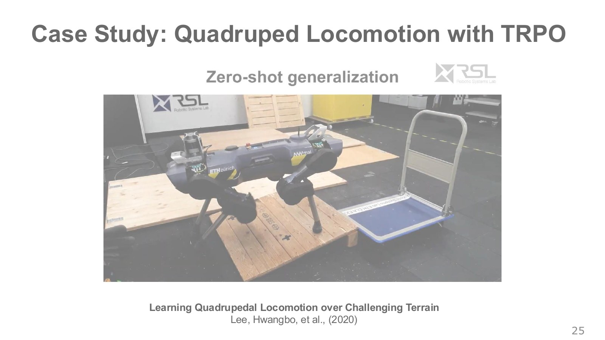

```text
Case Study: Quadruped Locomotion with TRPO

Zero-shot generalization

Learning Quadrupedal Locomotion over Challenging Terrain
Lee, Hwangbo, et al., (2020)

25
```

## Slide 27

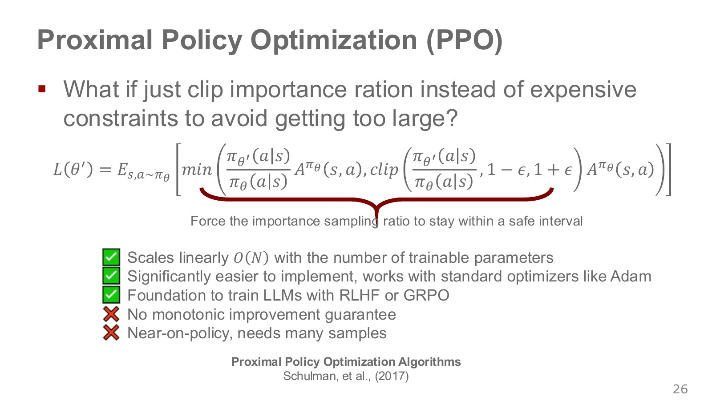

```text
Proximal Policy Optimization (PPO)

« What if just clip importance ration instead of expensive
constraints to avoid getting too large?

L(6') = Esa~ng nin (Hg ar (s,a), clip (a -eé,1+ c) A™9(s, 0)

- sl
,
tg (als) ta (als)
Force the importance eampliny ratio to stay within a safe interval

Scales linearly O(N) with the number of trainable parameters

M4 Significantly easier to implement, works with standard optimizers like Adam
Foundation to train LLMs with RLHF or GRPO

%€ No monotonic improvement guarantee

%€ Near-on-policy, needs many samples

Proximal Policy Optimization Algorithms
Schulman, et al., (2017)

26
```

## Slide 28

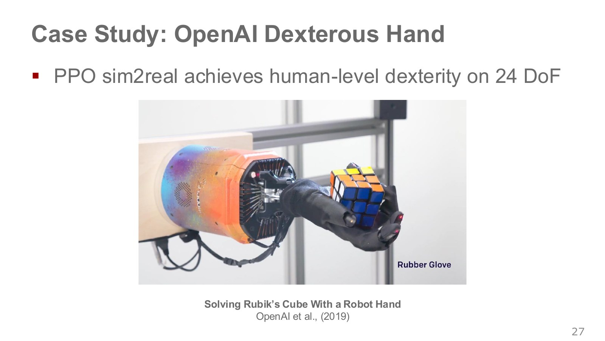

```text
Case Study: OpenAl Dexterous Hand

» PPO sim2real achieves human-level dexterity on 24 DoF

Rubber Glove

Solving Rubik’s Cube With a Robot Hand
OpenAl et al., (2019)

27
```

## Slide 29

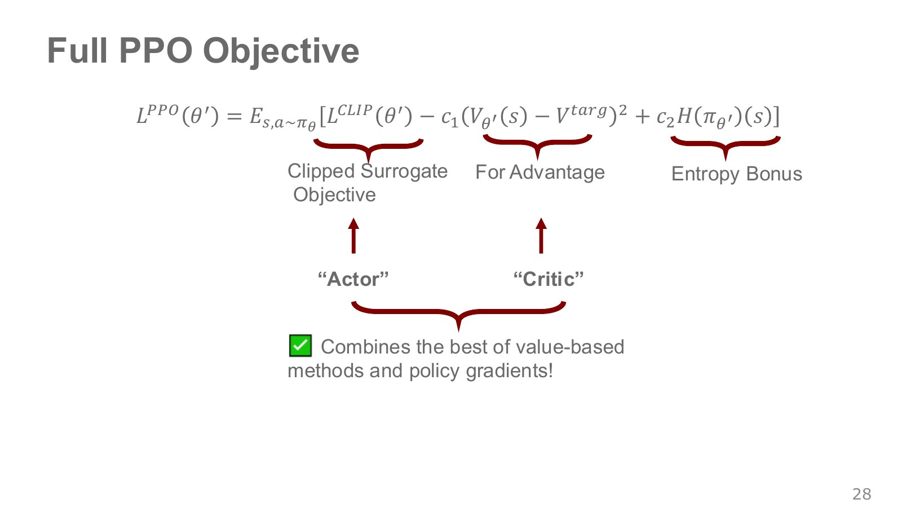

```text
Full PPO Objective

ure (6’) = Esa~n9 Pe Ce) 7c (Vor(s) _ viarg)2 + C2H(1t9')(s)]

Clipped Surrogate

For Advantage
Objective
“Actor” “Critic”

a el

Combines the best of value-based
methods and policy gradients!

Entropy Bonus

28
```

## Slide 30

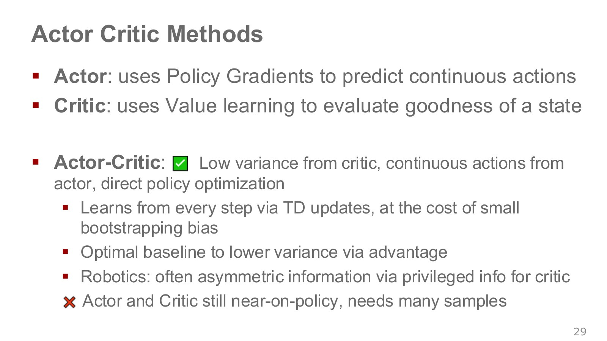

```text
Actor Critic Methods

" Actor: uses Policy Gradients to predict continuous actions
" Critic: uses Value learning to evaluate goodness of a state

" Actor-Critic: Low variance from critic, continuous actions from
actor, direct policy optimization

= Learns from every step via TD updates, at the cost of small
bootstrapping bias

« Optimal baseline to lower variance via advantage
« Robotics: often asymmetric information via privileged info for critic
x Actor and Critic still near-on-policy, needs many samples

29
```

## Slide 31

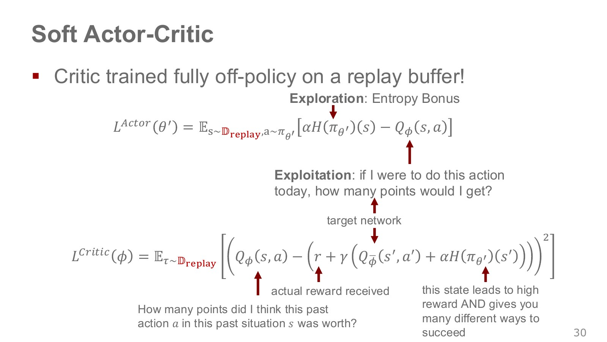

```text
Soft Actor-Critic

= Critic trained fully off-policy on a replay buffer!
Exploration: Entropy Bonus

[Actor (9') = Es~Dreplay:A~Tg! [@H (1t9')(s) = Og(s; a)|

t

Exploitation: if | were to do this action
today, how many points would | get?

target network

1 2
perttie (gs) = Ep~Dreplay (Gre a) - ie y (25(s', a’) + ait(ry"(s")))) |

t actual reward received this state leads to high
How many points did | think this past reward AND gives you
action a in this past situation s was worth? many different ways to

succeed 30
```

## Slide 32

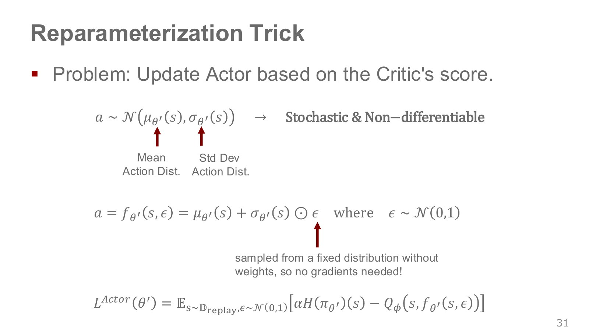

```text
Reparameterization Trick
«= Problem: Update Actor based on the Critic's score.
a~ N(ug'(s),9(s)) > Stochastic & Non-differentiable

Mean Std Dev
Action Dist. Action Dist.

a = fai(s,€) = Ugr(s) + ogr(s) Oe where e€ ~ N(0,1)

sampled from a fixed distribution without
weights, so no gradients needed!

pactor (9!) = Es Dy eplay €~N (0,1) [aH (1t9)(s) = Qg(s, Fars, e))|
31
```

## Slide 33

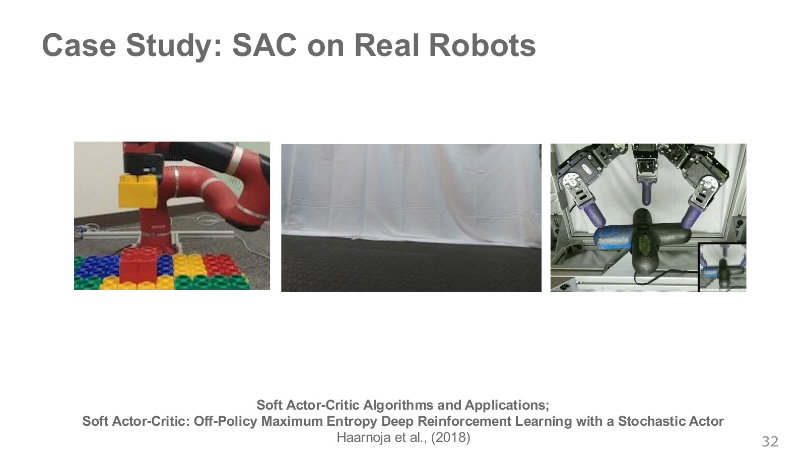

```text
Case Study: SAC on Real Robots

Soft Actor-Critic Algorithms and Applications;
Soft Actor-Critic: Off-Policy Maximum Entropy Deep Reinforcement Learning with a Stochastic Actor
Haarnoja et al., (2018)

32
```

## Slide 34

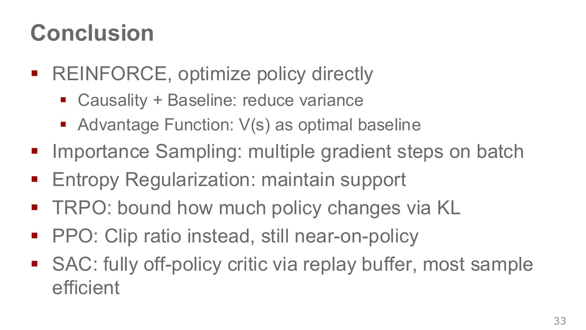

```text
Conclusion

» REINFORCE, optimize policy directly
« Causality + Baseline: reduce variance
« Advantage Function: V(s) as optimal baseline

« Importance Sampling: multiple gradient steps on batch
« Entropy Regularization: maintain support

« TRPO: bound how much policy changes via KL

= PPO: Clip ratio instead, still near-on-policy

# SAC: fully off-policy critic via replay buffer, most sample
efficient

33
```

## Slide 35


```text
Thank you for your attention
```

## Slide 36

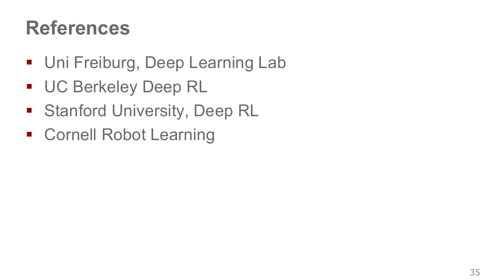

```text
References

# Uni Freiburg, Deep Learning Lab
«" UC Berkeley Deep RL

« Stanford University, Deep RL

« Cornell Robot Learning

35
```

---

[← Course home](../README.md) · [Open optional slide gallery →](../curriculum/week-05-reinforcement-learning-ii.md)
