# Week 06 - Generative Models: OCR transcript

[← Course home](../README.md) · **Default OCR view** · [Open optional slide gallery →](../curriculum/week-06-generative-models.md)

> This is an automated OCR transcript generated from the locally rendered slide images. Use the image as the source of truth for equations, diagrams, citations, and small text.

## Slide 1

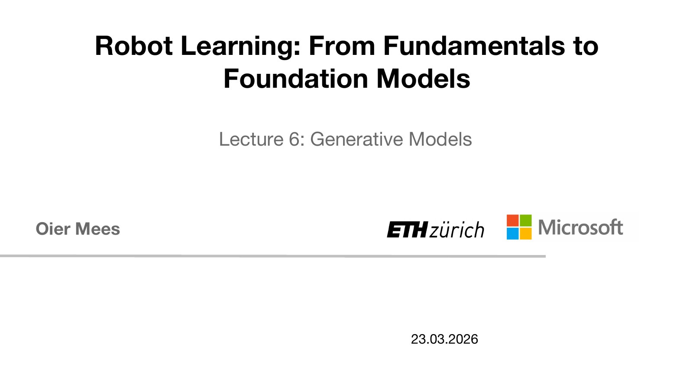

```text
Robot Learning: From Fundamentals to
Foundation Models

Lecture 6: Generative Models

Oier Mees ETHziirich 2 3™ Microsoft

23.03.2026
```

## Slide 2

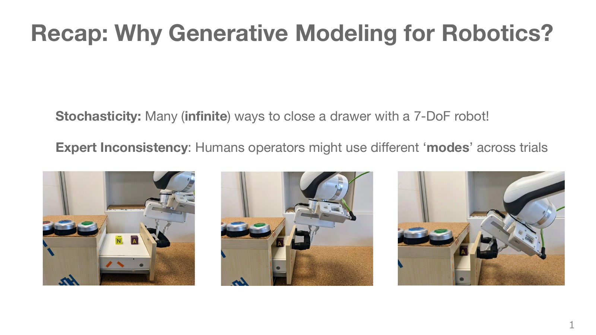

```text
Recap: Why Generative Modeling for Robotics?

Stochasticity: Many (infinite) ways to close a drawer with a 7-DoF robot!

Expert Inconsistency: Humans operators might use different ‘modes’ across trials
```

## Slide 3

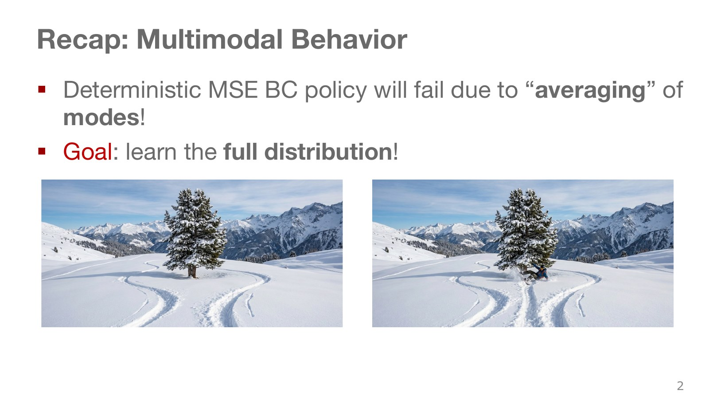

```text
Recap: Multimodal Behavior

" Deterministic MSE BC policy will fail due to “averaging” of
modes!

=" Goal: learn the full distribution!
```

## Slide 4

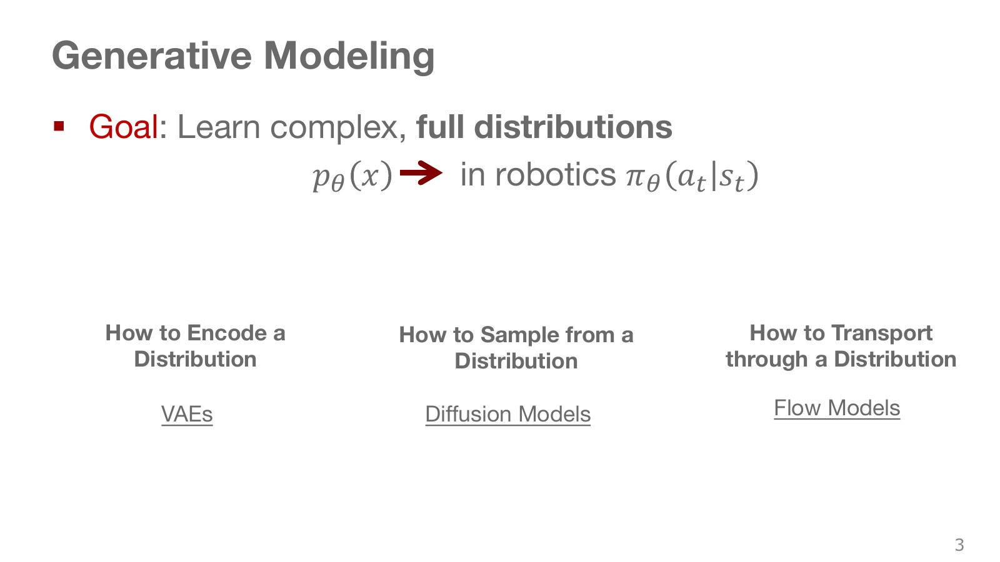

```text
Generative Modeling

" Goal: Learn complex, full distributions
po(x) => in robotics 79g (a;|s;)

How to Encode a How to Sample from a How to Transport
Distribution Distribution through a Distribution

VAEs Diffusion Models Flow Models
```

## Slide 5

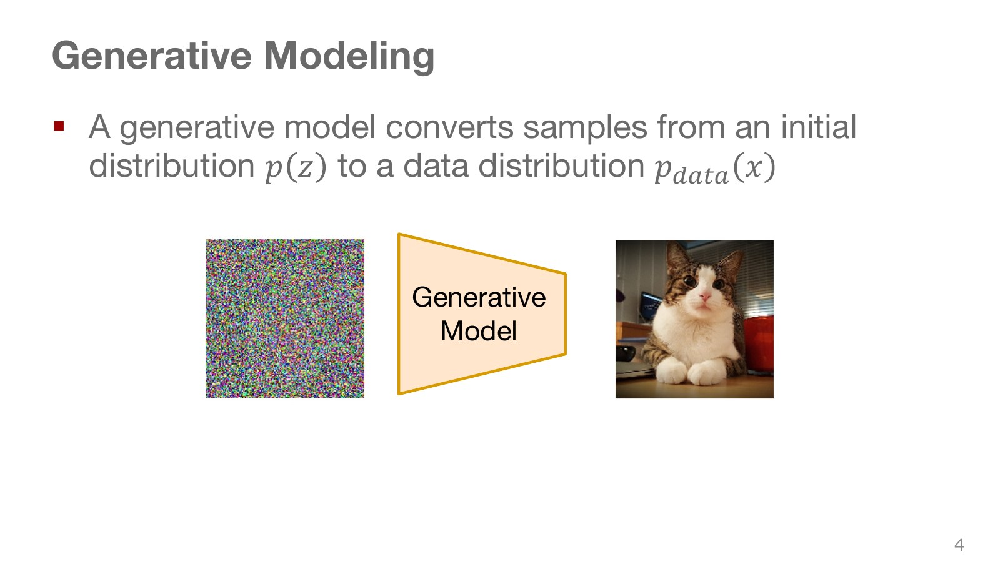

```text
Generative Modeling

=» A generative model converts samples from an initial
distribution p(z) to a data distribution pgata(x)

Generative

Model
```

## Slide 6

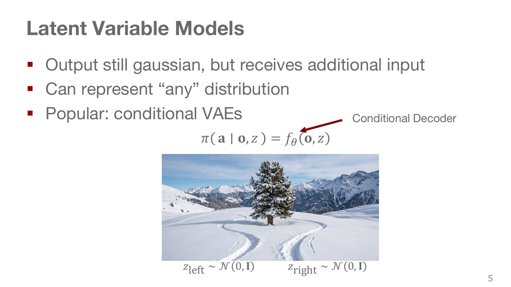

```text
Latent Variable Models

= Output still gaussian, but receives additional input
= Can represent “any” distribution
# Popular: conditional VAEs

Conditional Decoder
n(alo,z) = foto)
```

## Slide 7

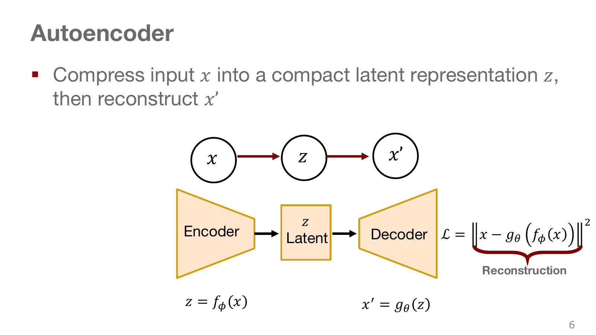

```text
Autoencoder

= Compress input x into a compact latent representation z,
then reconstruct x’

O-O-O

2
Latent/-*| Decoder |L£ = ||x - go (fs (x))

Reconstruction

Z = f(x) x’ = gg(Z)
```

## Slide 8

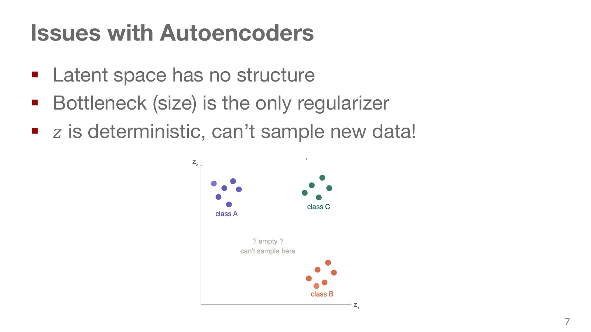

```text
Issues with Autoencoders

» Latent space has no structure
« Bottleneck (size) is the only regularizer
= z is deterministic, can’t sample new data!
```

## Slide 9

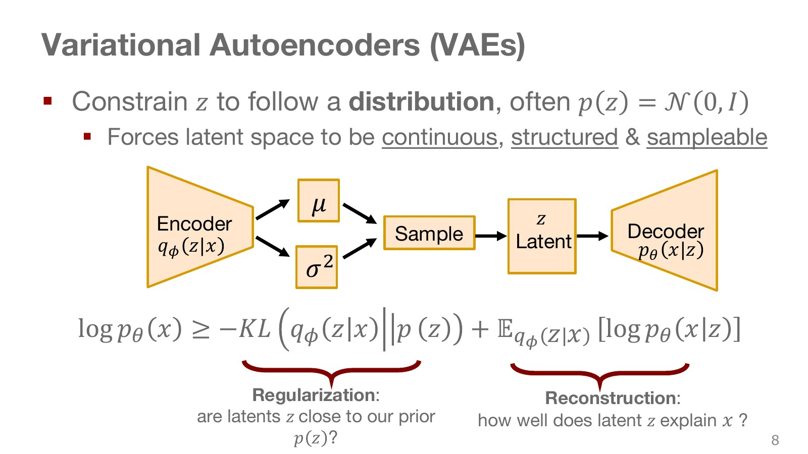

```text
Variational Autoencoders (VAEs)

* Constrain z to follow a distribution, often p(z) = N(0,/)
" Forces latent space to be continuous, structured & sampleable

a” LEN z
Ny Z7 Sample - | atent

Encoder

dg (zx) -»| Decoder

Do (x|z)

log pg(x) = -KL (4g (zlx) Ip (2)) + Eqyczix) log pe @lz)]

Regularization: Reconstruction:

are latents z close to our prior how well does latent z explain x ?
p(z)?

8
```

## Slide 10

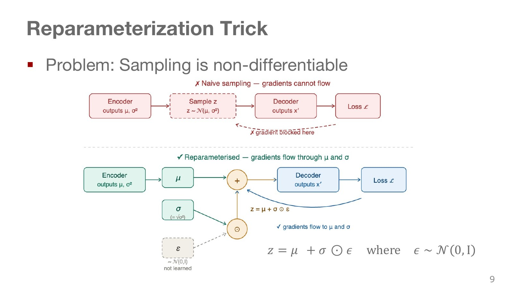

```text
Reparameterization Trick

« Problem: Sampling is non-differentiable

* Naive sampling - gradients cannot flow

e ’
Encoder Lt Sample z ' Decoder
! y - f Loss 4
outputs L, 0? t zZ~N(u, 0?) ; outputs x

y¥ Reparameterised - gradients flow through and o

Encoder Mm Decoder L
outputs 1, 0? outputs x’ Coe
i
= o8

¥ gradients flow to p and o

<a z=u +a0@Q€ where €~ N(0,J)

not learned
```

## Slide 11

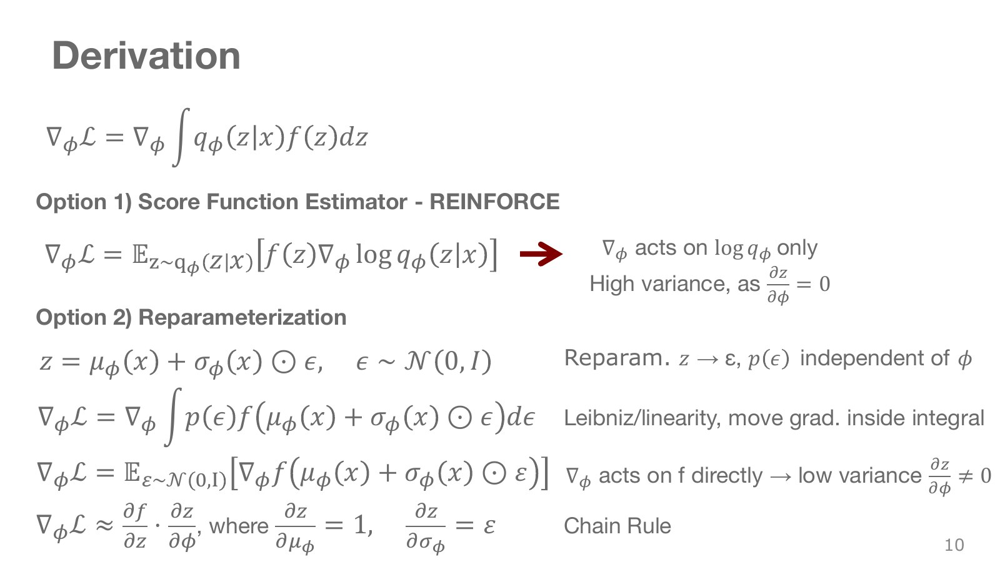

```text
Derivation

Vel =Vo [ao@bor@az

Option 1) Score Function Estimator - REINFORCE

Vp acts on log gg only

az
High variance, as a6 = 0

Vel = Ey~gg(zixy Lf (Z)V@ logqg(z|x)| ->

Option 2) Reparameterization
Z=Ug(x) tog) Oe €~N(O,I) Reparam. z - €, p(e) independent of

Vol =Vo [rors (x) + og (x) O e)de Leibniz/linearity, move grad. inside integral

Vol = Ec-wo)) [Vat (up (x) + og(x) O e)| Vy acts on f directly > low variance ss #0

Vpl x af a Chain Rule

og’ © On 1) Oop 10
```

## Slide 12

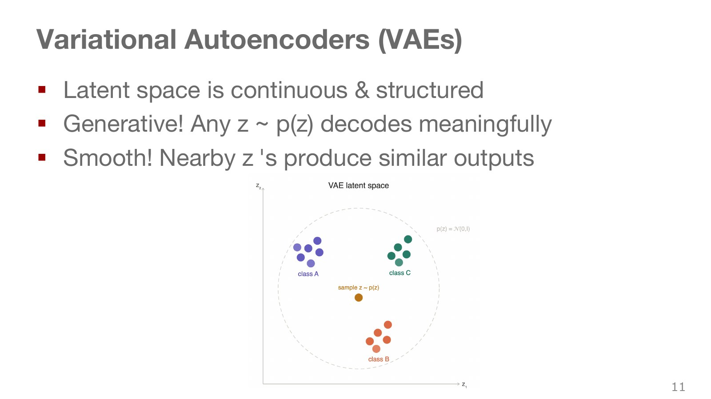

```text
Variational Autoencoders (VAEs)

« Latent space is continuous & structured
= Generative! Any z ~ p(z) decodes meaningfully
=" Smooth! Nearby z's produce similar outputs

VAE latent space

11
```

## Slide 13

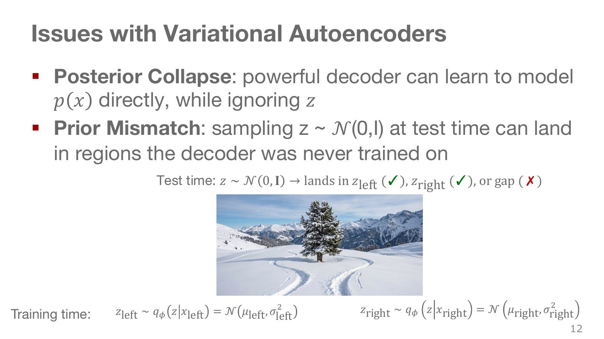

```text
Issues with Variational Autoencoders

= Posterior Collapse: powerful decoder can learn to model
p(x) directly, while ignoring z
« Prior Mismatch: sampling z ~ WV(0,I) at test time can land
in regions the decoder was never trained on
Test time: z ~ V'(0,1) = lands in Zjeg (W), Zright (Vv), or gap (X)

_ 2
Training time: “left ~ 9 (2/"eft) = MV Mete ert) Zright ~ I¢ ( |+ight) aN (right Tight)
12
```

## Slide 14

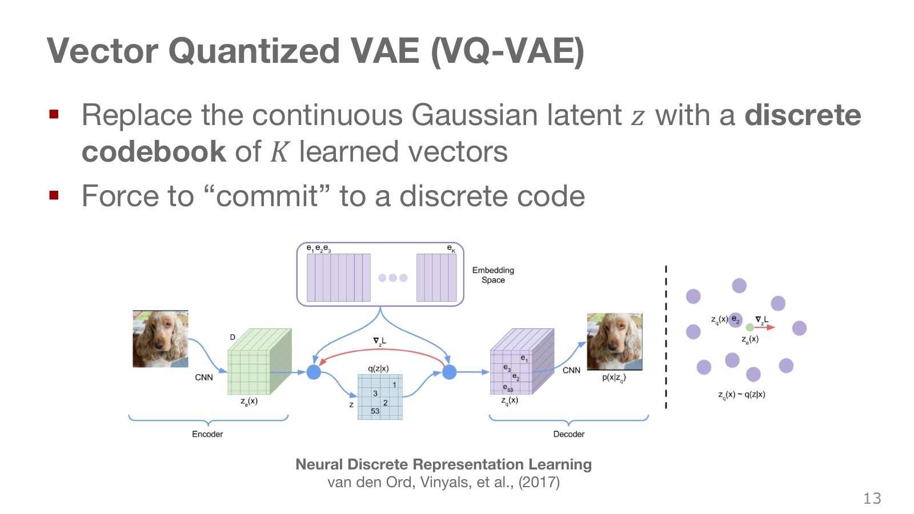

```text
Vector Quantized VAE (VQ-VAE)

= Replace the continuous Gaussian latent z with a discrete
codebook of K learned vectors

" Force to “commit” to a discrete code

1
; @
i
; @ eu!
1 2,00) vb
e>
1 @
ON plale) \ @ @ e
=e 2,9) ~ ala)
A, ----~Y

Decoder

Neural Discrete Representation Learning
van den Ord, Vinyals, et al., (2017)
13
```

## Slide 15

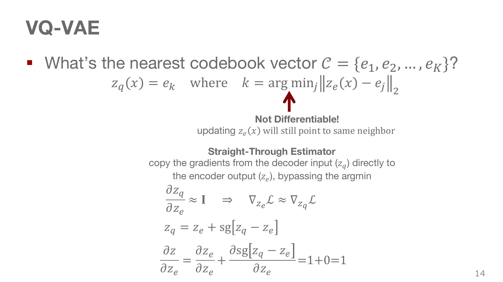

```text
VQ-VAE

« What’s the nearest codebook vector C = {ej, e2,
Zq(x) =e, where k = arg min,||Ze(x) - ell,

Not Differentiable!
updating z, (x) will still point to same neighbor

Straight-Through Estimator
copy the gradients from the decoder input (z,) directly to

the encoder output (z,), bypassing the argmin

0Zq
~I > V,£2V,,L

OZ
Zq = Ze + sg|zq _ Ze|
Oz OZ, asg|zq = Ze|

OZ ~ OZ t OZ

=1+0=1

14
```

## Slide 16

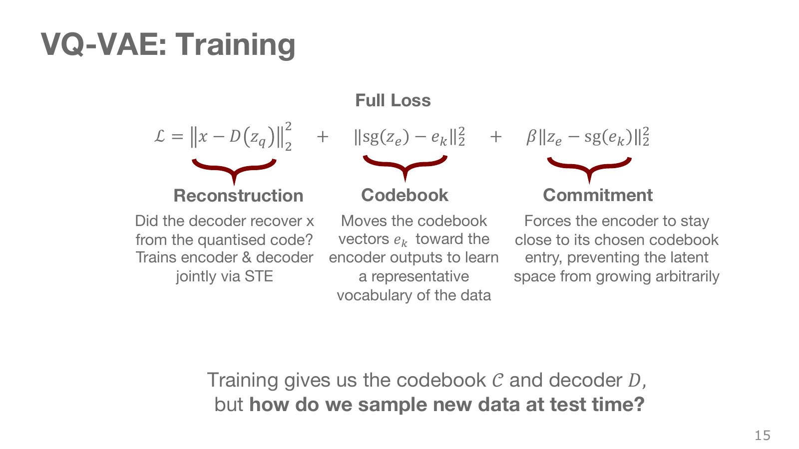

```text
VQ-VAE: Training

Full Loss
L=|x-D(z,)|l, + Ise@e)-exll3 + Blize -se(enIl3

Reconstruction Codebook Commitment

Did the decoder recover x Moves the codebook Forces the encoder to stay
from the quantised code? ~--vectors e, toward the _ close to its chosen codebook
Trains encoder & decoder encoder outputs to learn __ entry, preventing the latent
jointly via STE a representative space from growing arbitrarily
vocabulary of the data

Training gives us the codebook C and decoder D,
but how do we sample new data at test time?

15
```

## Slide 17

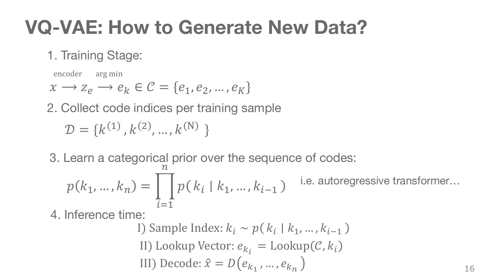

```text
VQ-VAE: How to Generate New Data?
1. Training Stage:

encoder argmin

X Ze ee EC = {€4,€2,...,eK}
2. Collect code indices per training sample
D ={kY ,h@, kM) 3

3. Learn a categorical prior over the sequence of codes:
n

p(k, ky) = | [oc | ky ki-1) i.e. autoregressive transformer..
pry hn) - t prrey UT
i=1

4. Inference time:
1) Sample Index: k; ~ p(k; | ky, .-,ki-1)

II) Lookup Vector: e,, = Lookup(C, k;)
III) Decode: = Dex,» rap Cie, )

16
```

## Slide 18

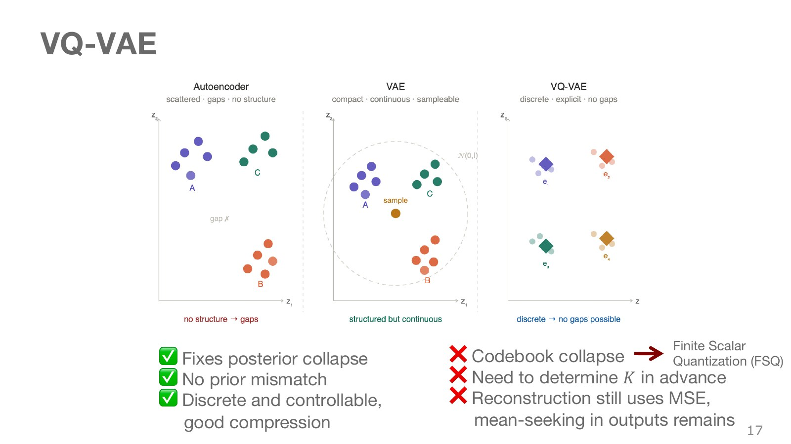

```text
VQ-VAE

Autoencoder
scattered - gaps - no structure

VAE
compact : continuous - sampleable

VQ-VAE
discrete - explicit - no gaps

z, Z, en

:
e e
e ee ; :
eo °% e e ° ry ¢
c
e e e e,
e e@@ e,
A e
e c
K sample
e
e
e ry e
Paid ° Cg by
e ee e .
@ e e
B B
2 2, oz

no structure + gaps structured but continuous discrete + no gaps possible

Finite Scalar

X Codebook collapse > Quantization (FSQ)

X Need to determine K in advance

X Reconstruction still uses MSE,
mean-seeking in outputs remains ‘a

Fixes posterior collapse

No prior mismatch

Discrete and controllable,
good compression
```

## Slide 19

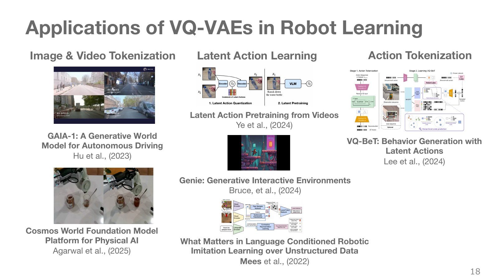

```text
Applications of VQ-VAEs in Robot Learning

Image & Video Tokenization Latent Action Learning Action Tokenization

1. Latent Action Quantization 2. Latent Pretraining

Latent Action Pretraining from Videos
Ye et al., (2024)

GAIA-1: A Generative World
Model for Autonomous Driving
Hu et al., (2023)

VQ-BeT: Behavior Generation with
Latent Actions

Lee et al., (2024)

Genie: Generative Interactive Environments
Bruce, et al., (2024)

Cosmos World Foundation Model
Platform for Physical Al What Matters in Language Conditioned Robotic
Agarwal et al., (2025) Imitation Learning over Unstructured Data
Mees et al., (2022)
18
```

## Slide 20

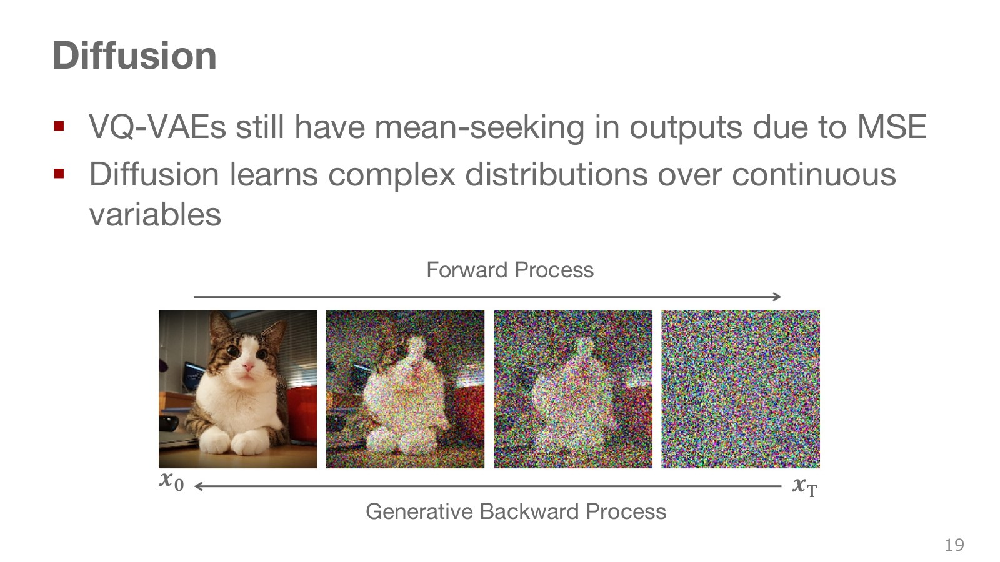

```text
Diffusion

= VQ-VAEs still have mean-seeking in outputs due to MSE

« Diffusion learns complex distributions over continuous
variables

Forward Process

Generative Backward Process

19
```

## Slide 21

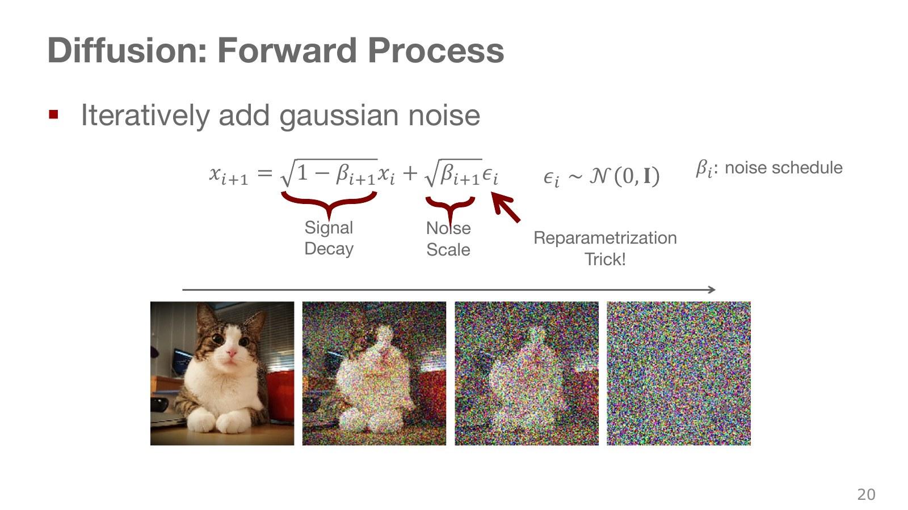

```text
Diffusion: Forward Process

« |teratively add gaussian noise

Migr = fl - Big rXi + /Bis16:

Signal a LS

Decay Scale

6 ~ N(0,D

Reparametrization
Trick!

Bj: noise schedule

20
```

## Slide 22

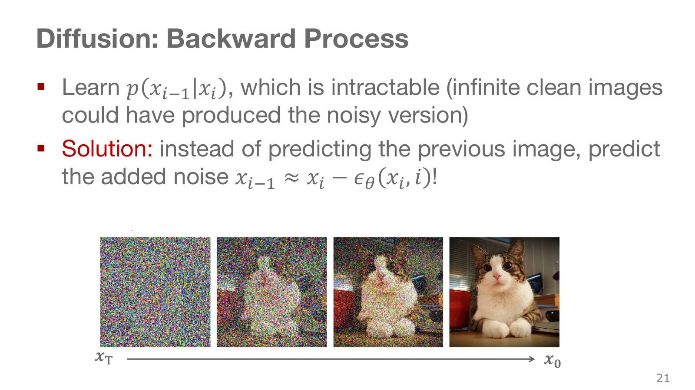

```text
Diffusion: Backward Process

# Learn p(x;-1|x;), which is intractable (infinite clean images
could have produced the noisy version)

# Solution: instead of predicting the previous image, predict
the added noise x;_1 * x; - €9(%;, i)!

21
```

## Slide 23

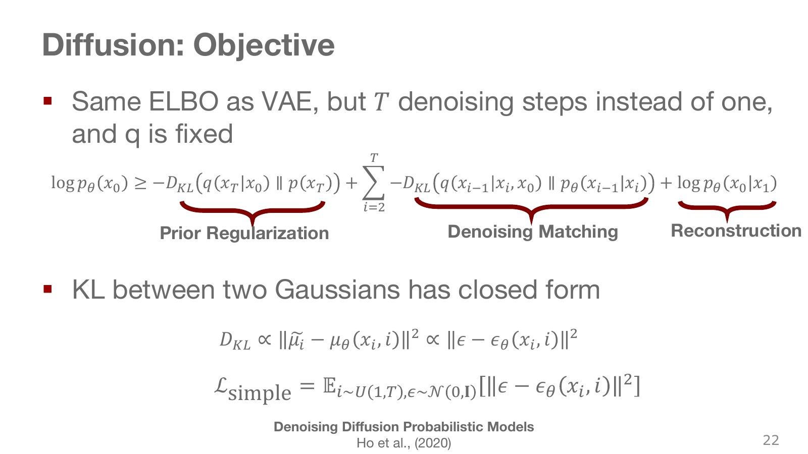

```text
Diffusion: Objective

» Same ELBO as VAE, but T denoising steps instead of one,
and q is fixed

T
log pg (Xo) = -Dxr(4&rlx0) I p(xr)) + ». -Dxr (4X11: Xo) I Po (xi-11%i)) + log pg (%olx1)

en ane i=2 ee a --
Prior Regularization Denoising Matching Reconstruction

= KL between two Gaussians has closed form
Det & Wi - He (XDI? & lle - €9 (x, II?
Lsimple = Ei~ua.r)e~wonllle - €6 i, i)|I7]

Denoising Diffusion Probabilistic Models
Ho et al., (2020) 22
```

## Slide 24

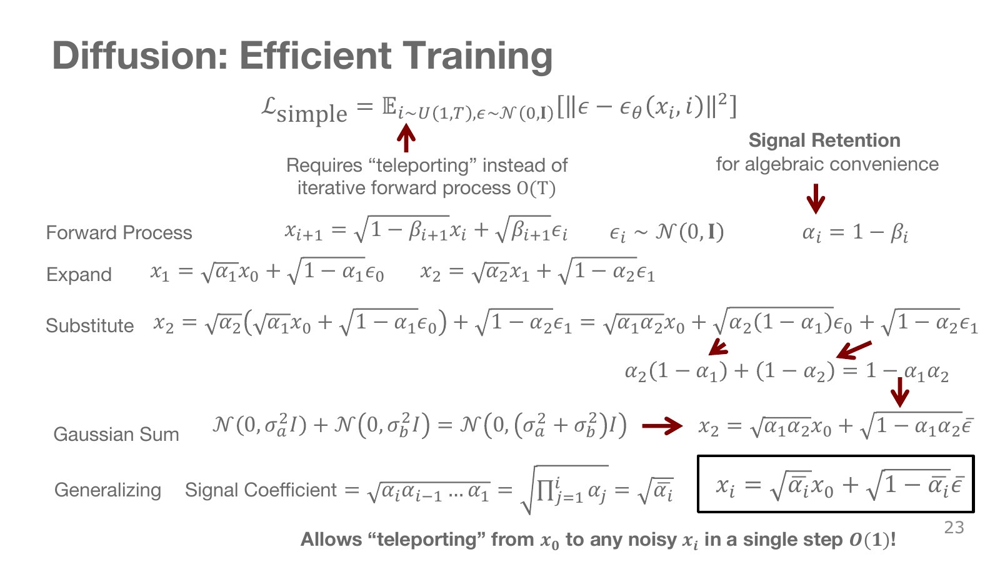

```text
Diffusion: Efficient Training

Lsimple = Ei~va.r)e~w onllle - €6 @, A117]
Signal Retention

Requires “teleporting” instead of for algebraic convenience
iterative forward process O(T) v
Forward Process Xi-a = V1 - Bissxi + V Bi41€ Ee ~ NOD a,=1-8£;

Expand = %1 = V@Xo tJ¥l-aye9 XQ = YAQx, + J1- ane,
Substitute %2 = V&2(VeiXo + 1 ~ @€) + V1 - AE = A A2Xq + Vaz(1 - ay )Eq + V1 - A2€,
k

@2(1 - ay) + (1-- a2) = 1 aya

Gaussian Sum NO, a@!) + N (0,051) = N (0, (oa + 0%!) SP y= VA AQXy + V1 - ay a2E

Generalizing Signal Coefficient = ./aj;Q@j_1 ...@ = a aj = fj xi FV GX + Vv 1- ae

23

Allows “teleporting” from x, to any noisy x; in a single step 0(1)!
```

## Slide 25

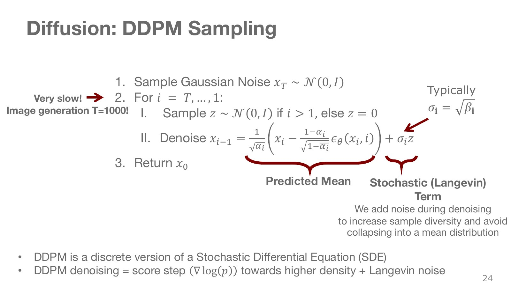

```text
Diffusion: DDPM Sampling

1. Sample Gaussian Noise x; ~ N(0,/)

Very slow! => 2. Fori = T,...,1: Typically
Image generation T=1000! |. Sample Z~ N(0, 1) ifi> 1, else z = 0 j= VBi
ll. Denoise x;_, = E(x - - €9 (Xi, 0) + oz
i -aj

3. Return x, -_~Yr “Y”

Predicted Mean -_ Stochastic (Langevin)

Term
We add noise during denoising

to increase sample diversity and avoid
collapsing into a mean distribution

¢ DDPM is a discrete version of a Stochastic Differential Equation (SDE)

¢« DDPM denoising = score step (V log(p)) towards higher density + Langevin noise #4
```

## Slide 26

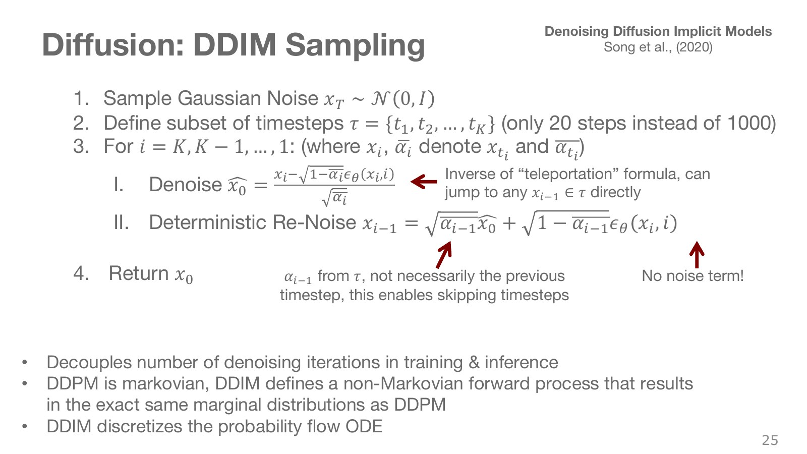

```text
Denoising Diffusion Implicit Models

Diffusion: DDIM Sampling Song et a, (2020)

1. Sample Gaussian Noise x; ~ N(0,/)
2. Define subset of timesteps t = {t,, tz, ..., tc} (only 20 steps instead of 1000)
3. Fori = K,K -1,...,1: (where x;, @ denote x,, and @;)

| D. wo Xi 1 BE Q (Xp, 1) Inverse of “teleportation” formula, can
. ENOISe Xo = VG jump to any x;_, € tT directly

ll. Deterministic Re-Noise x; = /@-1% + 1 - @-1€9(%, {)

4. Return Xo a-1 from t, not necessarily the previous No noise term!
timestep, this enables skipping timesteps

Decouples number of denoising iterations in training & inference
DDPM is markovian, DDIM defines a non-Markovian forward process that results
in the exact same marginal distributions as DDPM

DDIM discretizes the probability flow ODE 5e
```

## Slide 27

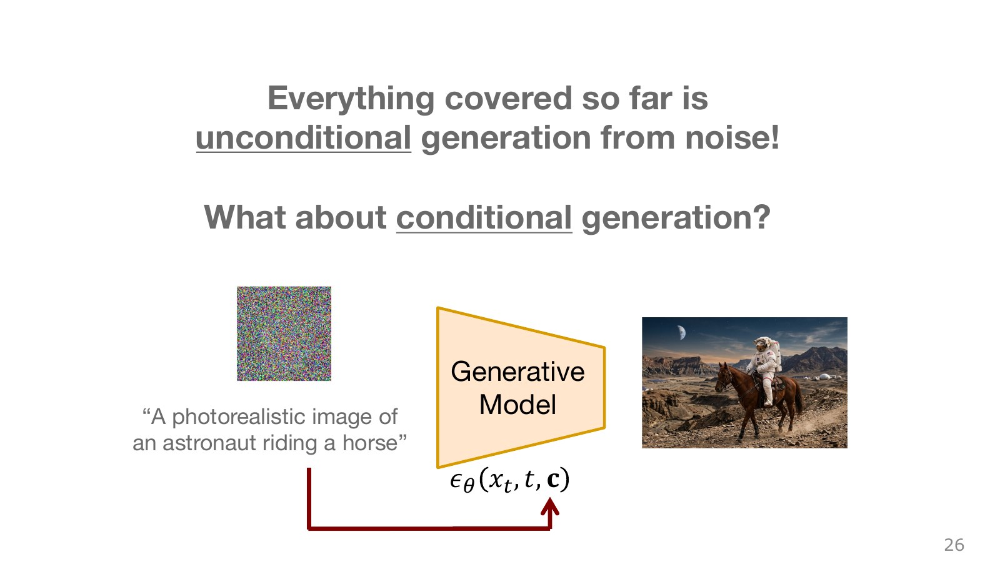

```text
Everything covered so far is
unconditional generation from noise!

What about conditional generation?

Generative
Model

“A photorealistic image of
an astronaut riding a horse”

26
```

## Slide 28

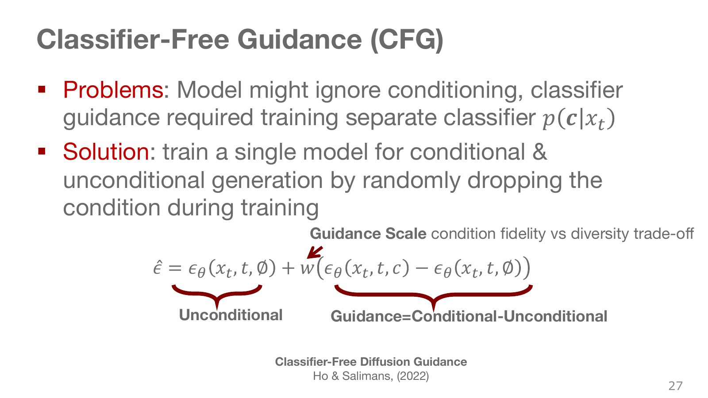

```text
Classifier-Free Guidance (CFG)

# Problems: Model might ignore conditioning, classifier
guidance required training separate classifier p(c|x;)

= Solution: train a single model for conditional &
unconditional generation by randomly dropping the
condition during training
Guidance Scale condition fidelity vs diversity trade-off

4
€ = €9 (xz, t, O) + w(ég (xp, t,c) - €g (Xz, t, 0))
Unconditional Guidance=Conditional-Unconditional

Classifier-Free Diffusion Guidance

Ho & Salimans, (2022) 57
```

## Slide 29

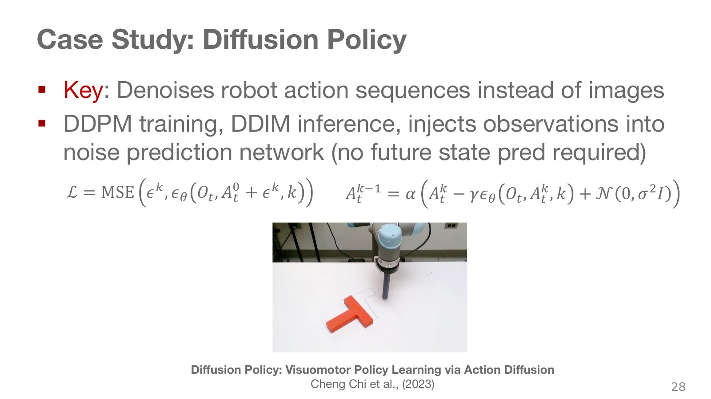

```text
Case Study: Diffusion Policy

=» Key: Denoises robot action sequences instead of images

" DDPM training, DDIM inference, injects observations into
noise prediction network (no future state pred required)

L=MSE(c*eg(0,42+e%k)) At =a (AE - yeo(0,, AE, k) + N(0,071))

»

Diffusion Policy: Visuomotor Policy Learning via Action Diffusion
Cheng Chi et al., (2023) 28
```

## Slide 30

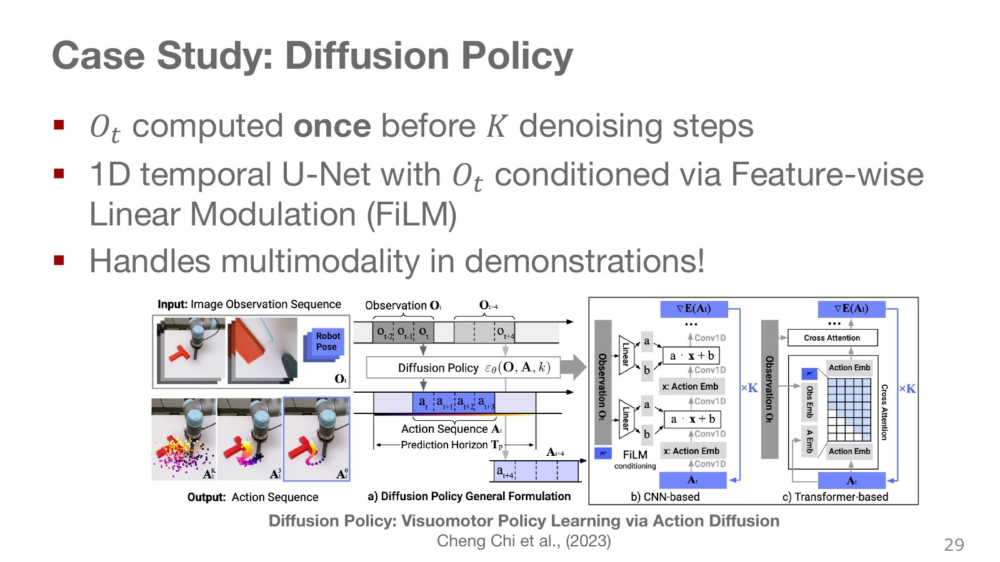

```text
Case Study: Diffusion Policy

=" 0, computed once before K denoising steps

» 1D temporal U-Net with 0; conditioned via Feature-wise
Linear Modulation (FiLM)

# Handles multimodality in demonstrations!

Input: Image Observation Sequence Observation O: Ovs
a-x+b ‘
- [ Diffusion Policy ¢9(O, A, k) > El B~__fConvid ‘Action Emb
: v x:AetionEmb {xk i xK|

or aox+b &
Action Sequence A: D b areca} ee

a Prediction Horizon Ts-rl ye cy EE S| es

Output: Action Sequence a) Diffusion Policy General Formulation b) CNN-based c) Transformer-based

Diffusion Policy: Visuomotor Policy Learning via Action Diffusion
Cheng Chi et al., (2023)
```

## Slide 31

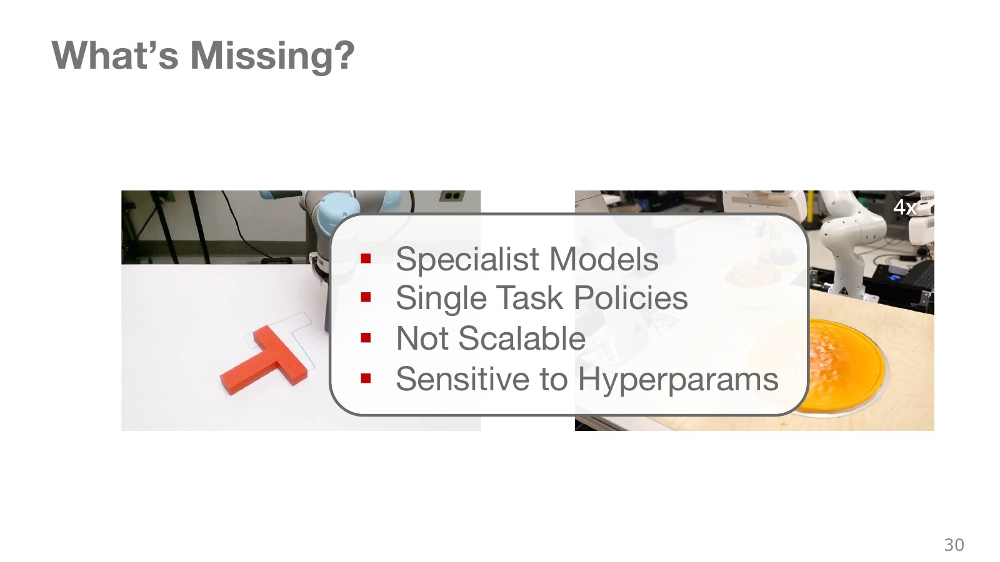

```text
What’s Missing?

Specialist Models
Single Task Policies

Not Scalable

Sensitive to Hyperparams

30
```

## Slide 32

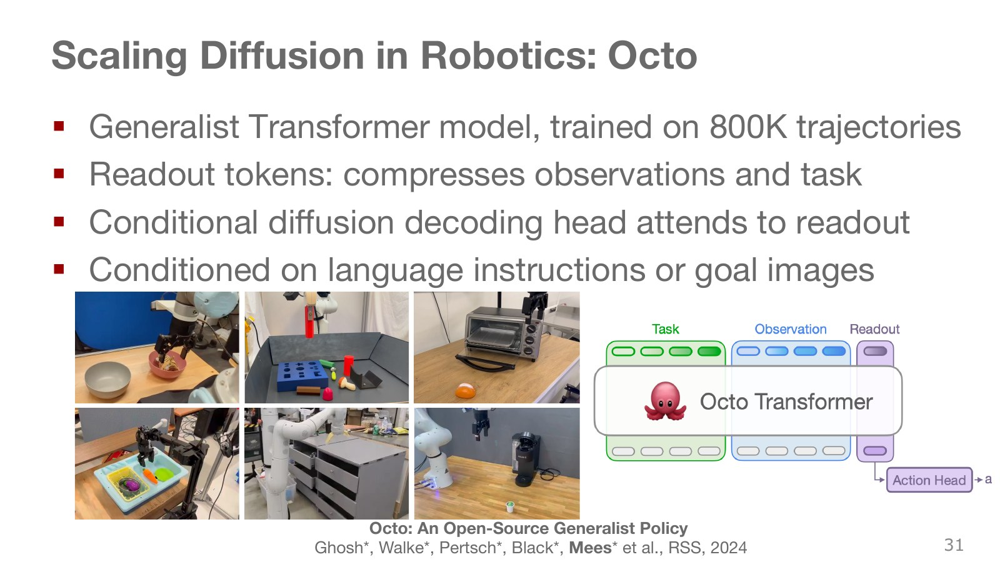

```text
Scaling Diffusion in Robotics: Octo

" Generalist Transformer model, trained on 800K trajectories
= Readout tokens: compresses observations and task

= Conditional diffusion decoding head attends to readout

= Conditioned on language instructions or goal images

™

Task Observation Readout

R Octo Transformer

Action Head |>a

Octo: An Open-Source Generalist Policy
Ghosh”, Walke*, Pertsch*, Black*, Mees* et al., RSS, 2024 31
```

## Slide 33

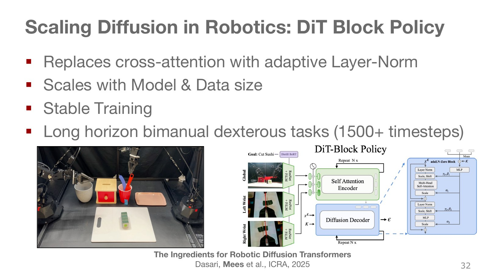

```text
Scaling Diffusion in Robotics: DiT Block Policy

= Replaces cross-attention with adaptive Layer-Norm

# Scales with Model & Data size
" Stable Training

» Long norizen bimanual dexterous tasks (1500+ timesteps)

DiT-Block Policy

Repeat Nx

ah Self Attention Z
Encoder J
Diffusion Decoder | | €

Global

,

/

Fa
§
x
z
ca |
z

Repeat Nx

The Ingredients for Robotic Diffusion Transformers
Dasari, Mees et al., ICRA, 2025

32
```

## Slide 34

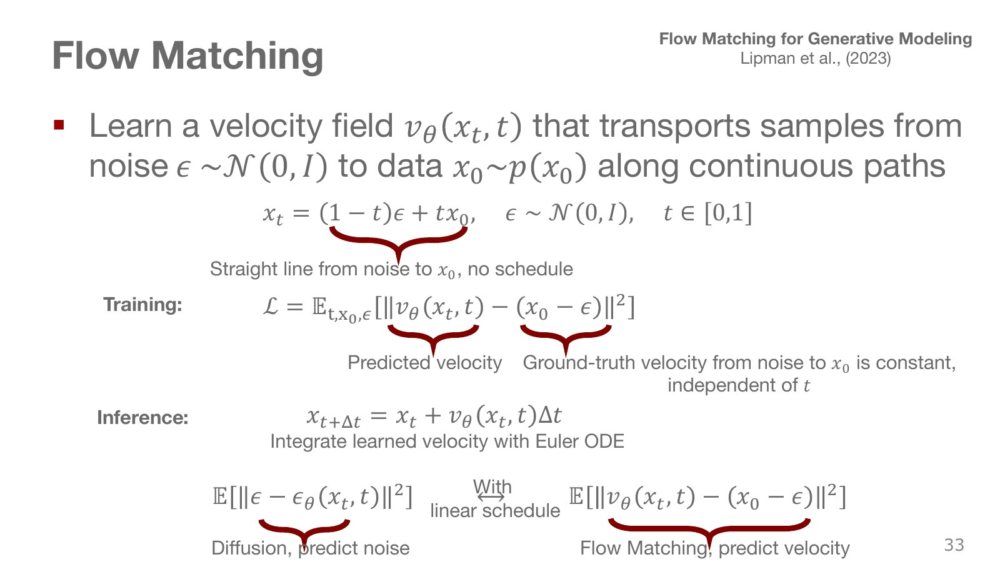

```text
Flow Matching for Generative Modeling

Flow Matching Lipman et al. (2028)

« Learn a velocity field vg (xz, t) that transports samples from
noise € ~N (0,1) to data x»~p(x)) along continuous paths

X= (1-tet+tx, e€~N(0,/), t€ [0,1]

Straight line from noise to x9, no schedule

Training: L = Erx,elllve rt) - @ - Ol?)

Predicted velocity Ground-truth velocity from noise to x9 is constant,
independent of t

Inference: Xtesat = Xe + ve (Xz, t)At
Integrate learned velocity with Euler ODE

Efile -eo(x,t)I7] SP Elllve (xe, t) - Go - DIN?

linear schedule

Diffusion, Yredict noise Flow Matching’ predict velocity 33
```

## Slide 35

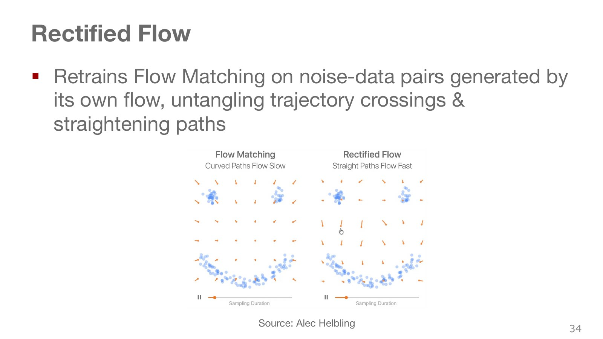

```text
Rectified Flow

# Retrains Flow Matching on noise-data pairs generated by
its own flow, untangling trajectory crossings &
straightening paths

Flow Matching Rectified Flow
Curved Paths Flow Slow Straight Paths Flow Fast
ie \ ‘ 4 d ie . ‘ < \ ‘ ‘
F A Py
w & ‘ 4 ee Pa sd & i od we -
~ oS - ‘ol I .. & 2
6
= - ot ‘ 1 7 5 ‘ é
awe om ie Ps
fu 8, te - * ae
Per Aigo A 5 eA go dee 3 iS
1 o--

Source: Alec Helbling 34
```

## Slide 36

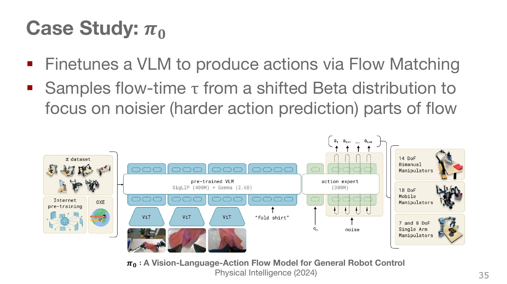

```text
Case Study: 71)

« Finetunes a VLM to produce actions via Flow Matching

= Samples flow-time t from a shifted Beta distribution to
focus on noisier (harder action prediction) parts of flow

Ce Are. Ate

t

pre-trained VLM

ion e
SigLIP (480M) + Gemma (2.6B) (300M)

m@. Ty noi:

ot ae

t [S]
pesteeninings |eccs + med an

se

t

act xpert

14 DoF

Bimanual

Manipulators

18 DoF

Mobile

Manipulators .

7 and 8 DoF
Single Arm
Manipulators

7

19 : A Vision-Language-Action Flow Model for General Robot Control

Physical Intelligence (2024)

35
```

## Slide 37

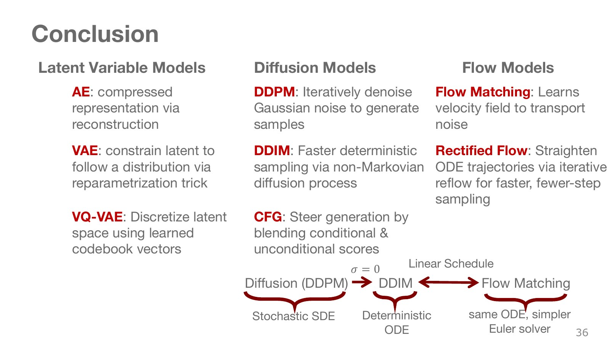

```text
Conclusion

Latent Variable Models Diffusion Models Flow Models
AE: compressed DDPM : Iteratively denoise Flow Matching: Learns
representation via Gaussian noise to generate velocity field to transport
reconstruction samples noise
VAE: constrain latent to DDIM: Faster deterministic Rectified Flow: Straighten
follow a distribution via sampling via non-Markovian ODE trajectories via iterative
reparametrization trick diffusion process reflow for faster, fewer-step
sampling

VQ-VAE: Discretize latent CFG: Steer generation by
space using learned blending conditional &
codebook vectors unconditional scores

r= Linear Schedule

Diffusion (DDPM) => DDIM <---=> Flow Matching

Stochastic SDE Beeseainiste same ope simpler

ODE Euler solver 36
```

## Slide 38

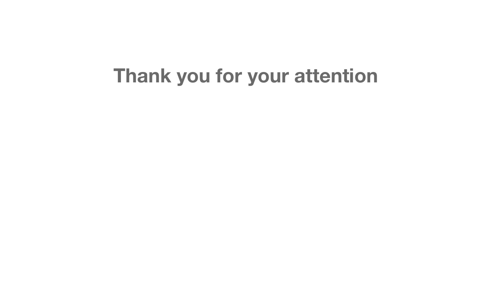

```text
Thank you for your attention
```

## Slide 39

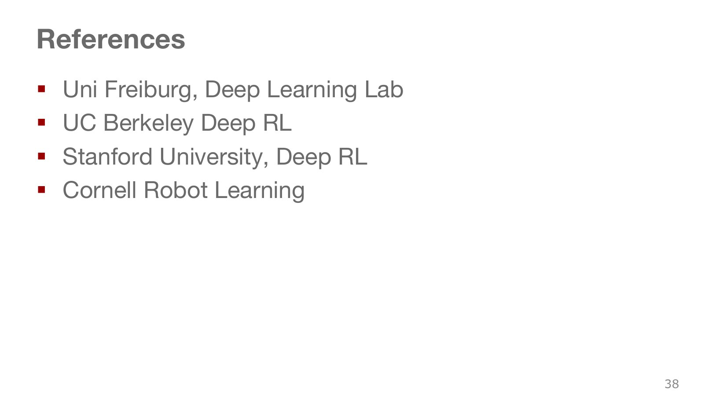

```text
References

# Uni Freiburg, Deep Learning Lab
" UC Berkeley Deep RL

« Stanford University, Deep RL

" Cornell Robot Learning

38
```

---

[← Course home](../README.md) · [Open optional slide gallery →](../curriculum/week-06-generative-models.md)
