# Week 07 - Sequence Modeling and Transformers: OCR transcript

[← Course home](../README.md) · **Default OCR view** · [Open optional slide gallery →](../curriculum/week-07-sequence-modeling.md)

> This is an automated OCR transcript generated from the locally rendered slide images. Use the image as the source of truth for equations, diagrams, citations, and small text.

## Slide 1


```text
Mid-Term Feedback

You team of TAs and instructor really
would appreciate feedback!
```

## Slide 2

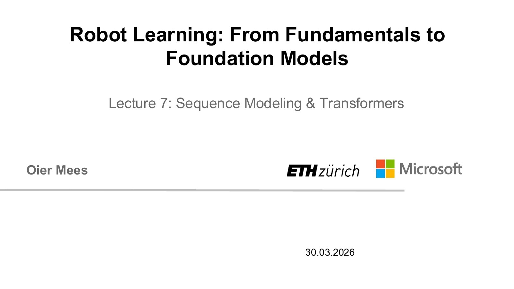

```text
Robot Learning: From Fundamentals to
Foundation Models

Lecture 7: Sequence Modeling & Transformers

Oier Mees ETHzirich §® Microsoft

30.03.2026
```

## Slide 3

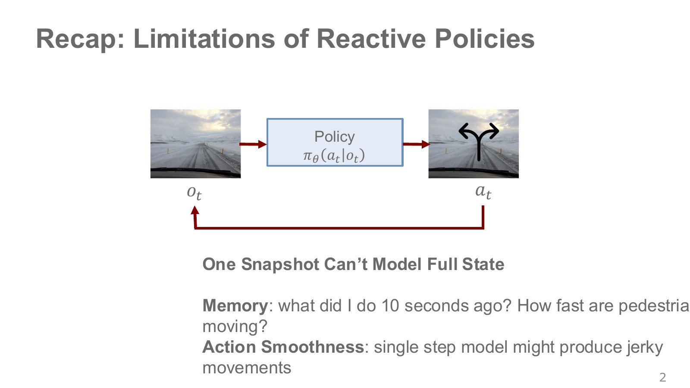

```text
Recap: Limitations of Reactive Policies

Policy
To (az 104)

at

One Snapshot Can’t Model Full State

Memory: what did | do 10 seconds ago? How fast are pedestria
moving?
Action Smoothness: single step model might produce jerky

movements 5
```

## Slide 4

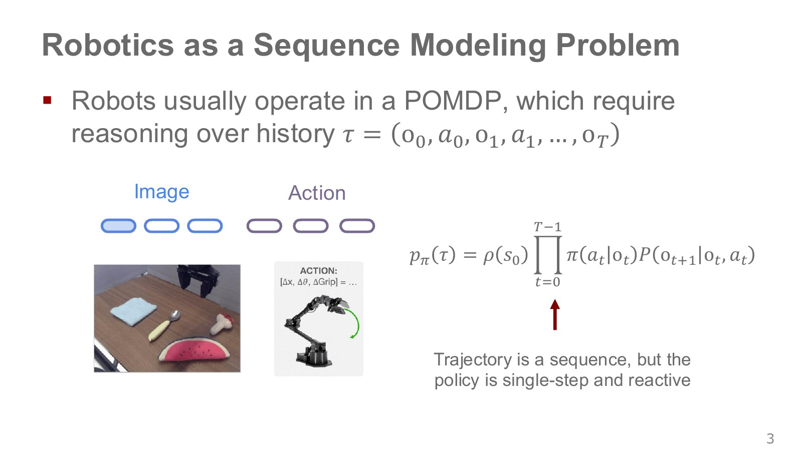

```text
Robotics as a Sequence Modeling Problem

= Robots usually operate ina POMDP, which require
reasoning over history tT = (09, Go, 01, @y, --, Or)

Image Action

COCICY) CY) CY) Cy)

ACTION:

T-1
Pr(t) = p(So) [| T(z |0¢) P(O¢41| 04, A)
[ax, 49, AGrip] =... t=0

<< Trajectory is a sequence, but the

policy is single-step and reactive
```

## Slide 5

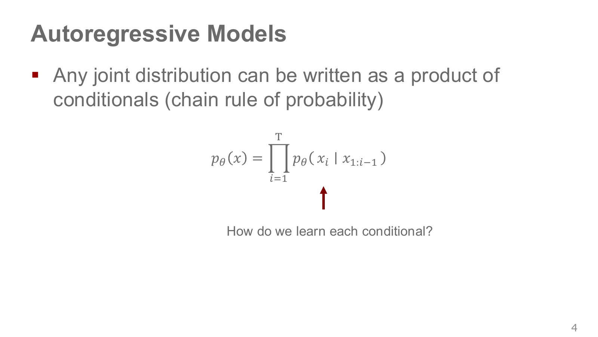

```text
Autoregressive Models

# Any joint distribution can be written as a product of
conditionals (chain rule of probability)

T
Poe(x) = Wee | X44-1)
i=i

t

How do we learn each conditional?
```

## Slide 6

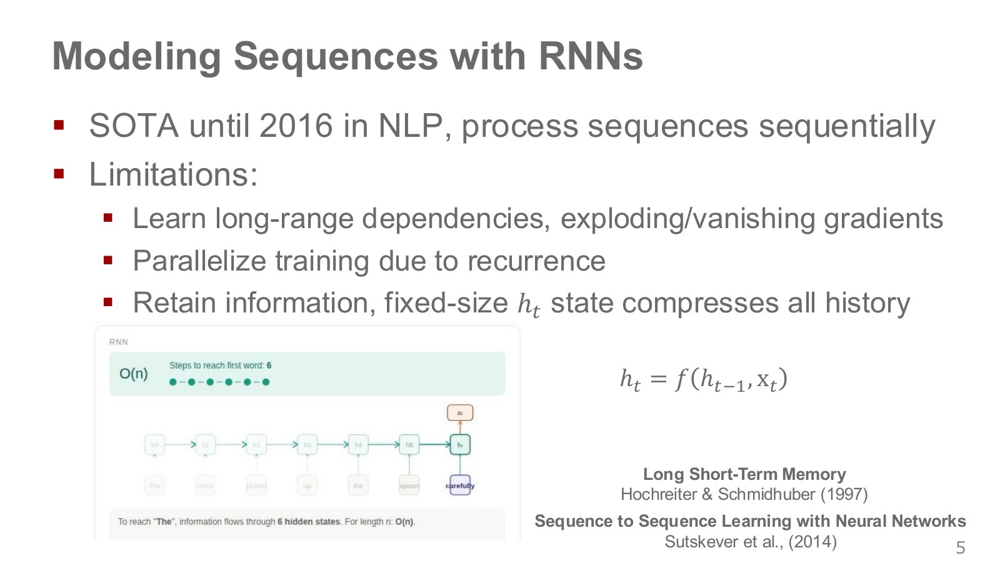

```text
Modeling Sequences with RNNs

# SOTA until 2016 in NLP, process sequences sequentially

» Limitations:
« Learn long-range dependencies, exploding/vanishing gradients
« Parallelize training due to recurrence
« Retain information, fixed-size h, state compresses all history

Steps to reach first word: 6

O(n) e-0-0-0-0-@ hy = f (re-1, Xe)

> z > : > --F} ris =
Long Short-Term Memory

5 Hochreiter & Schmidhuber (1997)

To reach “The”, information flows through 6 hidden states. For length n: O(n), Sequence to Sequence Learning with Neural Networks
Sutskever et al., (2014) 5
```

## Slide 7

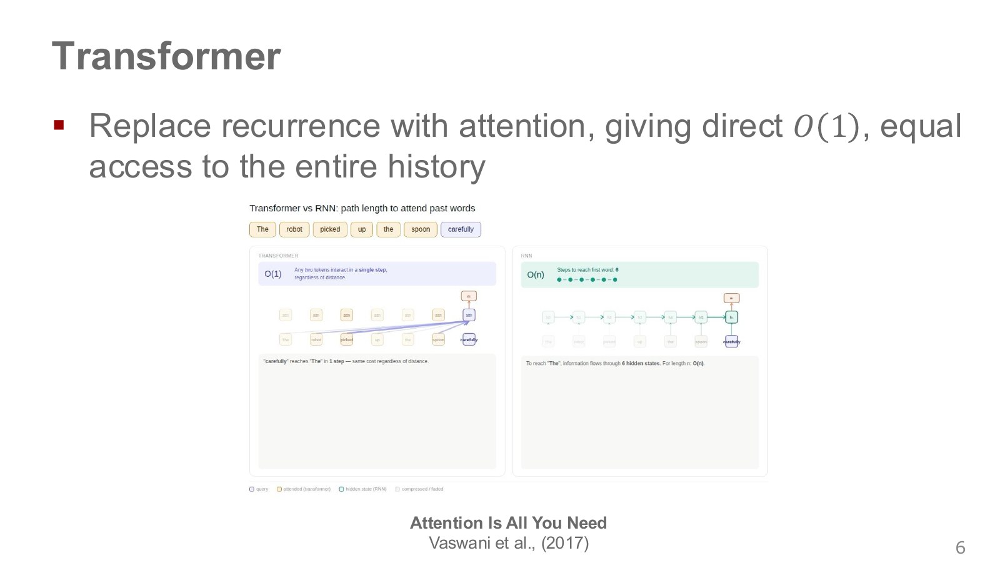

```text
Transformer

« Replace recurrence with attention, giving direct O(1), equal
access to the entire history

Transformer vs RN: path length to attend past words

(7 [5] (pe ) [ue [we ) (so (ens

Attention Is All You Need
Vaswani et al., (2017) a
```

## Slide 8

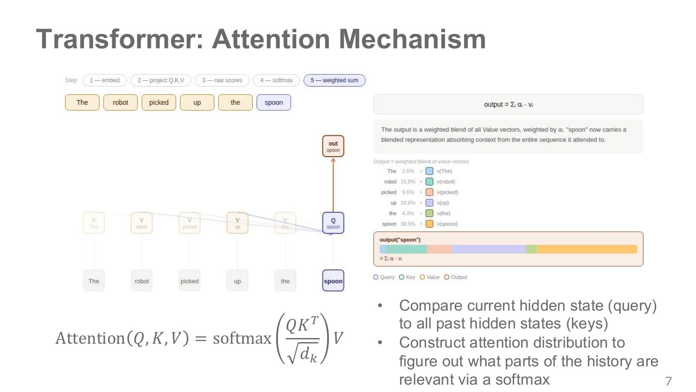

```text
Transformer: Attention Mechanism

1-embed 2-project QK.V 3-raw scores 4-softmax

Cp es SS Ge 9 =)

‘output = 25 Gi - vi

‘The output is a weighted blend of all Value vectors, weighted by ai. “spoon” now carries a

blended representation absorbing context from the entire sequence it attended to.
a
pon

The robot picked up ‘ie O Query Okey O Value O Output

* Compare current hidden state (query)
) to all past hidden states (keys)

xs

Construct attention distribution to
figure out what parts of the history are
relevant via a softmax

Attention(Q, K,V) = sts (
```

## Slide 9

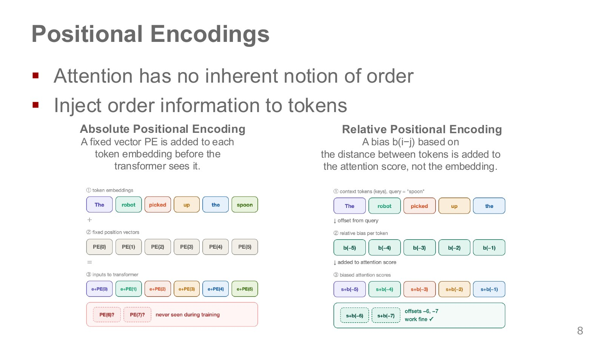

```text
Positional Encodings

» Attention has no inherent notion of order
« Inject order information to tokens

Absolute Positional Encoding
A fixed vector PE is added to each
token embedding before the
transformer sees it.

Relative Positional Encoding
A bias b(i-j) based on
the distance between tokens is added to
the attention score, not the embedding.

@ token embeddings

Soa B=

+

@ fixed position vectors

[rem }( ret ]( ree ][ ree ][ esi ]( rei |

@ inputs to transformer

(om) ) oe) Ge) Go)

| never seen during training |

context tokens (keys), query = "spoon"

(Es) = Je es

J offset from query

@ relative bias per token

Ge)

| added to attention score

@ biased attention scores

Seseseseo
```

## Slide 10

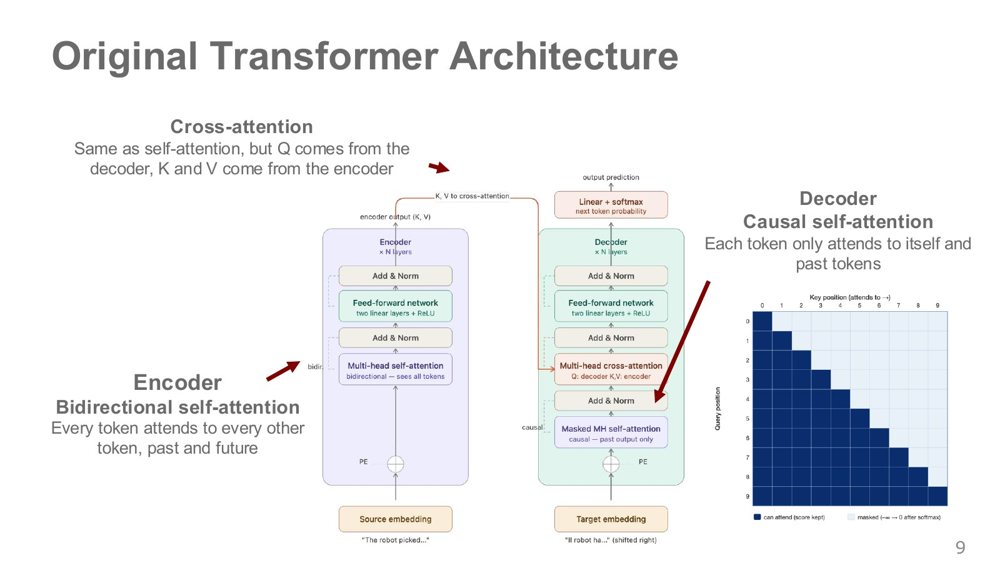

```text
Original Transformer Architecture

Cross-attention
Same as self-attention, but Q comes from the
decoder, K and V come from the encoder »>

K, V to cross-attention

encoder altput (K, V)

Encpder
x Nibyors

{ ‘Add & Norm )
--------

Feed-forward network
two linear layers + ReLU

Encoder a

Bidirectional self-attention
Every token attends to every other
token, past and future

PE

Ly

‘output prediction

( Linear + softmax

next token probability

Decpder
x Nihyers.

‘Add & Norm

t Feed-forward network
‘two linear layers + ReLU
---

‘Add & Norm
EE ee

Multi-head cross-attention
@: decoder K\V: encoder

‘Add & Norm
x
Masked MH self-attention
causal - past output only
ix

t

PE

‘Source embedding

"The robot picked..."

<----

“I robot ha..." (shifted right)

Decoder
Causal self-attention

Each token only attends to itself and

‘Query position

past tokens

Key position attends to -)
. 4 5 6 7 8 8

o 1 2

WB conatiend score kept) masked -00- 0 ater sotimax)
```

## Slide 11

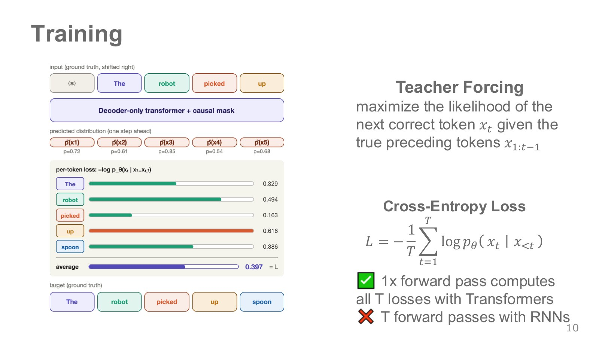

```text
Training

input (ground truth, shifted right)

L © Jive lL Jee Je) Teacher Forcing
| Decoder-only transformer + causal mask J maximize the likelihood of the
predicted distribution (one step ahead) next correct token Xt given the
5) 621) C8) a) true preceding tokens x .+_4
p=0.72 p=0.61 p=0.85 p=0.54 p=0.68 a

per-token loss: -log p_O(%: | X1..X+1)

: 0.329

0.494

ose ress Entepy Loss

Cw» } 0.616 1

(20 | 0.386 L=-2) logpo(xr| ee)

average es C397 = t=1
target Ground truth 1x forward pass computes
[Tre ( robot |{ picked \f - IE spoon | all T losses with Transformers

% T forward passes with RNNs |
```

## Slide 12

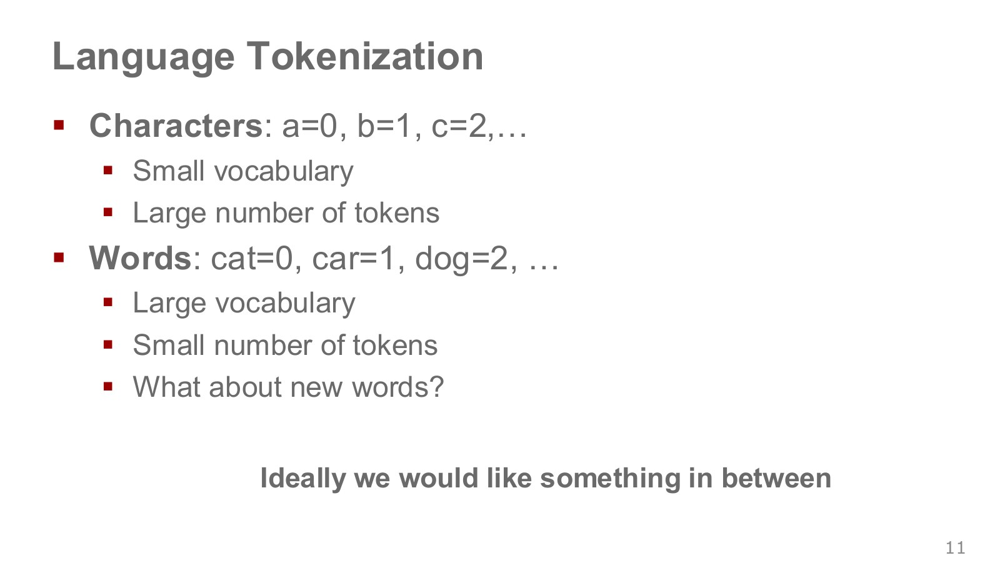

```text
Language Tokenization

= Characters: a=0, b=1, c=2....
# Small vocabulary
» Large number of tokens
" Words: cat=0, car=1, dog=2, ...
» Large vocabulary
# Small number of tokens
«» What about new words?

Ideally we would like something in between

11
```

## Slide 13

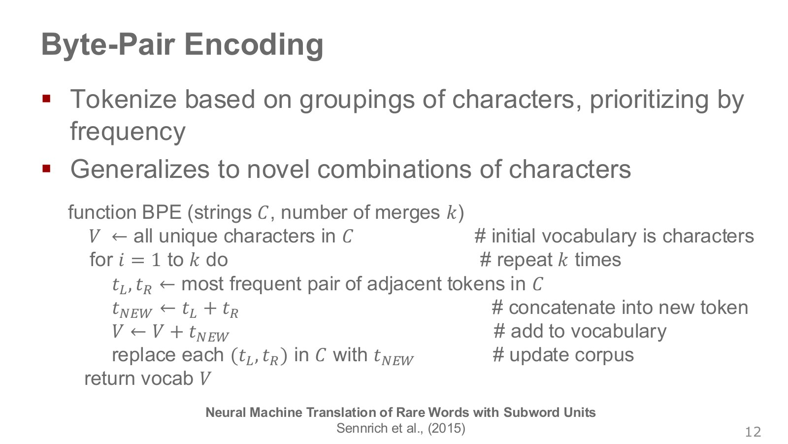

```text
Byte-Pair Encoding

= Tokenize based on groupings of characters, prioritizing by
frequency

= Generalizes to novel combinations of characters

function BPE (strings C, number of merges k)

V <all unique characters in C # initial vocabulary is characters
fori=1tokdo # repeat k times
t,, tp <- most frequent pair of adjacent tokens in C
tvew -t, +tp # concatenate into new token
V<-V+tnew # add to vocabulary
replace each (t,, tp) in C with tygw # update corpus

return vocab V

Neural Machine Translation of Rare Words with Subword Units
Sennrich et al., (2015) 12
```

## Slide 14

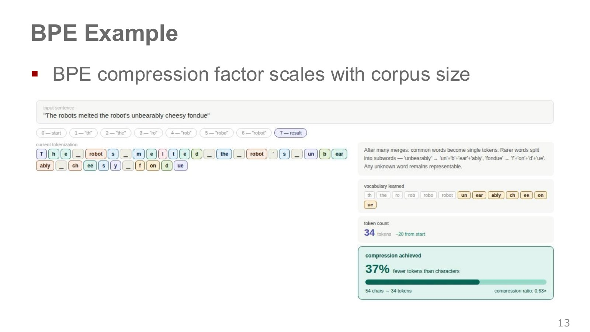

```text
BPE Example

= BPE compression factor scales with corpus size

"The robots melted the robot's unbearably cheesy fondue”
o-stat ) ( 1-"w 2-"the 3-"t0 4-"rob 5 - "robo 6-“robot” ) (7 -result

DHGCSQSOSO8OOCMO=00088™ 22.
(ay) lJ Olle) Any unknown word remains representable

vocabulary learned

(ve)

token count
34 tokens -20 from start

compression achieved
37% tower tokens than characters

SSS
54 chars - 34 tokens ‘compression ratio: 0.63

13
```

## Slide 15

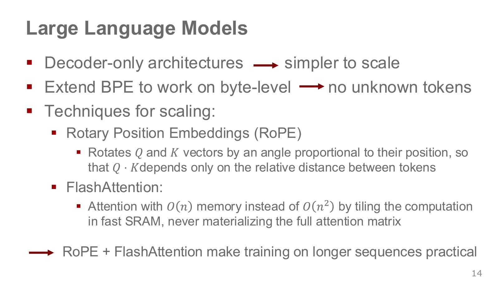

```text
Large Language Models

= Decoder-only architectures -+ simpler to scale
» Extend BPE to work on byte-level -* no unknown tokens

" Techniques for scaling:

» Rotary Position Embeddings (RoPE)

= Rotates Q and K vectors by an angle proportional to their position, so
that Q - Kdepends only on the relative distance between tokens

=" FlashAttention:

* Attention with O(n) memory instead of O(n) by tiling the computation
in fast SRAM, never materializing the full attention matrix

--» RoPE + FlashAttention make training on longer sequences practical
14
```

## Slide 16

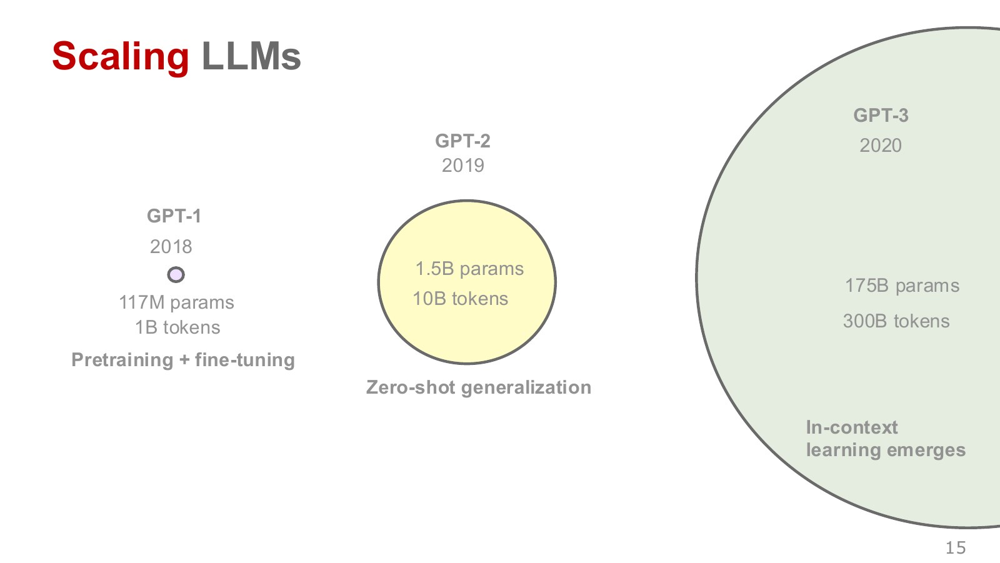

```text
Scaling LLMs

GPT-1
2018

fe)

117M params
1B tokens

Pretraining + fine-tuning

GPT-2
2019

1.5B params

175B params
300B tokens

10B tokens

Zero-shot generalization

In-context
learning emerges

15
```

## Slide 17

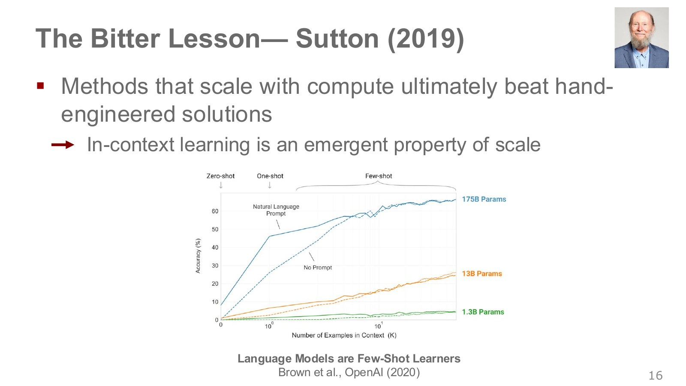

```text
The Bitter Lesson- Sutton (2019) pe

» Methods that scale with compute ultimately beat hand-
engineered solutions
- In-context learning is an emergent property of scale

Zero-shot One-shot Few-shot

175B Params

Natural Language
60 Prompt

50

40

Accuracy (%)

30
= 13B Params

1.3B Params

0 10° 10°
Number of Examples in Context (K)

Language Models are Few-Shot Learners
Brown et al., OpenAl (2020) 6
```

## Slide 18

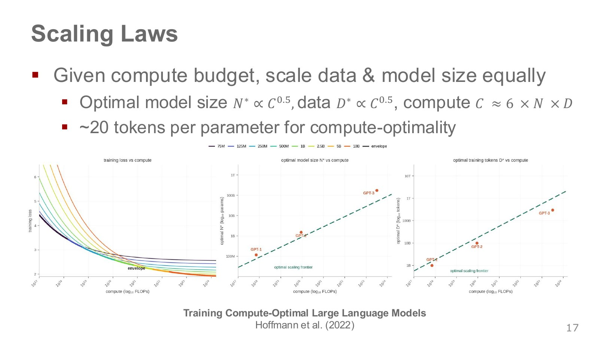

```text
Scaling Laws

=" Given compute budget, scale data & model size equally
« Optimal model size n* « c°5,data D* « c°>, compute C ~6 x N xD
« ~20 tokens per parameter for compute-optimality

- 7M - 25M - 20M - Soom - 1B - 258 - 58 - 1B - envelope

training loss vs compute optimal model size N* vs compute optimal training tokens D* vs compute

.
ers® ef
2 ae 2
z ie
g ae g 2
Es 2s 3 oP ae
3 x we 3 27 ora
8 a E 100 tt
& hae = 2
2 cae cI ar
= ote i we
eS ee Bo oe
27 ott
orn ~o P oP?
Be we
- ae
= ‘optimal sais ling frontier 1B L oe ==
s s s es # # cs s s s cS cS $ 2
compute (og:e FLOPS) compute (log:e FLOPS) compute (og:e FLOPS)

Training Compute-Optimal Large Language Models
Hoffmann et al. (2022) 17
```

## Slide 19

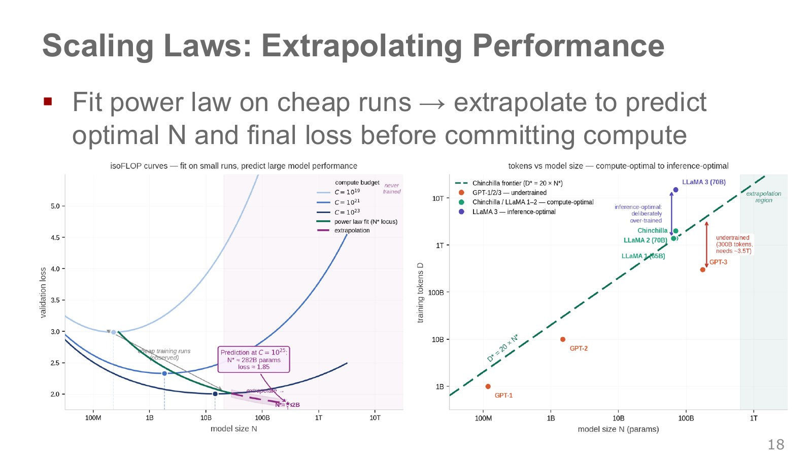

```text
Scaling Laws: Extrapolating Performance

= Fit power law on cheap runs - extrapolate to predict
optimal N and final loss before committing compute

isoFLOP curves - fit on small runs, predict large model performance tokens vs model size - compute-optimal to inference-optimal
ii compute budget ojo, == Chinchilla frontier (D* = 20 x N‘) LLaMA 3 (70B) a
- cei -taned _ @ GPT-1/2/3-undertained ° ‘extrapolation
50+ - c=102 10T = @ Chinchilla / LLaMA 1-2 -compute-optimal hccncemmans 7 ‘region
- c=107 @ LLaMa3- inference-optimal deliberately 7
- power law it (v* locus) covertrained
- extrapolation Chinchilla Jo, 7
4s- ‘o undertrained
"4 aT eee (2008 tokens,
/ ua gat) tae
g 40- o a e
3 5 a
A g
2 © 1008 ~ 7 Z
© 35- of 2
Zz = ve
ra =
§ oe gS Ea
30 IPSecless, i
. 108 - Sy, “
Prediction at C= 10%: wy wut
Nt = 2828 params y
loss = 1.85
a
B47
ero 7 ma
R428
100M 18 108 1008 wv 10T 100M 1B 108 1008 7
model size N model size N (params)

18
```

## Slide 20


```text
How can we extend LLMs & Transformers to Vision?

19
```

## Slide 21

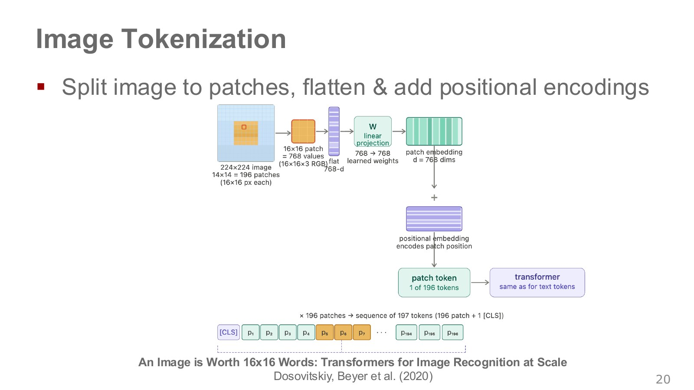

```text
Image Tokenization

= Split image to patches, flatten & add positional encodings

I 16x16 patch

E BD = 768 values ot learned weights
224x224 image (16*16x3 RGB} 2

14x14 = 196 patches
(16x16 px each)

768 > 768 patch embedding
d= 76B dims

positional embedding
encodes patch position

transformer

patch token
same as for text tokens

1 of 196 tokens

x 196 patches > sequence of 197 tokens (196 patch + 1 [CLS])

An Image is Worth 16x16 Words: Transformers for Image Recognition at Scale
Dosovitskiy, Beyer et al. (2020) 20
```

## Slide 22

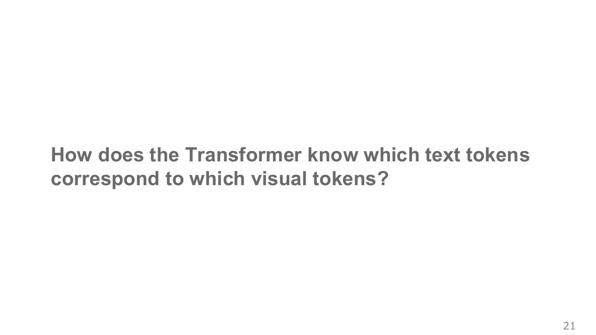

```text
How does the Transformer know which text tokens
correspond to which visual tokens?

21
```

## Slide 23

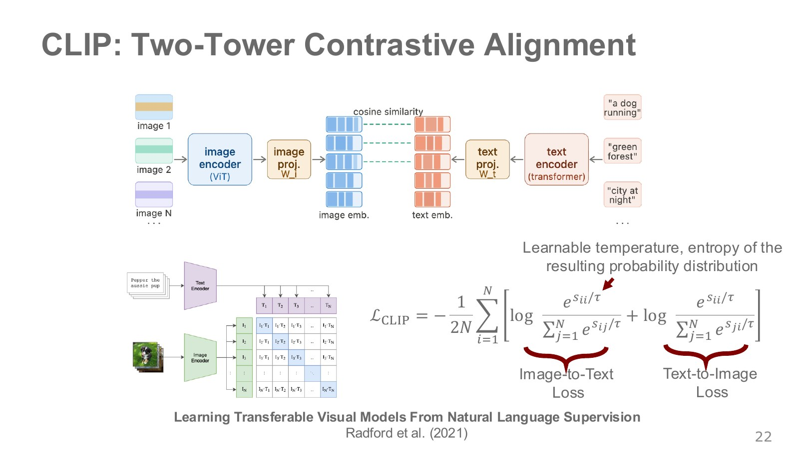

```text
CLIP: Two-Tower Contrastive Alignment

Ce "a dog
cosine similarit running"
- image i - | - text "green
i< l<-| <- forest"
image 2 encoder encoder
(ViT) fn) (transformer)
I ] "city at
- i ane
image N

image emb. text emb.

Learnable temperature, entropy of the

resulting probability distribution
4
esii/T eSii/T
lo + lo
g§ Wy esis/T 8 a, esii/t
ImageMo-Text Textvunnage
Loss Loss

Learning Transferable Visual Models From Natural Language Supervision

Radford et al. (2021) 22
```

## Slide 24

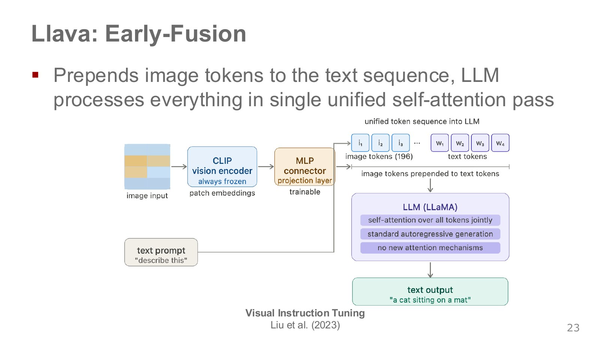

```text
Llava: Early-Fusion

» Prepends image tokens to the text sequence, LLM
processes everything in single unified self-attention pass

unified token sequence into LLM

CLIP MLP image tokens (196) text tokens
-> Rael d g ->+ 1
vision encoder connec! or image tokens prepended to text tokens
al always frozen rojection layer
image input patch embeddings trainable
text prompt

"describe this" J

text output
"a cat sitting on a mat"

Visual Instruction Tuning
Liu et al. (2023)
```

## Slide 25

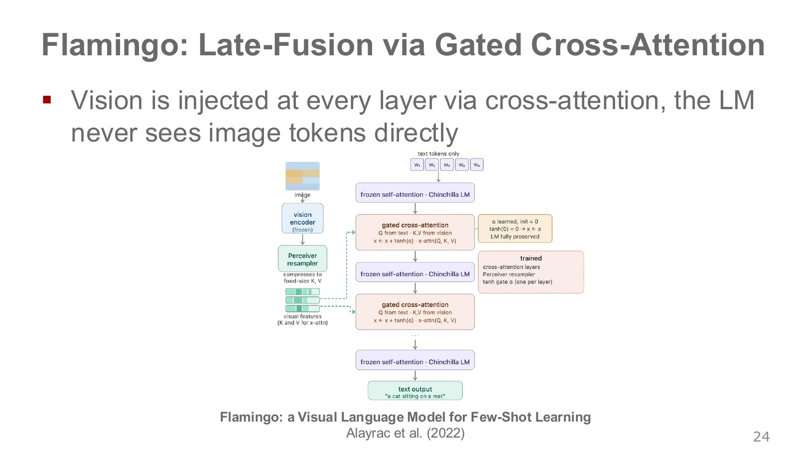

```text
Flamingo: Late-Fusion via Gated Cross-Attention

« Vision is injected at every layer via cross-attention, the LM

never sees image tokens directly

nga [ frozen self-attention - Chinchilla LM |

text output )
\___tacat sitting ona mat"__)

Flamingo: a Visual Language Model for Few-Shot Learning
Alayrac et al. (2022)

24
```

## Slide 26

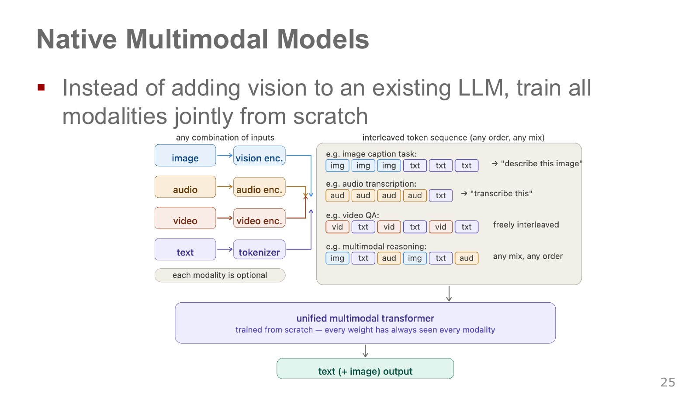

```text
Native Multimodal Models

= Instead of adding vision to an existing LLM, train all
modalities jointly from scratch

any combination of inputs

eee

tokenizer

each modality is optional

interleaved token sequence (any order, any mix)

e.g. image caption task:
{img |[img ][img |{ txt [txt ][ txt ] > "describe this image"

e.g. audio transcription:

> "transcribe this"

e.g. video QA:
(via )(xt_}(vid }( txt) via ](txt_] freely interleaved

e.g. multimodal reasoning:
{img }{ txt }{ aud }[ img }{ txt ]{ aud} any mix, any order

J

unified multimodal transformer
trained from scratch - every weight has always seen every modality

J

text (+ image) output }

25
```

## Slide 27

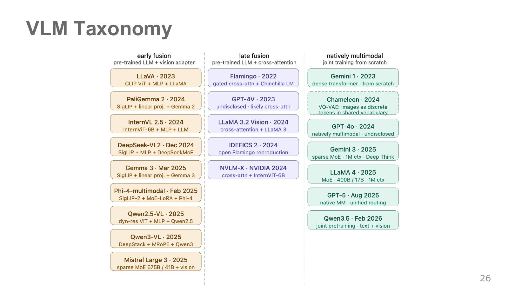

```text
VLM Taxonomy

early fusion
pre-trained LLM + vision adapter

late fusion
pre-trained LLM + cross-attention

natively multimodal
joint training from scratch

LLaVA - 2023
CLIP ViT + MLP + LLaMA

gated cross-attn + Chinchilla LM

Gemini 1 - 2023
dense transformer - from scratch

PaliGemma 2 - 2024
SigLIP + linear proj. + Gemma 2

(

GPT-4V - 2023

Flamingo - 2022 ]

undisclosed - likely cross-attn

InternVL 2.5 - 2024
InternViT-6B + MLP + LLM

LLaMA 3.2 Vision - 2024

cross-attention + LLaMA 3 J

Chameleon - 2024
VQ-VAE: images as discrete
kens in shared vocabulary-

GPT-4o - 2024

DeepSeek-VL2 - Dec 2024
SigLIP + MLP + DeepSeekMoE

IDEFICS 2 - 2024

open Flamingo reproduction _)

natively multimodal - undisclosed

Gemini 3 - 2025
sparse MoE - 1M ctx - Deep Think

Gemma 3 - Mar 2025
SigLIP + linear proj. + Gemma 3

NVLM-X - NVIDIA 2024
cross-attn + InternViT-6B

J

Ls
Phi-4-multimodal - Feb 2025
SigLIP-2 + MoE-LoRA + Phi-4

Qwen2.5-VL - 2025

dyt s VIT + MLP + Qwen2.5

Qwen3-VL - 2025
DeepStack + MRoPE + Qwen3
es
Mistral Large 3 - 2025
sparse MoE 675B / 41B + vision

LLaMA 4 - 2025
MoE - 400B / 17B - 1M ctx

GPT-5 - Aug 2025
native MM - unified routing

Qwen3.5 - Feb 2026
joint pretraining - text + vision

26
```

## Slide 28

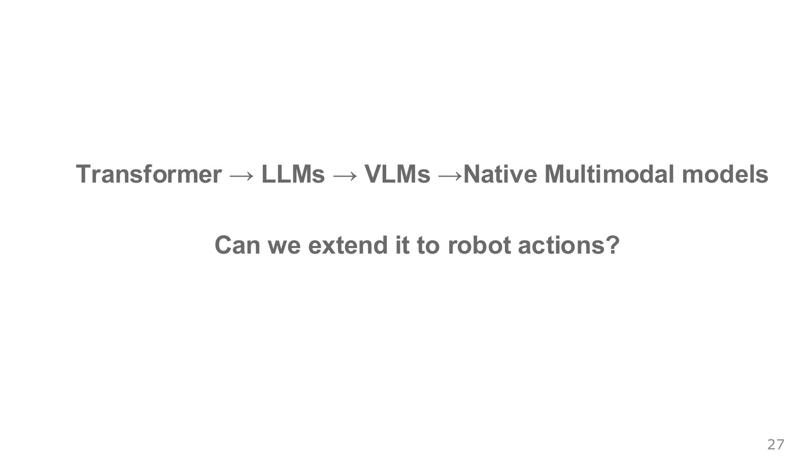

```text
Transformer - LLMs - VLMs -Native Multimodal models

Can we extend it to robot actions?

27
```

## Slide 29

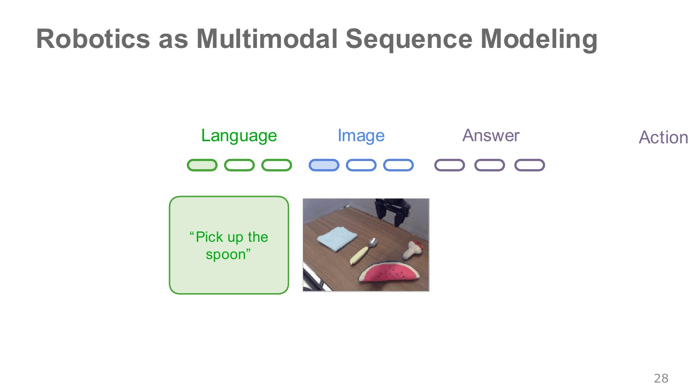

```text
Robotics as Multimodal Sequence Modeling

Language Image Answer Action

Cpe CIC) GecaoCcy) CJ) CC) Cy)

“Pick up the

spoon”

28
```

## Slide 30

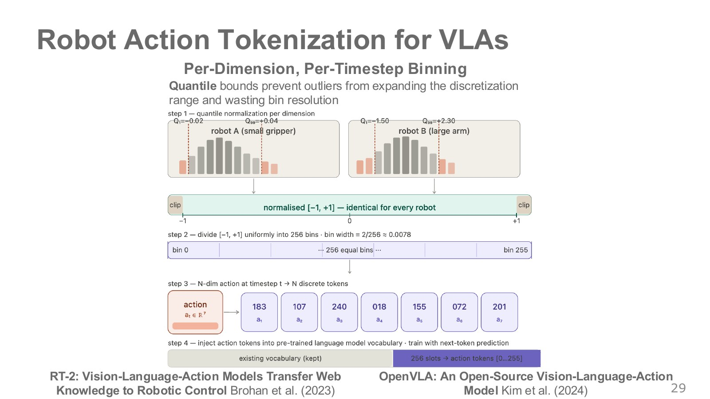

```text
Robot Action Tokenization for VLAs

Per-Dimension, Per-Timestep Binning
Quantile bounds prevent outliers from expanding the discretization

range and wasting bin resolution

step 1 quantile normalization per dimension
a= Qoo=+0.04 Qi=H1:50 Qos=42:30

robot A (smal gripper) robot B (large arm)

ip normalised [-1, +1] - identical for every robot cin
“1 0 +1

step 2 - divide [-1, +1] uniformly into 256 bins - bin width = 2/256 = 0.0078

| bino | + 256 equal bins -- bin 286]

|

step 3 - N-dim action at timestep t > N discrete tokens

action 183 107 240 018 155 072 201
are R”
a az as aa as as a
SS

step 4 - inject action tokens into pre-trained language model vocabulary - train with next-token prediction

RT-2: Vision-Language-Action Models Transfer Web OpenVLA: An Open-Source Vision-Language-Action
Knowledge to Robotic Control Brohan et al. (2023) Model Kim et al. (2024) 29
```

## Slide 31

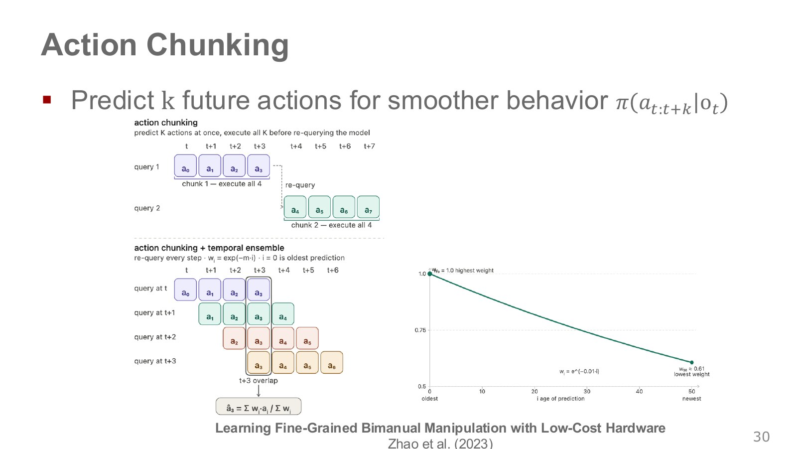

```text
Action Chunking

= Predict k future actions for smoother behavior z(a,.,,;|0,)

action chunking
predict K actions at once, execute all K before re-querying the model

t tT t+2 tH t4 5 67
sven

chunk 1- execute all 4 re-query

weg? JIL)

chunk 2 - execute all 4

action chunking + temporal ensemble
re-query every step - w, = exp(-m-i) - i = 0 is oldest prediction

t tel t+2 +3 ted tH tH
ae
sens (JL

10 gif = 10 highest weight

078
query at t+2
query at t+3
= eX(-0014) Wee = 0.61
és * ws e001) lowest weight
+3 overlal
2 os
° 0 20 30 40 50
oldest i age of prediction newest

Ewya,/Zw,

Learning Fine-Grained Bimanual Manipulation with Low-Cost Hardware

Zhao et al. (2023) 30
```

## Slide 32

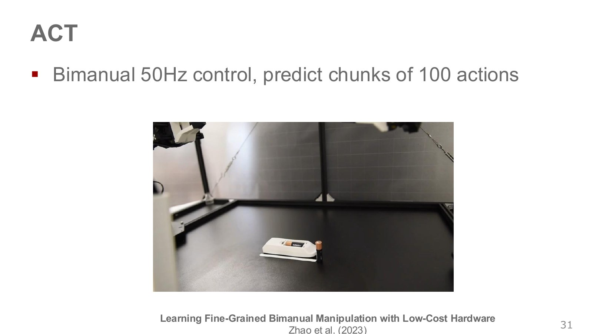

```text
ACT

# Bimanual 50Hz control, predict chunks of 100 actions

Learning Fine-Grained Bimanual Manipulation with Low-Cost Hardware
Zhao et al. (2023)

31
```

## Slide 33

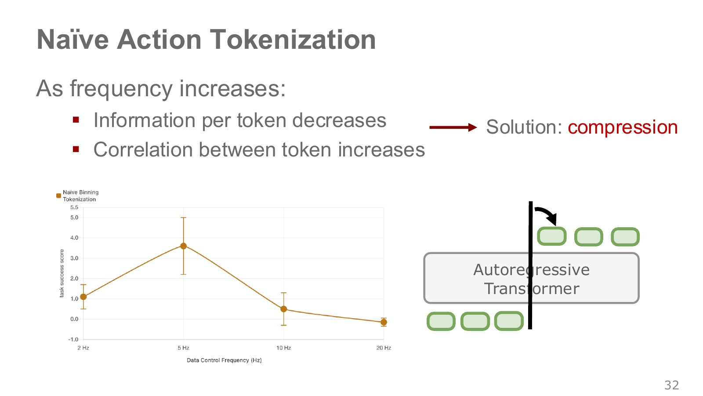

```text
Naive Action Tokenization

As frequency increases:

= Information per token decreases = ___, Solution: compression
= Correlation between token increases

i. Autoregressive
i Transformer

2He 5 Hz 10H 20 Hz

Data Control Frequency (Hz)

32
```

## Slide 34

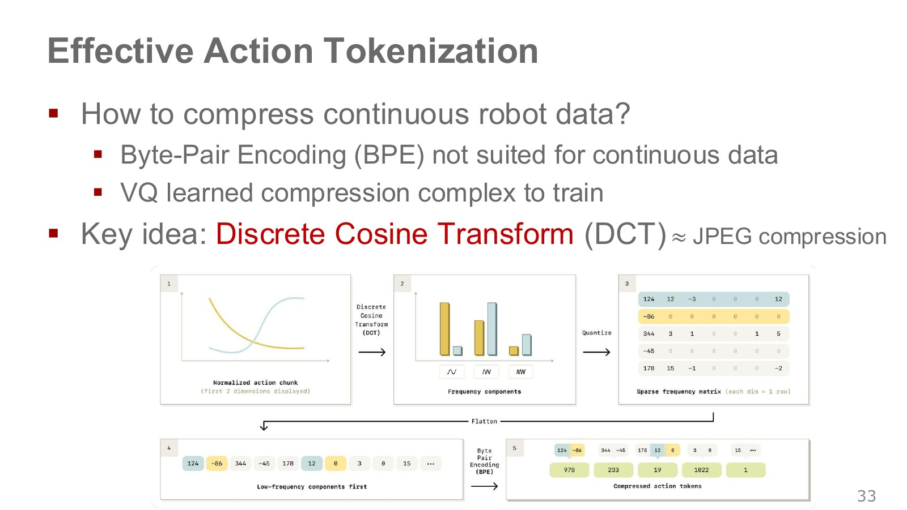

```text
Effective Action Tokenization

= How to compress continuous robot data?
« Byte-Pair Encoding (BPE) not suited for continuous data
= VQ learned compression complex to train

« Key idea: Discrete Cosine Transform (DCT) ~ JPEG compression

:
_
cate ee
-¥ @ all _ 45
aanfequ in
L nat |
yt ne s
ee BBM |x a
Low-frequency components first -_ 33
```

## Slide 35

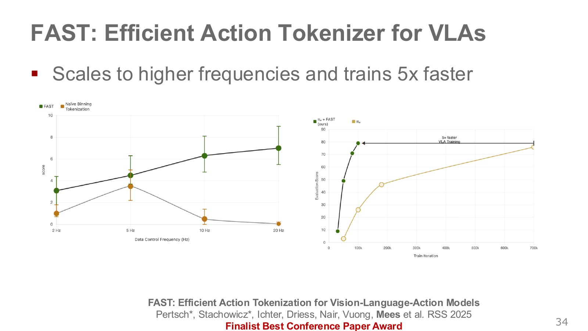

```text
FAST: Efficient Action Tokenizer for VLAs

= Scales to higher frequencies and trains 5x faster

Naive Binning
FAST Tokenization

10

He She toe 20 He

Data Control Frequency (Hz)

FAST: Efficient Action Tokenization for Vision-Language-Action Models
Pertsch*, Stachowicz*, Ichter, Driess, Nair, Vuong, Mees et al. RSS 2025

Finalist Best Conference Paper Award 34
```

## Slide 36

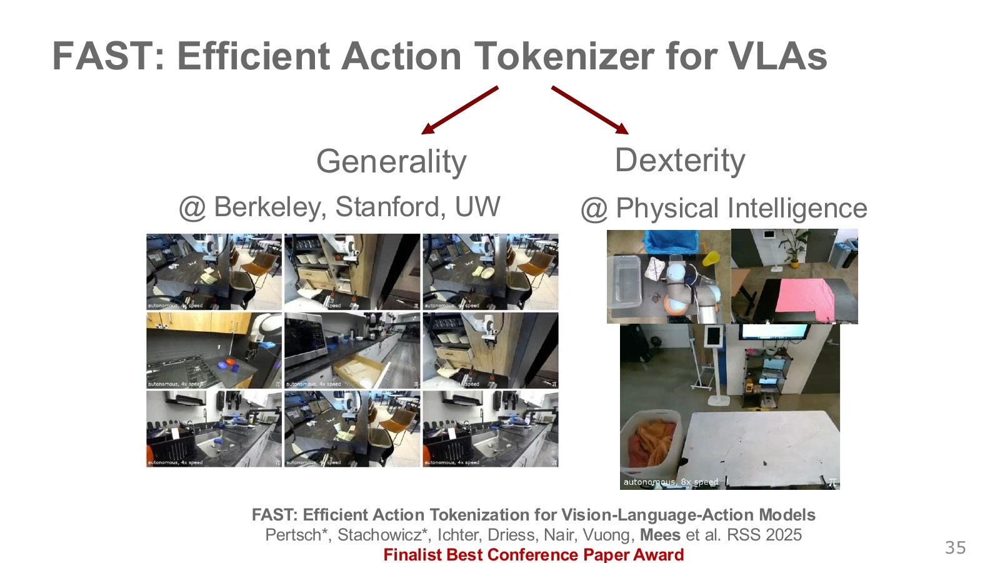

```text
FAST: Efficient Action Tokenizer for VLAs

gy

Generality Dexterity
@ Berkeley, Stanford, UW @ Physical Intelligence
G 0) ie =

FAST: Efficient Action Tokenization for Vision-Language-Action Models
Pertsch*, Stachowicz*, Ichter, Driess, Nair, Vuong, Mees et al. RSS 2025

Finalist Best Conference Paper Award 35
```

## Slide 37

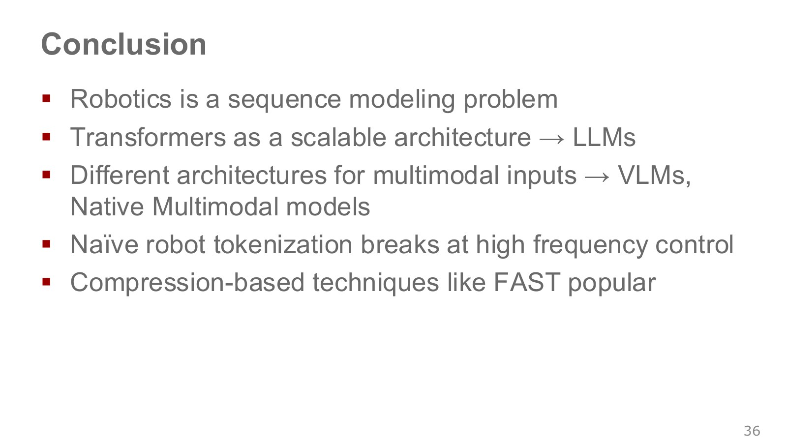

```text
Conclusion

" Robotics is a sequence modeling problem
= Transformers as a scalable architecture - LLMs

« Different architectures for multimodal inputs > VLMs,
Native Multimodal models

« Naive robot tokenization breaks at high frequency control
= Compression-based techniques like FAST popular

36
```

## Slide 38


```text
Thank you for your attention
```

## Slide 39

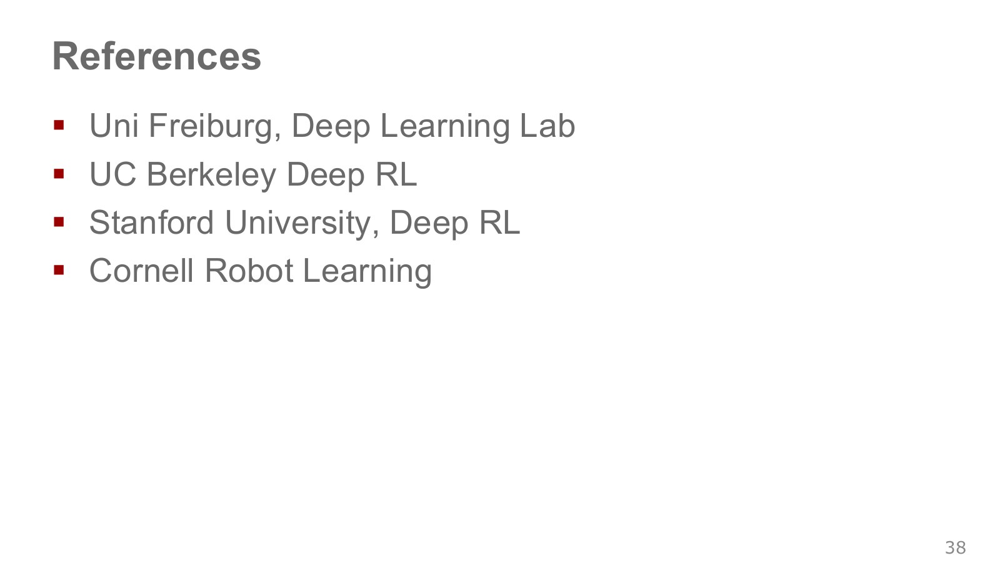

```text
References

# Uni Freiburg, Deep Learning Lab
«" UC Berkeley Deep RL

« Stanford University, Deep RL

« Cornell Robot Learning

38
```

---

[← Course home](../README.md) · [Open optional slide gallery →](../curriculum/week-07-sequence-modeling.md)
