# Week 08 - World Models: OCR transcript

[← Course home](../README.md) · **Default OCR view** · [Open optional slide gallery →](../curriculum/week-08-world-models.md)

> This is an automated OCR transcript generated from the locally rendered slide images. Use the image as the source of truth for equations, diagrams, citations, and small text.

## Slide 1


```text
Robot Learning: From Fundamentals to
Foundation Models

Lecture 8: World Models

Oier Mees ETHzirich §® Microsoft

13.04.2026
```

## Slide 2

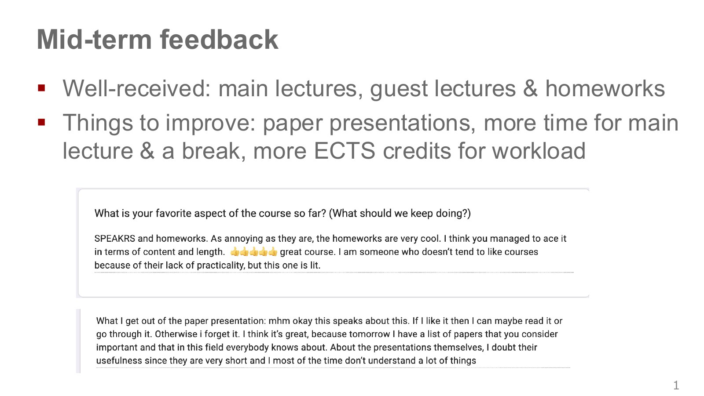

```text
Mid-term feedback

» Well-received: main lectures, guest lectures & homeworks

= Things to improve: paper presentations, more time for main
lecture & a break, more ECTS credits for workload

What is your favorite aspect of the course so far? (What should we keep doing?)

SPEAKRS and homeworks. As annoying as they are, the homeworks are very cool. | think you managed to ace it

in terms of content and length. che ce el ce great course. | am someone who doesn't tend to like courses
because of their lack of practicality, but this one is lit.

What | get out of the paper presentation: mhm okay this speaks about this. If | like it then | can maybe read it or
go through it. Otherwise i forget it. | think it’s great, because tomorrow | have a list of papers that you consider
important and that in this field everybody knows about. About the presentations themselves, | doubt their
usefulness since they are very short and | most of the time don't understand a lot of things
```

## Slide 3


```text
Changes

= We will move one additional paper presentation from
Monday’s to Thursdays
= More time for main lecture & a break
```

## Slide 4

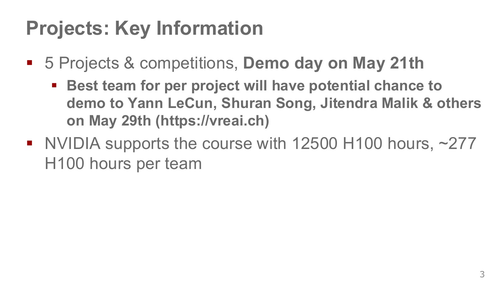

```text
Projects: Key Information

« 5 Projects & competitions, Demo day on May 21th

« Best team for per project will have potential chance to
demo to Yann LeCun, Shuran Song, Jitendra Malik & others
on May 29th (https://vreai.ch)

# NVIDIA supports the course with 12500 H100 hours, ~277
H100 hours per team
```

## Slide 5

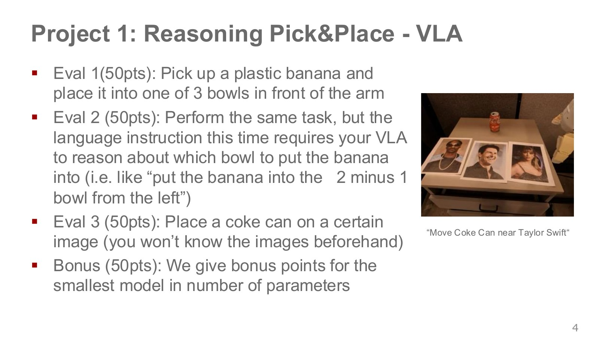

```text
Project 1: Reasoning Pick&Place - VLA

« Eval 1(50pts): Pick up a plastic banana and
place it into one of 3 bowls in front of the arm

« Eval 2 (50pts): Perform the same task, but the
language instruction this time requires your VLA
to reason about which bowl to put the banana
into (i.e. like “put the banana into the 2 minus 1
bowl from the left”)

" Eval 3 (50pts): Place a coke can on a certain
image (you won’t know the images beforehand)

« Bonus (50pts): We give bonus points for the
smallest model in number of parameters

“Move Coke Can near Taylor Swift*
```

## Slide 6

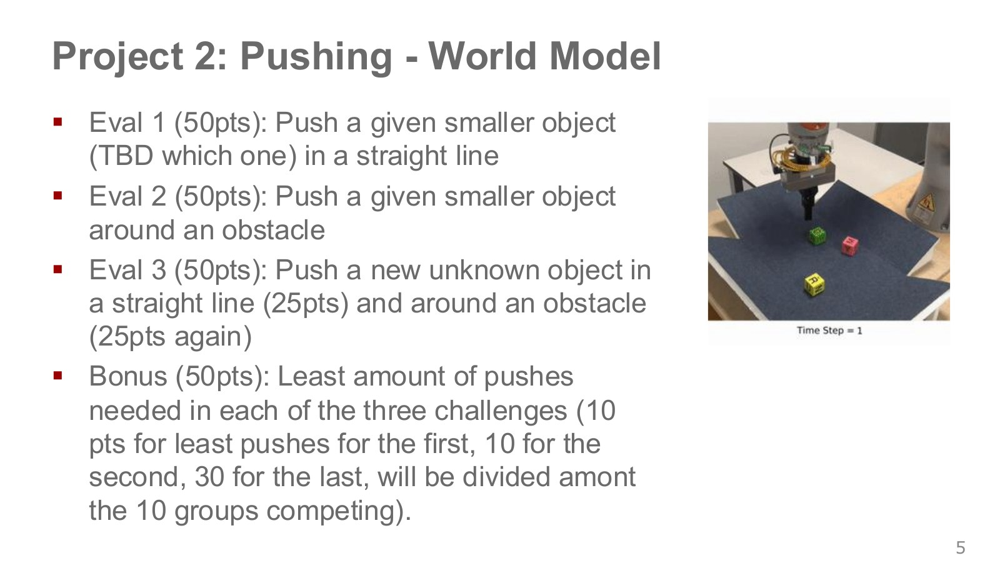

```text
Project 2: Pushing - World Model

Eval 1 (50pts): Push a given smaller object
(TBD which one) in a straight line

Eval 2 (50pts): Push a given smaller object
around an obstacle

Eval 3 (50pts): Push a new unknown object in
a straight line (25pts) and around an obstacle
(25pts again)

Bonus (50pts): Least amount of pushes
needed in each of the three challenges (10
pts for least pushes for the first, 10 for the
second, 30 for the last, will be divided amont
the 10 groups competing).

Time Step = 1
```

## Slide 7

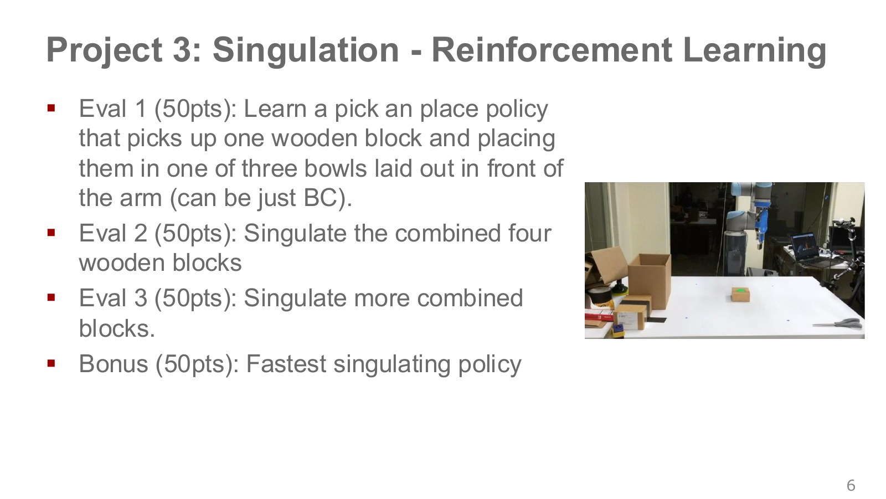

```text
Project 3: Singulation - Reinforcement Learning

« Eval 1 (50pts): Learn a pick an place policy
that picks up one wooden block and placing
them in one of three bowls laid out in front of
the arm (can be just BC).

« Eval 2 (50pts): Singulate the combined four
wooden blocks

" Eval 3 (50pts): Singulate more combined
blocks.

« Bonus (50pts): Fastest singulating policy
```

## Slide 8

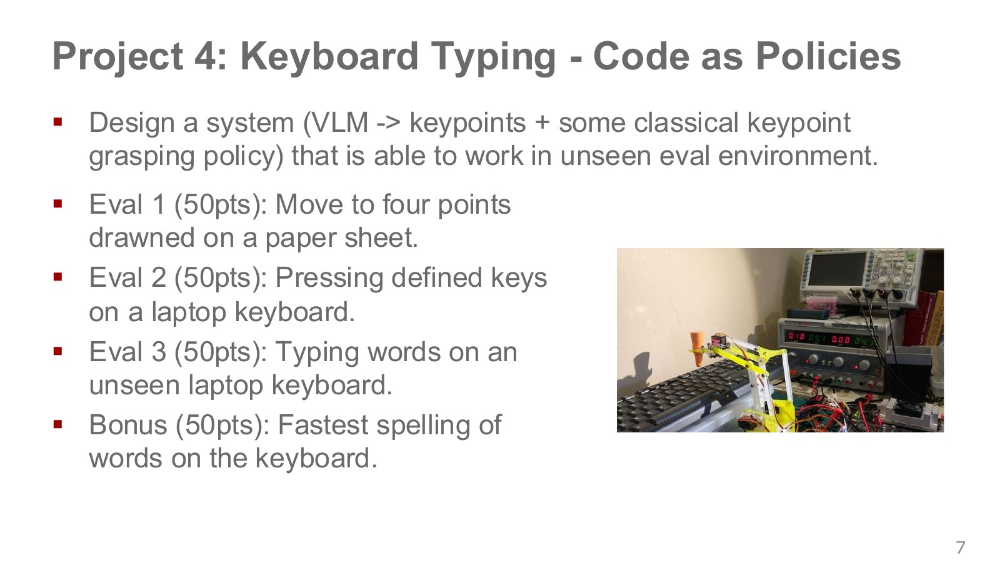

```text
Project 4: Keyboard Typing - Code as Policies

« Design a system (VLM -> keypoints + some classical keypoint
grasping policy) that is able to work in unseen eval environment.

" Eval 1 (50pts): Move to four points
drawned on a paper sheet.

« Eval 2 (50pts): Pressing defined keys
on a laptop keyboard.

" Eval 3 (50pts): Typing words on an
unseen laptop keyboard.

" Bonus (50pts): Fastest spelling of
words on the keyboard.
```

## Slide 9

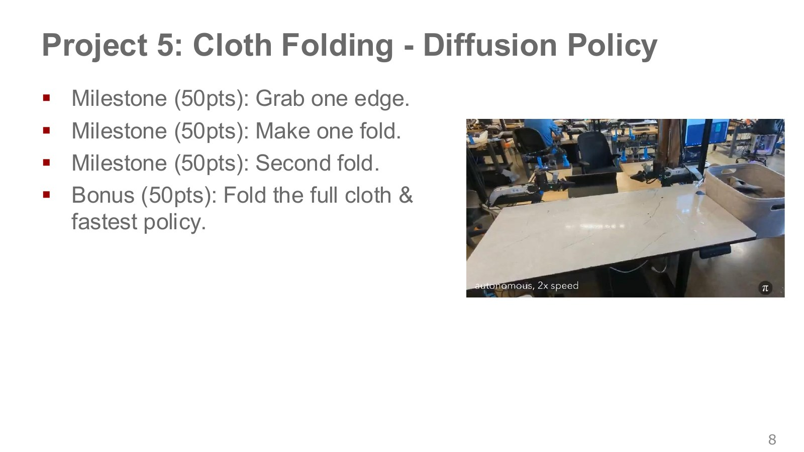

```text
Project 5: Cloth Folding - Diffusion Policy

« Milestone (50pts): Grab one edge.
« Milestone (50pts): Make one fold.
« Milestone (50pts): Second fold.

« Bonus (50pts): Fold the full cloth &
fastest policy.
```

## Slide 10

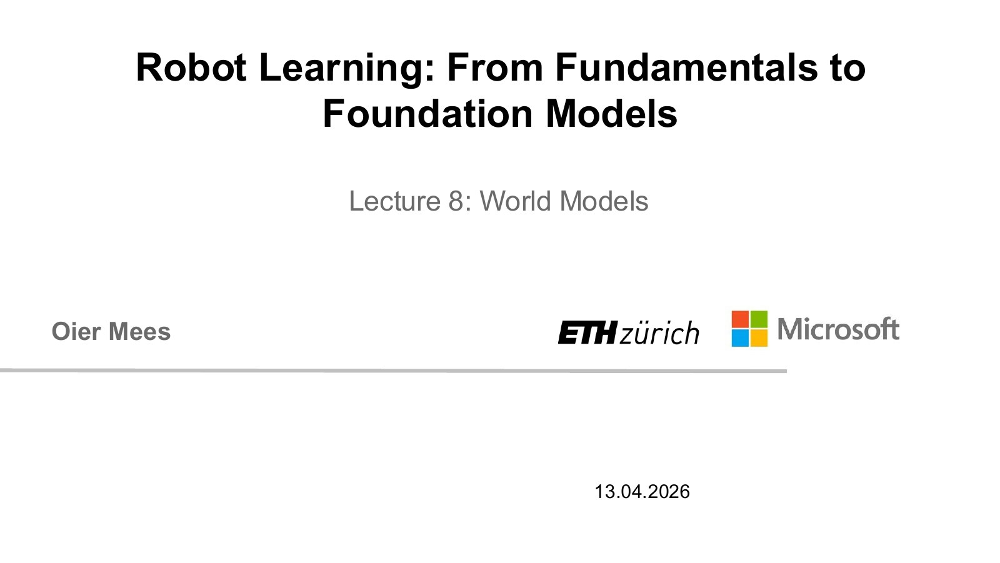

```text
Robot Learning: From Fundamentals to
Foundation Models

Lecture 8: World Models

Oier Mees ETHzirich §® Microsoft

13.04.2026
```

## Slide 11

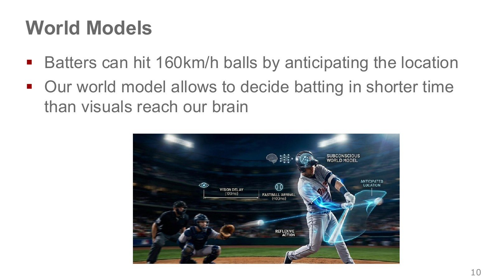

```text
World Models

» Batters can hit 160km/h balls by anticipating the location

=" Our world model allows to decide batting in shorter time
than visuals reach our brain

‘SUBCONSCIOUS
WORLD MODEL

10
```

## Slide 12

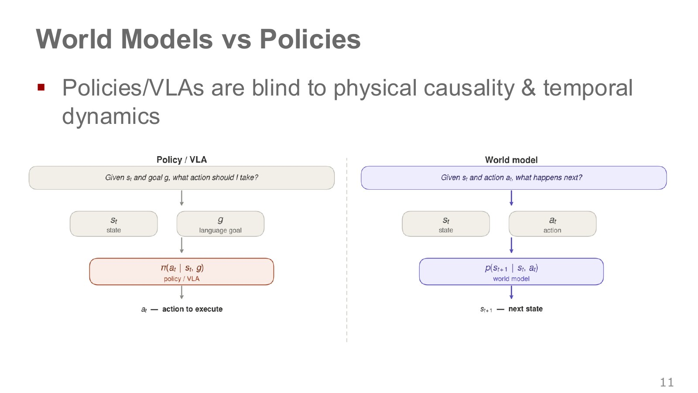

```text
World Models vs Policies

" Policies/VLAs are blind to physical causality & temporal
dynamics

Policy / VLA World model

Given s; and goal g, what action should | take? | ( Given s; and action a, what happens next? )
| St g { St ) at
state ) iN language goal ) \ state e action
ma | St 9) p(Sta1 | St ar)
policy / VLA world model
a - action to execute St+1 - Next state

11
```

## Slide 13

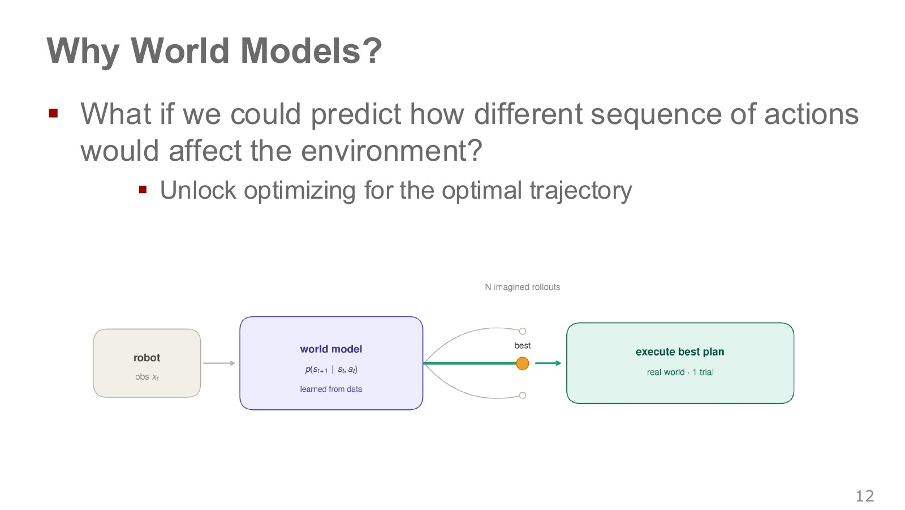

```text
Why World Models?

= What if we could predict how different sequence of actions
would affect the environment?
= Unlock optimizing for the optimal trajectory

N imagined rollouts

i eN a)
moaiaimodel “a aoe execute best plan
robot
(Sto 1 | St at =
obs x; Pls | eee) \ real world - 1 trial
\ ) learned from data NN .

12,
```

## Slide 14

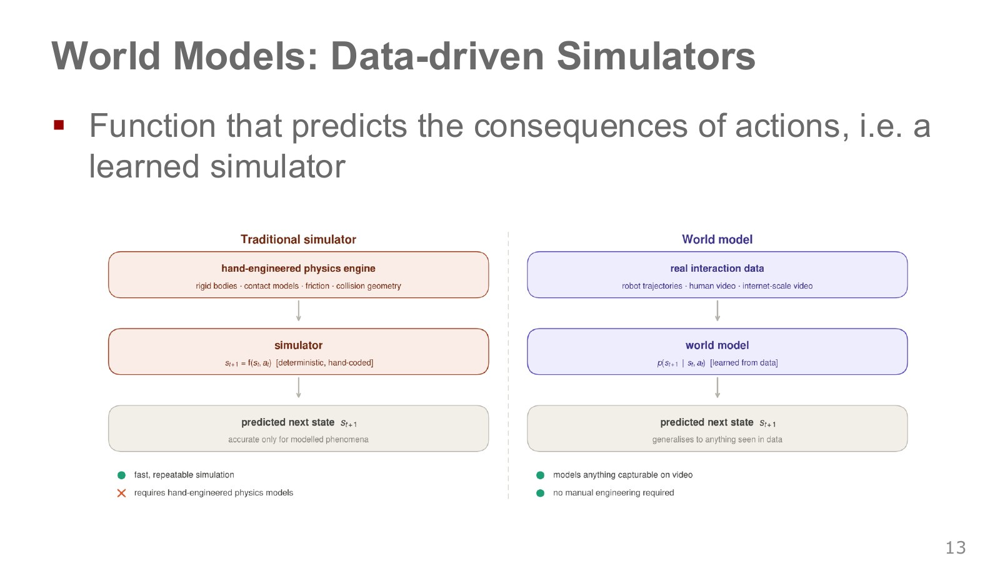

```text
World Models: Data-driven Simulators

= Function that predicts the consequences of actions, i.e. a
learned simulator

Traditional simulator World model

hand-engineered physics engine real interaction data
rigid bodies - contact models: friction - collision geometry

| |

robot trajectories - human video - intemet-scale video

simulator world model
Sis = (51, a) [deterministic, hand-coded] (st+1 | Sea) [leatned from data]
| predicted next state s;,; predicted next state s;.;
accurate only for modelled phenomena t generalises to anything seen in data
@ fast, repeatable simulation @ models anything capturable on video
X_ requires hand-engineered physics models @ 0 manual engineering required

13
```

## Slide 15

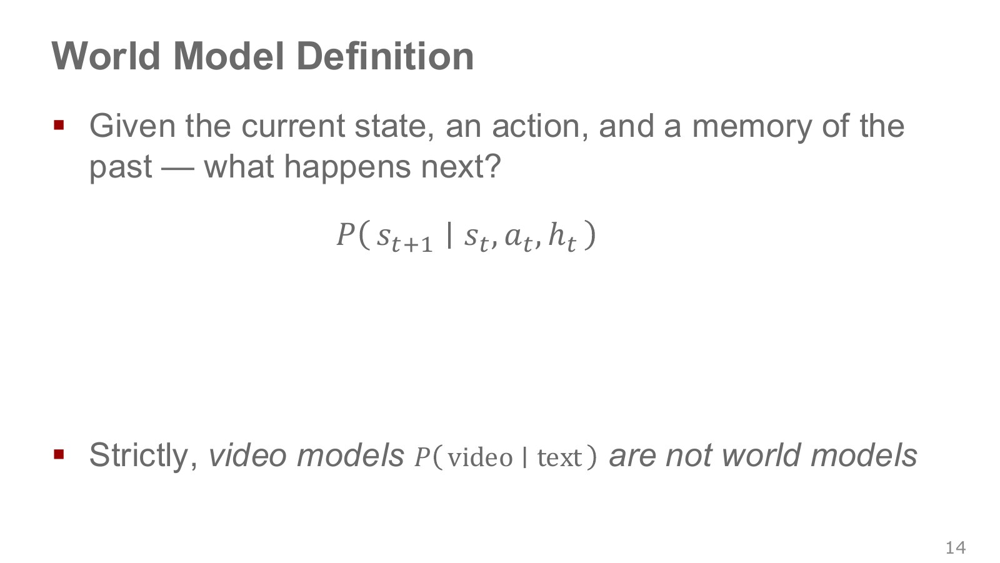

```text
World Model Definition

= Given the current state, an action, and a memory of the
past - what happens next?

P(Se41 | St, Ae, he)

" Strictly, video models P(video | text) are not world models

14
```

## Slide 16

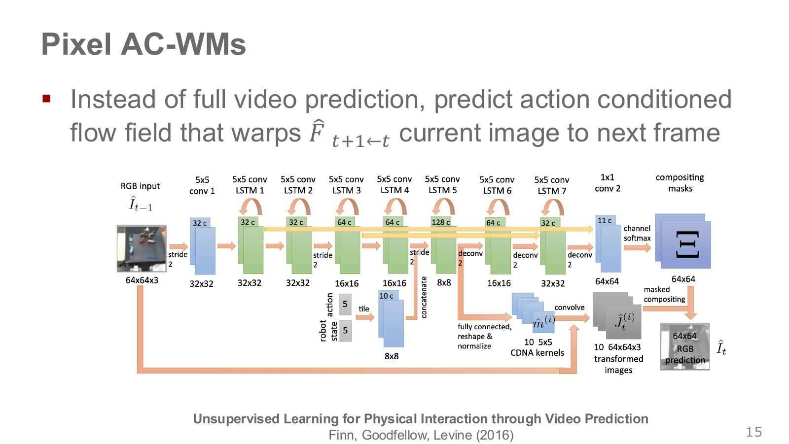

```text
Pixel AC-WMs

« Instead of full video prediction, predict action conditioned
flow field that warps F ,,,-; Current image to next frame

cet 5x5 5xS5conv 5x5conv 5x5conv 5x5conv Sx5conv 5x5conv _-5x5 conv dxl compositing
RGB input convl tSTM1 LSTM2 LSTM3. LSTM4 LSTMS ~-sLSTM6._-sULSTM 77. conv 2 masks

fia NN A HAHN A A

= -
BB
2

64x64x3 32x32 -«-32x32,-=s«s«32K32-ss«GX1G-«16KIG

channel
=

Tov
2

x8 16x16 32x32 64x64 ME,

masked
compositing
tile =
oo .-

8 fully connected,
3 : reshape & .
normale cow kernels 10 64x64x3 fe
8x8 transformed
images

Unsupervised Learning for Physical Interaction through Video Prediction
Finn, Goodfellow, Levine (2016) 15

concatenate
```

## Slide 17

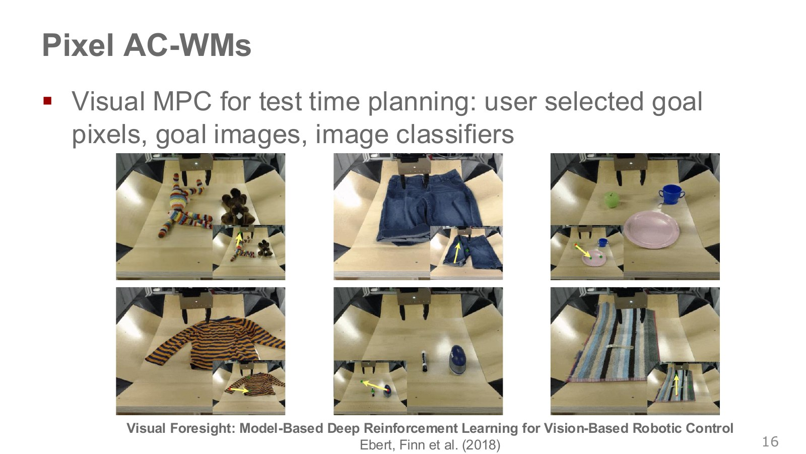

```text
Pixel AC-WMs

= Visual MPC for test time planning: user selected goal
pixels, goal images, image classifiers

Visual Foresight: Model-Based Deep Reinforcement Learning for Vision-Based Robotic Control
Ebert, Finn et al. (2018) 16
```

## Slide 18

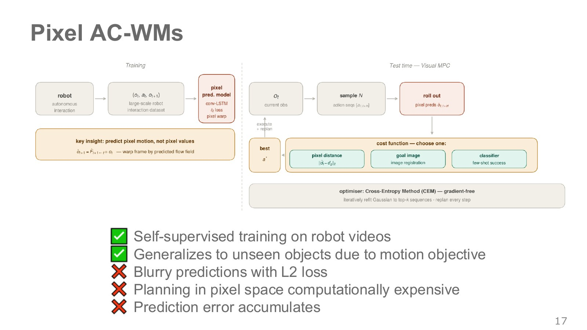

```text
Pixel AC-WMs

Training Test time - Visual MPC
robot (0%, @ O11)
autonomous | large-scale robot

or _ sample N _ roll out
current obs action segs {2:61} peel preds 64.1.4
Lis
key insight: predict pixel motion, not pixel values cost function - choose one:
O1-1=Figt-10 0, - warp frame by predicted flow field best ( }

pixel distance goal image classifier
id= dgle image registration few-shot success

interaction interaction datasat

‘optimiser: Cross-Entropy Method (CEM) - gradient-free
iteratively refit Gaussian to top-k sequences - replan every step

Self-supervised training on robot videos
Generalizes to unseen objects due to motion objective
% Blurry predictions with L2 loss

% Planning in pixel space computationally expensive
XX Prediction error accumulates

17
```

## Slide 19

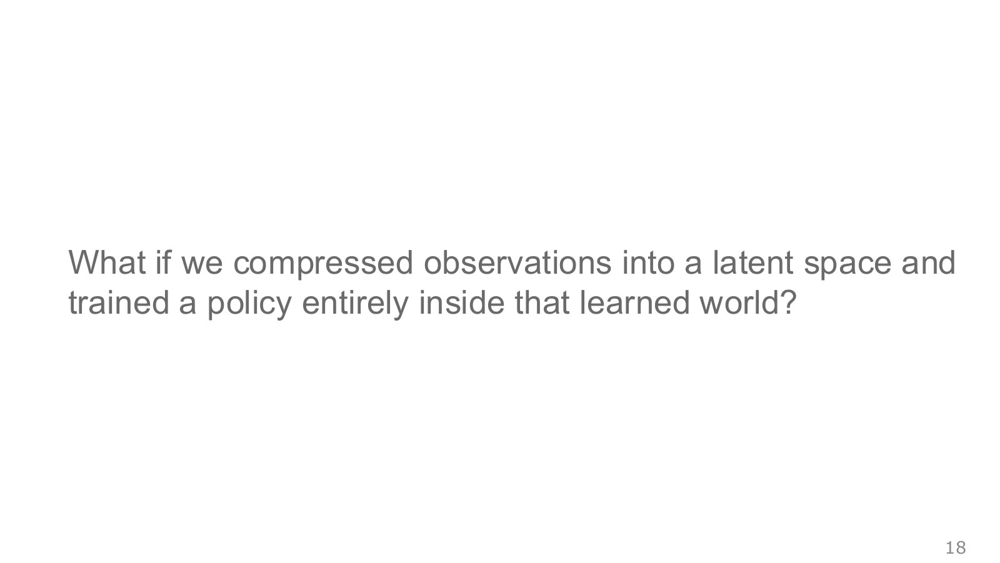

```text
What if we compressed observations into a latent space and
trained a policy entirely inside that learned world?

18
```

## Slide 20

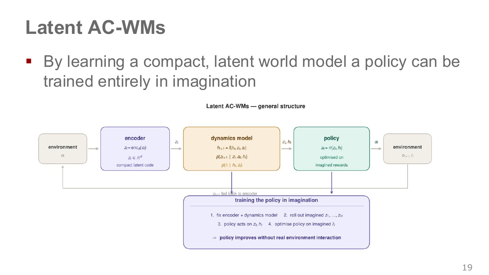

```text
Latent AC-WMs

« By learning a compact, latent world model a policy can be
trained entirely in imagination

Latent AC-WMs - general structure

rc
encoder 2 dynamics model iat policy _
environment |__. Z=ence(ar) a Inst = fMlhy 24 a1) gs a= m{zih) eas environment
Zeer? Pat | 21,4 h1) optimised on
compact latent code \e pir | fe 2) imagined rewards ) : |
O25 fod oho to encoder ‘
a training the policy in imagination a
1. fix encoder + dynamics model 2. ‘roll out imagined 2;, ..., 24
3. policy acts on z,h; 4. optimise policy on imagined /;
= policy improves without real environment interaction
y

19
```

## Slide 21

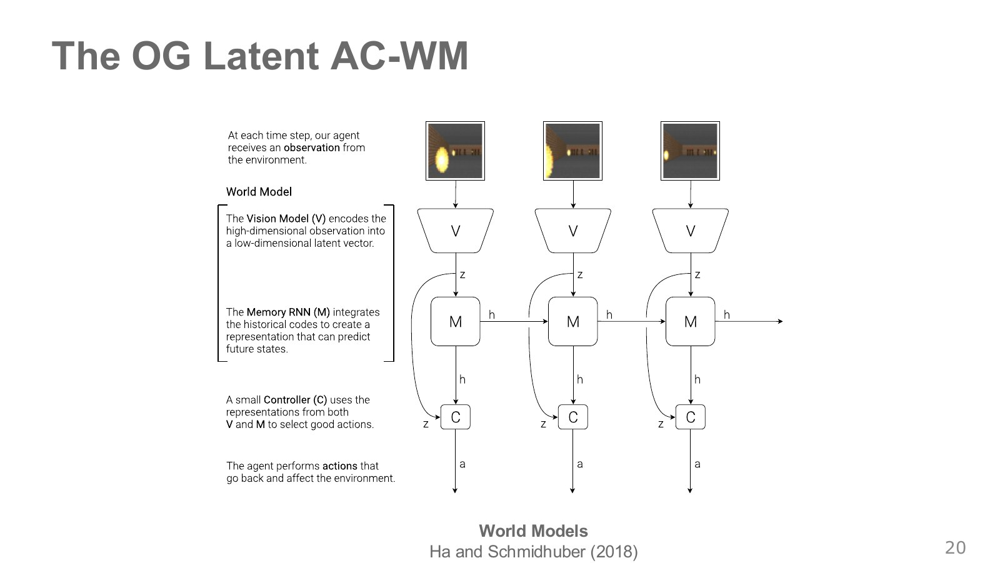

```text
The OG Latent AC-WM

At each time step, our agent
receives an observation from
the environment.

World Model

The Vision Model (V) encodes the
high-dimensional observation into
a low-dimensional latent vector.

< «SJ

Lys

7)

the historical codes to create a
representation that can predict

Z Z Zz
The Memory RNN (M) integrates ((. ln (r lh (r lh
Lo LJ

future states.

h h h
Asmall Controller (C) uses the
representations from both S {c] {c] {c]

V and M to select good actions. Zz

The agent performs actions that a a
go back and affect the environment

World Models
Ha and Schmidhuber (2018)
```

## Slide 22

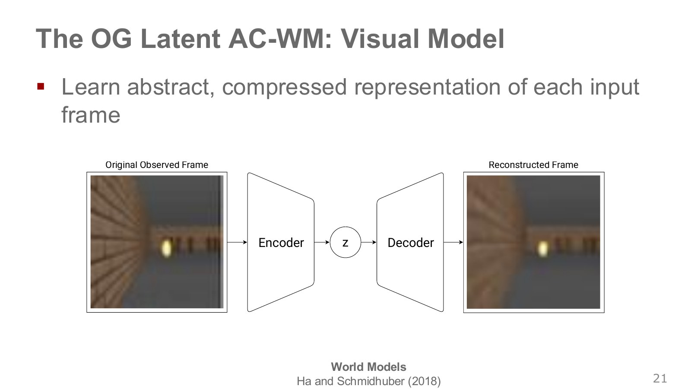

```text
The OG Latent AC-WM: Visual Model

= Learn abstract, compressed representation of each input

frame

Original Observed Frame

Encoder (244 Decoder

World Models
Ha and Schmidhuber (2018)

Reconstructed Frame

21
```

## Slide 23

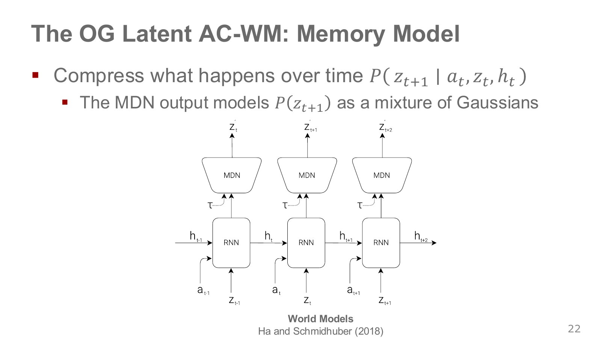

```text
The OG Latent AC-WM: Memory Model

= Compress what happens over time P( 2:43 | @¢,2Z4, he )
« The MDN output models P(z;,,) as a mixture of Gaussians

z Z Zi

World Models
Ha and Schmidhuber (2018)

22
```

## Slide 24

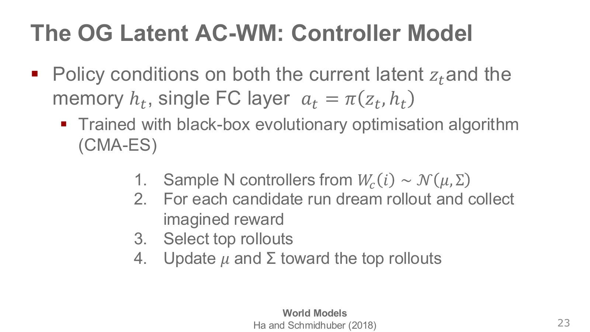

```text
The OG Latent AC-WM: Controller Model

# Policy conditions on both the current latent z,and the
memory h;, single FC layer a, = m(Z;, h;)

« Trained with black-box evolutionary optimisation algorithm
(CMA-ES)

1. Sample N controllers from W,(i) ~ N(u, z)

2. For each candidate run dream rollout and collect
imagined reward

3. Select top rollouts

4. Update uw and 2 toward the top rollouts

World Models
Ha and Schmidhuber (2018) 23
```

## Slide 25

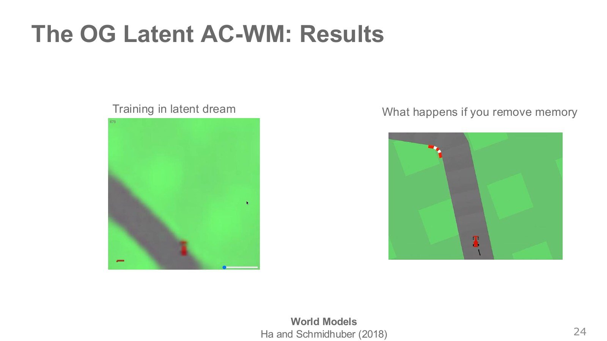

```text
The OG Latent AC-WM: Results

Training in latent dream What happens if you remove memory

World Models
Ha and Schmidhuber (2018) 24
```

## Slide 26

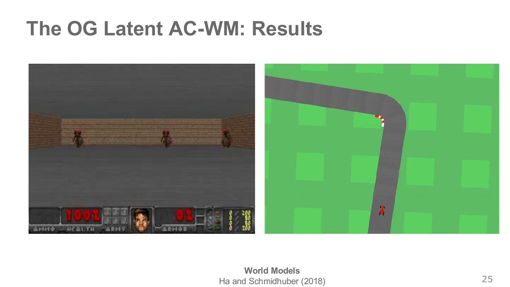

```text
The OG Latent AC-WM: Results

World Models
Ha and Schmidhuber (2018)

25
```

## Slide 27

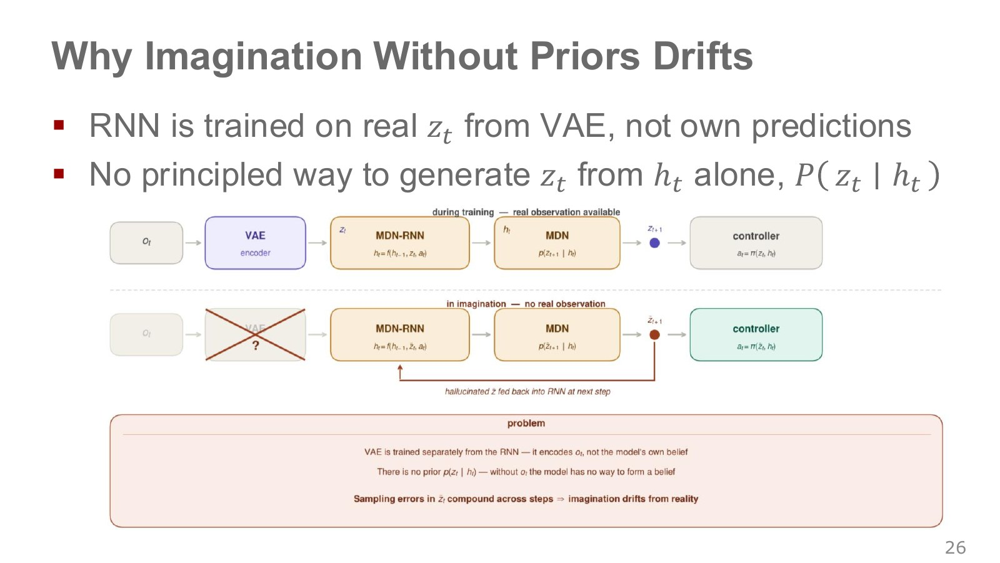

```text
Why Imagination Without Priors Drifts

# RNN is trained on real z, from VAE, not own predictions
# No principled way to generate z; from h; alone, P(z; | h; )

during training - real observation available

VAE
‘encoder

|- j

MDN-RNN
he fina 1,24 a)

Zee oe
.e- controller

r= mz hy)

-[ won

Phere | he)
in imagination - no real observation

MDN-RNN- uF MDN Hs 7 4! controller
Dom fil 1, 25 ad) Pl2te1 | hd | arm TH(2y he)

hallucinated 2 fed back into FINN at next step

problem

VAE |s trained separately from the RNN - it encodes o,, not the model's own belief

There is no prior p(zr | hx) - without o; the model has no way to form a belief

Sampling errors in Z: compound across steps > imagination drifts from reality

26
```

## Slide 28

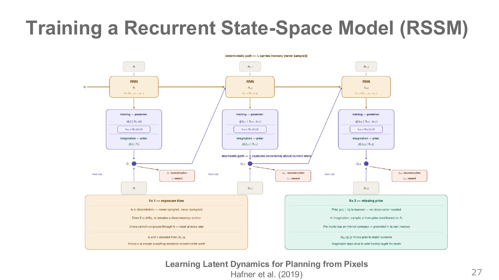

```text
Training a Recurrent State-Space Model (RSSM)

deterministic path - fy catries memory (never sampled)

a an aa

traning - poster: traning - posterior: ‘raining - posterior:

‘z1| 0) 2es| hs, O13) 210 | ao, ons)

Imagination - pir: Imagination ~ prior: Imagination - prior:
pezr| Plans | Pat) Phen | 2)

tix 1 -exposure bias {x2 - missing prior
‘nis étemiitio- neve sampled, nver comps Pr 4 |W) larned - no cbsraton needed
Even its, emains aceon memory anchor |nimaginaton, sample z rom prior condoned on
ers cana compound tough h- reset at vey top The model has an itera! compass - grounded nits cw memory
6 ended tom (2 aap re pte mate poseror
‘Forex 20 enone eveything nade to ecrstuctthe wo Iaghson says beet uha raring athe mate

Learning Latent Dynamics for Planning from Pixels
Hafner et al. (2019) 27
```

## Slide 29

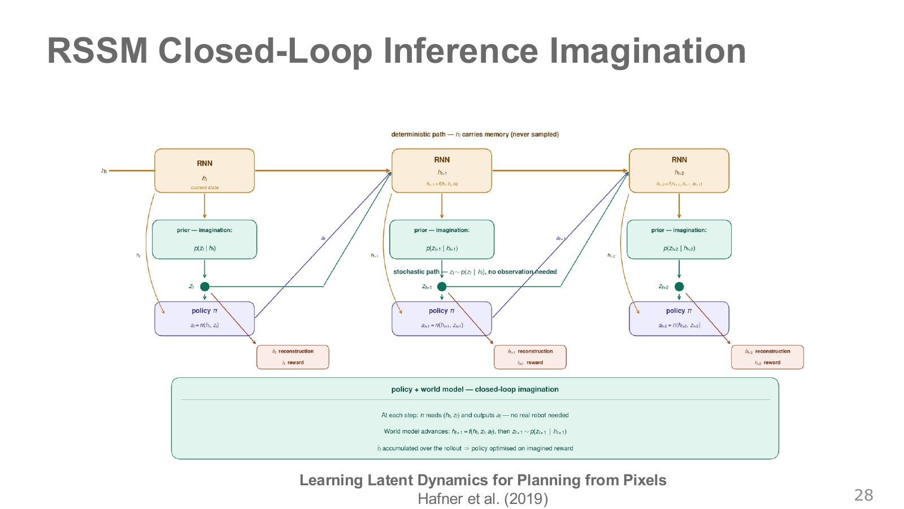

```text
RSSM Closed-Loop Inference Imagination

deterministic path - hi carries memory (never sampled)

policy + world model - closed-loop imagination

‘Ateach stop: reads (hy, 2) and outputs a - no real robot needed
World model advances: fe: =f(h 2,2), then 2.1 ~P{Zie3 | Mies)

accumulated over the rout > policy optimised on imagined reward

Learning Latent Dynamics for Planning from Pixels
Hafner et al. (2019)

28
```

## Slide 30

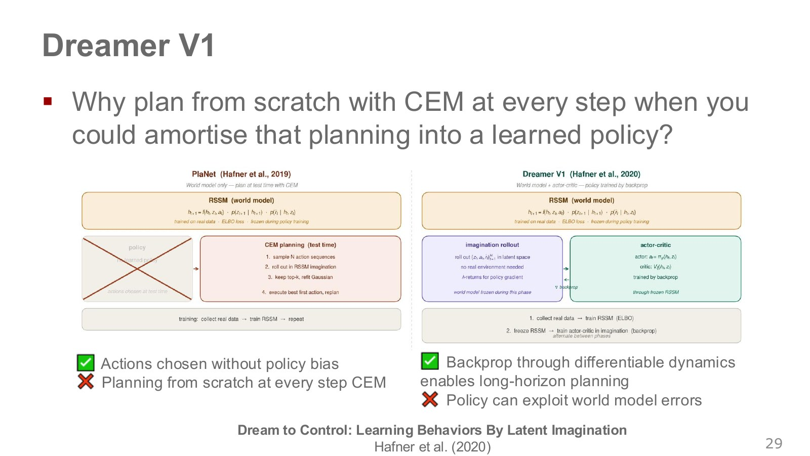

```text
Dreamer V1

« Why plan from scratch with CEM at every step when you

could amortise that planning into a learned policy?

)

heer Ay 20.2) plates | Prot)» AAR | 2)

RSSM (world model)

Mrerfits zy) ~ pleica | Pres) > BAF | 2)

trained on rea data - ELBO oss - hazen cing poly traning

| trained on realdata - ELBO loss - zen during posey raining

CEM planning (test time)

1. sample N action sequences

a 2. rollout in SSM imagination
3. keep top refit Gaussian

4, execute best first action, replan

actor-critic
actor v= ffm 2)
1 ia ‘ili: Vals.)
‘returns for policy aracent . trained by backorop
orld model razen cra tis phase trough rozen RSM
1. collect real data - train SSM (ELBO)

training: collect real data - train SSM ~ repeat

Actions chosen without policy bias
% Planning from scratch at every step CEM

in imagination (cackprop)
phases

2, freeze RSM ~> tain

Backprop through differentiable dynamics

enables long-horizon planning

%€ Policy can exploit world model errors

Dream to Control: Learning Behaviors By Latent Imagination
Hafner et al. (2020)
```

## Slide 31

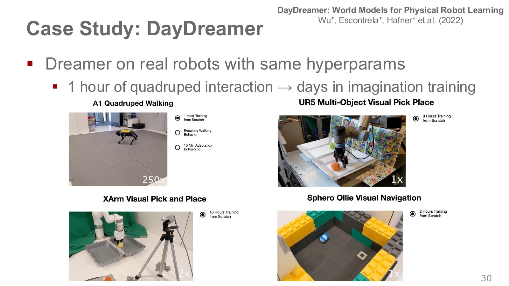

```text
DayDreamer: World Models for Physical Robot Learning
Wu*, Escontrela*, Hafner* et al. (2022)

Case Study: DayDreamer

» Dreamer on real robots with same hyperparams
= 1 hour of quadruped interaction - days in imagination training

A1 Quadruped Walking URS5 Multi-Object Visual Pick Place

4 Hour Training

8 Hours Taint
© tromScratch i

® tromSeratch

CO Besutne Wangs
Behavior

O joke Aceptaton
to Pushing

XArm Visual Pick and Place Sphero Ollie Visual Navigation

10 Hours Training

2 Hours Traini
© romseratcn © from Seraten

30
```

## Slide 32

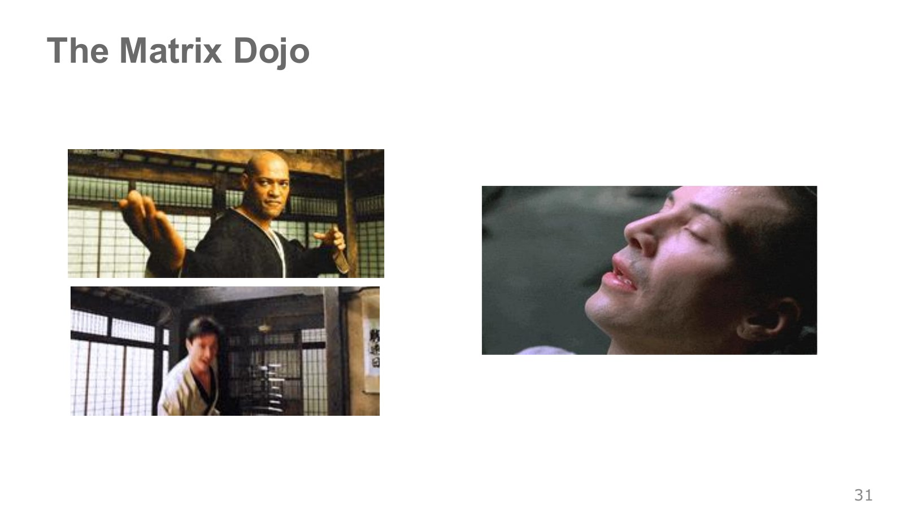

```text
The Matrix Dojo

31
```

## Slide 33

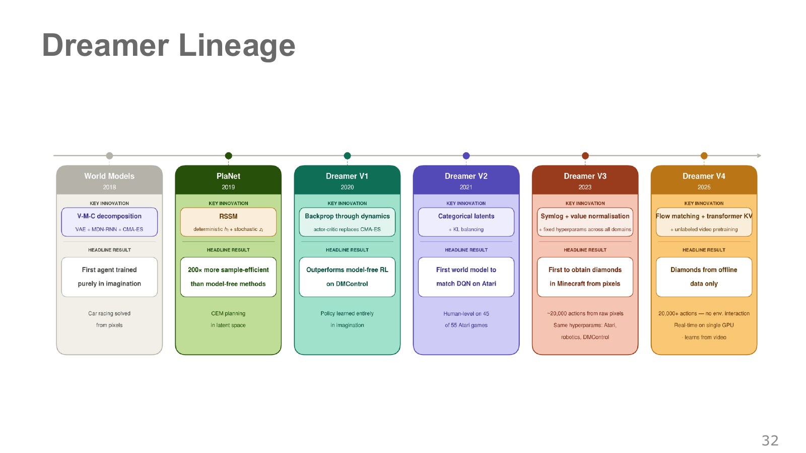

```text
Dreamer Lineage

World Models

KEY INNOVATION

HEADLINE RESULT

First agent trained
purely in imagination

Car racing solved,
from pixels

PlaNet

SM.
deterministic hy + stochastic z

200x more sample-efficient
than model-free methods

Dreamer V1

Backprop through dynamics
actor tite replaces CMA-ES

Outperforms model-free RL
‘on DMControl

Dreamer V2

KEY INNOVATION
Categorical latents

++ KL balancing

‘HEADLINE AESULT

First world model to

match DQN on Atari

Human-tevel on 45,
of 55 Atari games.

--EEEEE

Dreamer V3

reamer V4

Symlog + value
xed hyperparams across all domains

First to obtain diamonds

in Minecraft from pixels

low m + tran:

++ unlabeled video pretraining

Diamonds from offline
data only

32
```

## Slide 34

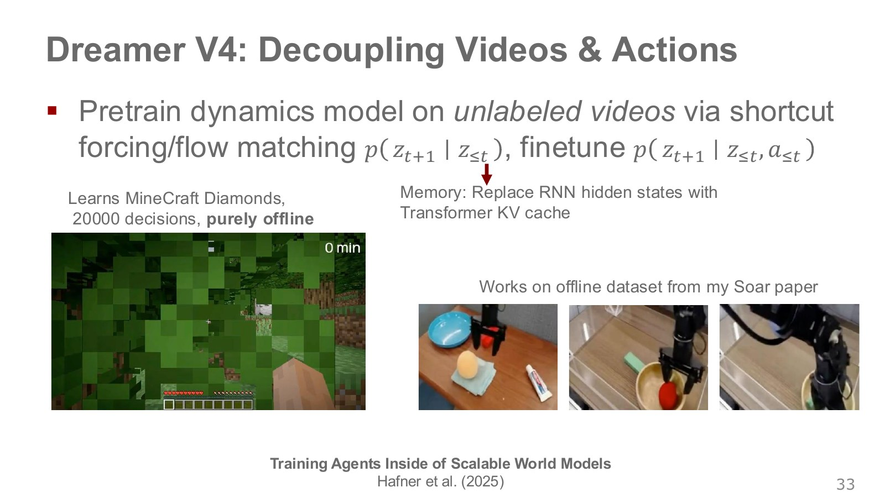

```text
Dreamer V4: Decoupling Videos & Actions

= Pretrain dynamics model on unlabeled videos via shortcut
forcing/flow matching p(%4, | z<,), finetune p( z:41 | 2<;,d<¢)

Learns MineCraft Diamonds Memory: Replace RNN hidden states with
Transformer KV cache

20000 decisions, purely offline

Works on offline dataset from my Soar paper

Training Agents Inside of Scalable World Models
Hafner et al. (2025) 33
```

## Slide 35

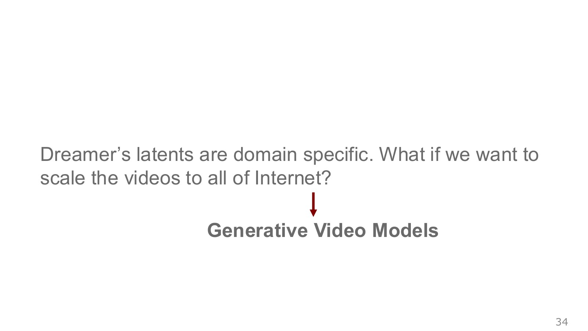

```text
Dreamer’s latents are domain specific. What if we want to
scale the videos to all of Internet?

|

Generative Video Models

34
```

## Slide 36

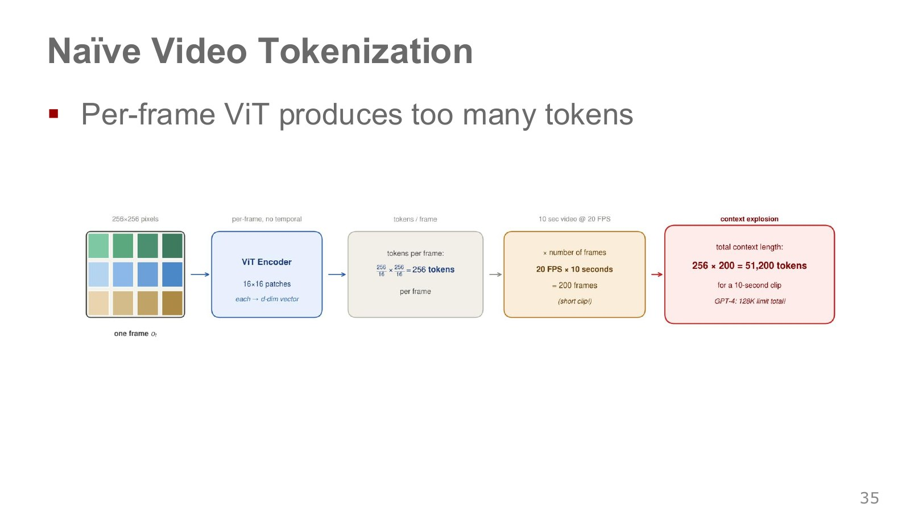

```text
Naive Video Tokenization

= Per-frame ViT produces too many tokens

per-frame, no temporal tokens / frame 10 sec video @ 20 FPS context explosion

r
x number of frames total context length:

20 FPS x 10 seconds 256 x 200 = 51,200 tokens
= 200 frames for a 10-second lip
(hort clip) GPT-4: 128K lt total!

tokens per frame:

255, 256 _
856 ,. 250 256 tokens

ViT Encoder
>
16x16 patches

per frame
‘each + d-dim vector
```

## Slide 37

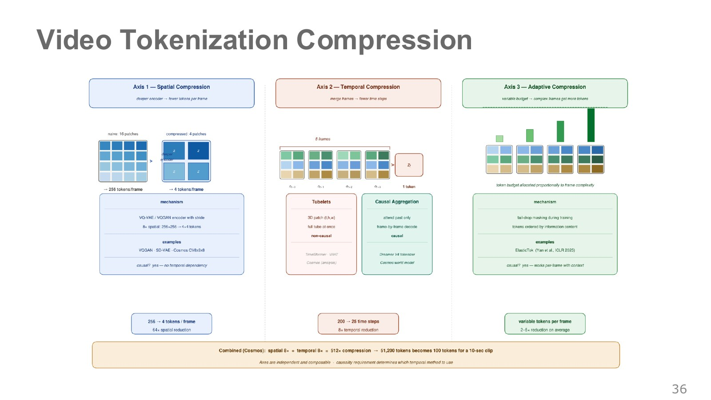

```text
Video Tokenization Compression

Axis 3- Adaptive Compression

abe bugget~ complex aes get more ens

‘Axis 2- Temporal Compression

‘Axis 1 - Spatial Compression
merge hares ~ tomer te step

deper encoder fewer ens per rae

ave: 16 patches compressed 4 paches
8 tames
------
= 258 tokeneirame 4 tokeneltrame oe os oe _
‘mechanism ‘Tubelets Causal Aggregation mechanism
\YOLVAE / VOGAN encoder wih sie 30 patch eth) ston past oly tahetop mashing dorm rang
spat: 256.256 4.4 thane ‘ut ube st once ‘rama oy rae ooo ‘okens crores by Iformaton cesar
examples ‘examples
VOGAN S0.VAE Cosmos CVE ElastiTok (Yano al, 0LR2025)
coer ee causa? yes - works per-rame wit contert

cnusa? ys- no temporal onpenaeney

286 4 tokens / frame 200 251ime steps
64s spatial reduoson 8x temporal reduction

51,200 tokens 100 tokens for a 10-see clip,

4 (Cosmos): spatial 8x + Be = 512
[Ares are independent and composable caveat requirement determines which temporal method 10 Ue
```

## Slide 38

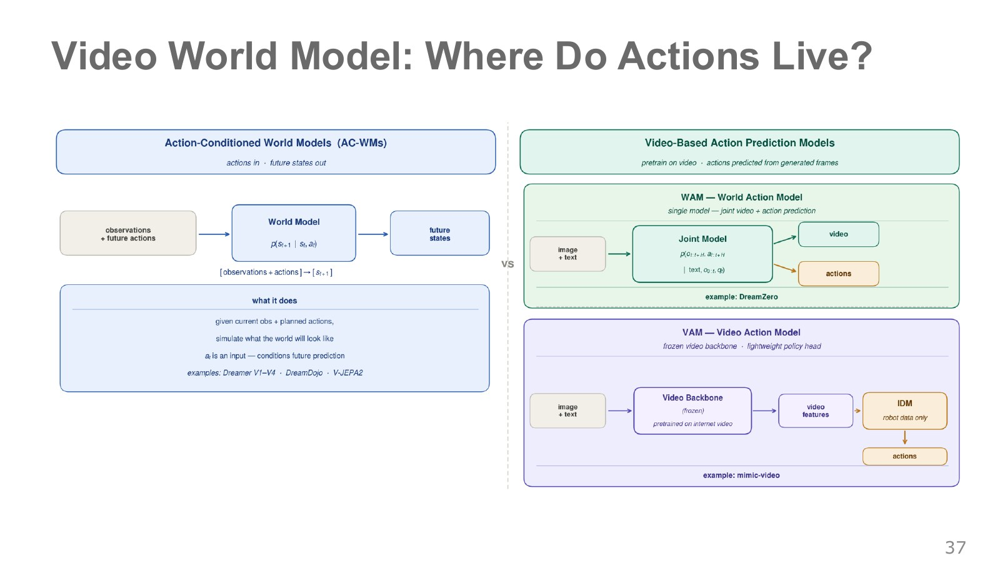

```text
Video World Model: Where Do Actions Live?

Action-Conditioned World Models (AC-WMs)

actions in + future states out

Video-Based Action Prediction Models
retrain on video - actions predicted from generated frames

World Model
observations
+ future actions

PASix1 | Stat)

[observations + actions] - [51.1]

what it does
given current abs + planned actions,
simulate what the world will look like
aris an input - conditions future prediction
‘examples: Dreamer V1-V4 » DreamDojo - V-JEPA2

vs

WAM - World Action Model
‘single model - joint video + action prediction

‘mage
seri Or arr
| text, 2.4) -- faoulona
example: Dreamzero
VAM - Video Action Model
‘tozen video backbone lightweight policy head
Video Backbone =
Lee} ->| (tozen)
robot data ony

pretvained on internet video

‘example: mimic-video

37
```

## Slide 39


```text
Didn’t we say video is expensive?
Why use video backbones?

38
```

## Slide 40

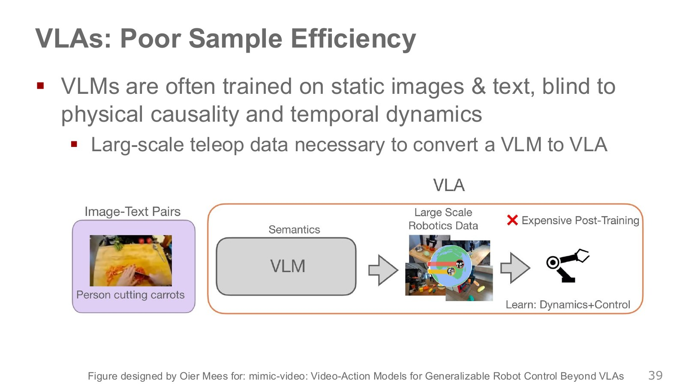

```text
VLAs: Poor Sample Efficiency

«= VLMs are often trained on static images & text, blind to
physical causality and temporal dynamics
« Larg-scale teleop data necessary to convert a VLM to VLA

VLA

Image-Text Pairs Large Scale

Semantics Robotics Data
em ; > oe
Person cutting carrots

Learn: Dynamics+Control

X Expensive Post-Training

Figure designed by Oier Mees for: mimic-video: Video-Action Models for Generalizable Robot Control Beyond VLAs 39
```

## Slide 41

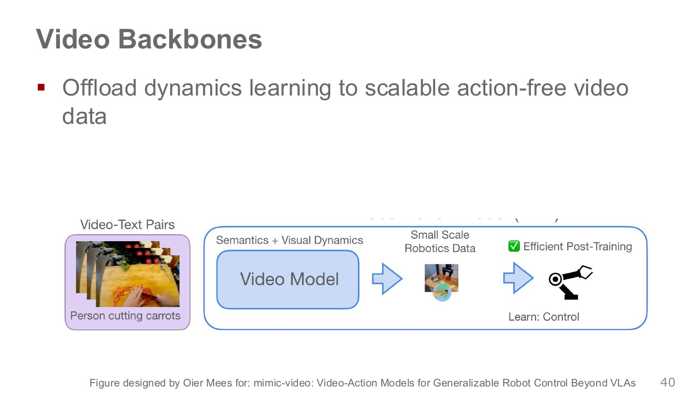

```text
Video Backbones

« Offload dynamics learning to scalable action-free video
data

Video-Text Pairs - So - dl
mall Scale
Semantics + Visual Dynamics Efficient Post-Training

Robotics Data
Video Model a> Be a> os

Person cutting carrots Learn: Control

Figure designed by Oier Mees for: mimic-video: Video-Action Models for Generalizable Robot Control Beyond VLAs 40
```

## Slide 42

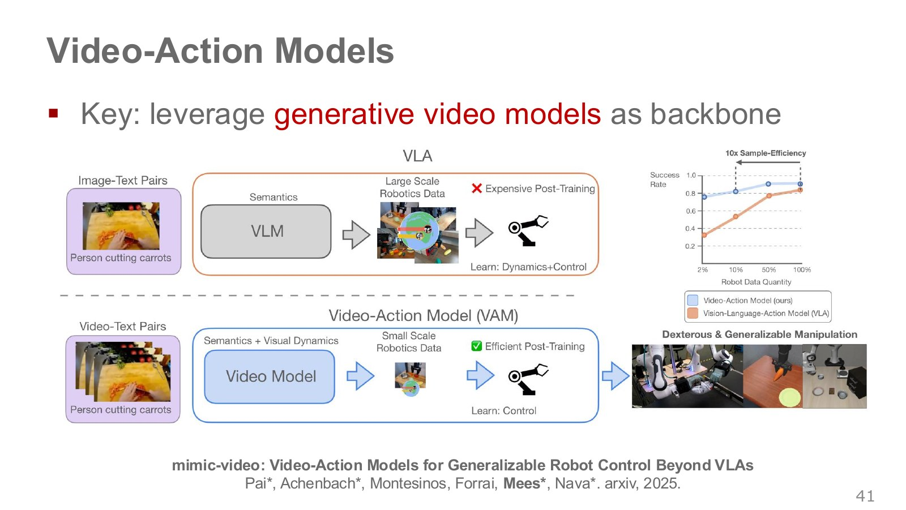

```text
Video-Action Models

« Key: leverage generative video models as backbone

VLA

Large Scale
Semantics Robotics Data

Co ole <

Image-Text Pairs

Person cutting carrots

Expensive Post-Training

Learn: Dynamics+Control_/

Video-Action Model (VAM)

Video-Text Pairs
Semantics + Visual Dynamics aren oe
Robotics Data

Learn: Control

Person cutting carrots

Efficient Post-Training

a

10x Sample-Efficiency

Success 1.0
Rate

2% 10% ~~ ~80% 100%
Robot Data Quantity

(© Video-Action Model (ours)
( Vision-Language-Action Model (VLA)

Dexterous & Generalizable Manipulation

mimic-video: Video-Action Models for Generalizable Robot Control Beyond VLAs
Pai*, Achenbach*, Montesinos, Forrai, Mees*, Nava*. arxiv, 2025. ay
```

## Slide 43

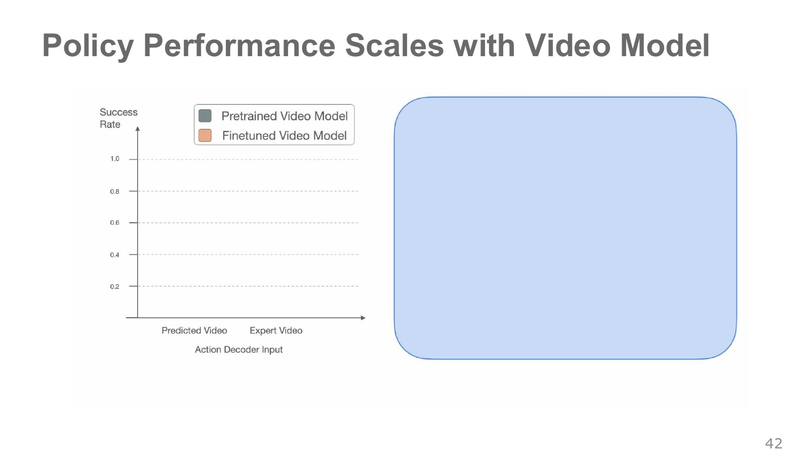

```text
Policy Performance Scales with Video Model

Success
Rate

10

os ->

os 4

o4 4

® Pretrained Video Model
|@B_ Finetuned Video Model |

I aa eae ai

Predicted Video Expert Video
Action Decoder Input

42
```

## Slide 44

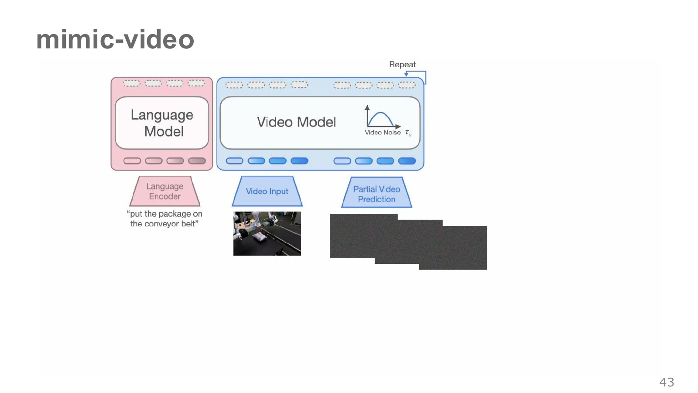

```text
mimic-video

Repeat

Language
Model

Video Model

Video Noise T,

oO ee

oe ee 2» Oe@ee

Language
Encoder

“put the package on
the conveyor belt”

sei =

43
```

## Slide 45

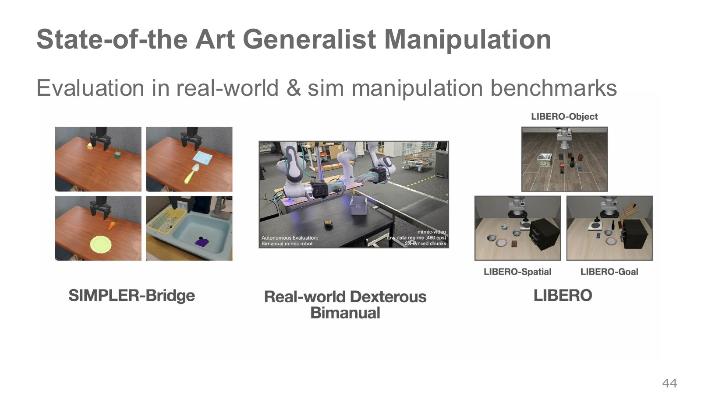

```text
State-of-the Art Generalist Manipulation

Evaluation in real-world & sim manipulation benchmarks

LIBERO-Object

+ j¢ -,

LIBERO-Spatial LIBERO-Goal

SIMPLER-Bridge Real-world Dexterous LIBERO
Bimanual

44
```

## Slide 46

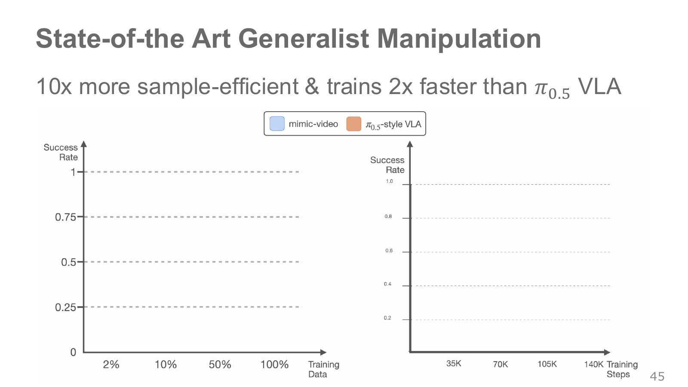

```text
State-of-the Art Generalist Manipulation

10x more sample-efficient & trains 2x faster than m1). VLA

| @ mimic-video @ %_5-Style wa

Success # 4
Rate Success
{abies dese score ecuseeee veces peeeese Rate
Se
(Ws... os
O.5-p oon eee eee eee eee eee nee
a
oro
o _|
0 > >
2% 10% 50% 100% Training 35K 70K 405K 140K Training

Data Steps 45
```

## Slide 47

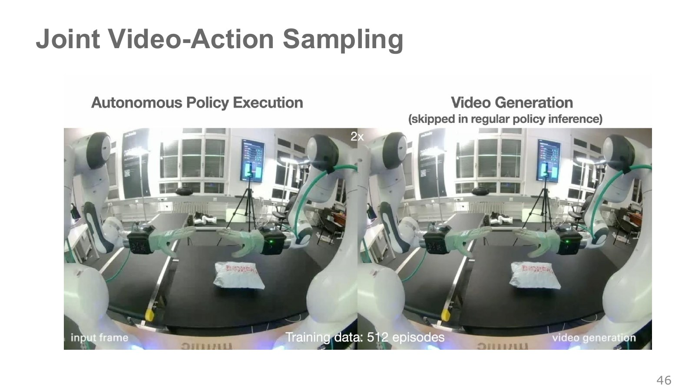

```text
Joint Video-Action Sampling

Autonomous Policy Execution

DP

Video Generation
(skipped in regular policy inference)

46
```

## Slide 48

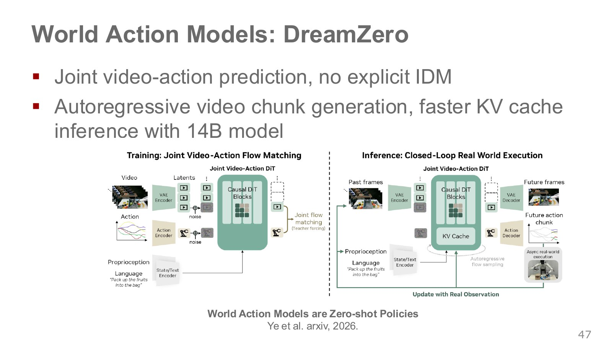

```text
World Action Models: DreamZero

# Joint video-action prediction, no explicit IDM

« Autoregressive video chunk generation, faster KV cache
inference with 14B model

Training: Joint Video-Action Flow Matching 4 Inference: Closed-Loop Real World Execution
t

Joint Video-Action DiT Joint Video-Action DiT

Past frames

Update with Real Observation

World Action Models are Zero-shot Policies

Ye et al. arxiv, 2026.
47
```

## Slide 49

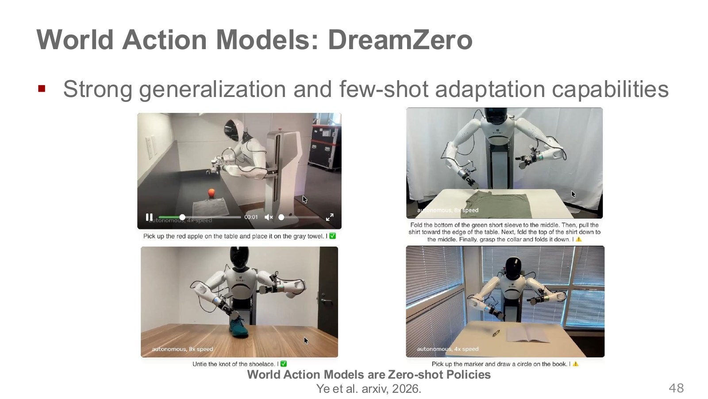

```text
World Action Models: DreamZero

Fold the bottom of the green short sieeve to the middle. Then, pull the
shirt toward the edge of the table. Next, fold the top of the shirt down to
the middle. Finally, arasp the collar and folds it down. |

font <M jl i
Untie the knot of the shoolace. | @ Pick up the marker and draw a circle on the book. |

World Action Models are Zero-shot Policies
Ye et al. arxiv, 2026.

48
```

## Slide 50

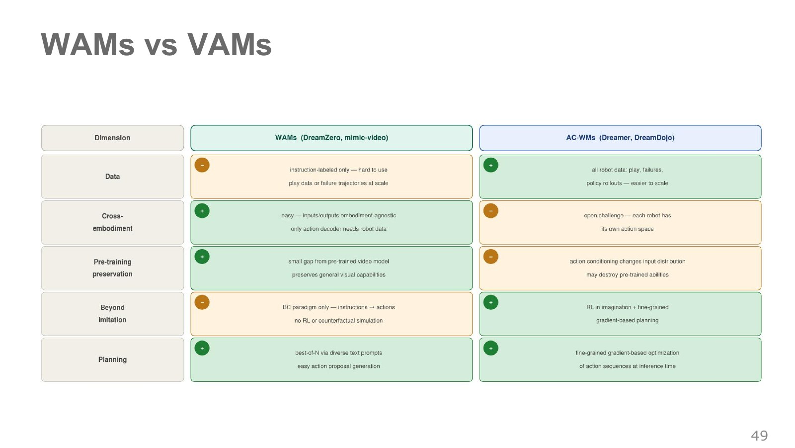

```text
WAMs vs VAMs

Dimension WAMs (DreamZero, mimic-video) AC-WMs (Dreamer, DreamDojo)
. ) Sere ° oo
ata

play data or failure trajectories at scale policy rollouts - easier to scale
embodiment only action decoder needs robot data its own action space
preservation preserves general visual capabitios may destroy pre-trained abilities
imitation ‘no RL or counterfactual simulation ‘racient-based planning
Planning

‘easy action proposal generation

‘of action sequences at inference time

49
```

## Slide 51

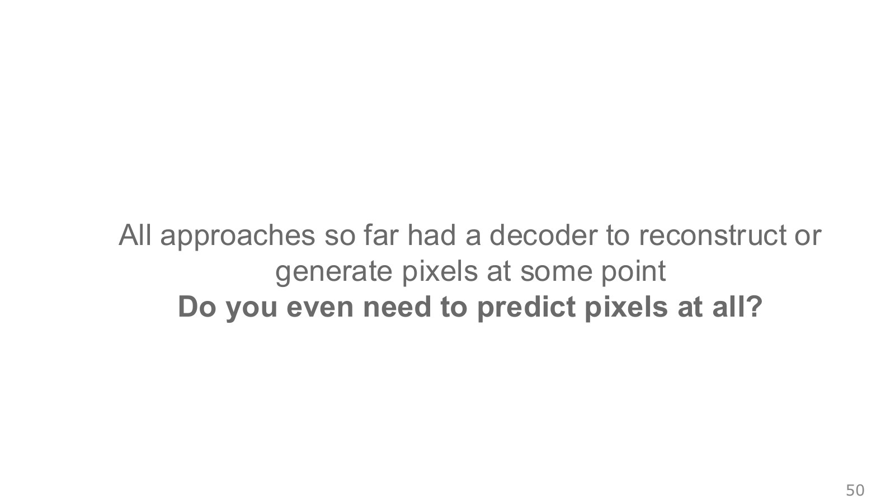

```text
All approaches so far had a decoder to reconstruct or
generate pixels at some point
Do you even need to predict pixels at all?

50
```

## Slide 52

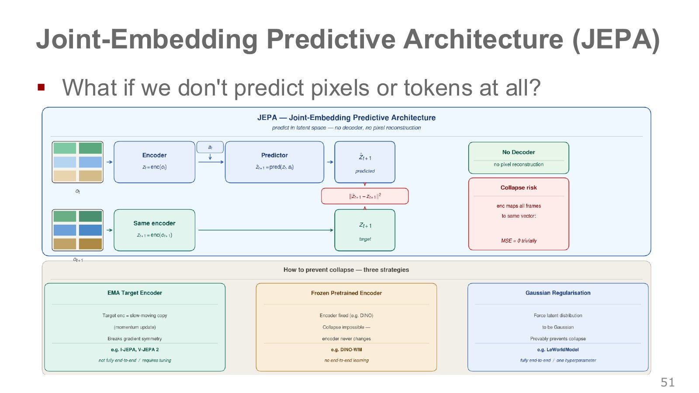

```text
Joint-Embedding Predictive Architecture (JEPA)

= What if we don't predict pixels or tokens at all?

JEPA - Joint-Embedding Predictive Architecture
predict in latent space -no decoder, no pixel reconstruction

Targat enc = slow-moving copy
(momentum update)
Breaks gradient symmetry
(0.9. IJEPA, V-JEPA2

‘ot fly end-to-end / requires tring

Encoder fixed (@.g. DINO)
Collapse impossible -
lencoder never changes:

e.g. DINO-WM
no enct-o-end leaming

a
Ly ae | e=) is bu No Decoder
= = -- a i no pixel reconstruction
z=enc(o)) 2a =pred(z, a) aoa
= “ Collapse risk
W2te1 Zee?
‘ene maps all frames
= oom
‘Same encoder Fave)
>|
target MSE = O trivially
Ont
How to prevent collapse - three strategies
EMA Target Encoder Frozen Pretrained Encoder Gaussian Regularisation

Foro latent distibution
{0 be Gaussian
Provably prevents colanse
2.9, LeWorldModel

July end-to-end / one hyperparameter

51
```

## Slide 53

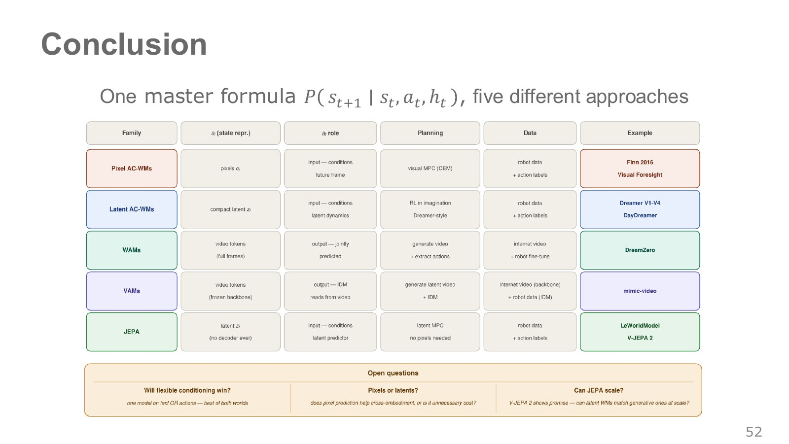

```text
Conclusion

One master formula P(s;4, |

St, Az, h,), five different approaches

[ex en (a - ose ex:
voit -condtons rb dat Finn 2016
Pixel ACLs oil aval MP (C8)
future frame + action labels Visual Foresight
Ft omdtins Lin traghaton wba dt Dreamer Vi.v4
Latent AC-WMs ‘compact latent 2;
eran bres se + acon abl DayDreamer
vie ohne oust -ioty corte veo sot
‘WAMs DreamZero
(full frames) predicted + extract actions + robot fine-tune
vie ths opt 10M den ste: eo tte onto)
VAMs mimic-video
eo eter om + bt din (0
_ tert out -condens ltr pe roetdoa Letritode
(seca ov set ret nope nae rare Vea?
Open questions
Will flexible conditioning win? Pixels or latents? ‘Can JEPA scale?

‘one model on foxt OR actions - best of both worlds

does pirel prediction help cress-embodment, ori it unnecessary cost?

\VoJEPA 2 shows promise -can latent Ws match generative ones at scale?

52
```

## Slide 54


```text
Thank you for your attention
```

## Slide 55

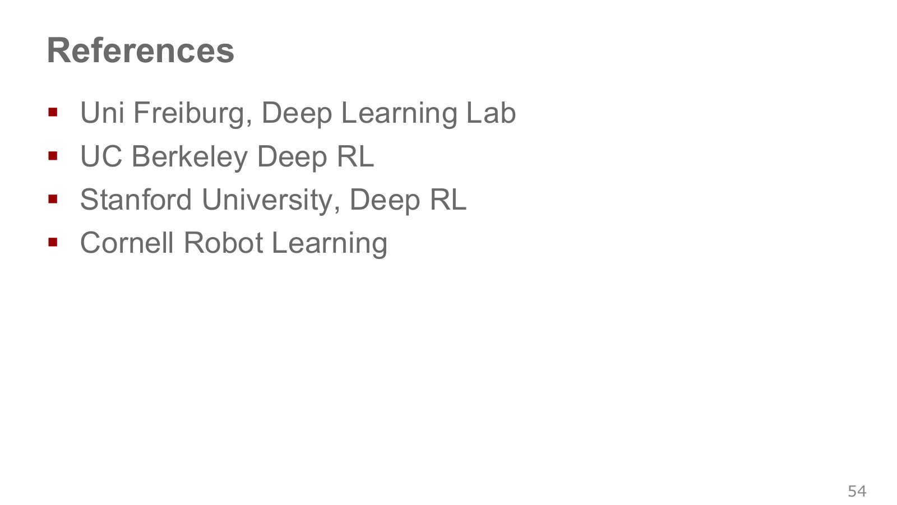

```text
References

# Uni Freiburg, Deep Learning Lab
«" UC Berkeley Deep RL

« Stanford University, Deep RL

« Cornell Robot Learning

54
```

---

[← Course home](../README.md) · [Open optional slide gallery →](../curriculum/week-08-world-models.md)
