# Week 09 - Generalist Robot Policies: OCR transcript

[← Course home](../README.md) · **Default OCR view** · [Open optional slide gallery →](../curriculum/week-09-generalist-policies.md)

> This is an automated OCR transcript generated from the locally rendered slide images. Use the image as the source of truth for equations, diagrams, citations, and small text.

## Slide 1

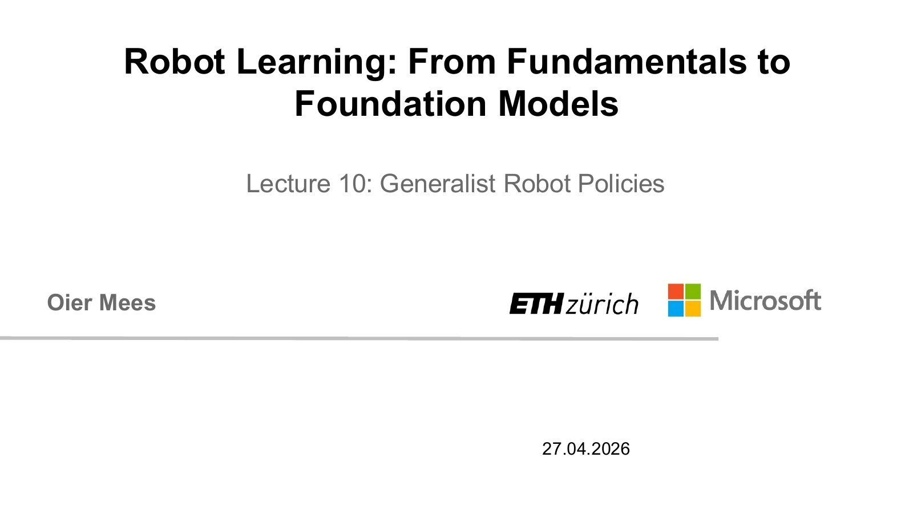

```text
Robot Learning: From Fundamentals to
Foundation Models

Lecture 10: Generalist Robot Policies

Oier Mees ETHzirich §® Microsoft

27.04.2026
```

## Slide 2

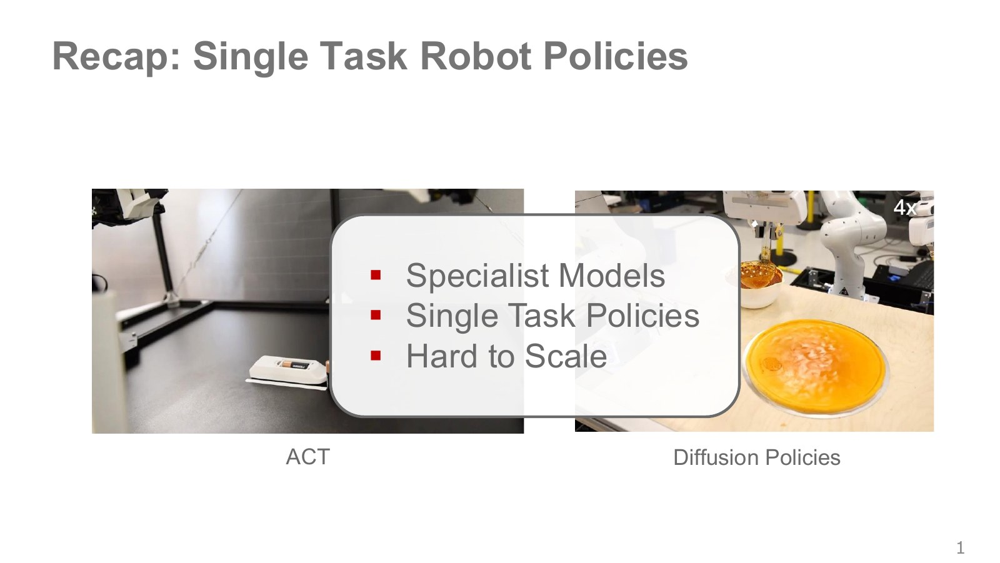

```text
Recap: Single Task Robot Policies

= Specialist Models
# Single Task Policies
= Hard to Scale

L_ -
ACT Diffusion Policies
```

## Slide 3

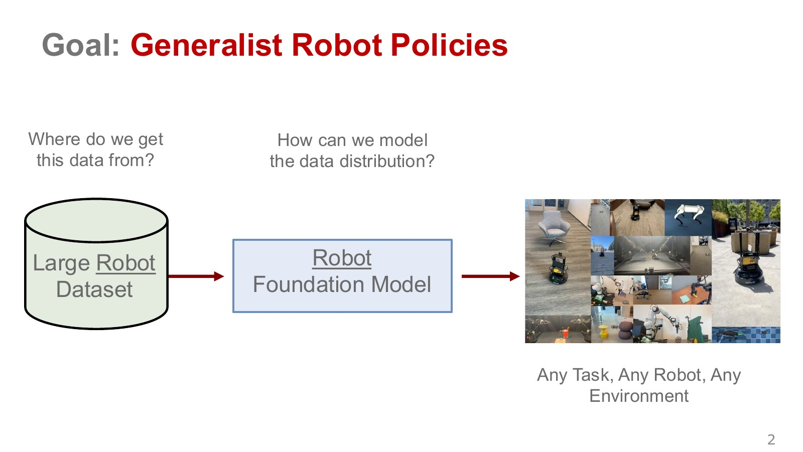

```text
Goal: Generalist Robot Policies

Where do we get How can we model
this data from? the data distribution?

Robot
Foundation Model

Large Robot
Dataset

Any Task, Any Robot, Any
Environment
```

## Slide 4

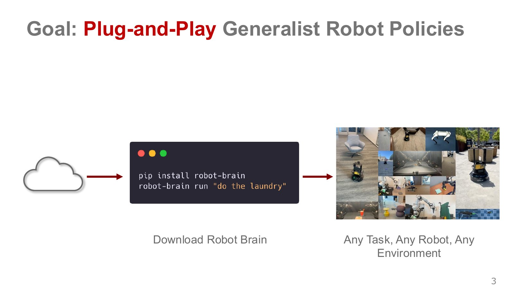

```text
Goal: Plug-and-Play Generalist Robot Policies

pip install robot-brain
robot-brain run "d

Download Robot Brain Any Task, Any Robot, Any
Environment
```

## Slide 5

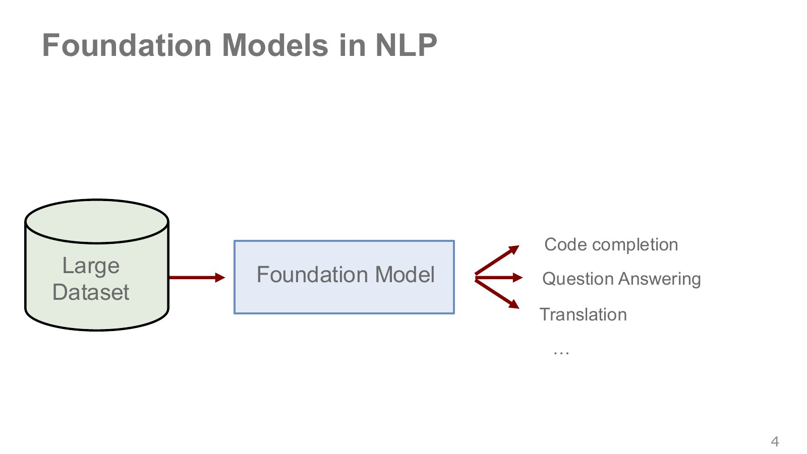

```text
Foundation Models in NLP

Large
Dataset

Code completion
Foundation Model Question Answering

Translation
```

## Slide 6

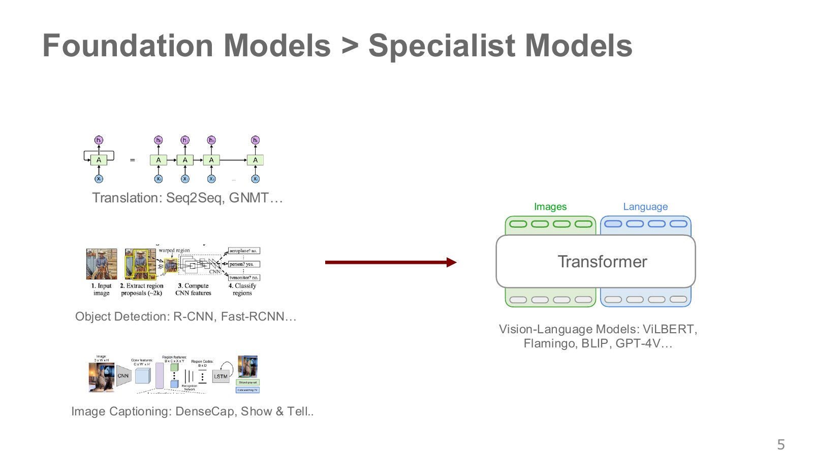

```text
Foundation Models > Specialist Models

® ® ® ® ®
- BREE

Translation: Seq2Seq, GNMT...

Images Language
Soc ) (@ & Gc
(‘ )( |

ee amare
Yee waa ----- Transformer

1. Input 2. Extract region 3. Compute Gonay

no poeta) Gennes | gin

Object Detection: R-CNN, Fast-RCNN...
Vision-Language Models: ViLBERT,
Flamingo, BLIP, GPT-4V...

Image Captioning: DenseCap, Show & Tell..
```

## Slide 7

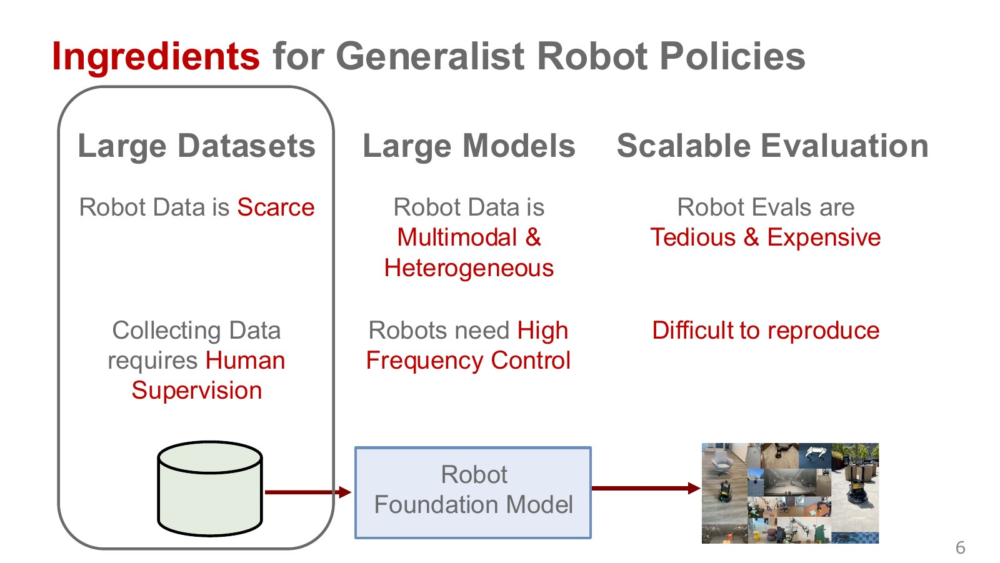

```text
Ingredients for Generalist Robot Policies

7

“

Large Datasets

Robot Data is Scarce

Collecting Data
requires Human
Supervision

Large Models

Robot Data is
Multimodal &
Heterogeneous

Robots need High
Frequency Control

Robot
Foundation Model

Scalable Evaluation

Robot Evals are
Tedious & Expensive

Difficult to reproduce
```

## Slide 8

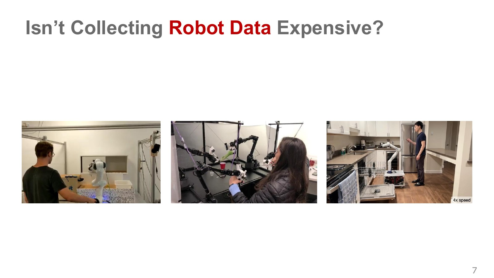

```text
Isn’t Collecting Robot Data Expensive?
```

## Slide 9

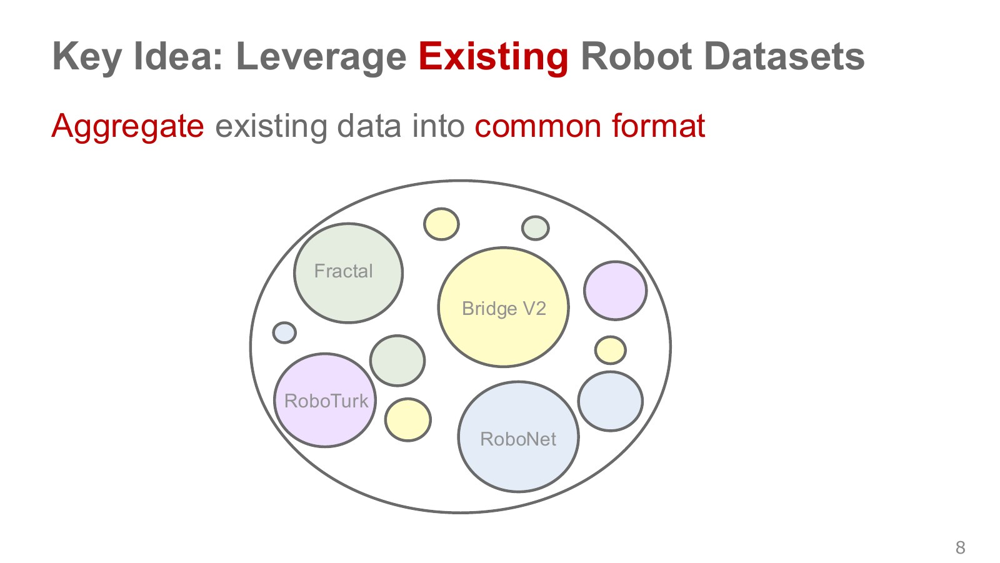

```text
Key Idea: Leverage Existing Robot Datasets

Aggregate existing data into common format

O oOo

Bridge V2 C)
RoboTurk QO C)
RoboNet
```

## Slide 10

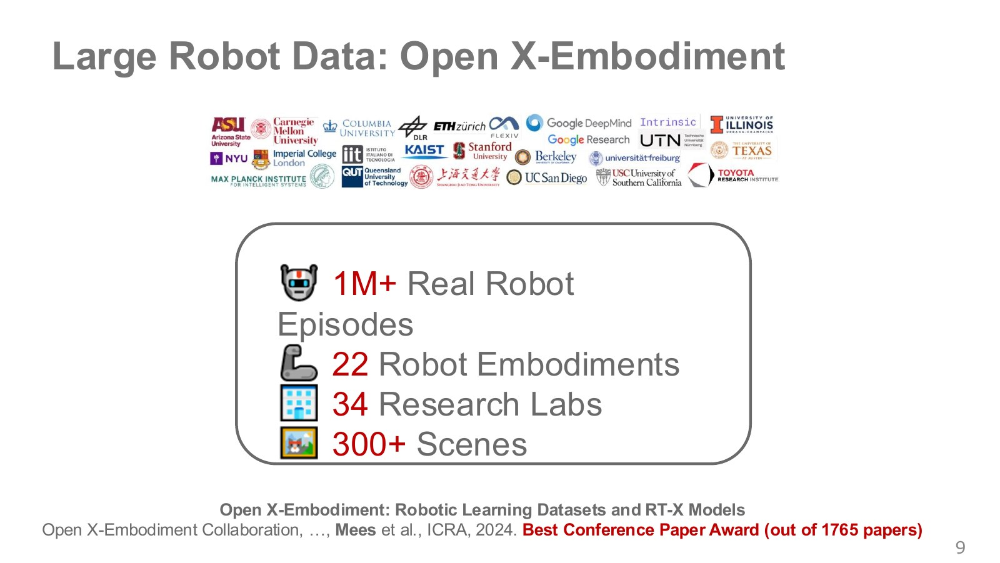

```text
Large Robot Data: Open X-Embodiment

ISU Sister a Sovinsie, @f Emtzirn ON © Goode dvenbind Tocrsowic
Giizona stato ~~ University : ens = Siaatard Google Research UTN ==
Eanvu Bi ree Coleoe FP kaist § Stanfers © Berkeley @) universtattreiburg

?) PPS, © HALE Oucsmpen Fe, C) we

=

MAX PANE

Va

1M+ Real Robot
Episodes

& 22 Robot Embodiments
34 Research Labs

\. Eel 300+ Scenes

Open X-Embodiment: Robotic Learning Datasets and RT-X Models
Open X-Embodiment Collaboration, ..., Mees et al., ICRA, 2024. Best Conference Paper Award (out of 1765 papers)
```

## Slide 11

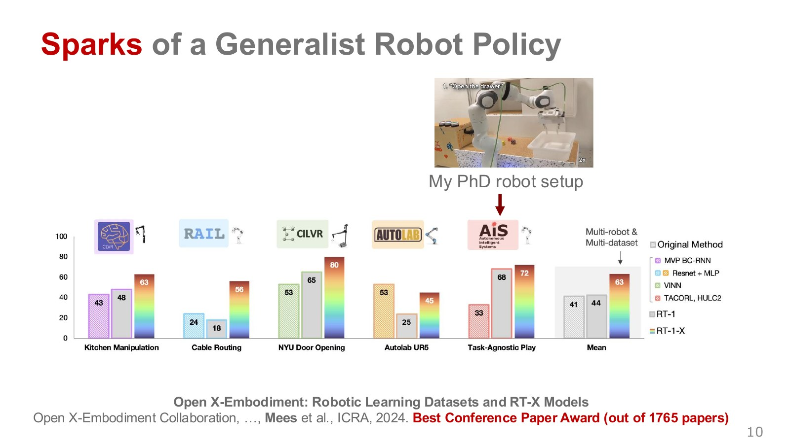

```text
Sparks of a Generalist Robot Policy

My PhD robot setup

1

Save 4 (AUTOLAD) < Ais * Multi-robot &

sige Multi-dataset - - Original Method

a MVP BC-RNN
68 72 © Resnet + MLP_
VINN
at 44 TACORL, HULC2
\ |RT-1
\ =RT-1-X

Kitchen Manipulation Cable Routing NYU Door Opening Autolab URS Task-Agnostic Play Mean

Open X-Embodiment: Robotic Learning Datasets and RT-X Models
Open X-Embodiment Collaboration, ..., Mees et al., ICRA, 2024. Best Conference Paper Award (out of 1765 papers)
```

## Slide 12

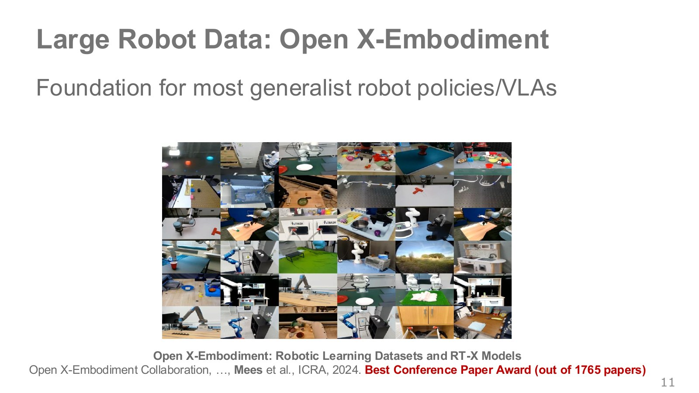

```text
Large Robot Data: Open X-Embodiment

Foundation for most generalist robot policies/VLAs

Open X-Embodiment: Robotic Learning Datasets and RT-X Models
Open X-Embodiment Collaboration, ..., Mees et al., ICRA, 2024. Best Conference Paper Award (out of 1765 papers)
```

## Slide 13

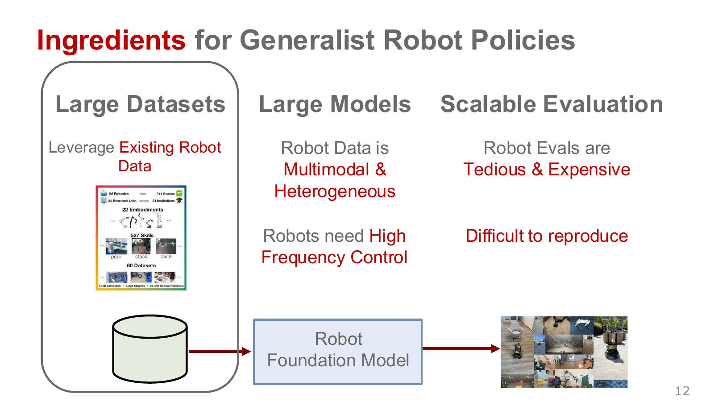

```text
Ingredients for Generalist Robot Policies

(- >

Large Datasets

Leverage Existing Robot
Data

ee
TB atrenemcs tat soon aan IP

ccnp

527 Skills

Large Models

Robot Data is
Multimodal &
Heterogeneous

Robots need High
Frequency Control

Scalable Evaluation

Robot Evals are
Tedious & Expensive

Difficult to reproduce

Robot
Foundation Model

12,
```

## Slide 14

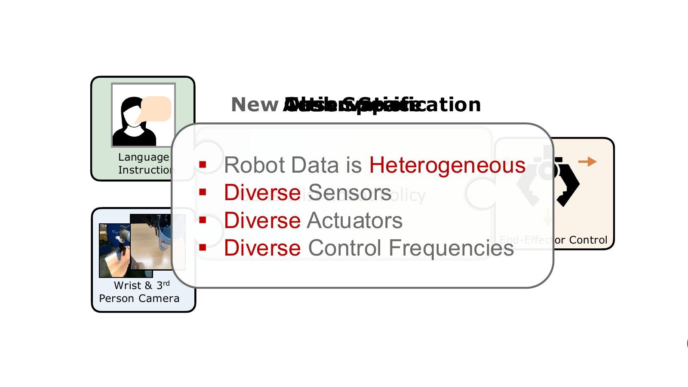

```text
| New Base Sfipatication

a

facture, © Robot Datais Heterogeneous fg
=» Diverse Sensors >
-

= Diverse Actuators
= Diverse Control Frequencies

ior Control

Wrist & 3'¢
Person Camera
```

## Slide 15

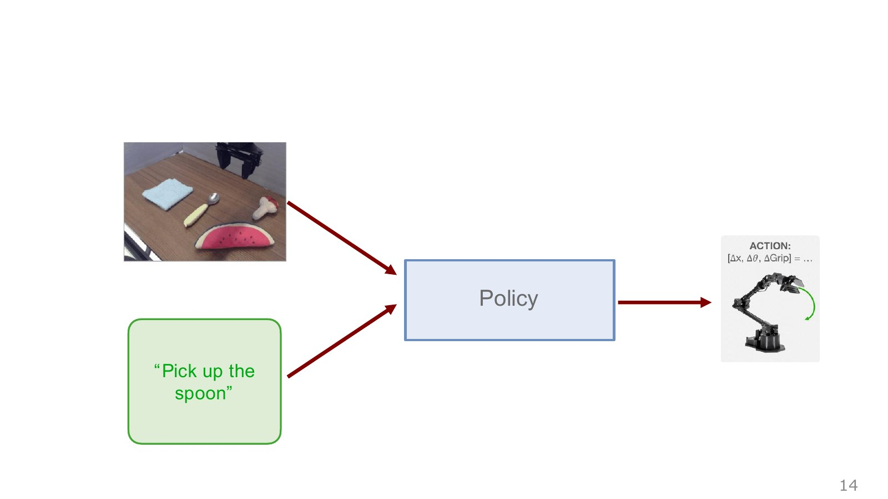

```text
“Pick up the
spoon”

Policy

ACTION:
[ax, A9, AGrip] = ...

14
```

## Slide 16

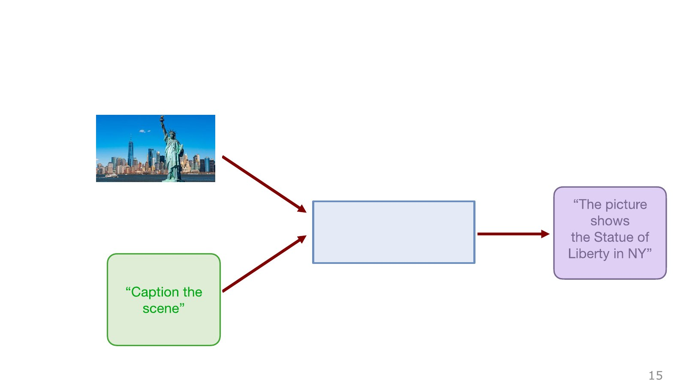

```text
“The picture
shows

the Statue of
Liberty in NY”

“Caption the
scene”

15
```

## Slide 17

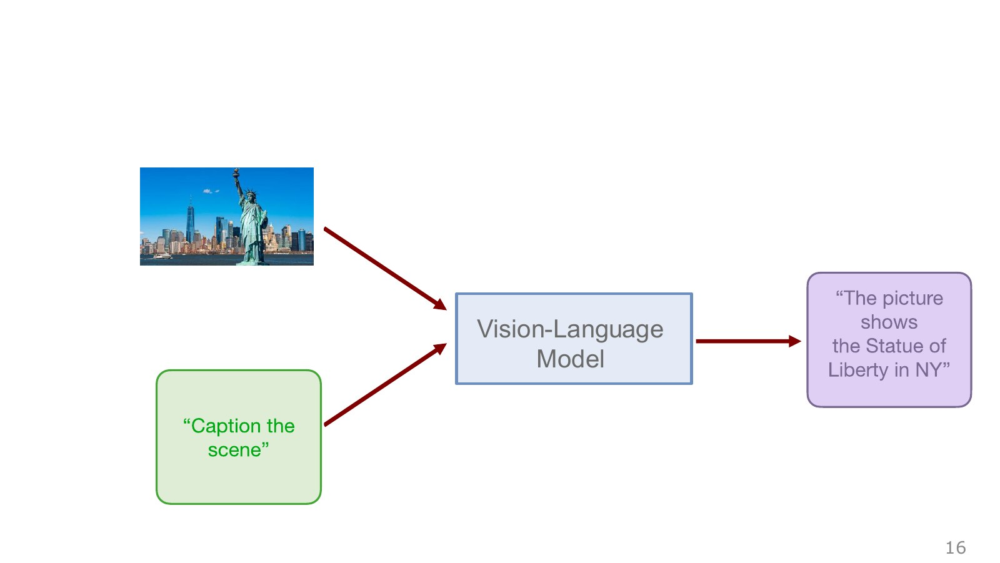

```text
“Caption the
scene”

Vision-Language
Model

“The picture
shows

the Statue of
Liberty in NY”

16
```

## Slide 18

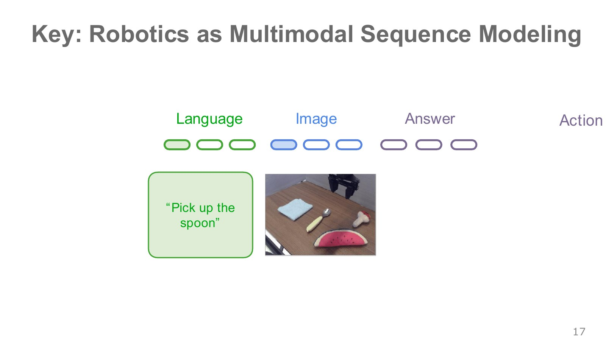

```text
Key: Robotics as Multimodal Sequence Modeling

Language Image Answer Action

Cpe CIC) GecaoCcy) CJ) CC) Cy)

“Pick up the

spoon”

17
```

## Slide 19

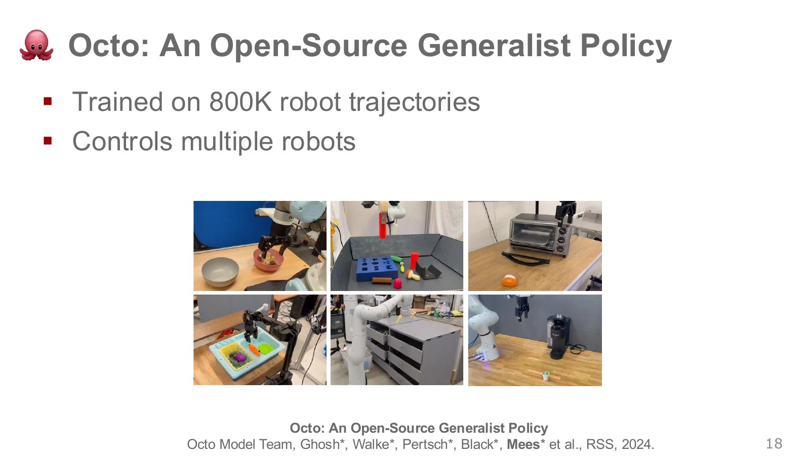

```text
R Octo: An Open-Source Generalist Policy

# Trained on 800K robot trajectories
= Controls multiple robots

Octo: An Open-Source Generalist Policy
Octo Model Team, Ghosh*, Walke*, Pertsch*, Black*, Mees* et al., RSS, 2024.

18
```

## Slide 20

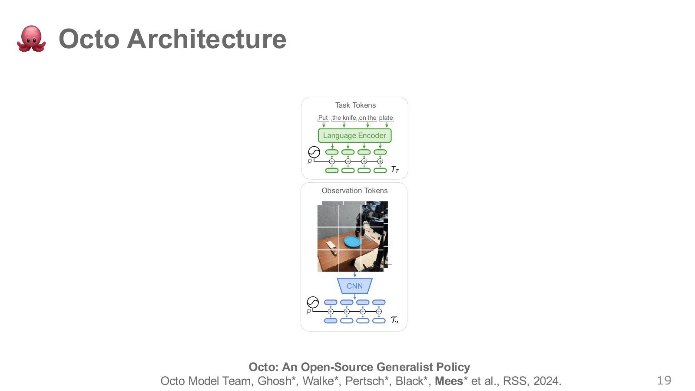

```text
SR Octo Architecture

Task Tokens

Put, the knife, on the, plate
+ + +

Language Encoder
{PE SE SRG
OPCeQ
Pp O-O-_O-®

SOOO

Observation Tokens

+

for!
ai
(ow?
(==)

Beeeoa
Pp O-O-_O-0
Q0O007

Octo: An Open-Source Generalist Policy

Octo Model Team, Ghosh*, Walke*, Pertsch*, Black*, Mees* et al., RSS, 2024.

19
```

## Slide 21

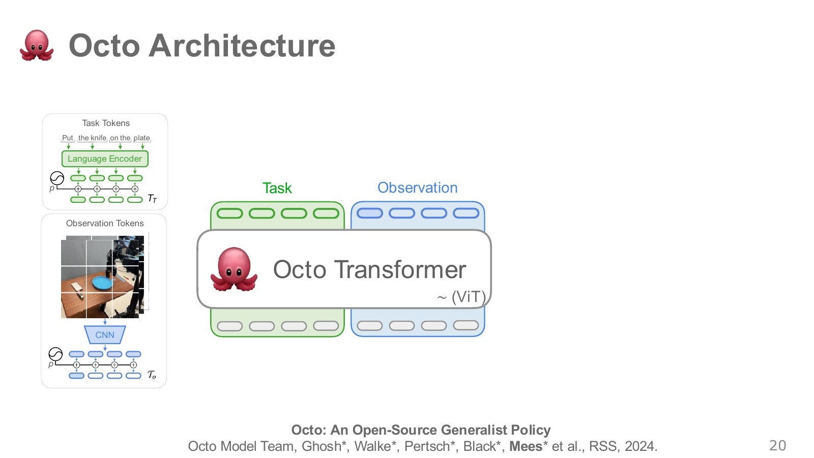

```text
SR Octo Architecture

Task Tokens

Put, the knife, on the, plate,
+ + +

EE aes
Task Observation

el eSSsSsscss

Observation Tokens

R Octo Transformer
~ (ViT

Octo: An Open-Source Generalist Policy

Octo Model Team, Ghosh*, Walke*, Pertsch*, Black*, Mees* et al., RSS, 2024.

20
```

## Slide 22

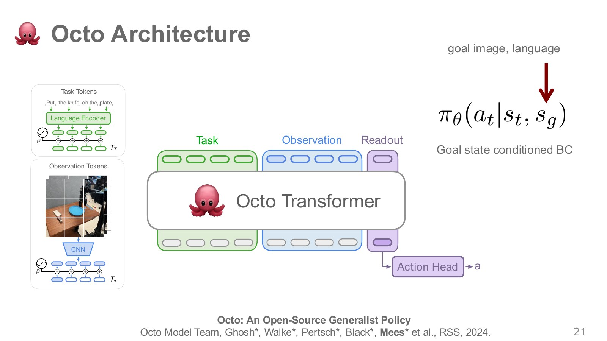

```text
SR Octo Architecture soal nave enguaee

Task Tokens i
Put, the knife, on the, plate,
+ +

+ +
To (at|St, Sg)
Task Observati Readout
p e-o, © as| servation eadou

CGOOOr Goal state conditioned BC

Observation Tokens (< JCICOUC >) (¢ > @¢ >) (« >|
R Octo Transformer

Action Head |>a

Octo: An Open-Source Generalist Policy
Octo Model Team, Ghosh*, Walke*, Pertsch*, Black*, Mees* et al., RSS, 2024. 21
```

## Slide 23

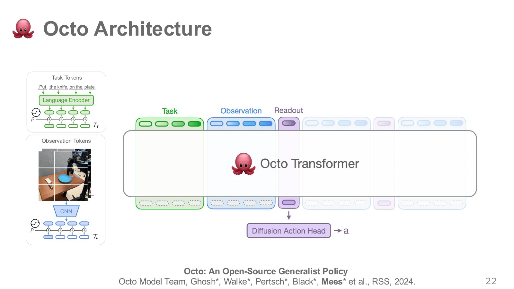

```text
SR Octo Architecture

Task Tokens

Put, the knife, on the, plate,
+ + + +

SB) = ee S Task Observation Readout

Observation Tokens

R Octo Transformer

Diffusion Action Head

~a

Octo: An Open-Source Generalist Policy

Octo Model Team, Ghosh*, Walke*, Pertsch*, Black*, Mees* et al., RSS, 2024.

22
```

## Slide 24

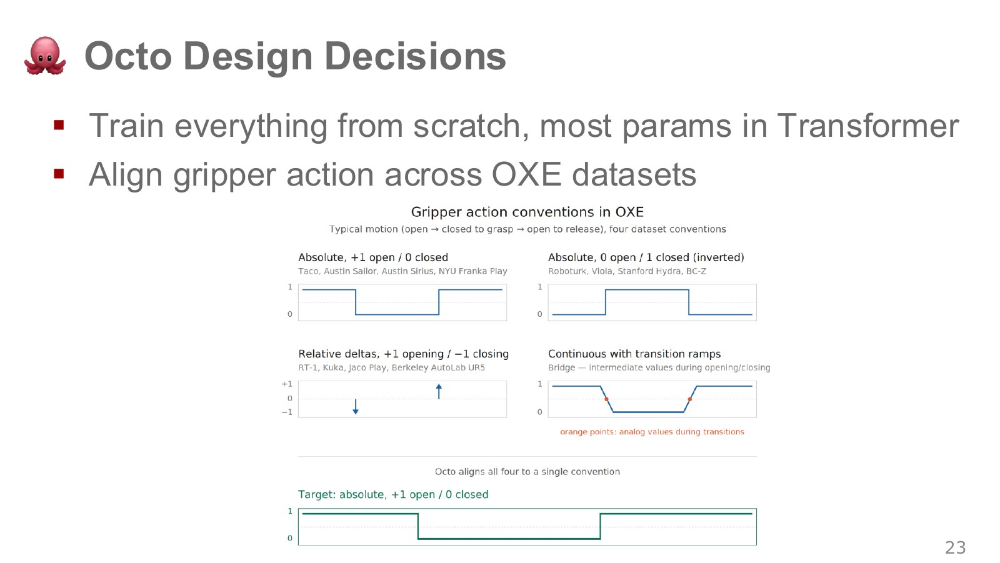

```text
R Octo Design Decisions

= Train everything from scratch, most params in Transformer
« Align gripper action across OXE datasets

Gripper action conventions in OXE
Typical motion (open - closed to grasp ~ open to release), four dataset conventions

Absolute, +1 open / 0 closed Absolute, 0 open / 1 closed (inverted)
Taco, Austin Sailor, Austin Sirius, NYU Franka Play Roboturk, Viola, Stanford Hydra, BC-Z
1 1
° °
Relative deltas, +1 opening / -1 closing Continuous with transition ramps
RT-1, Kuka, Jaco Play, Berkeley AutoLab URS Bridge - intermediate values during opening/closing

a ' ,
: a, a ca
4 4 o

Octo aligns all four to a single convention

Target: absolute, +1 open / 0 closed

¥

0

23
```

## Slide 25

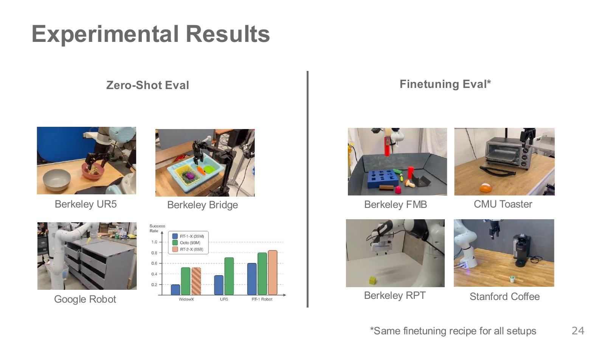

```text
Experimental Results

Zero-Shot Eval

{ @ erixesm
104-1 cto eam
B rex 656)

Google Robot

Finetuning Eval*

Berkeley RPT Stanford Coffee

*Same finetuning recipe for all setups

24
```

## Slide 26

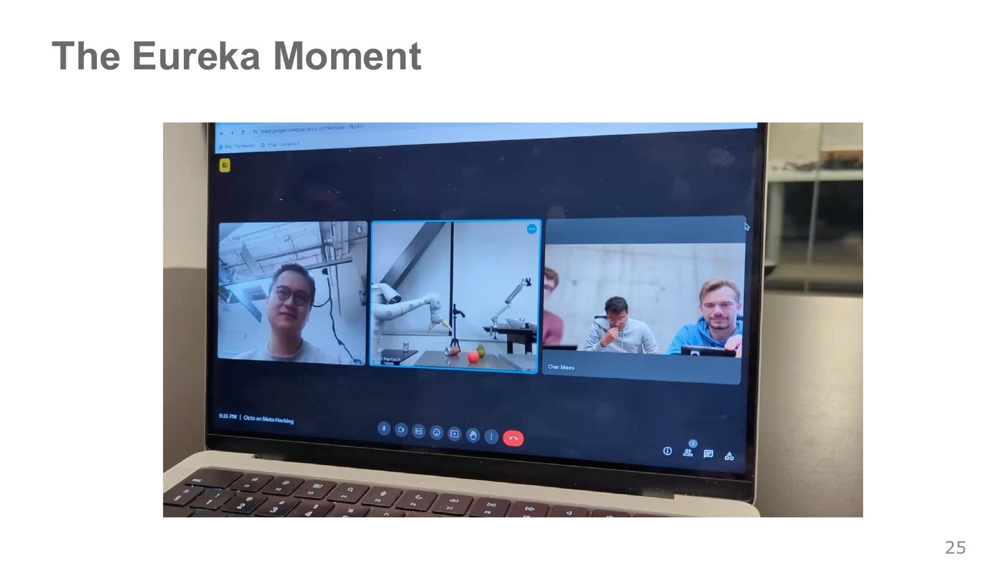

```text
The Eureka Moment

25
```

## Slide 27

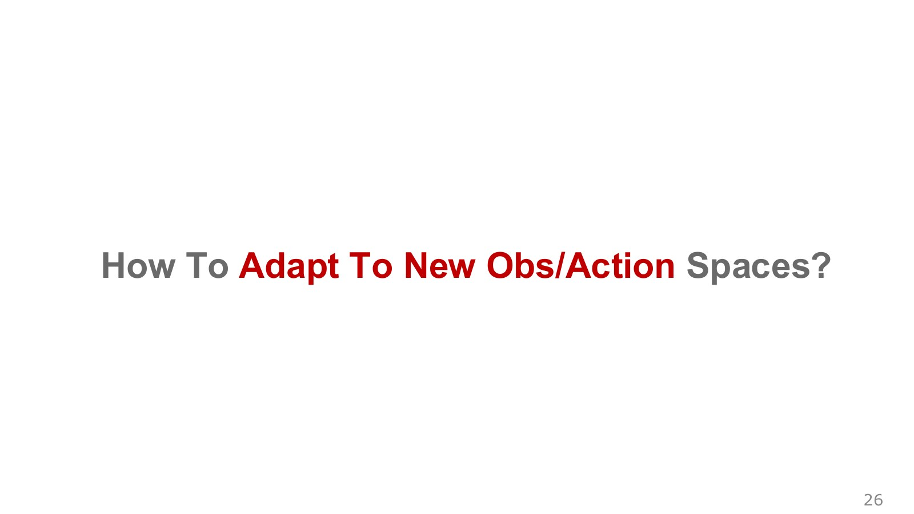

```text
How To Adapt To New Obs/Action Spaces?

26
```

## Slide 28

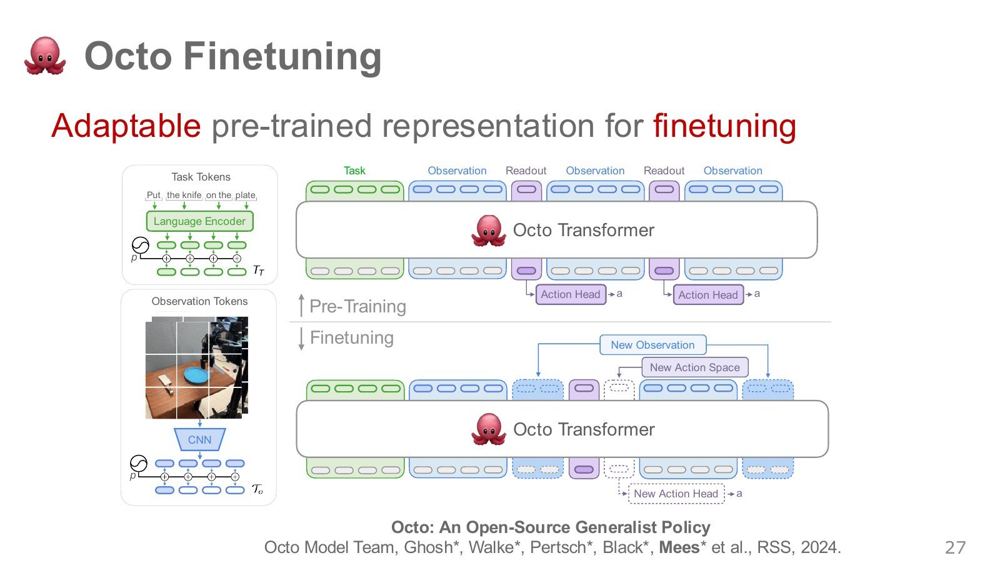

```text
R Octo Finetuning

Adaptable pre-trained representation for finetuning

Task Tokens Task Observation Readout Observation Readout Observation

Put, the knife on the, plate,
+ 4 4 +

Rg Octo Transformer
DOOOoQ
QESTS Geooeoco we eooo we eoons)

(Action Head }>a (action Head }+a

Observation Tokens t Pre-Training

| Finetuning
SSsaSsse se S

Ssso aa

| R Octo Transformer |

QAeeoo
Pp -O-

@OOO7

Octo: An Open-Source Generalist Policy
Octo Model Team, Ghosh*, Walke*, Pertsch*, Black*, Mees* et al., RSS, 2024. 27
```

## Slide 29

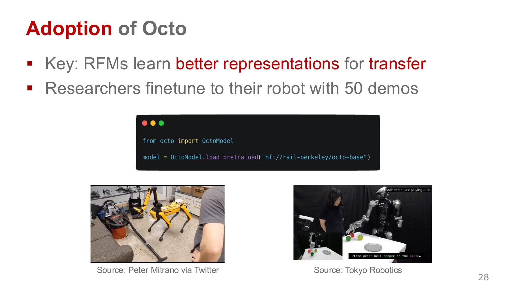

```text
Adoption of Octo

» Key: RFMs learn better representations for transfer
= Researchers finetune to their robot with 50 demos

Source: Peter Mitrano via Twitter Source: Tokyo Robotics

28
```

## Slide 30

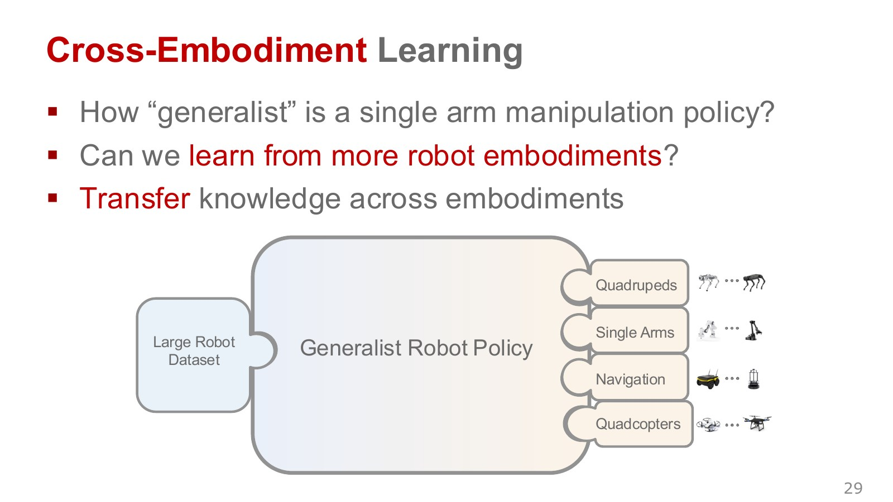

```text
Cross-Embodiment Learning

" How “generalist” is a single arm manipulation policy?
= Can we learn from more robot embodiments?
= Transfer knowledge across embodiments

Quadrupeds

S

; . Single Arms | #- °°
Large Robot Generalist Robot Policy C sine ms

»

Dataset

Y
Quadcopters

29
```

## Slide 31

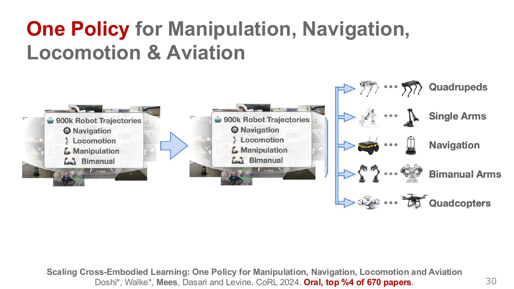

```text
One Policy for Manipulation, Navigation,
Locomotion & Aviation

900k Robot Trajectories |.
@ Navigation

} Locomotion

& Manipulation

&& Bimanual

@ 900k Robot Trajectories |.
® Navigation

} Locomotion
& Manipulation
&& Bimanual

ap SF) °° 8) Quadrupeds
ae eas sale } Single Arms

>= eee i Navigation

p> > see - Bimanual Arms

D> BP ooo “BB quadcopters

Scaling Cross-Embodied Learning: One Policy for Manipulation, Navigation, Locomotion and Aviation
Doshi*, Walke*, Mees, Dasari and Levine. CoRL 2024. Oral, top %4 of 670 papers. 30
```

## Slide 32

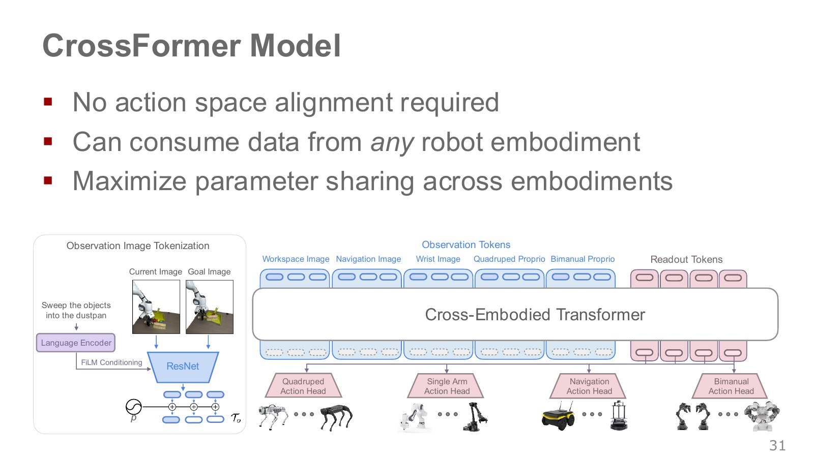

```text
CrossFormer Model

# No action space alignment required
= Can consume data from any robot embodiment
«» Maximize parameter sharing across embodiments

Observation Image Tokenization Observation Tokens
Workspace Image Navigation mage Wrist Image Quadruped Proprio Bimanual Proprio Readout Tokens

Curent mage, Goal image fecegecsesleres(ereslese) Ferrel)

Sweep the objects ‘
bine dene ons in | Cross-Embodied Transformer

Eau ol = deanna Se fresacl SIE lceadies JES a 3) lololel|s)

FILM Conditioning
eee LN Action Head Action Head Action Head
9 SE85 MH HM aN a £9. OD

31
```

## Slide 33

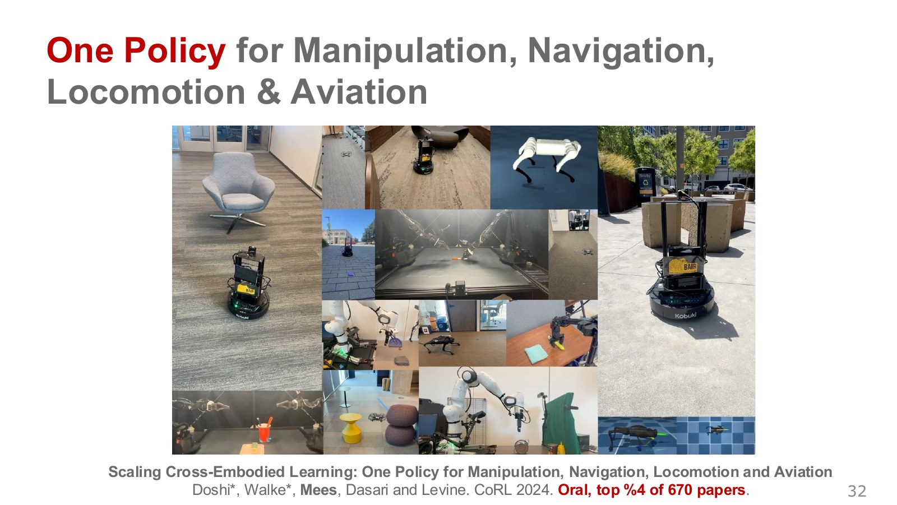

```text
One Policy for Manipulation, Navigation,
Locomotion & Aviation

Scaling Cross-Embodied Learning: One Policy for Manipulation, Navigation, Locomotion and Aviation
Doshi*, Walke*, Mees, Dasari and Levine. CoRL 2024. Oral, top %4 of 670 papers. 32
```

## Slide 34

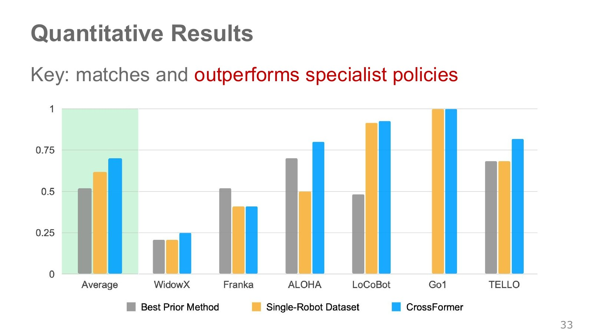

```text
Quantitative Results

Key: matches and outperforms specialist policies

Average WidowX Franka ALOHA LoCoBot Got TELLO

1

0.7

a

0.

a

0.2

a

oO

©) Best Prior Method !) Single-Robot Dataset 1 CrossFormer
33
```

## Slide 35

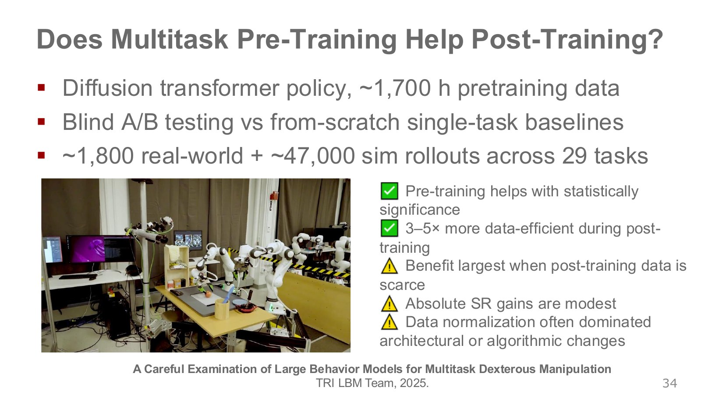

```text
Does Multitask Pre-Training Help Post-Training?

« Diffusion transformer policy, ~1,700 h pretraining data
« Blind A/B testing vs from-scratch single-task baselines
» ~1,800 real-world + ~47,000 sim rollouts across 29 tasks

Pre-training helps with statistically
significance

3--5* more data-efficient during post-
training

A Benefit largest when post-training data is
scarce

A Absolute SR gains are modest

A Data normalization often dominated
architectural or algorithmic changes

A Careful Examination of Large Behavior Models for Multitask Dexterous Manipulation
TRI LBM Team, 2025. 34
```

## Slide 36

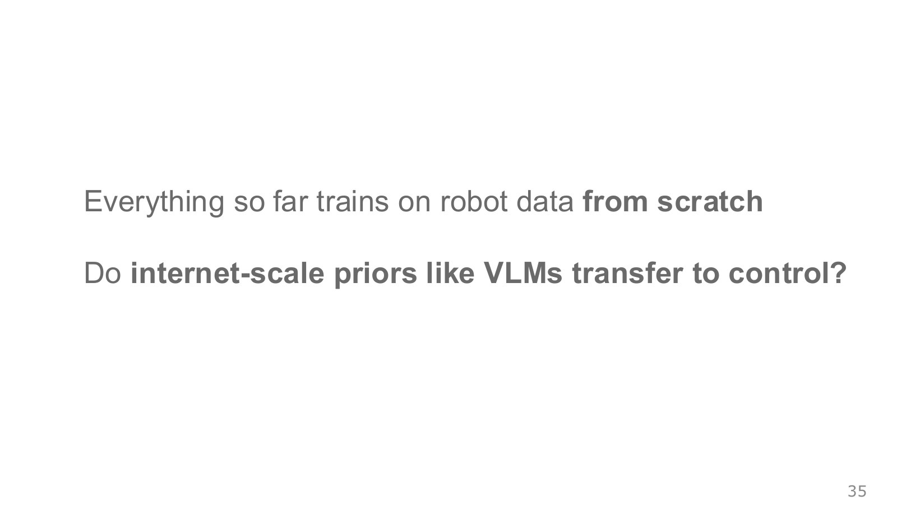

```text
Everything so far trains on robot data from scratch

Do internet-scale priors like VLMs transfer to control?

35
```

## Slide 37

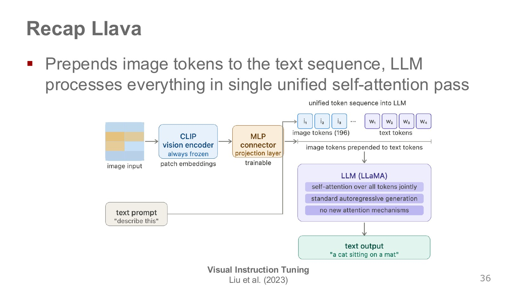

```text
Recap Llava

» Prepends image tokens to the text sequence, LLM
processes everything in single unified self-attention pass

unified token sequence into LLM

iy in is | + | Wi we || Ws |} Wa
CLIP MLP image tokens (196) text tokens
-) di ->+ 1
vision encoder connector image tokens prepended to text tokens
al always frozen rojection layer
image input patch embeddings trainable
LLM (LLaMA)
self-attention over all tokens jointly
text prompt | Renew attention mechanisms
"describe this" J i
text output
"a cat sitting on a mat"

Visual Instruction Tuning
Liu et al. (2023)
```

## Slide 38

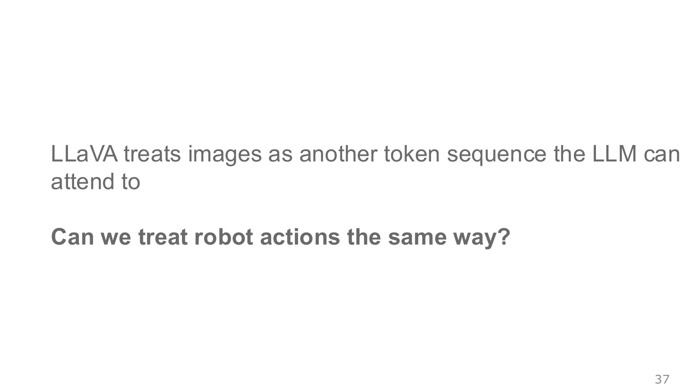

```text
LLaVA treats images as another token sequence the LLM can
attend to

Can we treat robot actions the same way?

37
```

## Slide 39

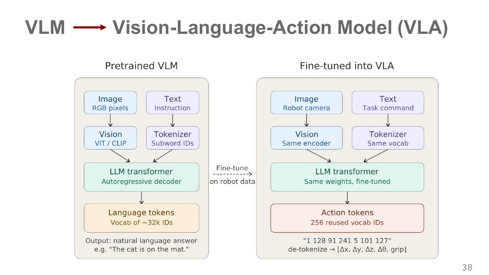

```text
Pretrained VLM

Image | | Text
RGB pixels Instruction

Vision | | Tokenizer
ViT / CLIP Subword IDs

NS

LLM transformer
Autoregressive decoder

Language tokens
Vocab of ~32k IDs

Output: natural language answer
e.g. "The cat is on the mat."

_4

on robot data

VLM - Vision-Language-Action Model (VLA)

Fine-tuned into VLA

Z
Image | Text

Robot camera

Task command

Vision | |
Same encoder

Tokenizer
Same vocab

SS

LLM transformer
Same weights, fine-tuned

Action tokens
256 reused vocab IDs

PIGl28/91) 2415 10127

de-tokenize - [Ax, Ay, Az, A®, grip]

38
```

## Slide 40

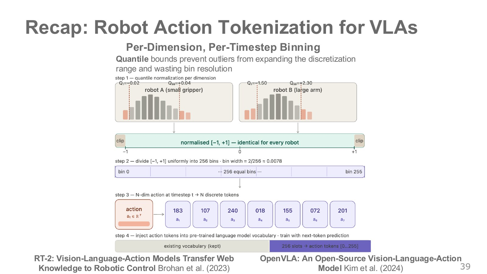

```text
Recap: Robot Action Tokenization for VLAs

Per-Dimension, Per-Timestep Binning
Quantile bounds prevent outliers from expanding the discretization

range and wasting bin resolution

step 1 quantile normalization per dimension
Qi Qoo=+0.04 Qi=H1:50

i robot A (smal gripper)
lll: alll.

ip normalised [-1, +1] - identical for every robot cin
“1 0 +1

step 2 - divide [-1, +1] uniformly into 256 bins - bin width = 2/256 = 0.0078

| bino | + 256 equal bins -- bin 286]

|

step 3 - N-dim action at timestep t > N discrete tokens

action 183 107 240 018 155 072 201
are R”
a az as aa as as a
SS

step 4 - inject action tokens into pre-trained language model vocabulary - train with next-token prediction

RT-2: Vision-Language-Action Models Transfer Web OpenVLA: An Open-Source Vision-Language-Action
Knowledge to Robotic Control Brohan et al. (2023) Model Kim et al. (2024) 39
```

## Slide 41

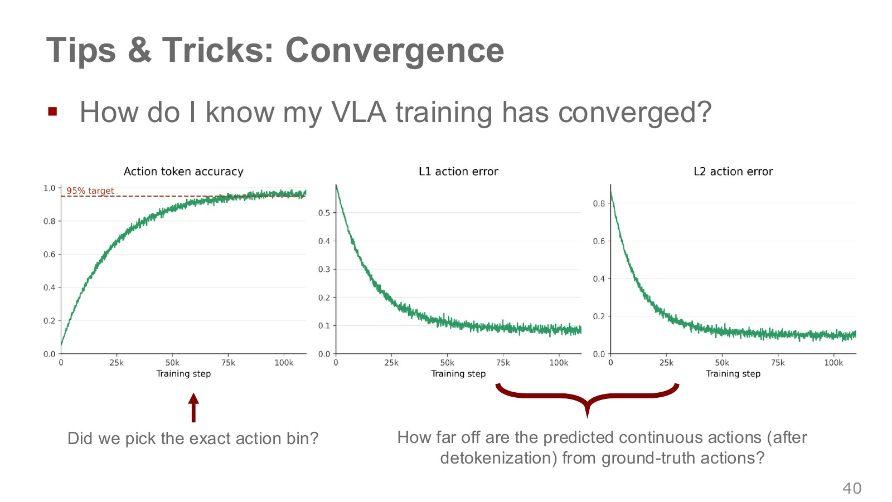

```text
Tips & Tricks: Convergence

" How do! know my VLA training has converged?

Action token accuracy L1 action error L2 action error

0.8

0.5

0.4 0.6

03
0.4

0.2
0.2

0.1

0.0 0.0

oO 25k 50k 75k 100k oO 25k 50k 75k 100k 0 25k 50k 75k 100k
Training step Training step Training step
Did we pick the exact action bin? How far off are the predicted continuous actions (after

detokenization) from ground-truth actions?
40
```

## Slide 42

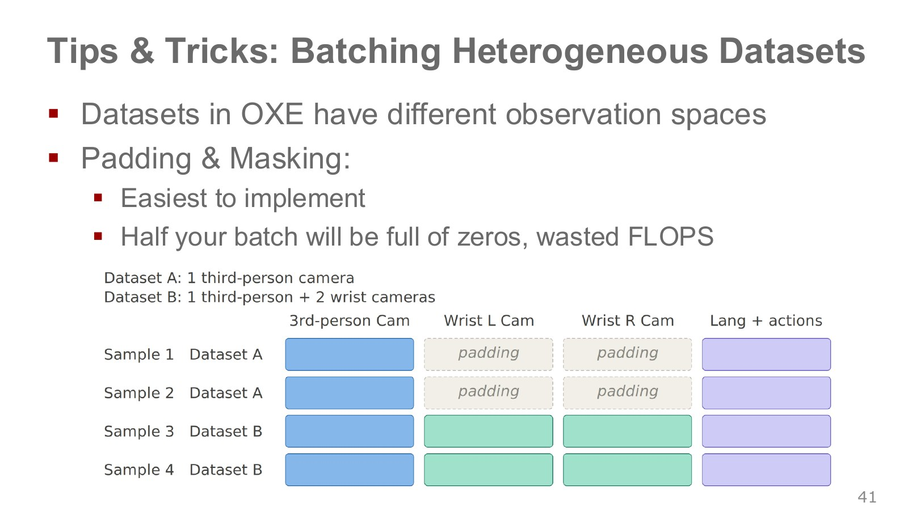

```text
Tips & Tricks: Batching Heterogeneous Datasets

= Datasets in OXE have different observation spaces
» Padding & Masking:

« Easiest to implement

" Half your batch will be full of zeros, wasted FLOPS

Dataset A: 1 third-person camera
Dataset B: 1 third-person + 2 wrist cameras

3rd-person Cam Wrist L Cam Wrist R Cam Lang + actions

Sample 1 Dataset A
Sample 2 Dataset A
Sample 3 Dataset B

Sample 4 Dataset B
```

## Slide 43

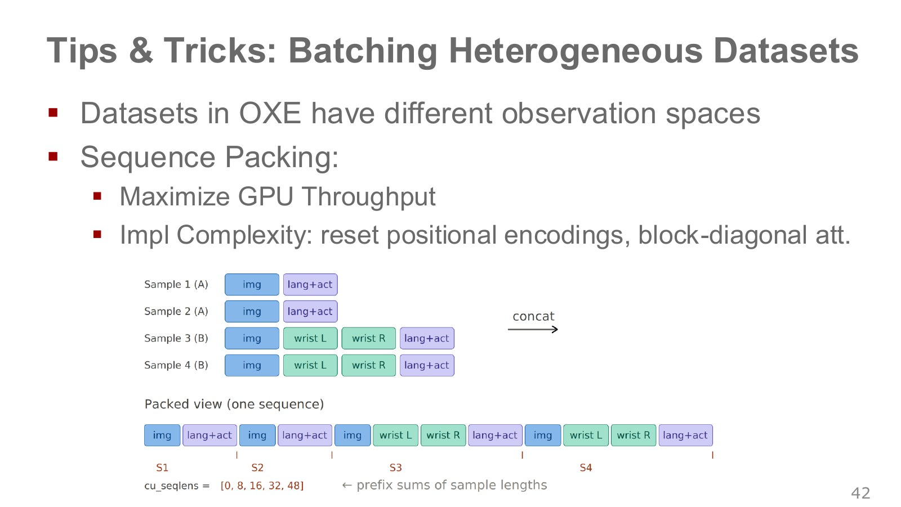

```text
Tips & Tricks: Batching Heterogeneous Datasets

« Datasets in OXE have different observation spaces

=» Sequence Packing:
= Maximize GPU Throughput
« Impl Complexity: reset positional encodings, block-diagonal att.

Sample 1 (A) (ima)
Sample 2 (A) {img | concat

Packed view (one sequence)

[| os (i wt is] sa (wt st] moss
| | I I

sl S2. S3 S4

cu_seglens = [0, 8, 16, 32, 48] «© prefix sums of sample lengths 42
```

## Slide 44

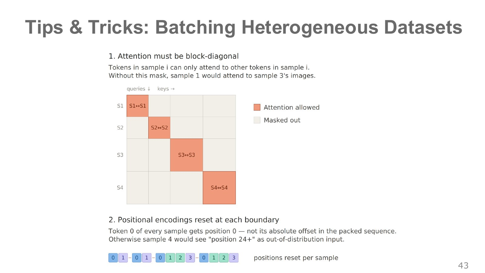

```text
Tips & Tricks: Batching Heterogeneous Datasets

1. Attention must be block-diagonal

Tokens in sample i can only attend to other tokens in sample i.
Without this mask, sample 1 would attend to sample 3's images.

queries L| keys >

sl 1 Attention allowed

Masked out
s2

S3

$4

2. Positional encodings reset at each boundary

Token 0 of every sample gets position 0 - not its absolute offset in the packed sequence.

Otherwise sample 4 would see "position 24+" as out-of-distribution input.

(0) () -Be\2) BEB) positions reset per sample

43
```

## Slide 45

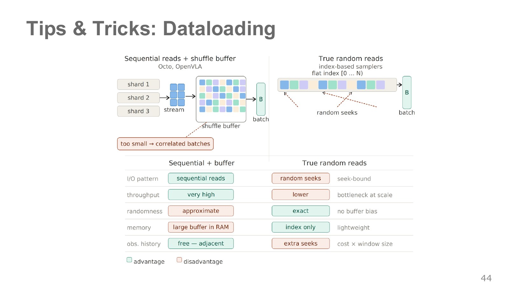

```text
Tips & Tricks: Dataloading

Sequential reads + shuffle buffer True random reads

Octo, OpenVLA index-based samplers
flat index [0 ... N)

shard1 >
shard 2 _§8-
shard 3 | stream random seeks batch
batch
too small > correlated batches
Sequential + buffer True random reads

I/O pattern sequential reads random seeks } seek-bound

throughput very high lower bottleneck at scale

no buffer bias

memory large buffer in RAM index only lightweight

extra seeks cost x window size

( J (

( } (
randomness [approximate { exact

( ) (

( ) (

}
}

obs. history free - adjacent

O advantage O disadvantage

44
```

## Slide 46

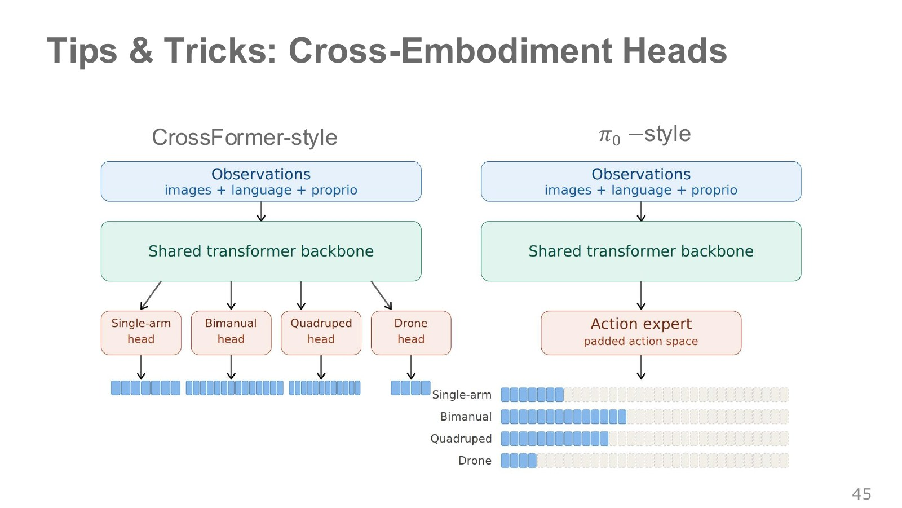

```text
Tips & Tricks: Cross-Embodiment Heads

CrossFormer-style

Observations
images + language + proprio

| Observations
images + language + proprio

L

L

Shared transformer backbone

| | Shared transformer backbone

Single-arm Bimanual Quadruped Drone Action expert
head head head head padded action space
CT

Bimanual §UGSGROR0RR008
Quadruped GUSSOOGRSRES
Drone §U08

45
```

## Slide 47

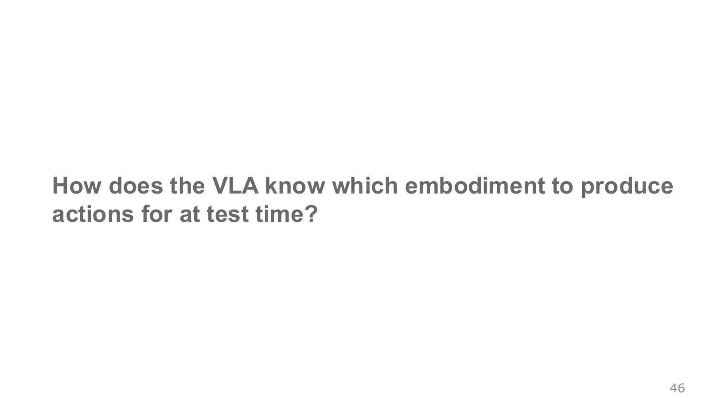

```text
How does the VLA know which embodiment to produce
actions for at test time?

46
```

## Slide 48

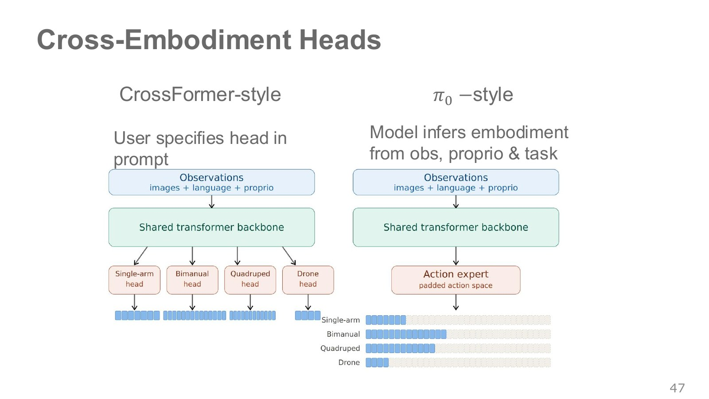

```text
Cross-Embodiment Heads

CrossFormer-style TM, -Style
User specifies head in Model infers embodiment
prompt from obs, proprio & task

| Observations | | Observations |
images + language + proprio images + language + proprio

| Shared transformer backbone | | Shared transformer backbone |
Single-arm Bimanual Quadruped Drone Action expert
head head head head padded action space

Se eee |

Bimanual JB
Quadruped MBB
Drone §UG8

47
```

## Slide 49

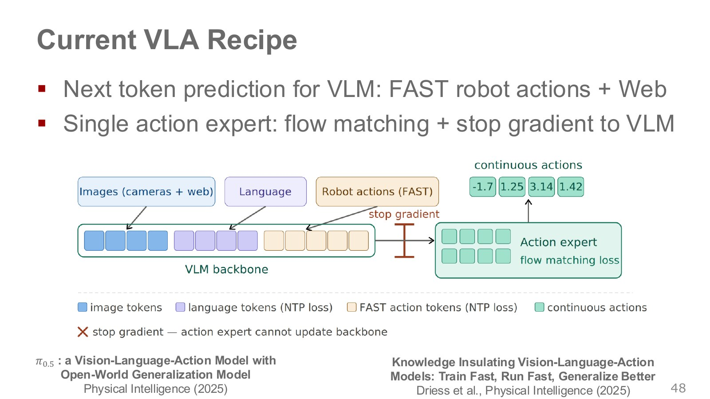

```text
Current VLA Recipe

« Next token prediction for VLM: FAST robot actions + Web
# Single action expert: flow matching + stop gradient to VLM

continuous actions

Images (cameras + web)| | Language | | Robot actions (FAST) | -1.7)(2.25 3.14)(1.42

stop gradient

CL COOO+ eae Acton expert

Saas flow matching loss
VLM backbone

@image tokens () language tokens (NTP loss) () FAST action tokens (NTP loss) (continuous actions

X stop gradient - action expert cannot update backbone

Ts : a Vision-Language-Action Model with Knowledge Insulating Vision-Language-Action
Open-World Generalization Model Models: Train Fast, Run Fast, Generalize Better
Physical Intelligence (2025) Driess et al., Physical Intelligence (2025) 48
```

## Slide 50

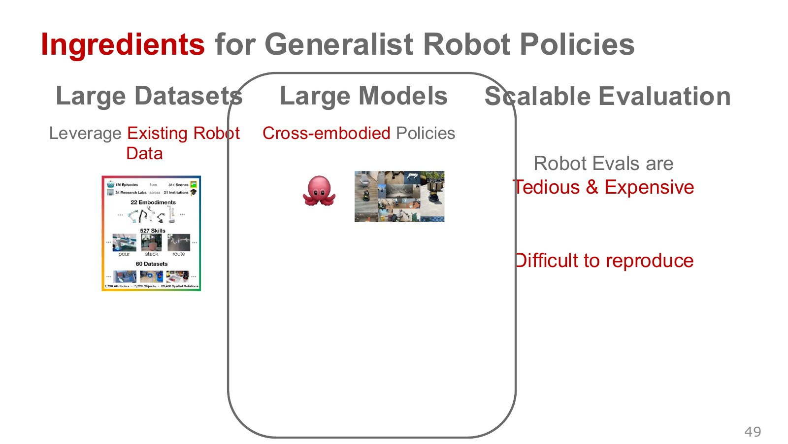

```text
Ingredients for Generalist Robot Policies
Large Datasets Large Models | Syalable Evaluation

Leverage Existing Robpt Cross-embodied Policies
Hele Robot Evals are

Fee. Tedious & Expensive
== || & Be

ope Difficult to reproduce
```

## Slide 51

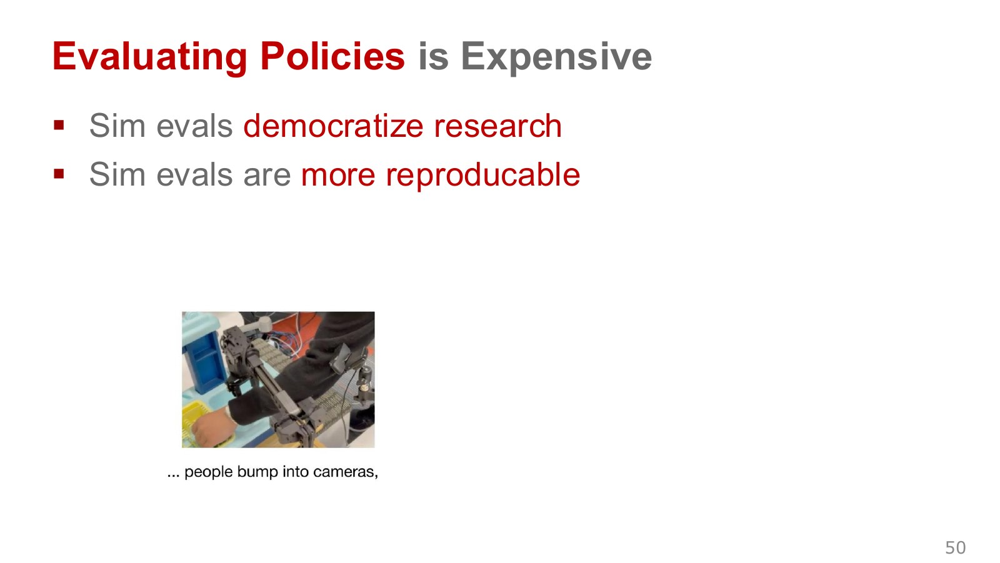

```text
Evaluating Policies is Expensive

=» Sim evals democratize research
= Sim evals are more reproducable

... people bump into cameras,

50
```

## Slide 52

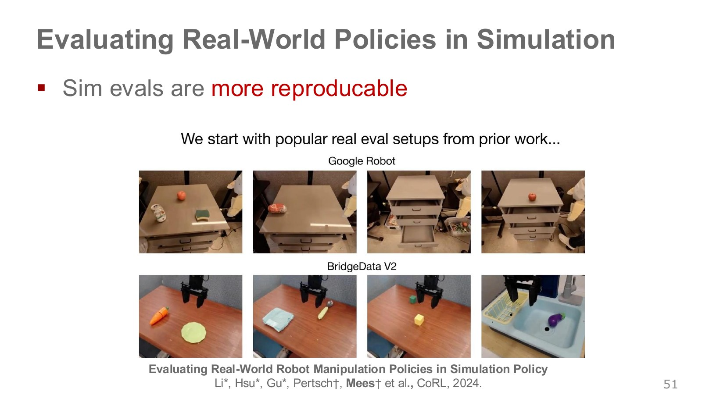

```text
Evaluating Real-World Policies in Simulation
= Sim evals are more reproducable

We start with popular real eval setups from prior work...
Google Robot

Evaluating Real-World Robot Manipulation Policies in Simulation Policy
Li*, Hsu*, Gu*, Pertscht, Meest et al., CoRL, 2024. 51
```

## Slide 53

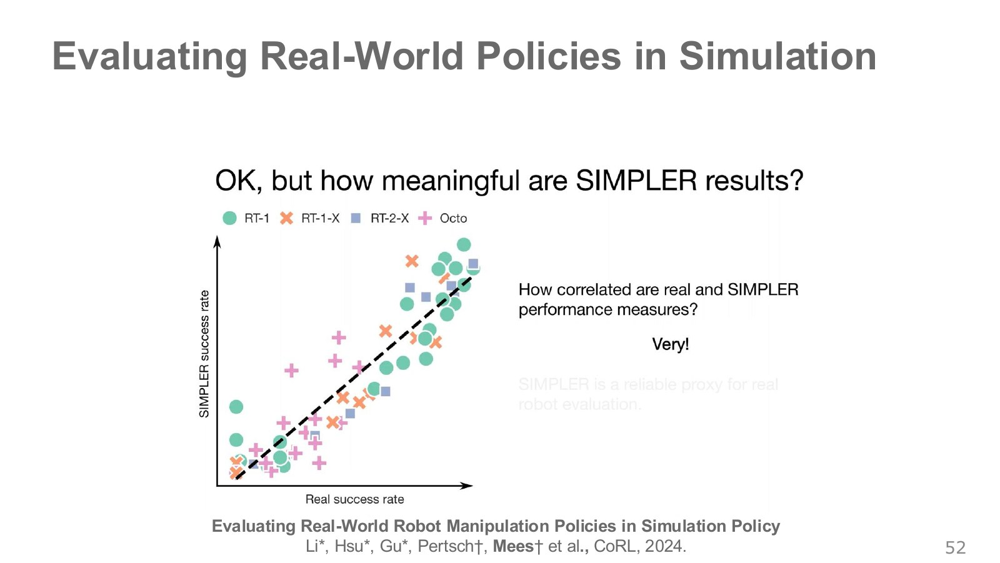

```text
Evaluating Real-World Policies in Simulation

OK, but how meaningful are SIMPLER results?

@ AT-1 %& AT1-X BM RE2-X “ Octo

td
* Jez

2 a. on How correlated are real and SIMPLER
& °- eo performance measures?
3 + % 3G Very!
a 7
z % sou
=|@ CAS
or) ot a

+, A x

® + 2 in +

Real success rate

Evaluating Real-World Robot Manipulation Policies in Simulation Policy
Li*, Hsu*, Gu*, Pertscht, Meest et al., CoRL, 2024.
```

## Slide 54

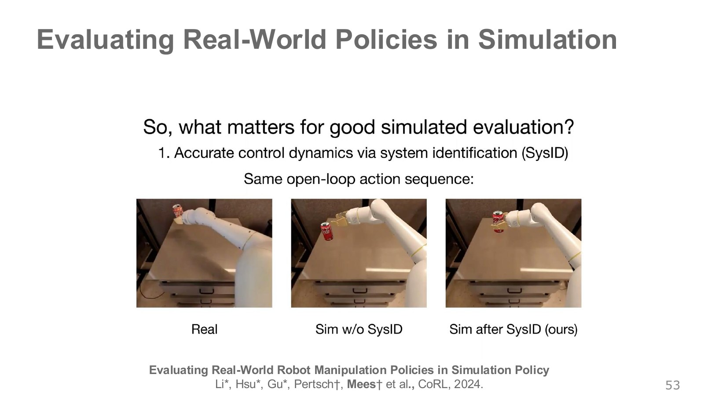

```text
Evaluating Real-World Policies in Simulation

So, what matters for good simulated evaluation?
1. Accurate control dynamics via system identification (SysID)

Same open-loop action sequence:

ce

Sim w/o SysID Sim after SysID (ours)

Evaluating Real-World Robot Manipulation Policies in Simulation Policy
Li*, Hsu*, Gu*, Pertscht, Meest et al., CoRL, 2024. 53
```

## Slide 55

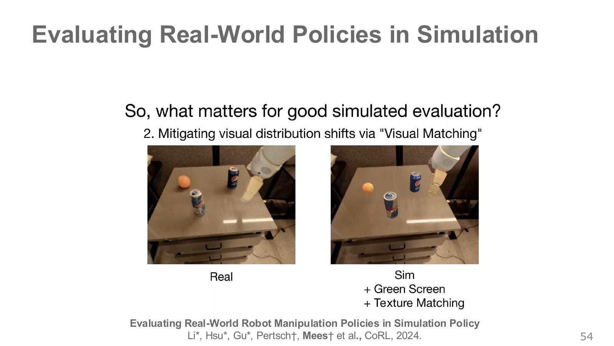

```text
Evaluating Real-World Policies in Simulation

So, what matters for good simulated evaluation?
2. Mitigating visual distribution shifts via "Visual Matching"

Real Sim
+ Green Screen
+ Texture Matching

Evaluating Real-World Robot Manipulation Policies in Simulation Policy
Li*, Hsu*, Gu*, Pertscht, Meest et al., CoRL, 2024. 54
```

## Slide 56

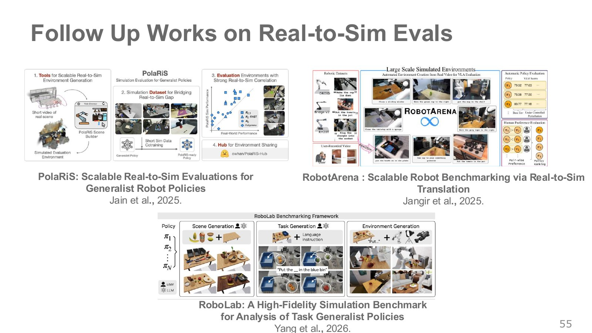

```text
Follow Up Works on Real-to-Sim Evals

“Anomas Poley akon

@ » 70
@ ne 7x

PolaRiS 3, Evaluation Environments with
‘Strong Real-to-Sim Correlation

1. Tools for Scalable Real-to-Sim

Environment Generation ‘Simulation Evaluation for Generalist Policies

2. Simulation Dataset for Bridging
Real-to-Sim Gap

Shor video of

real oer
Pola Soene
ulder
short sim Data
) Covraining 4, Hub for Environment Sharing
Simulated Evaluation : Fane
Snowe creates S228

PolaRiS: Scalable Real-to-Sim Evaluations for RobotArena : Scalable Robot Benchmarking via Real-to-Sim
Translation

Generalist Robot Policies
Jain et al., 2025. Jangir et al., 2025.

RoboLab Benchmarking Framework
Policy Scene Generation & Task Generation & si Environment Generation

+> pe, te, ee Oe

‘| Pe. Bisse Che ‘Sty,
bos Eo

aw od .
Let et A High-Fidelity Simulation Benchmark
for Analysis of Task Generalist Policies 55

Yana et al., 2026.
```

## Slide 57

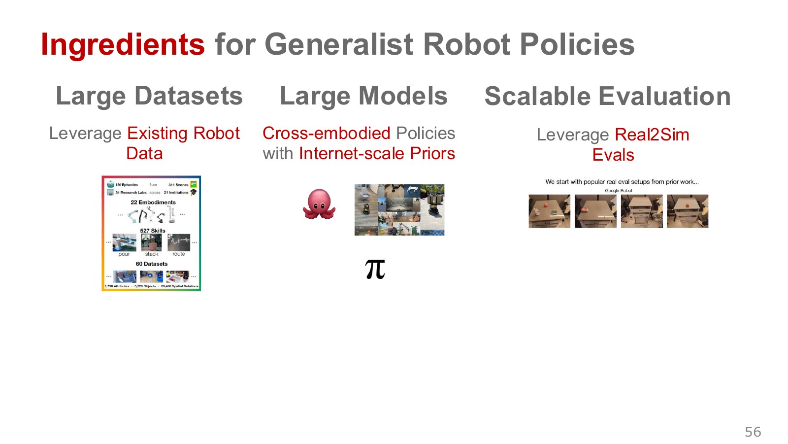

```text
Ingredients for Generalist Robot Policies

Large Datasets Large Models Scalable Evaluation

Leverage Existing Robot Cross-embodied Policies Leverage Real2Sim
Data with Internet-scale Priors Evals
Peon R | wy
nt = BSEeEe
Bo Eoe 7

56
```

## Slide 58


```text
Thank you for your attention
```

## Slide 59

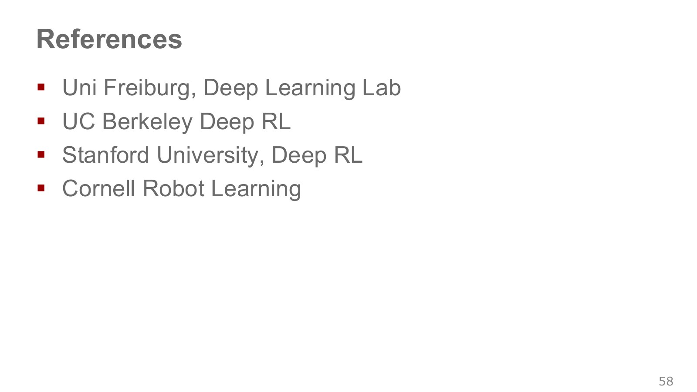

```text
References

# Uni Freiburg, Deep Learning Lab
«" UC Berkeley Deep RL

« Stanford University, Deep RL

« Cornell Robot Learning

58
```

---

[← Course home](../README.md) · [Open optional slide gallery →](../curriculum/week-09-generalist-policies.md)
