# Week 10 - Embodied Reasoning and Test-time Scaling: OCR transcript

[← Course home](../README.md) · **Default OCR view** · [Open optional slide gallery →](../curriculum/week-10-embodied-reasoning.md)

> This is an automated OCR transcript generated from the locally rendered slide images. Use the image as the source of truth for equations, diagrams, citations, and small text.

## Slide 1

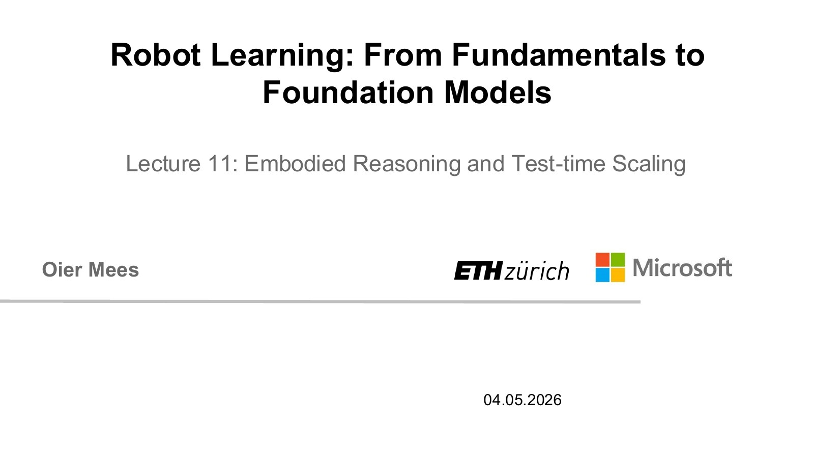

```text
Robot Learning: From Fundamentals to
Foundation Models

Lecture 11: Embodied Reasoning and Test-time Scaling

Oier Mees ETHzirich §® Microsoft

04.05.2026
```

## Slide 2


```text
Is Scaling Robot Data All We Need?

No...
```

## Slide 3

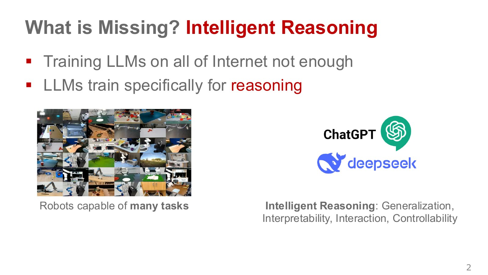

```text
What is Missing? Intelligent Reasoning

« Training LLMs on all of Internet not enough

« LLMs train specifically for reasoning
ChatGPT

ay deepseek

Robots capable of many tasks Intelligent Reasoning: Generalization,
Interpretability, Interaction, Controllability
```

## Slide 4

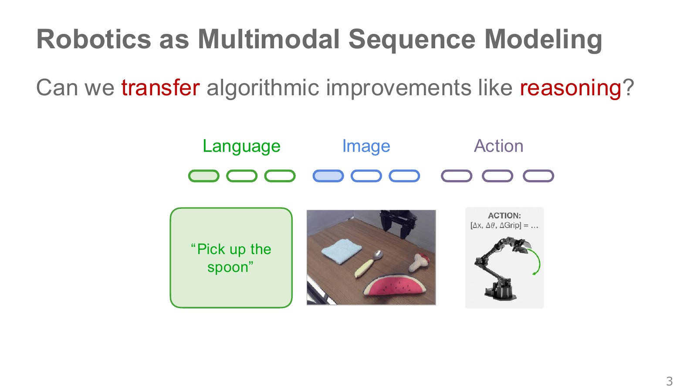

```text
Robotics as Multimodal Sequence Modeling

Can we transfer algorithmic improvements like reasoning?

Language Image Action

Ce CIC) GeCICY) CY) CY) CW)

ACTION:
[Ax, 48, AGrip] =...

“Pick up the a
spoon” CF
‘ v
```

## Slide 5

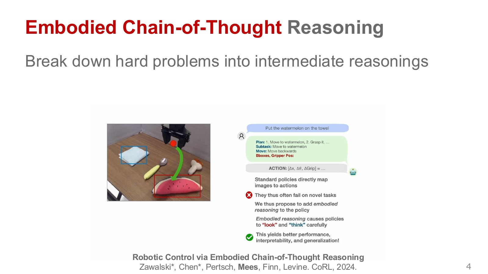

```text
Embodied Chain-of-Thought Reasoning

Break down hard problems into

Og

iv]

intermediate reasonings

Plan: 1. Move to watermelon, 2. Grasp it, ..
‘Subtask: Move to watermelon

Move: Move backwards,

Bboxes, Gripper Pos:

ACTION: (Ax, 49, AGrip] =...
Standard policies directly map
images to actions

They thus often fail on novel tasks

We thus propose to add embodied
reasoning to the policy

Embodied reasoning causes policies
to “look” and “think” carefully

This yields better performance,
interpretability, and generalization!

Robotic Control via Embodied Chain-of-Thought Reasoning
Zawalski*, Chen*, Pertsch, Mees, Finn, Levine. CoRL, 2024.
```

## Slide 6

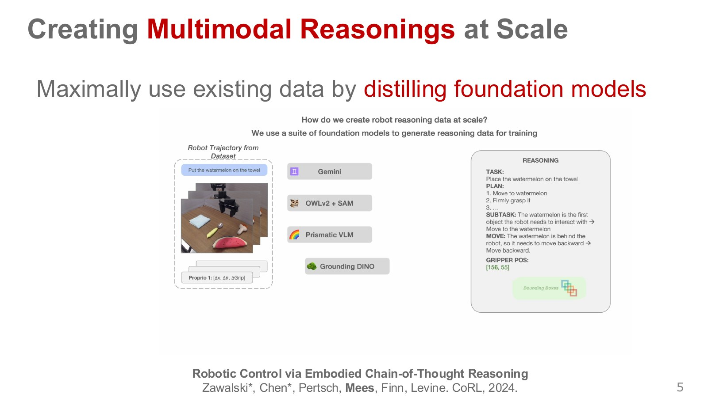

```text
Creating Multimodal Reasonings at Scale

Maximally use existing data by distilling foundation models

How do we create robot reasoning data at scale?
We use a suite of foundation models to generate reasoning data for training

Robot Trajectory from
Dataset

REASONING

TASK:

Place the watermelon on the towel
PLAN:

1. Move to watermeion

2. Firmly grasp it

3.

SUBTASK: The watermelon is the first
object the robot needs to interact with >
Move to the watermelon

MOVE: The watermelon is behind the
robot, so it needs to move backward >
Move backward.

GRIPPER POS:

1156, 55]
aunetng Boies A,

Robotic Control via Embodied Chain-of-Thought Reasoning
Zawalski*, Chen*, Pertsch, Mees, Finn, Levine. CoRL, 2024.
```

## Slide 7

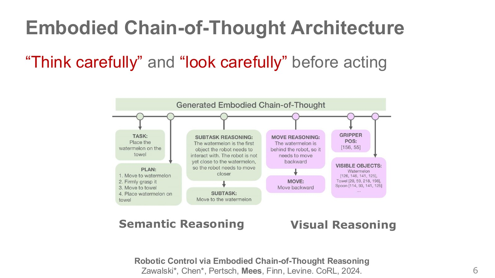

```text
Embodied Chain-of-Thought Architecture

“Think carefully” and “look carefully” before acting

Generated Embodied Chain-of-Thought

ri i ’ yd

TASK: SUBTASK REASONING: MOVE REASONING: GRIPPER

Place the The watermelon is the first The watermelon is Eos
watermelon on the object the robot needs to behind the robot, so it [156, 55]

towel interact with. The robot is not needs to move

yet close to the watermelon, backward
PLAN: 'so the robot needs to move Mil pean?

1. Move to watermelon eee M [126, 146, 141, 125],
2. Firmly grasp it 1 MOVE: Towel 20, 59, 218, 198],
3. Move to towel Move backward Spoon fia) 8,144,126)
4, Place watermelon on SUBTASK: -
towel Move to the watermelon
Semantic Reasoning Visual Reasoning

Robotic Control via Embodied Chain-of-Thought Reasoning
Zawalski*, Chen*, Pertsch, Mees, Finn, Levine. CoRL, 2024.
```

## Slide 8

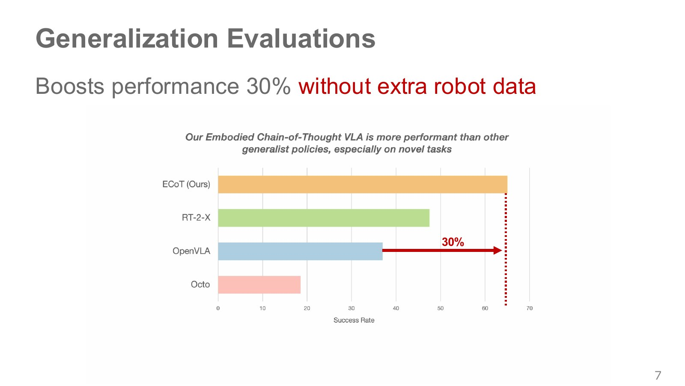

```text
Generalization Evaluations
Boosts performance 30% without extra robot data

Our Embodied Chain-of-Thought VLA is more performant than other
generalist policies, especially on novel tasks

ECoT (Ours)

RT-2-X

30% :
OpenVLA :

Octo

|

20 30 40 50 6 70

°

Success Rate
```

## Slide 9

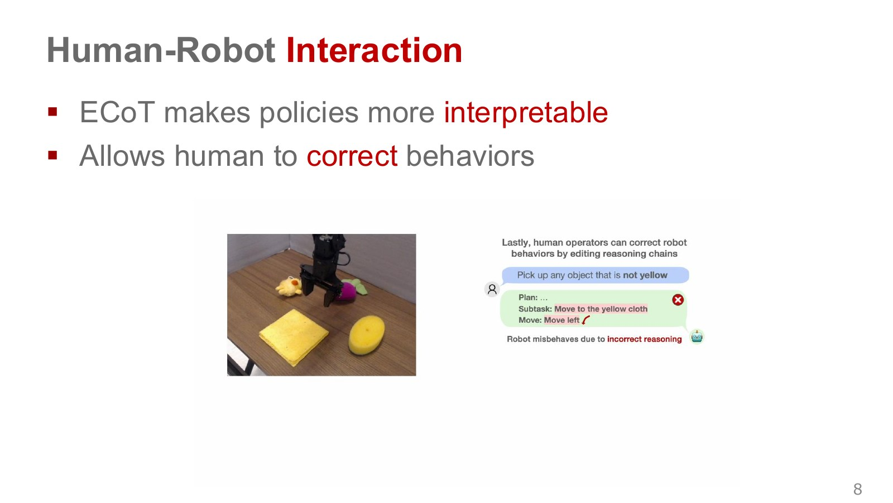

```text
Human-Robot Interaction

" ECoT makes policies more interpretable
# Allows human to correct behaviors

Lastly, human operators can correct robot
behaviors by editing reasoning chains

. __ Pick up any object that is not yellow,
Plan: ... x}

‘Subtask: Move to the yellow cloth
Move: Move left

Robot misbehaves due to incorrect reasoning i)
```

## Slide 10

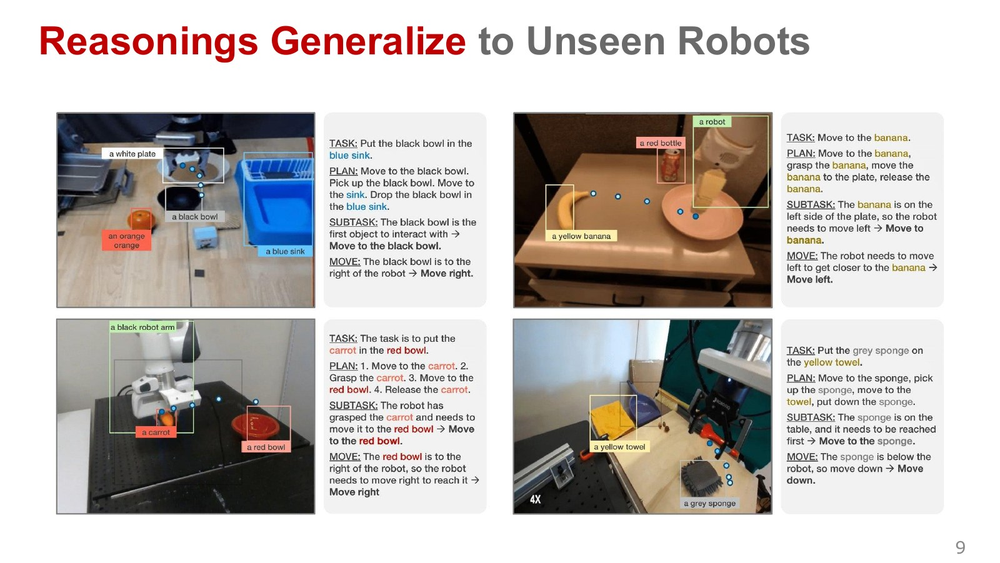

```text
a8 orange:
orange

‘a black robot arm
.

acarrot

a red bowl

TASK: Put the black bowl in the
blue sink.

PLAN: Move to the black bowl.
Pick up the black bowl. Move to
the sink. Drop the black bowl in

the blue sink.

SUBTASK: The black bowl is the
first object to interact with >
Move to the black bowl.

MOVE: The black bowl is to the
right of the robot > Move right.

A
3

llow banana

TASK: The task is to put the

TAS! love to the banana.

PLAN: Move to the banana,
grasp the banana, move the
banana to the plate, release the
banana.

SUBTASK: The banana is on the
left side of the plate, so the robot
needs to move left > Move to
banana.

MOVE: The robot needs to move

left to get closer to the bane
Move left.

in the red bowl. TASK: Put the grey sponge on
PLAN: 1. Move to the Ea) the yellow towel:
Grasp the carrot. 3. Move to the PLAN: Move to the sponge, pick

red bowl. 4. Release the
SUBTASK: The robot has
grasped the and needs to
move it to the red bowl > Move
to the red bowl.

MOVE: The red bow! is to the
right of the robot, so the robot
needs to move right to reach it >

ny

up the sponge, move to the
towel, put down the sponge.
SUBTASK: The sponge is on the
table, and it needs to be reached
first > Move to the sponge.

MOVE: The sponge is below the

at
| ca robot, so move down > Move
| g down.

agrey sponge

Move right
```

## Slide 11

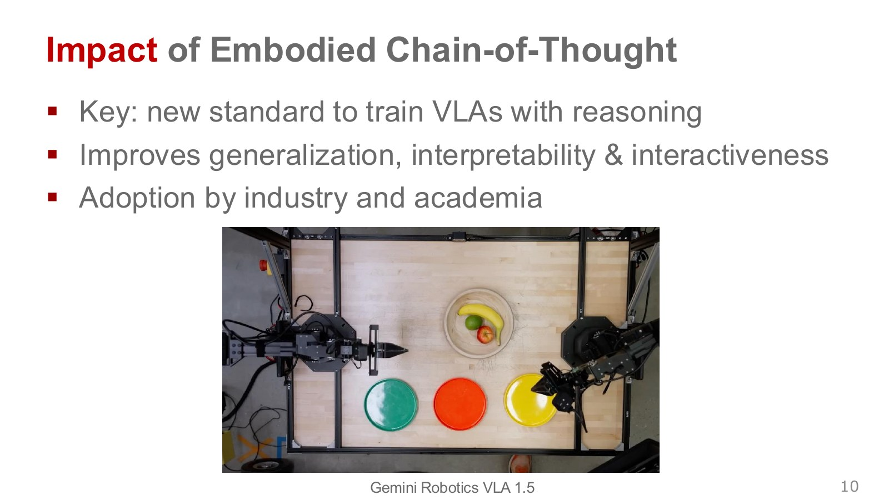

```text
Impact of Embodied Chain-of-Thought

« Key: new standard to train VLAs with reasoning
= Improves generalization, interpretability & interactiveness
» Adoption by industry and academia

Gemini Robotics VLA 1.5

10
```

## Slide 12

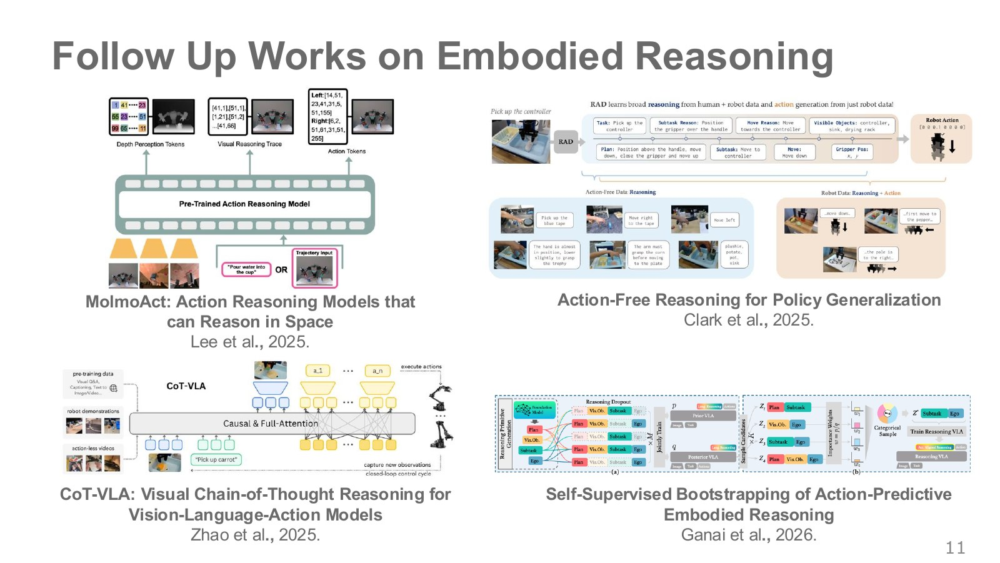

```text
Follow Up Works on Embodied Reasoning

Ler r4 51,

tes Rightif.2
{41,66} 51,61,31,51,]

‘Visual Reasoning Trace a,

ation Tokens

MolmoAct: Action Reasoning Models that
can Reason in Space
Lee et al., 2025.

xr nee greet actions,
cma PG
-_- O99 Gog--Go9 &
= Causal & Full-Attention
ee 600 OBO cena)

CoT-VLA: Visual Chain-of-Thought Reasoning for
Vision-Language-Action Models
Zhao et al., 2025.

RAD learns road reasoning fom human + robot data and action generation from just robot datal

Action-Free Reasoning for Policy Generalization
Clark et al., 2025.

Self-Supervised Bootstrapping of Action-Predictive
Embodied Reasoning
Ganai et al., 2026.

11
```

## Slide 13

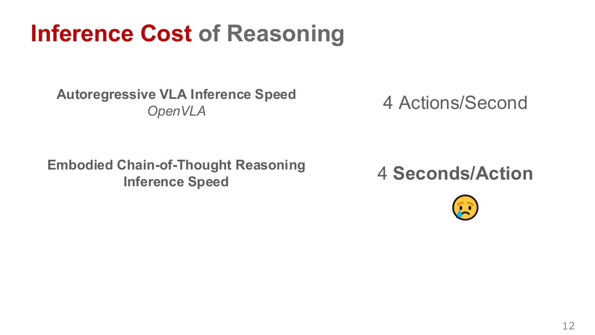

```text
Inference Cost of Reasoning

Autoregressive VLA Inference Speed
OpenVLA

Embodied Chain-of-Thought Reasoning
Inference Speed

4 Actions/Second

4 Seconds/Action

12
```

## Slide 14

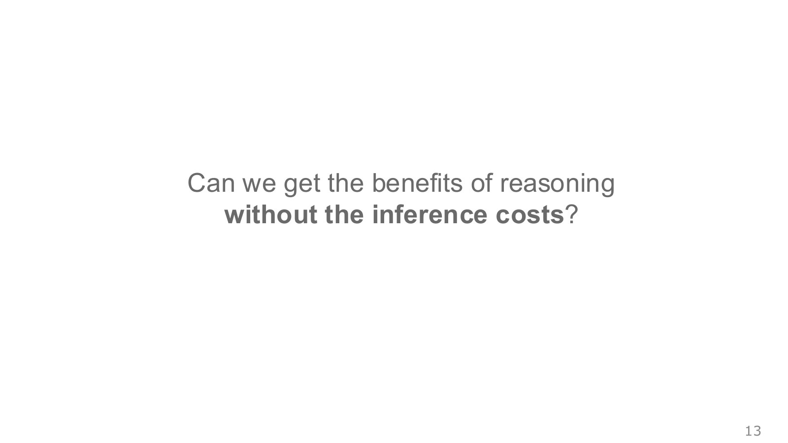

```text
Can we get the benefits of reasoning
without the inference costs?

13
```

## Slide 15

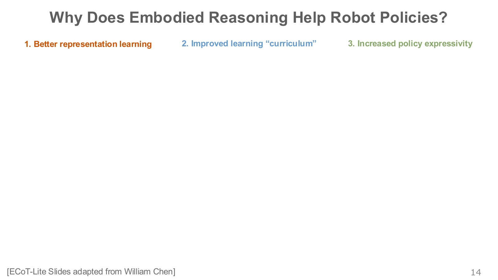

```text
Why Does Embodied Reasoning Help Robot Policies?

1. Better representation learning 2. Improved learning “curriculum” 3. Increased policy expressivity

[ECoT-Lite Slides adapted from William Chen] 14
```

## Slide 16

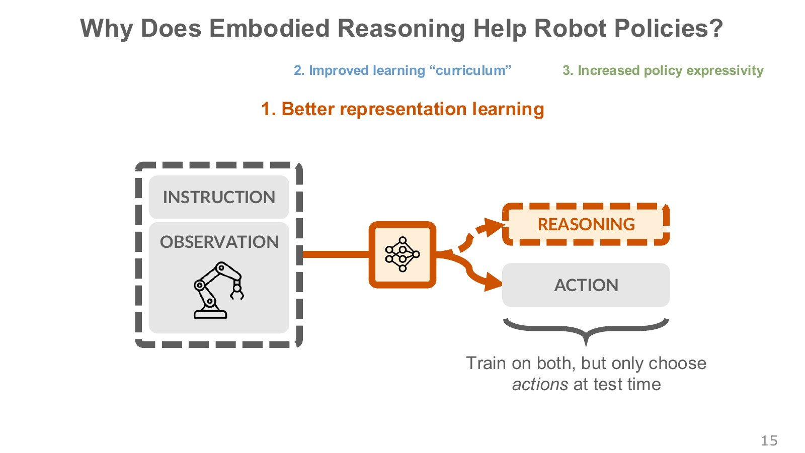

```text
Why Does Embodied Reasoning Help Robot Policies?

2. Improved learning “curriculum” 3. Increased policy expressivity

1. Better representation learning

on ee es a
i INSTRUCTION |

encoun Al

ual REASONING

ee es

ACTION

ee -_”

Train on both, but only choose
actions at test time

15
```

## Slide 17

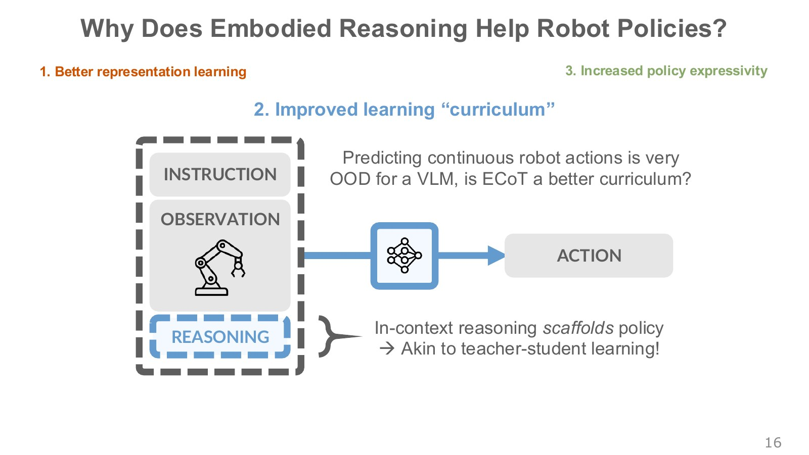

```text
Why Does Embodied Reasoning Help Robot Policies?

1. Better representation learning 3. Increased policy expressivity

2. Improved learning “curriculum”

Predicting continuous robot actions is very
INSTRUCTION J} OOD fora VLM, is ECoT a better curriculum?

OBSERVATION

I
I
i
8 l
I - \
I | meee | In-context reasonin i
) - g scaffolds policy
oe, | > Akin to teacher-student learning!

l a

ACTION

16
```

## Slide 18

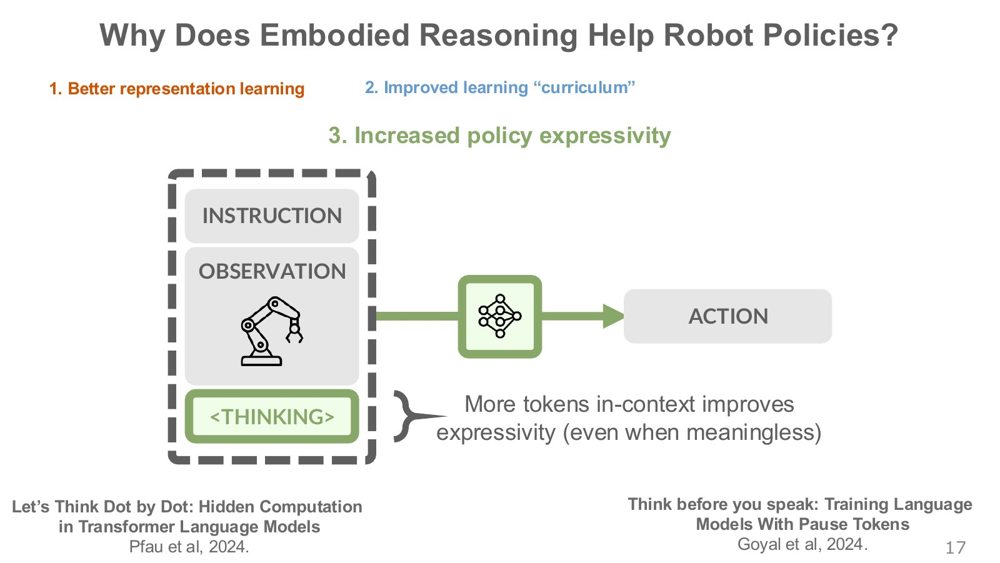

```text
Why Does Embodied Reasoning Help Robot Policies?

1. Better representation learning 2. Improved learning “curriculum”

3. Increased policy expressivity

INSTRUCTION §f

OBSERVATION I
LS

Y, le

ACTION

I

f l | |
<THINKING> [J ) More tokens in-context improves

I expressivity (even when meaningless)

eS |

Let’s Think Dot by Dot: Hidden Computation Think before you speak: Training Language
in Transformer Language Models Models With Pause Tokens
Pfau et al, 2024. Goyal et al, 2024. 17
```

## Slide 19

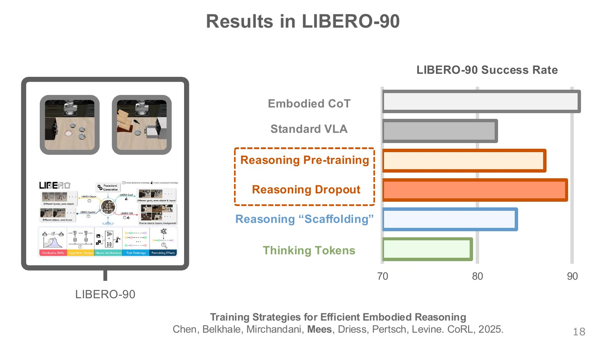

```text
Results in LIBERO-90

LIBERO-90 Success Rate

Embodied CoT ]
Standard VLA JJ
(Reasoning Preraining![ =i
I 1
Reasoning Dropout SSS
Gontihig “Scaffolding” |
Thinking Tokens ]

70 80 90

LIBERO-90

Training Strategies for Efficient Embodied Reasoning
Chen, Belkhale, Mirchandani, Mees, Driess, Pertsch, Levine. CoRL, 2025. 18
```

## Slide 20

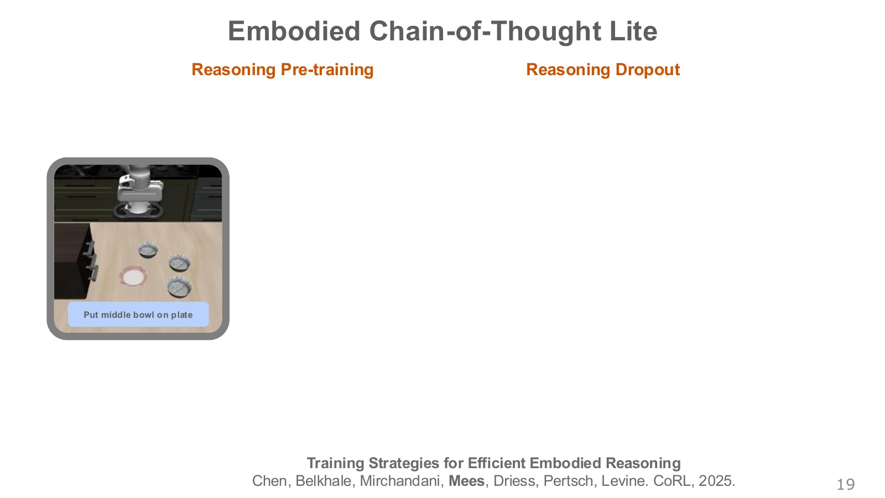

```text
Embodied Chain-of-Thought Lite

Reasoning Pre-training Reasoning Dropout

Put middle bowl on plate

Training Strategies for Efficient Embodied Reasoning
Chen, Belkhale, Mirchandani, Mees, Driess, Pertsch, Levine. CoRL, 2025.

19
```

## Slide 21

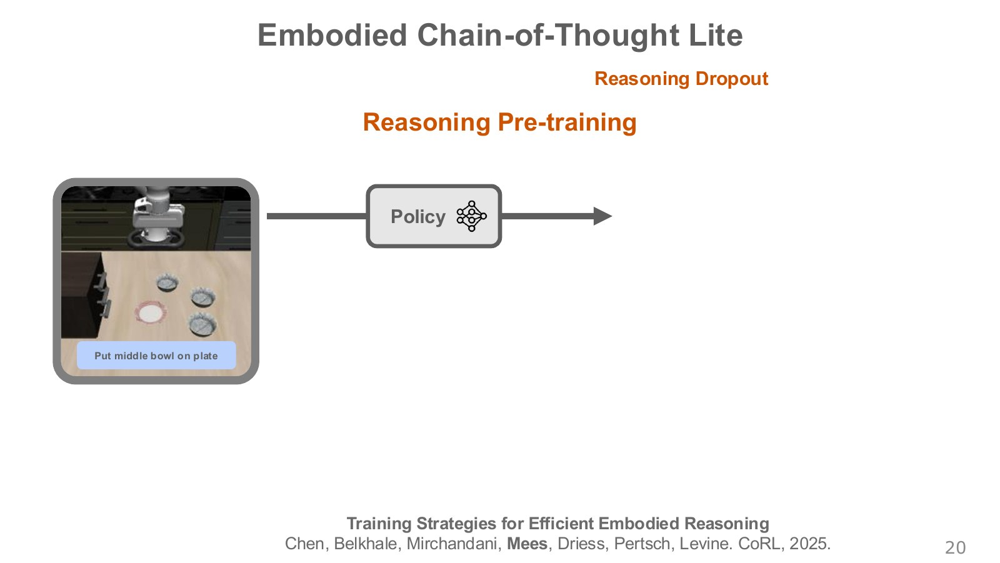

```text
Put middle bowl on plate

Embodied Chain-of-Thought Lite

Reasoning Dropout

Reasoning Pre-training

Training Strategies for Efficient Embodied Reasoning

Chen, Belkhale, Mirchandani, Mees, Driess, Pertsch, Levine. CoRL, 2025.

20
```

## Slide 22

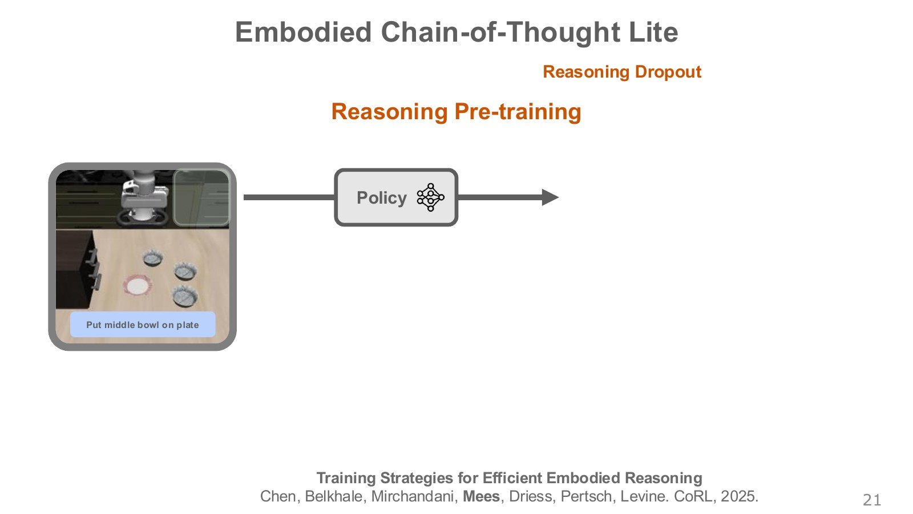

```text
Put middle bowl on plate

Embodied Chain-of-Thought Lite

Reasoning Dropout

Reasoning Pre-training

Training Strategies for Efficient Embodied Reasoning

Chen, Belkhale, Mirchandani, Mees, Driess, Pertsch, Levine. CoRL, 2025.

21
```

## Slide 23


```text
Put middle bowl on plate

Embodied Chain-of-Thought Lite

Reasoning Dropout

Reasoning Pre-training

Training Strategies for Efficient Embodied Reasoning

Chen, Belkhale, Mirchandani, Mees, Driess, Pertsch, Levine. CoRL, 2025.

22
```

## Slide 24

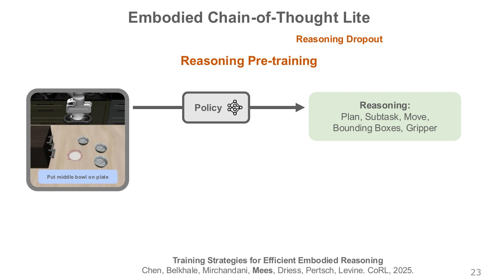

```text
Put middle bow! on plate |

Embodied Chain-of-Thought Lite

Reasoning Dropout

Reasoning Pre-training

Plan, Subtask, Move,

Bounding Boxes, Gripper

Training Strategies for Efficient Embodied Reasoning
Chen, Belkhale, Mirchandani, Mees, Driess, Pertsch, Levine. CoRL, 2025.

23
```

## Slide 25

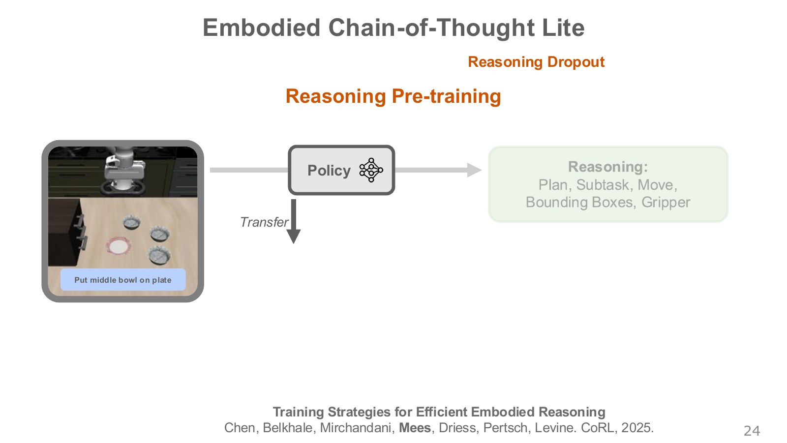

```text
Embodied Chain-of-Thought Lite

Reasoning Dropout

Reasoning Pre-training

Policy Reasoning:
eS Plan, Subtask, Move,

Bounding Boxes, Gripper
rans

Put middle bowl on plate

Training Strategies for Efficient Embodied Reasoning
Chen, Belkhale, Mirchandani, Mees, Driess, Pertsch, Levine. CoRL, 2025. 24
```

## Slide 26

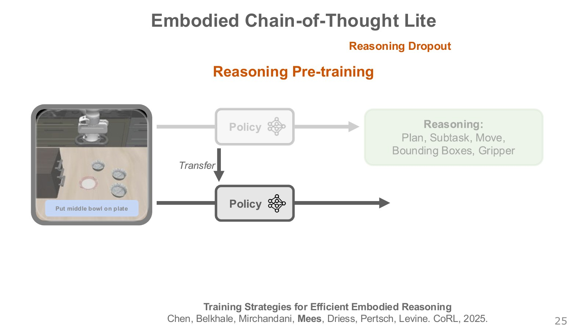

```text
7 Put middle bowl on plate

Embodied Chain-of-Thought Lite

Reasoning Dropout

Reasoning Pre-training

Lp Reasoning:
: Plan, Subtask, Move,
Bounding Boxes, Gripper
rans

Training Strategies for Efficient Embodied Reasoning
Chen, Belkhale, Mirchandani, Mees, Driess, Pertsch, Levine. CoRL, 2025.

25
```

## Slide 27


```text
Put middle bowl on plate

Embodied Chain-of-Thought Lite

Reasoning Dropout

Reasoning Pre-training

Reasoning:
Plan, Subtask, Move,

Bounding Boxes, Gripper
rans

Training Strategies for Efficient Embodied Reasoning
Chen, Belkhale, Mirchandani, Mees, Driess, Pertsch, Levine. CoRL, 2025.

26
```

## Slide 28

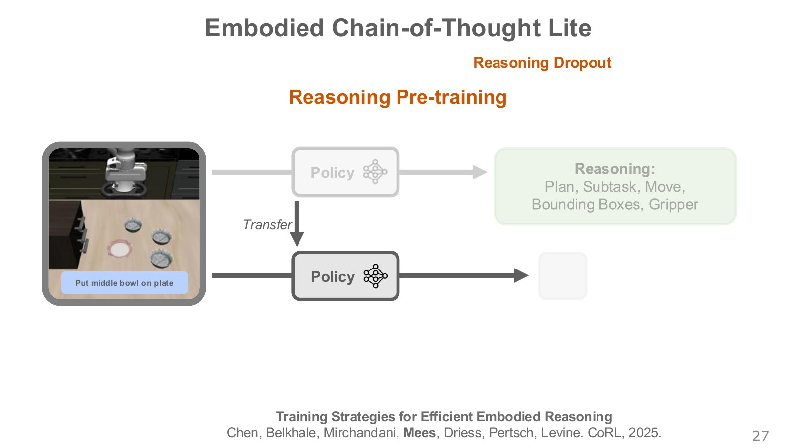

```text
Put middle bowl on plate

Embodied Chain-of-Thought Lite

Reasoning Dropout

Reasoning Pre-training

Reasoning:
Plan, Subtask, Move,

Bounding Boxes, Gripper
rans

Training Strategies for Efficient Embodied Reasoning
Chen, Belkhale, Mirchandani, Mees, Driess, Pertsch, Levine. CoRL, 2025.

27
```

## Slide 29

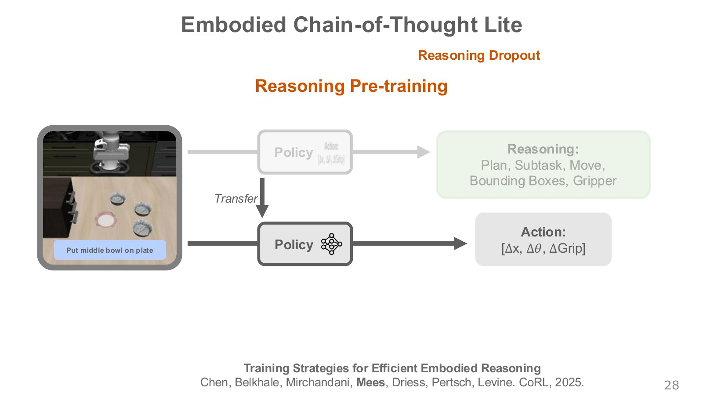

```text
Put middle bowl on plate

Embodied Chain-of-Thought Lite

Reasoning Dropout

Reasoning Pre-training

Reasoning:
Plan, Subtask, Move,

Bounding Boxes, Gripper
rans

; Action:
Policy [Ax, A@, AGrip]

Training Strategies for Efficient Embodied Reasoning
Chen, Belkhale, Mirchandani, Mees, Driess, Pertsch, Levine. CoRL, 2025.

28
```

## Slide 30

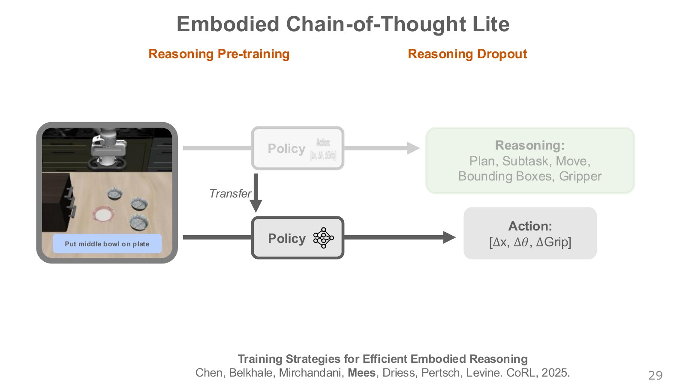

```text
Embodied Chain-of-Thought Lite

Reasoning Pre-training Reasoning Dropout

Reasoning:
Plan, Subtask, Move,

Bounding Boxes, Gripper
rans

Pp @ Action:

Training Strategies for Efficient Embodied Reasoning
Chen, Belkhale, Mirchandani, Mees, Driess, Pertsch, Levine. CoRL, 2025.

29
```

## Slide 31

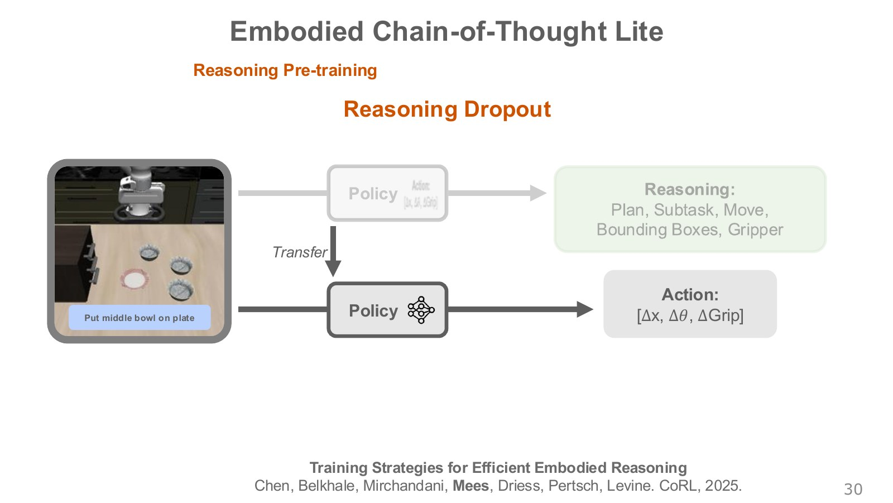

```text
Embodied Chain-of-Thought Lite

Reasoning Pre-training

Reasoning Dropout

Reasoning:
Plan, Subtask, Move,

Bounding Boxes, Gripper
rans

2 ; Action:

Training Strategies for Efficient Embodied Reasoning
Chen, Belkhale, Mirchandani, Mees, Driess, Pertsch, Levine. CoRL, 2025.

30
```

## Slide 32

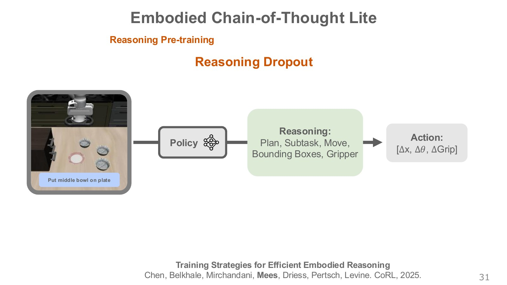

```text
Embodied Chain-of-Thought Lite

Reasoning Pre-training

Reasoning Dropout

Reasoning: Action:
Policy Plan, Subtask, Move, => ue
Bounding Boxes, Gripper ee eo)

Put middle bow! on plate |

Training Strategies for Efficient Embodied Reasoning
Chen, Belkhale, Mirchandani, Mees, Driess, Pertsch, Levine. CoRL, 2025. 31
```

## Slide 33

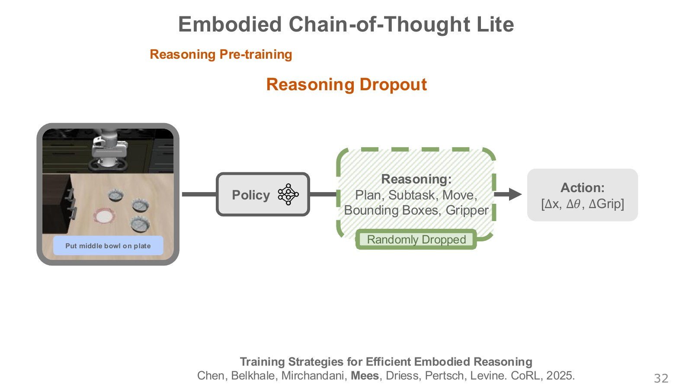

```text
Embodied Chain-of-Thought Lite

Reasoning Pre-training

Reasoning Dropout

YY Ww”y

Reasoning: l Action:
Plan, Subtask, Move, => x ue .
Bounding Boxes, Gripper | ee eo)

Training Strategies for Efficient Embodied Reasoning
Chen, Belkhale, Mirchandani, Mees, Driess, Pertsch, Levine. CoRL, 2025. 32
```

## Slide 34

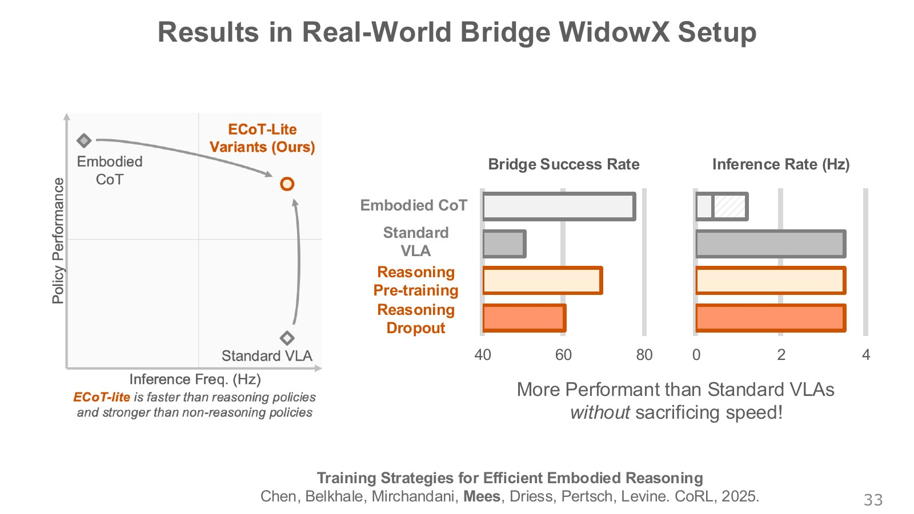

```text
Policy Performance

Results in Real-World Bridge WidowX Setup

ECoT-Lite
° : Variants (Ours)
Embodied Bridge Success Rate Inference Rate (Hz)
CoT fe)
Embodied CoT
Standard
va Lo |
Reasoning
Pre-training
Dropout
> p
Standard VLA 40 60 80 0 2 4
Inference Freq. (Hz)
ECoT-lite is faster than reasoning policies More Performant than Standard VLAs
and stronger than non-reasoning policies without sacrificing speed!

Training Strategies for Efficient Embodied Reasoning
Chen, Belkhale, Mirchandani, Mees, Driess, Pertsch, Levine. CoRL, 2025. 33
```

## Slide 35

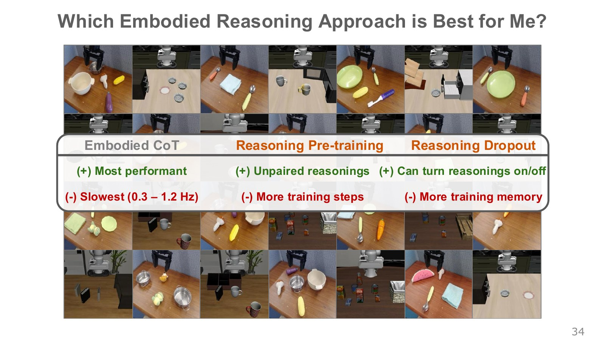

```text
Which Embodied Reasoning Approach is Best for Me?

Embodied CoT

(+) Most performant (+) Unpaired reasonings (+) Can turn reasonings on/off

34
```

## Slide 36

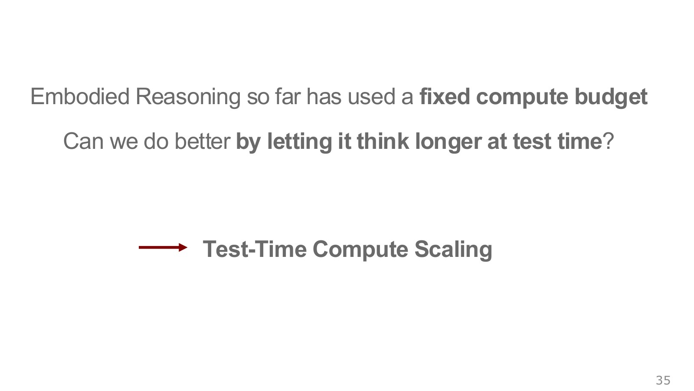

```text
Embodied Reasoning so far has used a fixed compute budget

Can we do better by letting it think longer at test time?

-- Test-Time Compute Scaling

35
```

## Slide 37

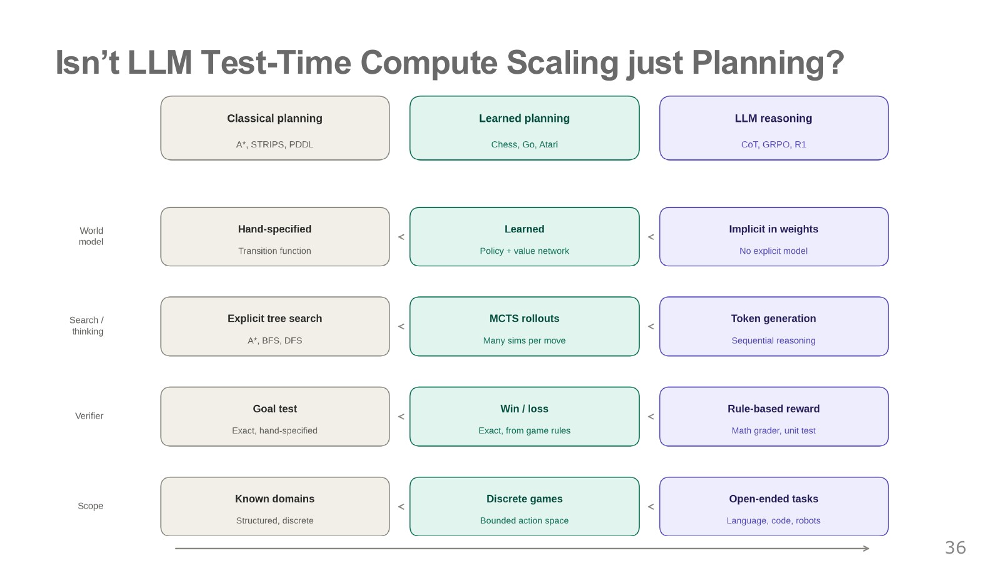

```text
Isn’t LLM Test-Time Compute Scaling just Planning?

World
model

Search /
thinking

Verifier

Scope

Classical planning

A*, STRIPS, PDDL

Learned planning

Chess, Go, Atari

LLM reasoning

CoT, GRPO, R1

Hand-specified

Transition function

Learned

Policy + value network

Implicit in weights

No explicit model

Explicit tree search

A‘, BFS, DFS

MCTS rollouts

Many sims per move

Token generation

Sequential reasoning

Goal test

Exact, hand-specified

Win / loss

Exact, from game rules

Rule-based reward

Math grader, unit test

Known domains

Structured, discrete

Discrete games

Bounded action space

Open-ended tasks

Language, code, robots

36
```

## Slide 38

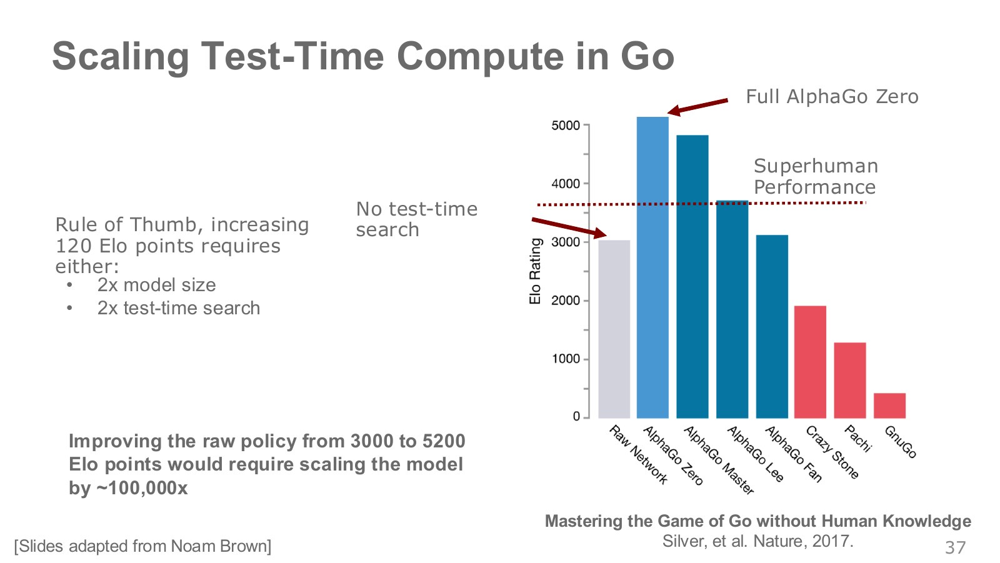

```text
Scaling Test-Time Compute in Go

No test-time

Rule of Thumb, increasing search
120 Elo points requires
either:

* 2x model size
* 2x test-time search

Improving the raw policy from 3000 to 5200
Elo points would require scaling the model
by ~100,000x

[Slides adapted from Noam Brown]

| Superhuman
4000 5 Performance
-
3000)
2000 ~
1000 ~
0-4
a ¢g

an Full AlphaGo Zero

Mastering the Game of Go without Human Knowledge
Silver, et al. Nature, 2017. 37
```

## Slide 39

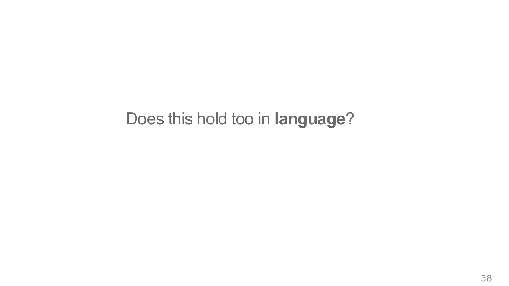

```text
Does this hold too in language?

38
```

## Slide 40

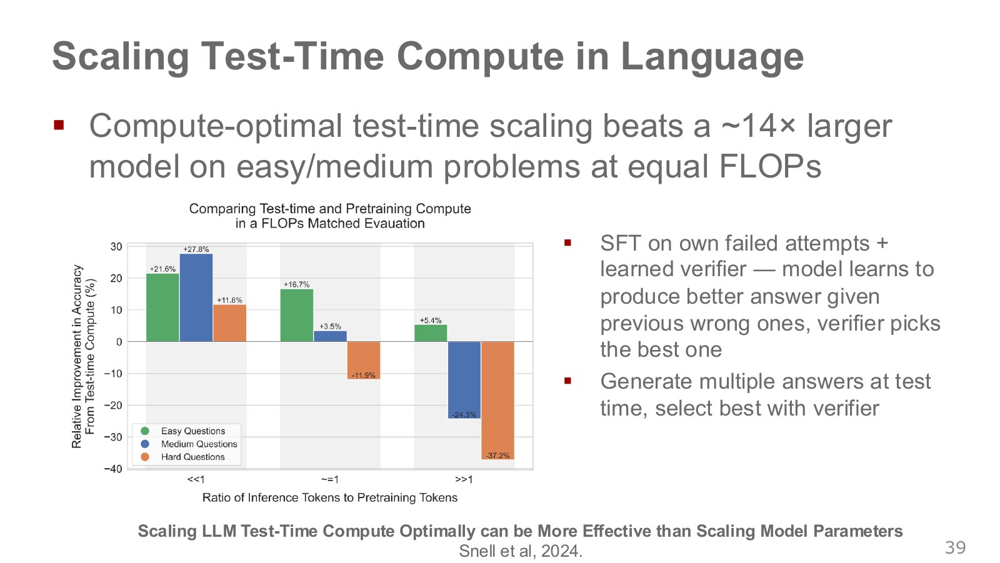

```text
Scaling Test-Time Compute in Language

= Compute-optimal test-time scaling beats a ~14x larger
model on easy/medium problems at equal FLOPs

Comparing Test-time and Pretraining Compute
in a FLOPs Matched Evauation

=e = SFT on own failed attempts +
learned verifier - model learns to
produce better answer given
previous wrong ones, verifier picks
the best one

= Generate multiple answers at test
time, select best with verifier

Relative Improvement in Accuracy
From Test-time Compute (%)

@ Easy Questions
@ Medium Questions
@ Hard Questions

<<1 ~=1 >t

Ratio of Inference Tokens to Pretraining Tokens

Scaling LLM Test-Time Compute Optimally can be More Effective than Scaling Model Parameters
Snell et al, 2024. 39
```

## Slide 41

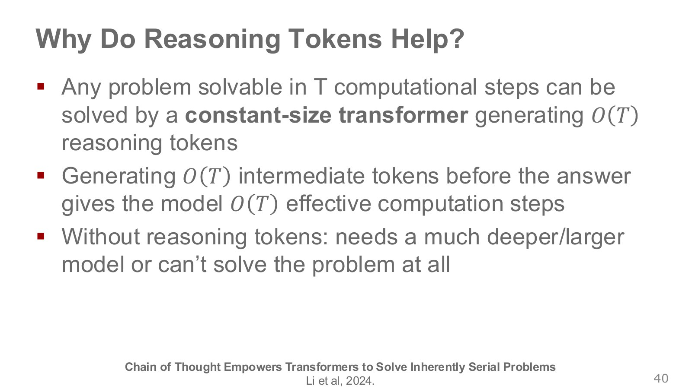

```text
Why Do Reasoning Tokens Help?

# Any problem solvable in T computational steps can be
solved by a constant-size transformer generating O(T)
reasoning tokens

= Generating O(T) intermediate tokens before the answer
gives the model O(T) effective computation steps

= Without reasoning tokens: needs a much deeper/larger
model or can’t solve the problem at all

Chain of Thought Empowers Transformers to Solve Inherently Serial Problems
Li et al, 2024.

40
```

## Slide 42

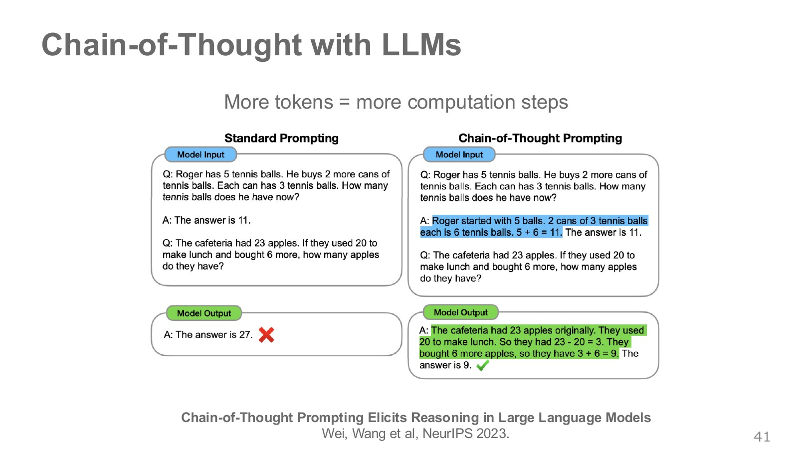

```text
Chain-of-Thought with LLMs

More tokens = more computation steps

Standard Prompting

Medline

Q: Roger has 5 tennis balls. He buys 2 more cans of
tennis balls. Each can has 3 tennis balls. How many
tennis balls does he have now?

A: The answer is 11.

Q: The cafeteria had 23 apples. If they used 20 to
make lunch and bought 6 more, how many apples
do they have?

Ne

Wel ua

A: The answer is 27. x

a

Chain-of-Thought Prompting

Q: Roger has 5 tennis balls. He buys 2 more cans of

tennis balls. Each can has 3 tennis balls. How many
tennis balls does he have now?

A:
The answer is 11.

Q: The cafeteria had 23 apples. If they used 20 to
make lunch and bought 6 more, how many apples
do they have?

SS

Mop

The

\_ answer is9. of )

Chain-of-Thought Prompting Elicits Reasoning in Large Language Models
Wei, Wang et al, NeurlPS 2023.

41
```

## Slide 43

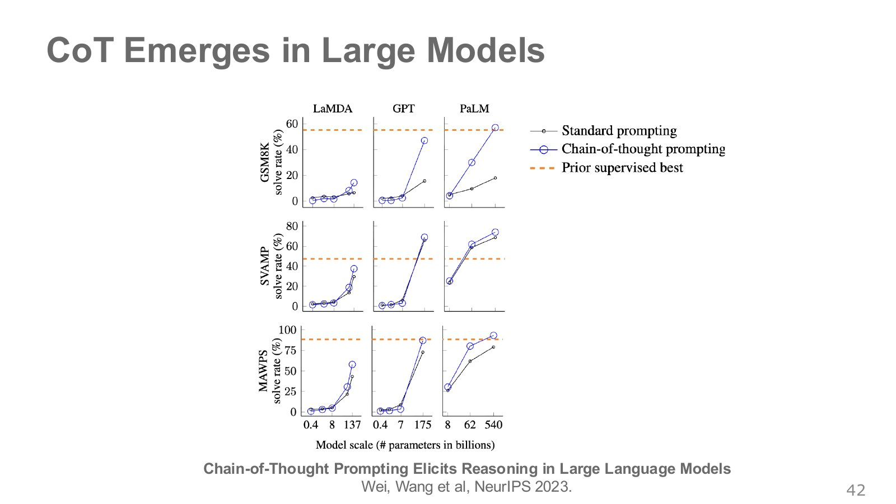

```text
CoT Emerges in La

GSM8K
solve rate (%)
yp 2 OD
6 6 6
T

o

rge Models

-e- Standard prompting
-e- Chain-of-thought prompting
- ~~ Prior supervised best

SVAMP
for}
oo

solve rate (%)
vk oD
a)

a

moa
So

MAWPS
solve rate (%)
a

°

04 8 137

04 7 175 8 62 540

Model scale (# parameters in billions)

Chain-of-Thought Prompting Elicits Reasoning in Large Language Models

Wei, Wang et al, NeurlPS 2023.

42
```

## Slide 44

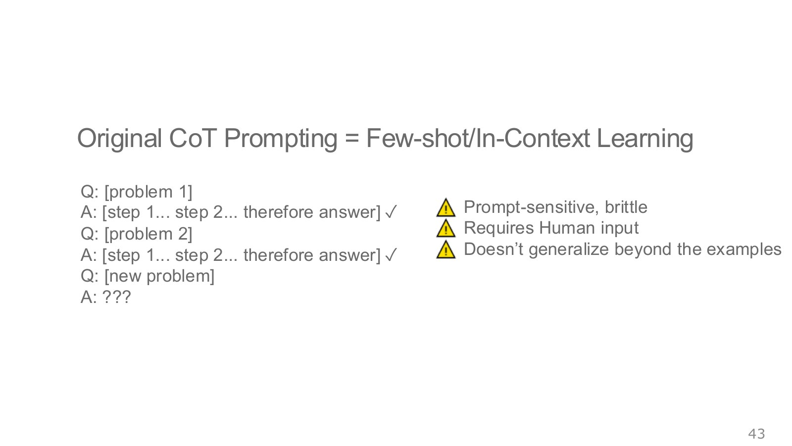

```text
Original CoT Prompting = Few-shot/In-Context Learning

Q: [problem 1]
A: [step 1... step 2... therefore answer] /

Q: [problem 2]
A: [step 1... step 2... therefore answer] /

Q: [new problem]
A: 22?

A Prompt-sensitive, brittle
A\ Requires Human input
A Doesn't generalize beyond the examples

43
```

## Slide 45

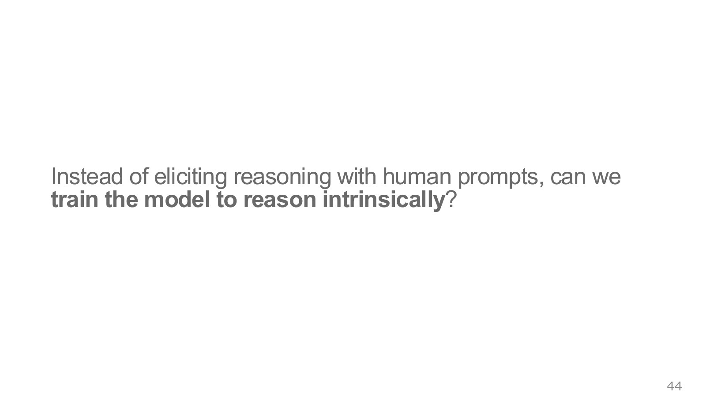

```text
Instead of eliciting reasoning with human prompts, can we
train the model to reason intrinsically?

44
```

## Slide 46

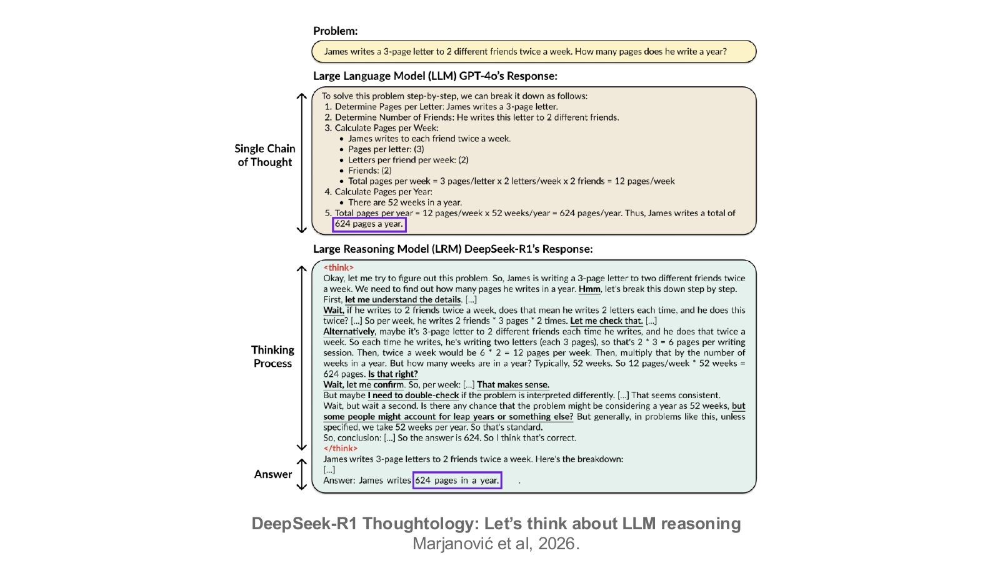

```text
Single Chain
of Thought

Thinking
Process

Answer

Problem:

Cares writes a 3-page letter to 2 different friends twice a week. How many pages does he write a year? »

Large Language Model (LLM) GPT-4o’s Response:

To solve this problem step-by-step, we can break it dawn as follows: >)
4. Determine Pages per Letter: James writes a 3-page letter.
2. Determine Number of Friends: He writes ths letter to 2 different friends.
3, Calculate Pages per Week:
James writes to each friend twice a week.
© Pages per letter: (3)
* Letters per friend per week: (2)
* Friends: (2)
* Total pages per week = 3 pages/letter x 2 letters/week x 2 friends = 12 pages/week
4, Calculate Pages per Year:
* There are 52 weeks in a year.
5. Total pages per year = 12 pages/week x 52 weeks/year = 624 pages/year. Thus, James writes a total of
\__ [eet pases aye

Large Reasoning Model (LRM) DeepSeek-R1’s Response:

<think> >)
Okay, let me try to figure out this problem. So, James is writing a 3-page letter to two different friends twice
a week. We need to find out how many pages he writes in a year. Hmm, let's break this down step by step.
First, let me understand the details. (..]

Wait, if he writes to 2 friends twice a week, does that mean he writes 2 letters each time, and he does this
twice? [...] So per week, he writes 2 friends * 3 pages * 2 times. Let me check that. [...]

Alternatively, maybe it's 3-page letter to 2 different friends each time he writes, and he does that twice a
week. So each time he writes, he’s writing two letters (each 3 pages), so that’s 2 * 3 = 6 pages per writing
session. Then, twice a week would be 6 * 2 = 12 pages per week. Then, multiply that by the number of
weeks in a year. But how many weeks are in a year? Typically, 52 weeks. So 12 pages/week * 52 weeks =
624 pages. Is that right?

‘Wait, let me confirm. So, per week: [...) That makes sense.

But maybe I need to double-check if the problem is interpreted differently. [..] That seems consistent.

Wait, but wait a second. Is there any chance that the problem might be considering a year as 52 weeks, but
some people might account for leap years or something else? But generally, in problems like this, uniess
specified, we take 52 weeks per year. So that's standard.

So, conclusion: [..] So the answer is 624. So | think that's correct.

</think>

James writes 3-page letters to 2 friends twice a week. Here's the breakdown:

bel

Answer: James writes|624 pages in a year

y

DeepSeek-R1 Thoughtology: Let’s think about LLM reasoning

Marjanovié et al, 2026.
```

## Slide 47

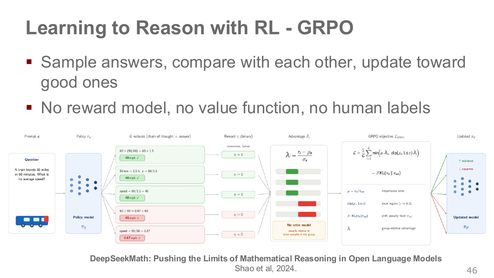

```text
Learning to Reason with RL - GRPO

= Sample answers, compare with each other, update toward
good ones

= No reward model, no value function, no human labels

Prompt ¢ Policy 7 rollouts (chain-of thought + answer) Rewards; (binary) Advantage A, GRPO objective Leapo Updated =

DeepSeekMath: Pushing the Limits of Mathematical Reasoning in Open Language Models
Shao et al, 2024. 46
```

## Slide 48

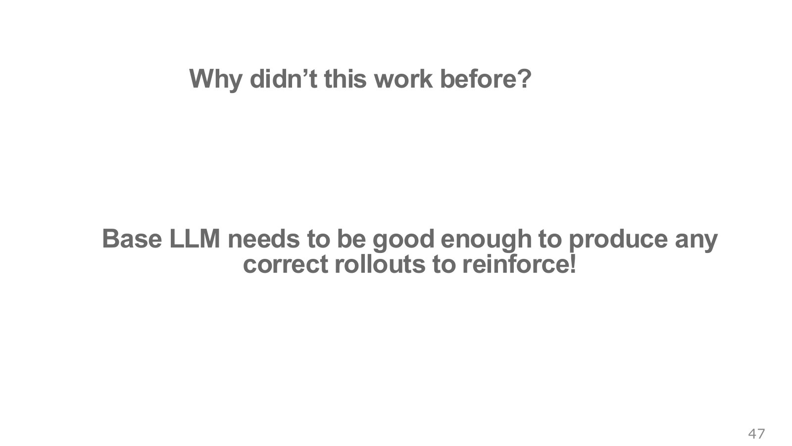

```text
Why didn’t this work before?

Base LLM needs to be good enough to produce any
correct rollouts to reinforce!

47
```

## Slide 49

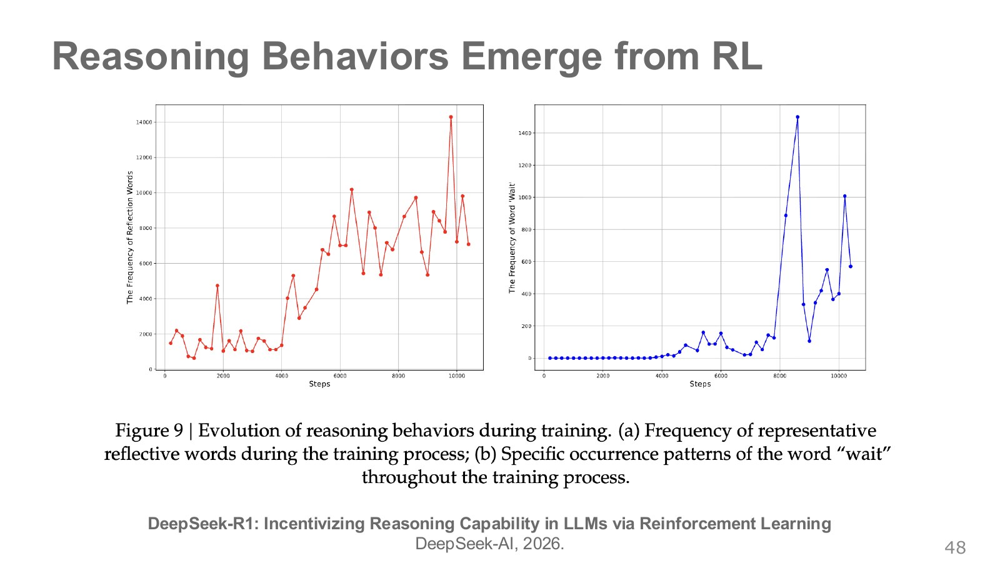

```text
Reasoning Behaviors Emerge from RL

2an00

0000

Hy

6000

The Frequency of Reflection Words
The Frequency of Word ‘Wait’

7 3000 1000 6000 #500 T0100 ° 2000 000 e000 3000 10000
Steps Steps

Figure 9 | Evolution of reasoning behaviors during training. (a) Frequency of representative
reflective words during the training process; (b) Specific occurrence patterns of the word “wait”
throughout the training process.

DeepSeek-R1: Incentivizing Reasoning Capability in LLMs via Reinforcement Learning
DeepSeek-Al, 2026.

48
```

## Slide 50

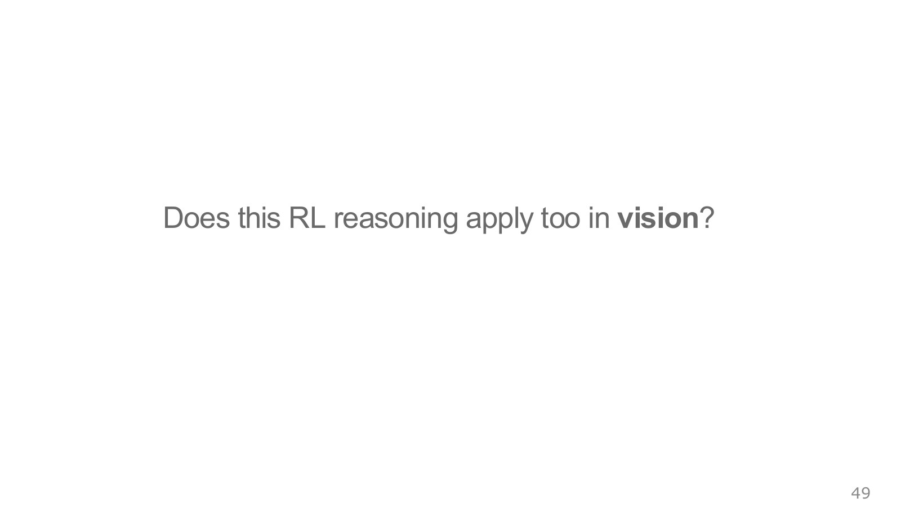

```text
Does this RL reasoning apply too in vision?

49
```

## Slide 51

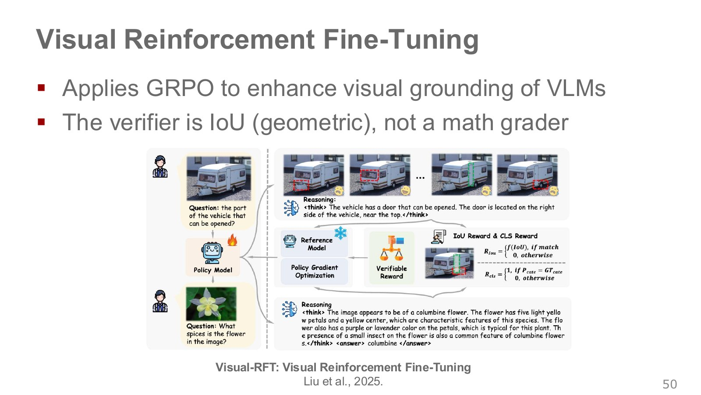

```text
Visual Reinforcement Fine-Tuning

« Applies GRPO to enhance visual grounding of VLMs
« The verifier is loU (geometric), not a math grader

Question: the part
of the vehicle that
can be opened?

Policy Model
‘

Question: What
spices is the flower
in the image?

@ peterence *f = ARP teu Reward & CLS Reward
‘Model prow, if match
- 0, of
Policy Gradient Verifiable 4 4, tf Tete
Optimization Reward ere Ra ={ 0, otherwise

s&f, Reasoning

<think> The image appears to be of a columbine flower. The flower has five light yello
w petals and a yellow center, which are characteristic features of this species. The flo
wer also has a purple or lavender color on the petals, which is typical for this plant. Th
€ presence of a small insect on the flower is also a common feature of columbine flower
s.</think> <answer> columbine. </answer>

Visual-RFT: Visual Reinforcement Fine-Tuning

Liu et al., 2025. 50
```

## Slide 52

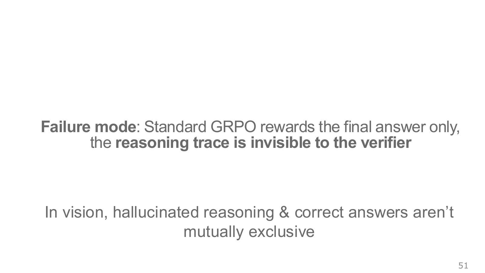

```text
Failure mode: Standard GRPO rewards the final answer only,
the reasoning trace is invisible to the verifier

In vision, hallucinated reasoning & correct answers aren't
mutually exclusive

51
```

## Slide 53

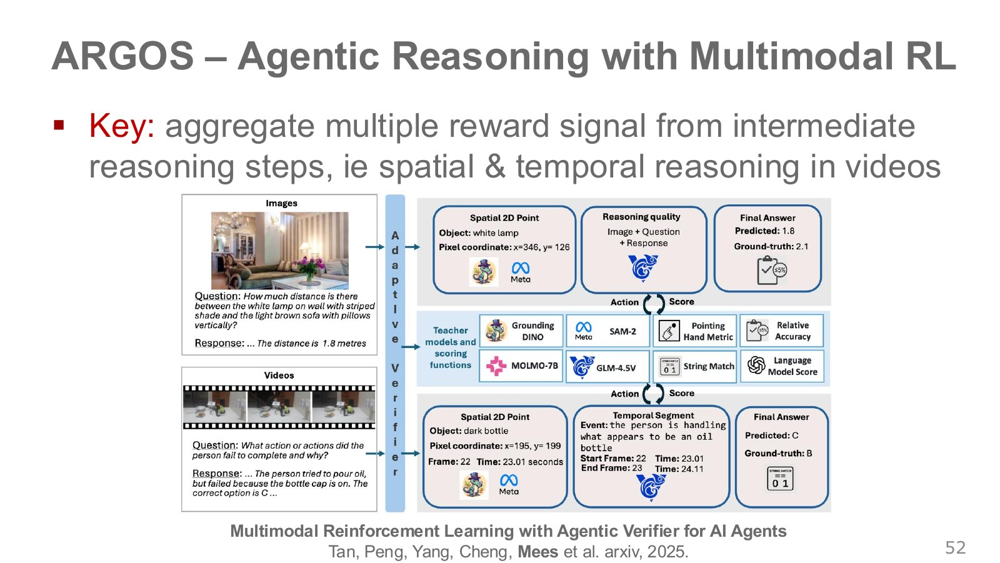

```text
ARGOS - Agentic Reasoning with Multimodal RL

« Key: aggregate multiple reward signal from intermediate
reasoning steps, ie spatial & temporal reasoning in videos

Spatial 2D Point Reasoning quality Fe een
Object: white lamp Image + Question Predicted: 1.8
Pixel coordinate: x=346, y= 126 “a EERETE Ground-truth: 2.1
Meta 7
Questi S
uestion: How much distance is there =
between the white lamp on wall with striped Action ) Score
shade and the light brown sofa with pillows
vertically? & Grounding || (X) Pointing Relative
Teacher SAM-2
Meta Ac
Response: ... The distance is 1.8 metres models and BIND. Hand Matic curacy
scoring anna
functi )-7 i
functions ae MOLMO-7B WS aumasy ‘String Match Model Scare
Action 5) Score
Spatial2D Point pee creo semen (Final Answer
ws nt:tthe person is handling
Cease use a what appears to be an oi] Predicted: C

Question: What action or actions did the
-

Pixel coordinate: x=195, y= 199 || bottle
person failto complete and why?

Ground-truth: B
Frame: 22 Time: 23.01 seconds| | StartFrame:22 Time: 23.01

End Frame: 23 Time: 24.11
os €

A i X

Multimodal Reinforcement Learning with Agentic Verifier for Al Agents
Tan, Peng, Yang, Cheng, Mees et al. arxiv, 2025. 52

Response: ... The person tried to pour oil,
but failed because the bottle cap is on. The
correct option is C...
```

## Slide 54

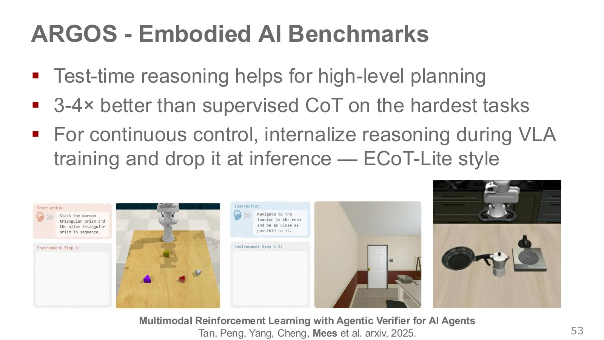

```text
ARGOS - Embodied Al Benchmarks

« Test-time reasoning helps for high-level planning
« 3-4x better than supervised CoT on the hardest tasks

# For continuous control, internalize reasoning during VLA
training and drop it at inference - ECoT-Lite style

Multimodal Reinforcement Learning with Agentic Verifier for Al Agents
Tan, Peng, Yang, Cheng, Mees et al. arxiv, 2025.

53
```

## Slide 55

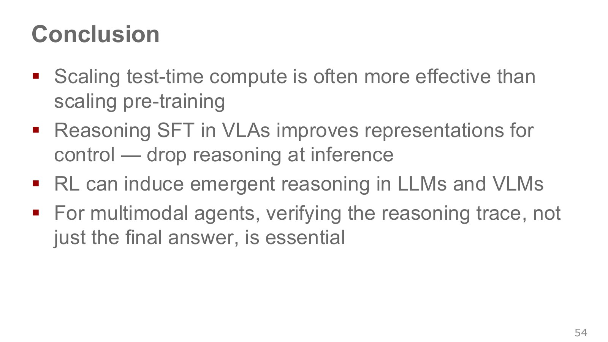

```text
Conclusion

Scaling test-time compute is often more effective than
scaling pre-training

Reasoning SFT in VLAs improves representations for
control - drop reasoning at inference

RL can induce emergent reasoning in LLMs and VLMs

For multimodal agents, verifying the reasoning trace, not
just the final answer, is essential

54
```

## Slide 56


```text
Thank you for your attention
```

## Slide 57

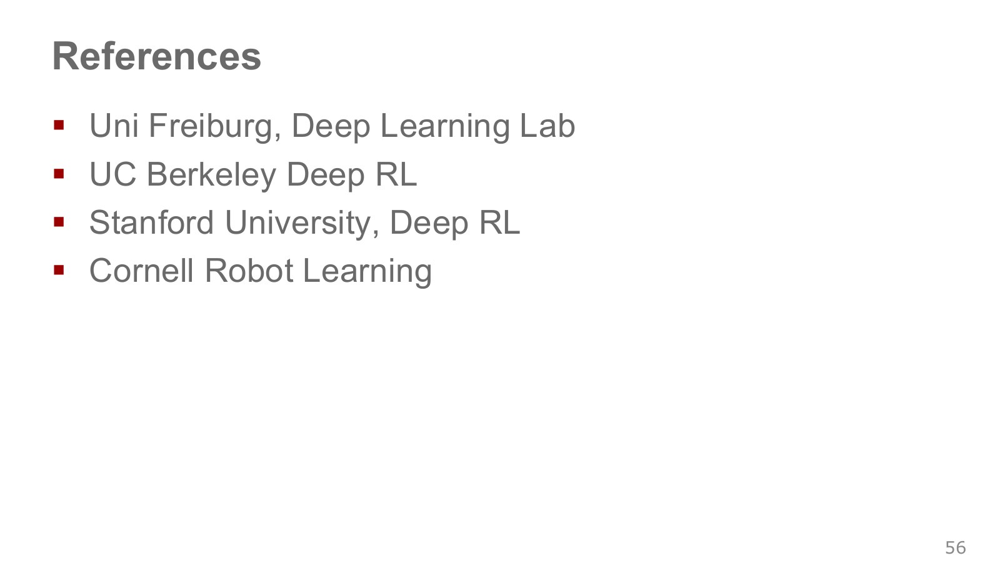

```text
References

# Uni Freiburg, Deep Learning Lab
«" UC Berkeley Deep RL

« Stanford University, Deep RL

« Cornell Robot Learning

56
```

---

[← Course home](../README.md) · [Open optional slide gallery →](../curriculum/week-10-embodied-reasoning.md)
