# Week 11 - Frontiers and Open Problems: OCR transcript

[← Course home](../README.md) · **Default OCR view** · [Open optional slide gallery →](../curriculum/week-11-frontiers.md)

> This is an automated OCR transcript generated from the locally rendered slide images. Use the image as the source of truth for equations, diagrams, citations, and small text.

## Slide 1

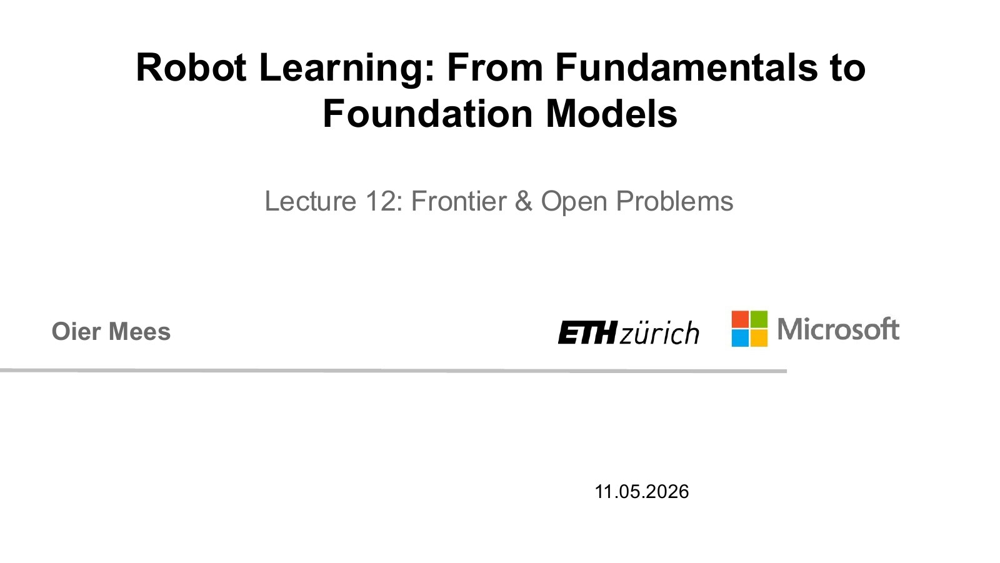

```text
Robot Learning: From Fundamentals to
Foundation Models

Lecture 12: Frontier & Open Problems

Oier Mees ETHzirich §® Microsoft

11.05.2026
```

## Slide 2

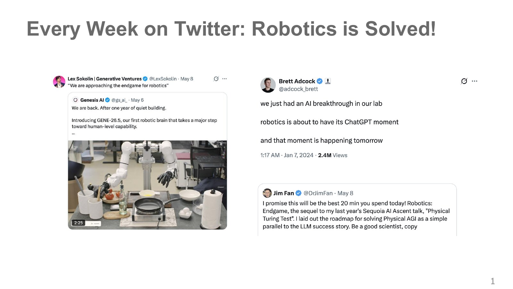

```text
Every Week on Twitter: Robotics is Solved!

e Lex Sokolin | Generative Ventures @ @LexSokolin - May 8 Go Brett Adcock @ 1 Gm
“We are approaching the endgame for robotics” @adcock brett

O Genesis Al @ @gs ai_: May6

va we just had an Al breakthrough in our lab
We are back. After one year of quiet building.

Introducing GENE-26.5, our first robotic brain that takes a major step robotics is about to have its ChatGPT moment
toward human-level capability.

and that moment is happening tomorrow

1:17 AM - Jan 7, 2024 - 2.4M Views

@ Jim Fan @ @duimFan- May8

| promise this will be the best 20 min you spend today! Robotics:
Endgame, the sequel to my last year's Sequoia Al Ascent talk, "Physical
Turing Test" | laid out the roadmap for solving Physical AGI as a simple
parallel to the LLM success story. Be a good scientist, copy
```

## Slide 3

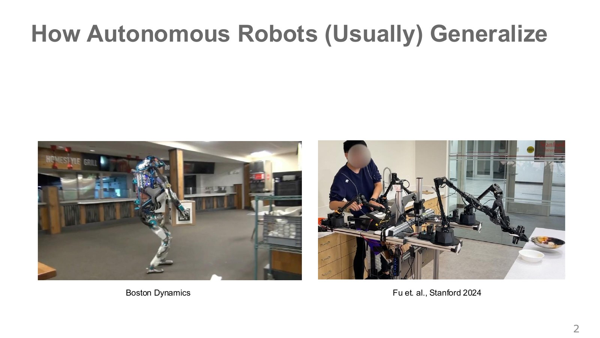

```text
How Autonomous Robots (Usually) Generalize

Boston Dynamics Fu et. al., Stanford 2024
```

## Slide 4

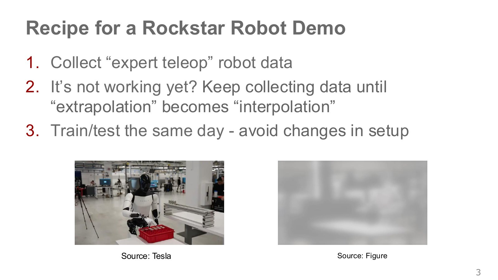

```text
Recipe for a Rockstar Robot Demo

1. Collect “expert teleop” robot data

2. It's not working yet? Keep collecting data until
“extrapolation” becomes “interpolation”

3. Train/test the same day - avoid changes in setup

Source: Tesla Source: Figure
```

## Slide 5

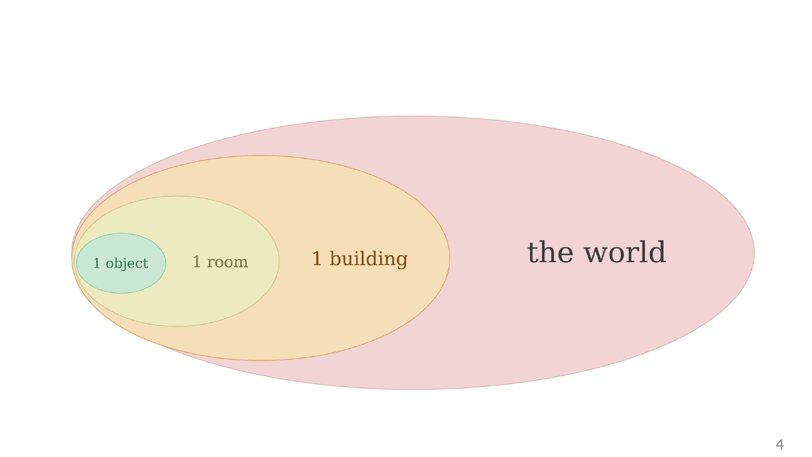

```text
_No text was detected on this slide._
```

## Slide 6

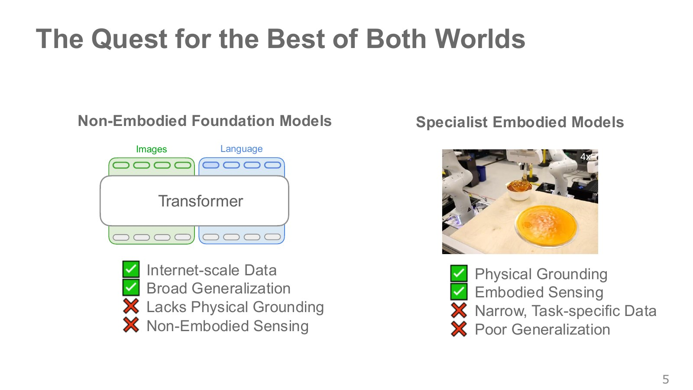

```text
The Quest for the Best of Both Worlds

Non-Embodied Foundation Models Specialist Embodied Models

Images Language

Transformer

Internet-scale Data Physical Grounding
Broad Generalization Embodied Sensing
% Lacks Physical Grounding X Narrow, Task-specific Data
% Non-Embodied Sensing %€ Poor Generalization
```

## Slide 7

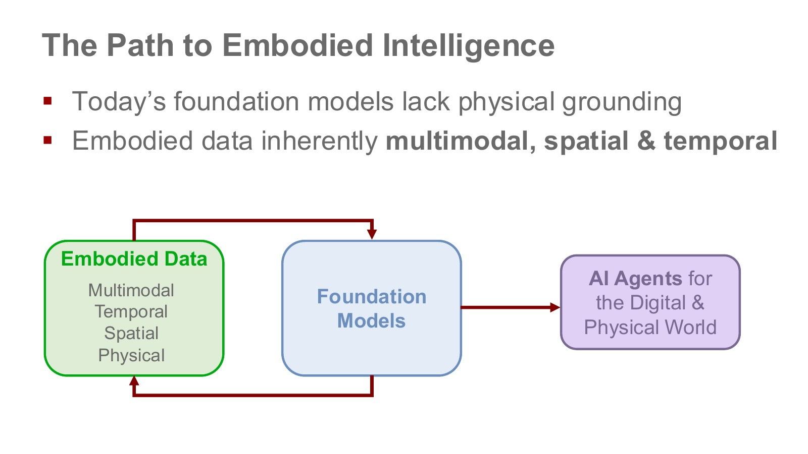

```text
The Path to Embodied Intelligence

« Today’s foundation models lack physical grounding
= Embodied data inherently multimodal, spatial & temporal

Embodied Data
; Al Agents for
“Temporal Foundation the Digital &
Spatial Models Physical World
Physical
```

## Slide 8

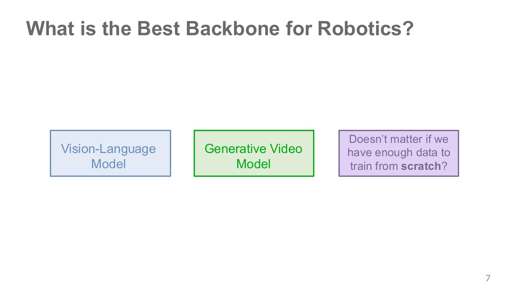

```text
What is the Best Backbone for Robotics?

Vision-Language
Model

Generative Video
Model

Doesn't matter if we
have enough data to
train from scratch?
```

## Slide 9

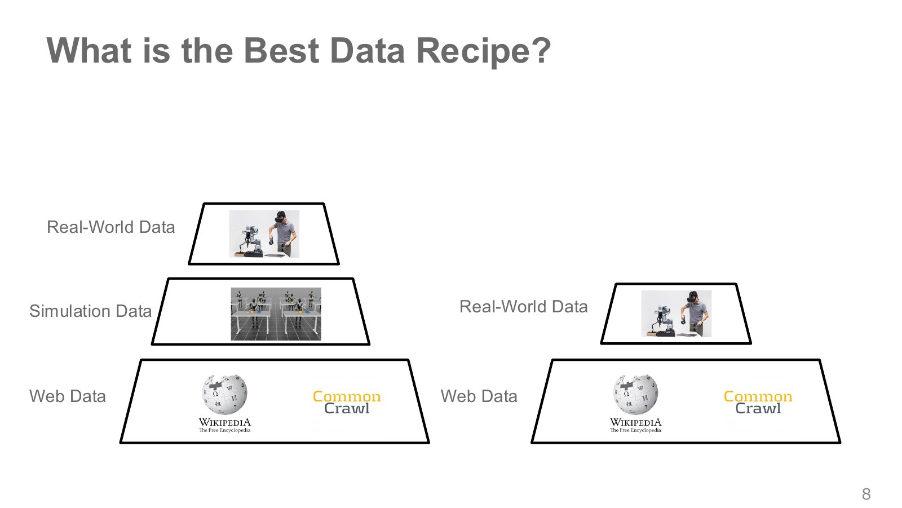

```text
What is the Best Data Recipe?

Real-World Data & hy

Simulation cia

Real-World Data

-24

(is
Web Data ‘ ie Common Web Data
_ Crawl
WIKIPEDIA ne

Common
Crawl

\
```

## Slide 10

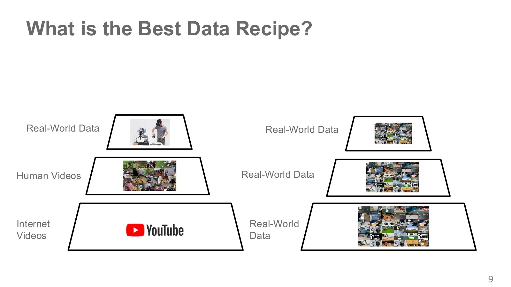

```text
What is the Best Data Recipe?

Real-World Data Real-World Data
Human vor | \ Real-World Data /

Internet Real-World
videos 3 VouTube Data
```

## Slide 11

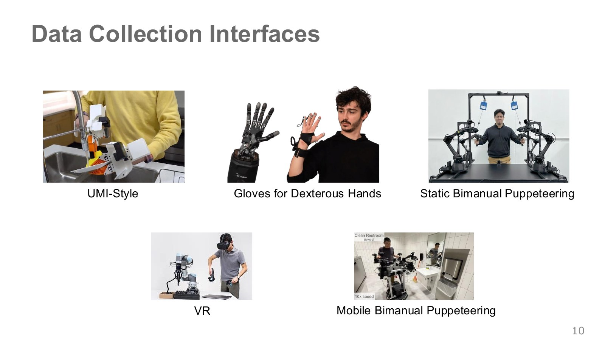

```text
Data Collection Interfaces

UMI-Style Gloves for Dexterous Hands

at

Static Bimanual Puppeteering

Mobile Bimanual Puppeteering

10
```

## Slide 12

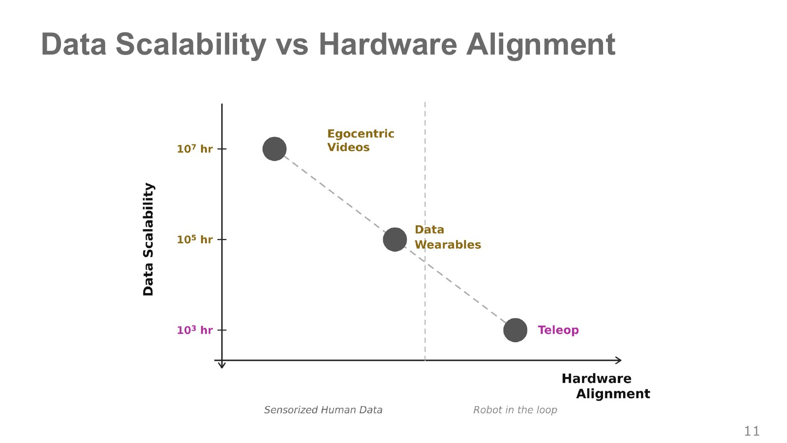

```text
Data Scalability vs Hardware Alignment

Data Scalability

107 hr 4

105 hr 4

103 hr 4

Egocentric
Videos

N

Data
Wearables
~ N
IN
S
XS
S
.

~
S
\
r ) Teleop

Sensorized Human Data

Hardware
Alignment
Robot in the loop

11
```

## Slide 13

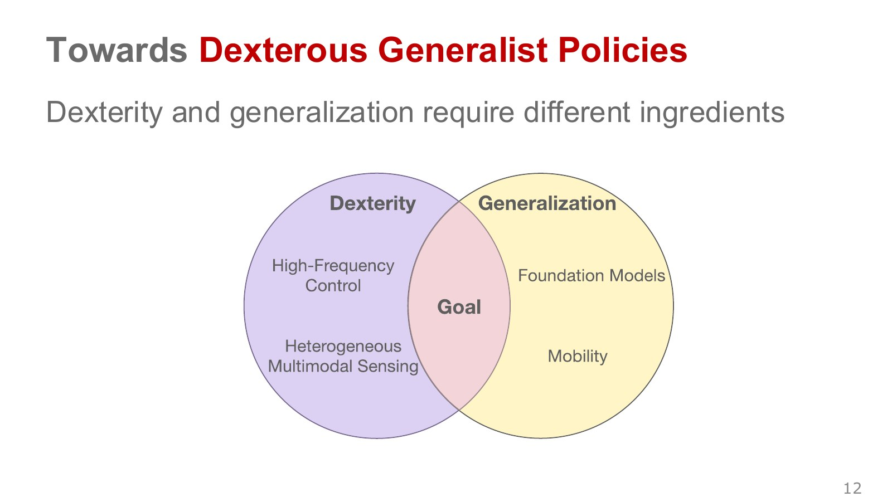

```text
Towards Dexterous Generalist Policies

Dexterity and generalization require different ingredients

Dexterity Generalization

High-Frequency
Control

Foundation Models

Heterogeneous

Multimodal Sensing Mobility

12,
```

## Slide 14

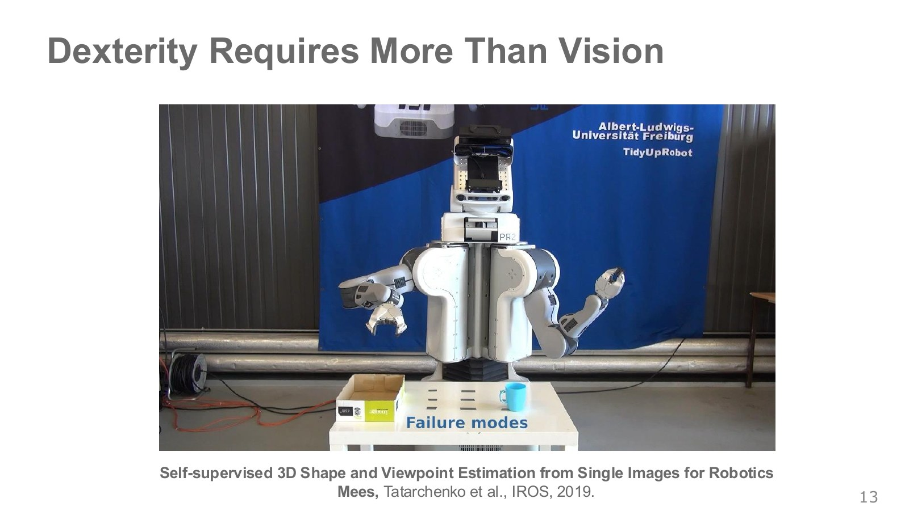

```text
Dexterity Requires More Than Vision

, Albert-Ludwigs-
Universitat Freiburg

TidyUpRobot

Failure modes

Self-supervised 3D Shape and Viewpoint Estimation from Single Images for Robotics
Mees, Tatarchenko et al., IROS, 2019.

13
```

## Slide 15

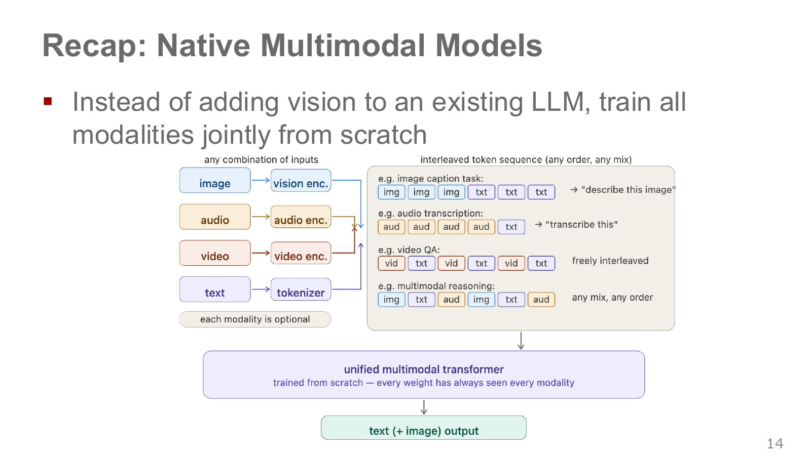

```text
Recap: Native Multimodal Models

= Instead of adding vision to an existing LLM, train all
modalities jointly from scratch

any combination of inputs

| image _ | vision ene -

| video ‘video ene, -

tokenizer

each modality is optional

interleaved token sequence (any order, any mix)

e.g. image caption task:
{img |[img ][img |{ txt [txt ][ txt ] > "describe this image"

e.g. audio transcription:

> "transcribe this"

e.g. video QA:
(via )(xt_}(vid }( txt) via ](txt_] freely interleaved

e.g. multimodal reasoning:
{img }{ txt }{ aud }[ img }{ txt ]{ aud} any mix, any order

J

unified multimodal transformer
trained from scratch - every weight has always seen every modality

J

(

text (+ image) output }

14
```

## Slide 16

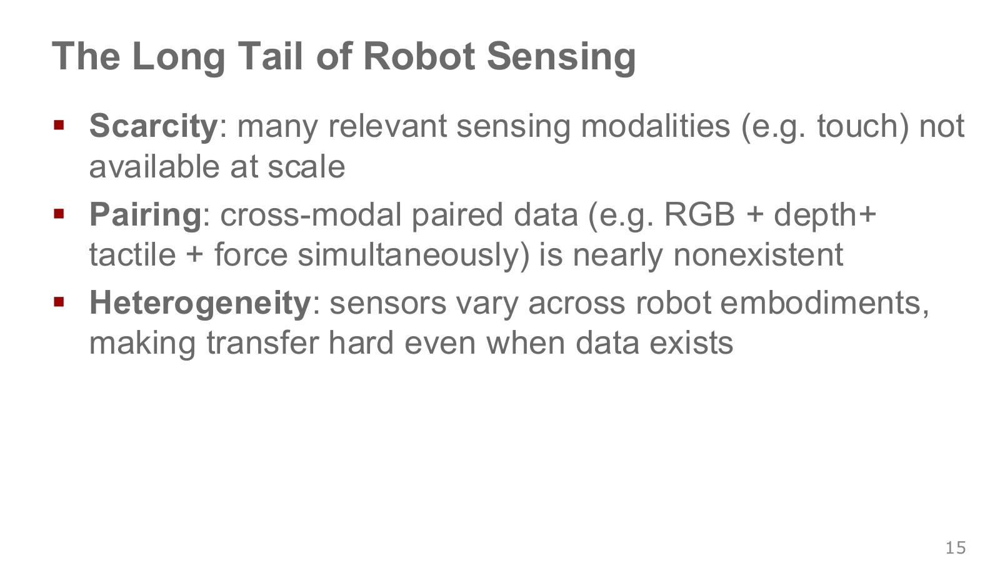

```text
The Long Tail of Robot Sensing

" Scarcity: many relevant sensing modalities (e.g. touch) not
available at scale

« Pairing: cross-modal paired data (e.g. RGB + depth+
tactile + force simultaneously) is nearly nonexistent

" Heterogeneity: sensors vary across robot embodiments,
making transfer hard even when data exists

15
```

## Slide 17

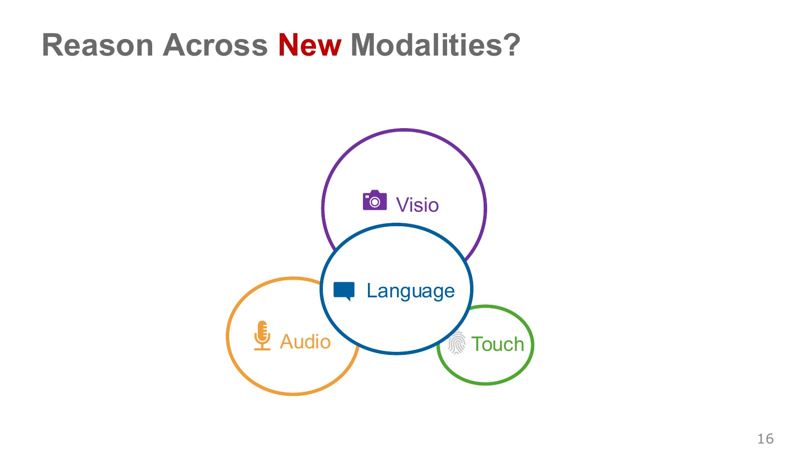

```text
Reason Across New Modalities?

@® Language

16
```

## Slide 18

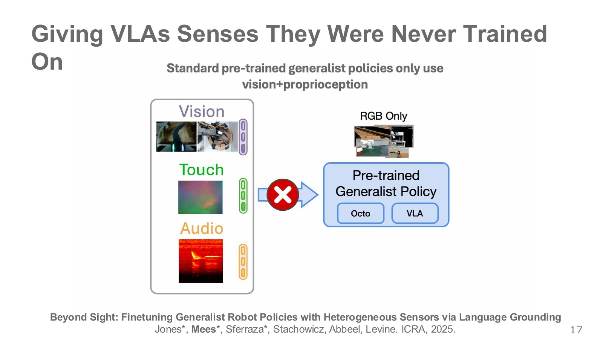

```text
Giving VLAs Senses They Were Never Trained

On Standard pre-trained generalist policies only use
vision+proprioception

Vision

ma,

Touch

|

Audio

i

>

RGB Only

Pre-trained
Generalist Policy

Octo ( VLA )

Beyond Sight: Finetuning Generalist Robot Policies with Heterogeneous Sensors via Language Grounding
Jones*, Mees*, Sferraza*, Stachowicz, Abbeel, Levine. ICRA, 2025. 17
```

## Slide 19

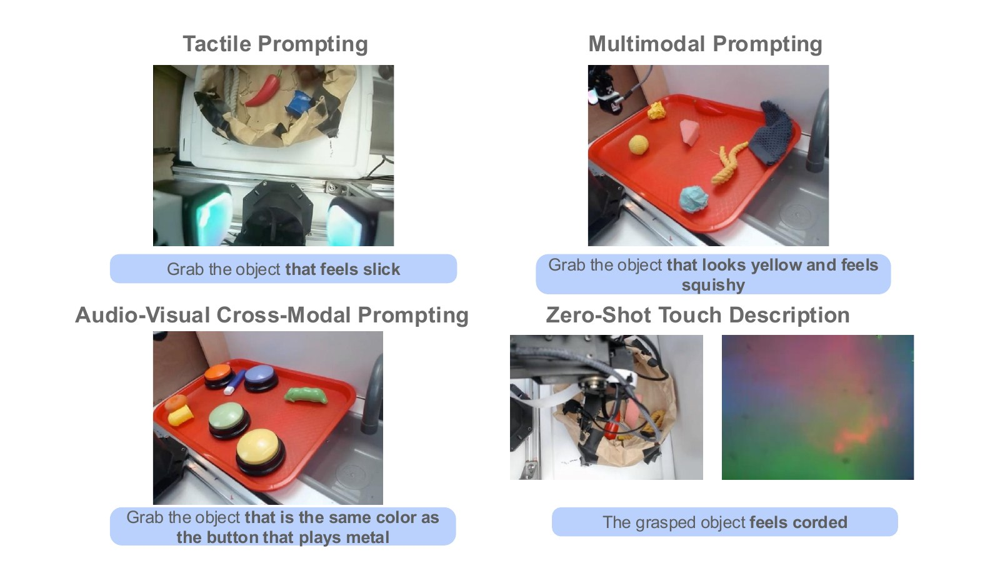

```text
Tactile Prompting Multimodal Prompting

Grab the object that feels slick Grab the object that looks yellow and feels

squishy
Audio-Visual Cross-Modal Prompting Zero-Shot Touch Description

Grab the object that is the same color as The grasped object feels corded
the button that plays metal
```

## Slide 20

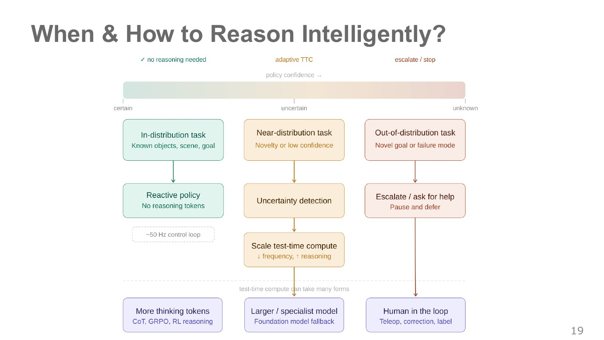

```text
When & How to Reason Intelligently?

¥ no reasoning needed adaptive TTC escalate / stop
policy confidence
| |
certain uncertain unknown
In-distribution task Near-distribution task Out-of-distribution task
Known objects, scene, goal Novelty or low confidence Novel goal or failure mode
|
Reactive polit . 5
‘ policy Uncertainty detection Escalate / ask for help
No reasoning tokens Pause and defer
~50 Hz control loop
Scale test-time compute
4 frequency, + reasoning
est-time compute dan take many forms
More thinking tokens Larger / specialist model Human in the loop
CoT, GRPO, RL reasoning Foundation model fallback Teleop, correction, label

u : 19
```

## Slide 21

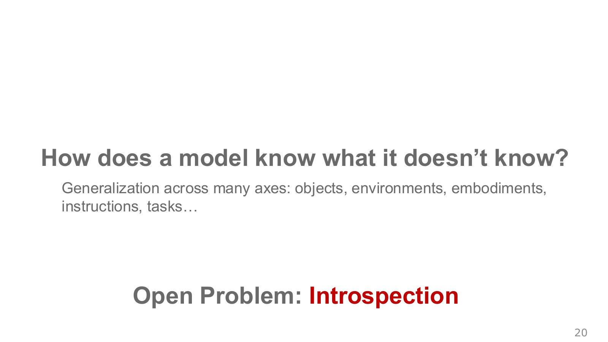

```text
How does a model know what it doesn’t know?

Generalization across many axes: objects, environments, embodiments,
instructions, tasks...

Open Problem: Introspection

20
```

## Slide 22

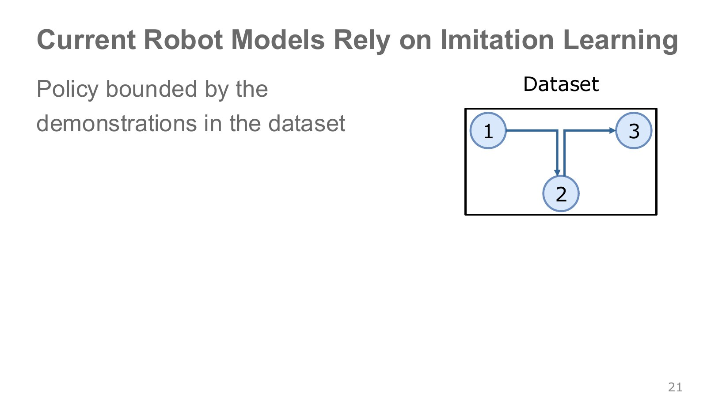

```text
Current Robot Models Rely on Imitation Learning

Policy bounded by the Dataset
demonstrations in the dataset

21
```

## Slide 23

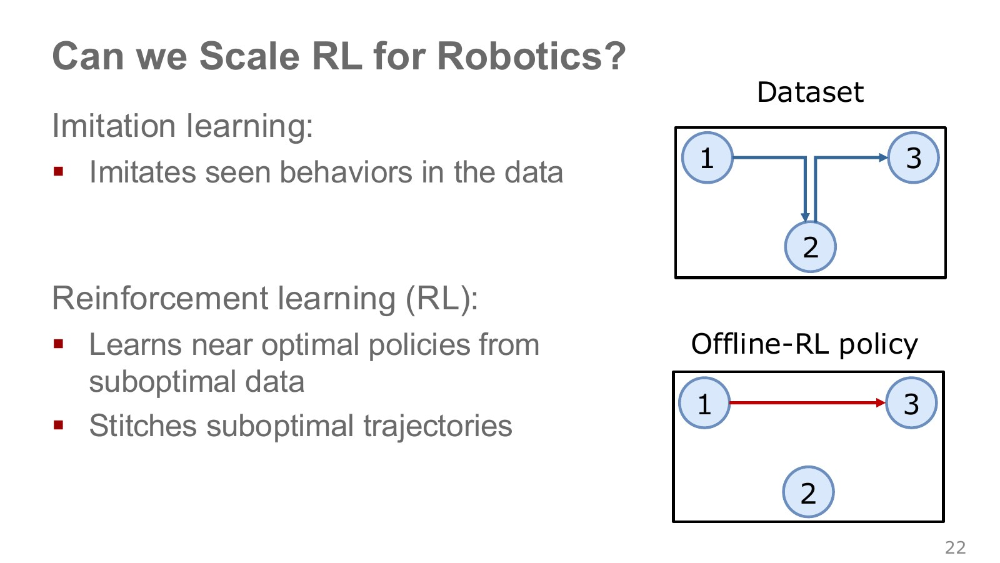

```text
Can we Scale RL for Robotics?

Imitation learning:
= |Imitates seen behaviors in the data

Reinforcement learning (RL):

« Learns near optimal policies from
suboptimal data

= Stitches suboptimal trajectories

Dataset

Offline-RL policy

@-®
@)

22
```

## Slide 24

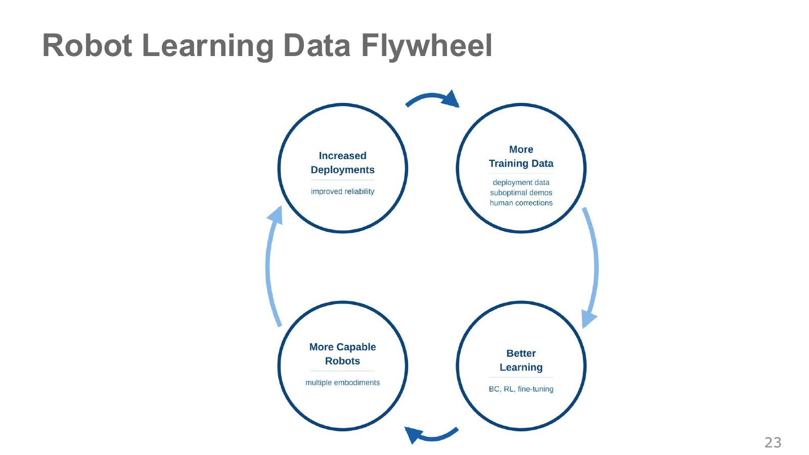

```text
Robot Learning Data Flywheel
a \

More

Increased ies
Training Data

Deployments

deployment data
suboptimal demos
human corrections

improved reliability

More Capable
Robots

Better
Learning
multiple embodiments

BC, RL, fine-tuning

23
```

## Slide 25

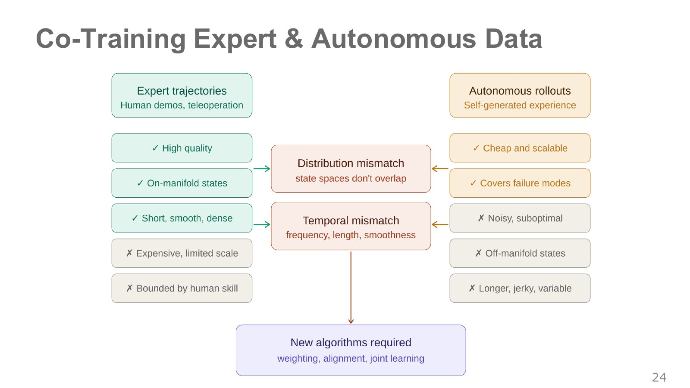

```text
Expert trajectories
Human demos, teleoperation

¥ High quality

Co-Training Expert & Autonomous Data

Autonomous rollouts
Self-generated experience

v On-manifold states

Distribution mismatch
state spaces don't overlap

¥ Cheap and scalable

¥ Covers failure modes

¥ Short, smooth, dense

X Expensive, limited scale

Temporal mismatch
frequency, length, smoothness

X Noisy, suboptimal

X Bounded by human skill

X Off-manifold states

X Longer, jerky, variable

New algorithms required
weighting, alignment, joint learning

24
```

## Slide 26

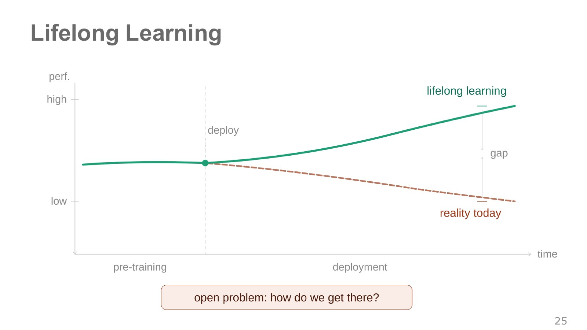

```text
Lifelong Learning

perf.
lifelong learnin
high : ia 2
deploy
gap
2 ae
low TUT San.
reality today
time
pre-training deployment

open problem: how do we get there?

25
```

## Slide 27

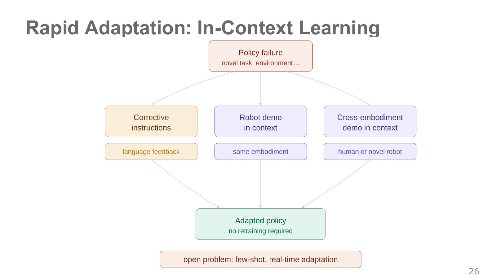

```text
Rapid Adaptation: In-Context Learning

Policy failure
novel task, environment...

Corrective Robot demo Cross-embodiment
instructions in context demo in context

( language feedback ( same embodiment | ( human or novel robot

Adapted policy
no retraining required

| open problem: few-shot, real-time adaptation

26
```

## Slide 28

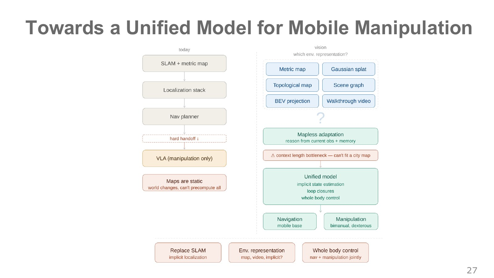

```text
Towards a Unified Model for Mobile Manipulation

today

SLAM + metric map

Localization stack

Nav planner

hard handoff 1

: |
VLA (manipulation only)

Maps are static
world changes, can't precompute all

vision
which env, representation?

( Metric map ) ( Gaussian splat ]

l Topological map if Scene graph }

l BEV projection } ( Walkthrough video }

Mapless adaptation
teason from current obs + memory

( 4 context length bottleneck - can't fit a city map }

Unified model
implicit state estimation
loop closures
whole body control
J
Navigation | | Manipulation
mobile base bimanual, dexterous

Replace SLAM
implicit localization

Env. representation Whole body control
map, video, implicit?

nav + manipulation jointly

27
```

## Slide 29

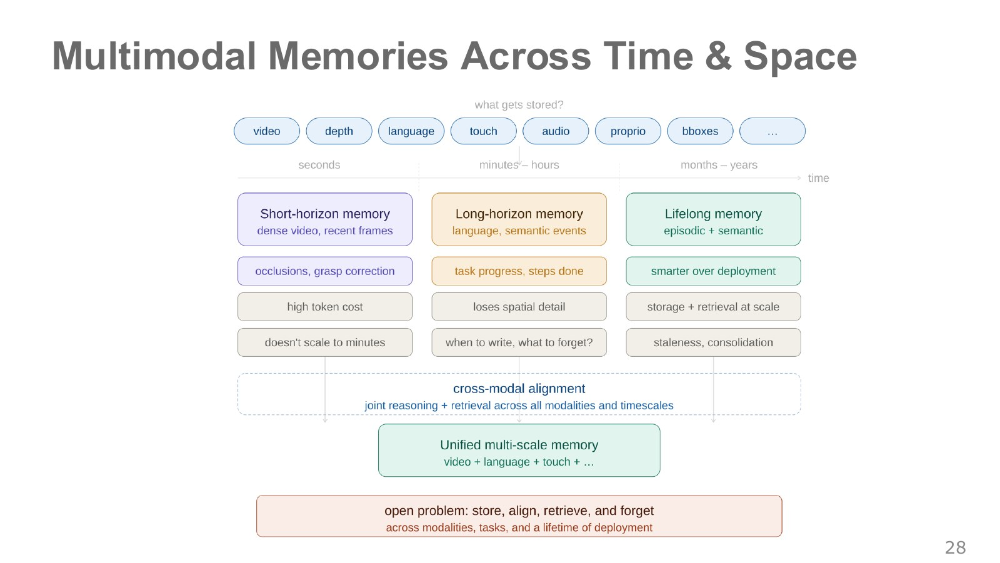

```text
Multimodal Memories Across Time & Space

what gets stored?

Gp 4D GD &) G> 2D & ED

seconds

minutes’ hours

months - years

time

Short-horizon memory
dense video, recent frames

Long-horizon memory
language, semantic events

Lifelong memory
episodic + semantic

( occlusions, grasp correction

task progress, steps done } (

smarter over deployment ]

high token cost

loses spatial detail

storage + retrieval at scale

doesn't scale to minutes

staleness, consolidation

cross-modal alignment

joint reasoning + retrieval across all modalities and timescales

Unified multi-scale memory
video + language + touch + ...

open problem: store, align, retrieve, and forget
across modalities, tasks, and a lifetime of deployment

28
```

## Slide 30

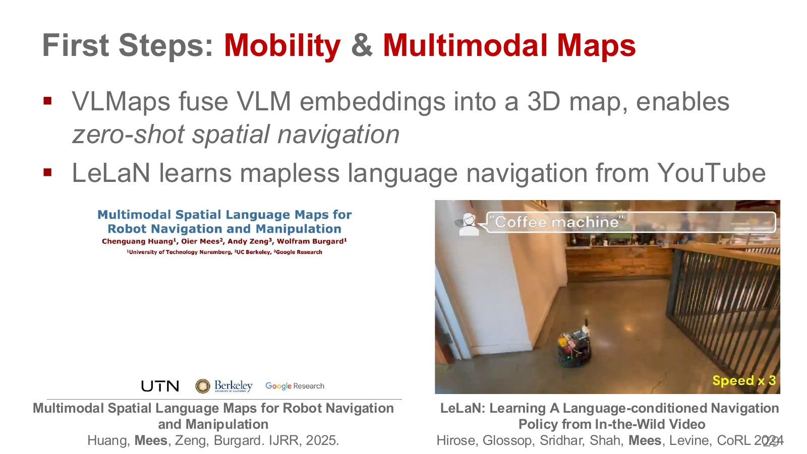

```text
First Steps: Mobility & Multimodal Maps

« VLMaps fuse VLM embeddings into a 3D map, enables
zero-shot spatial navigation

= LeLaN learns mapless language navigation from YouTube

Multimodal Spatial Language Maps for @ fe Bachine ay Ta. Neue)
Robot Navigation and Manipulation --,
Chenguang Huang', Oier Mees”, Andy Zeng?, Wolfram Burgard’ - 2 2
2University of Technology Nuremberg, 2UC Berkeley, "Google Research we

UTN © Berkeley coosle Researen

Multimodal Spatial Language Maps for Robot Navigation LeLaN: Learning A Language-conditioned Navigation
and Manipulation Policy from In-the-Wild Video
Huang, Mees, Zeng, Burgard. IJRR, 2025. Hirose, Glossop, Sridhar, Shah, Mees, Levine, CoRL 2024
```

## Slide 31

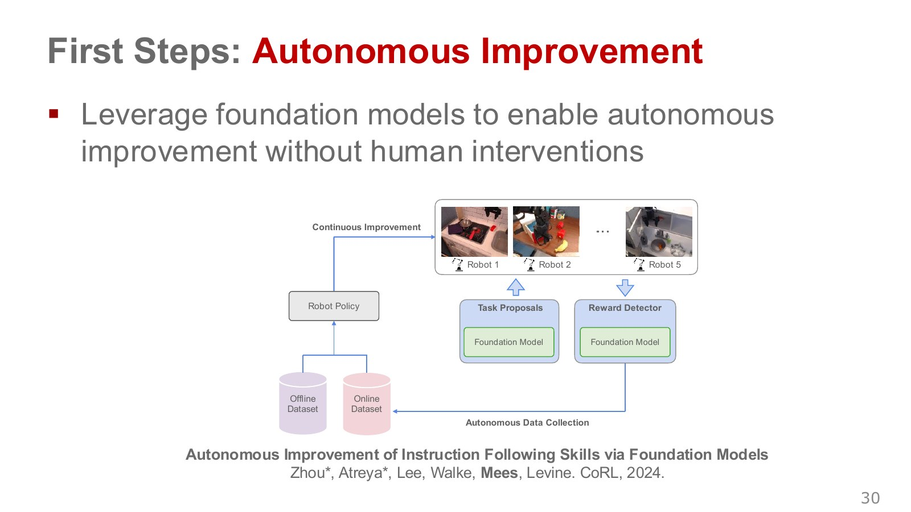

```text
First Steps: Autonomous Improvement

« Leverage foundation models to enable autonomous
improvement without human interventions

Continuous Improvement

Offline
Dataset

olicy

Online
Dataset

wm

FET ?Z Robot 2 Robe

Task ao =e Detector

Foundation Model Foundation Model

Autonomous Data Collection

Autonomous Improvement of Instruction Following Skills via Foundation Models
Zhou*, Atreya*, Lee, Walke, Mees, Levine. CoRL, 2024.

30
```

## Slide 32

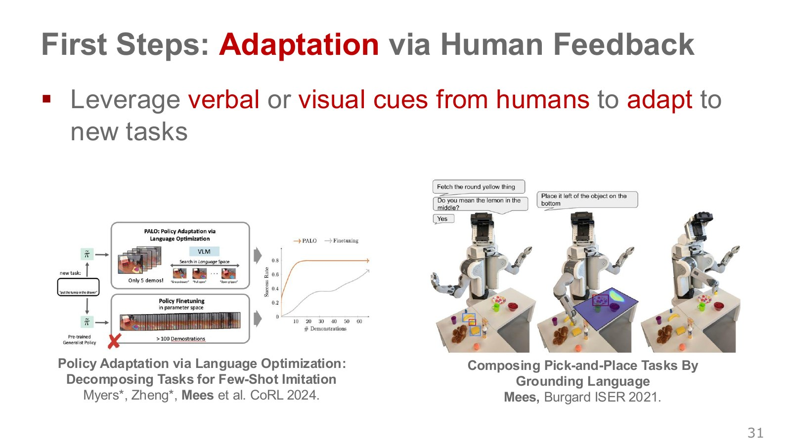

```text
First Steps: Adaptation via Human Feedback

= Leverage verbal or visual cues from humans to adapt to
new tasks

Fetch the round yellow thing
= Place it left of the object on the
(Gagne ia) mean the Temon in the bok
es.

Policy Adaptation via Language Optimization: Composing Pick-and-Place Tasks By
Decomposing Tasks for Few-Shot Imitation Grounding Language
Myers*, Zheng*, Mees et al. CoRL 2024. Mees, Burgard ISER 2021.

31
```

## Slide 33

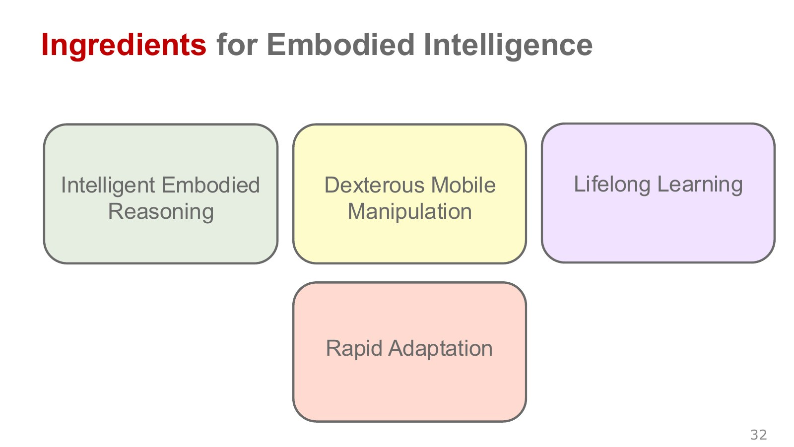

```text
Ingredients for Embodied Intelligence

( >
Intelligent Embodied Dexterous Mobile Lifelong Learning
Reasoning Manipulation
S 4
( >)
Rapid Adaptation
XN y

32
```

## Slide 34

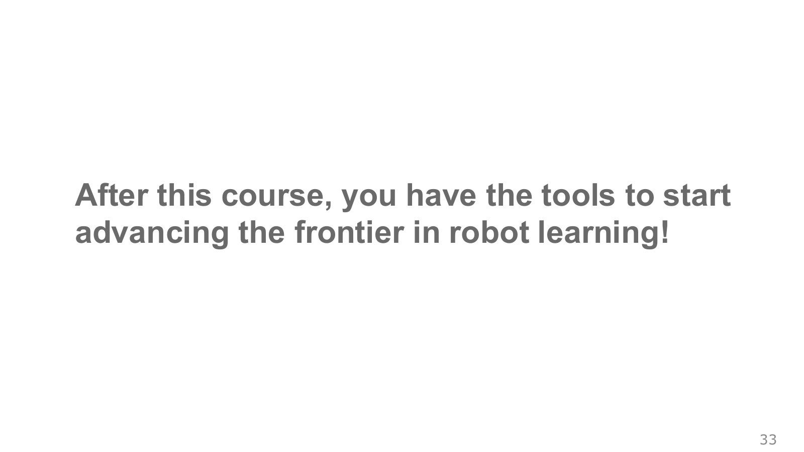

```text
After this course, you have the tools to start
advancing the frontier in robot learning!

33
```

## Slide 35

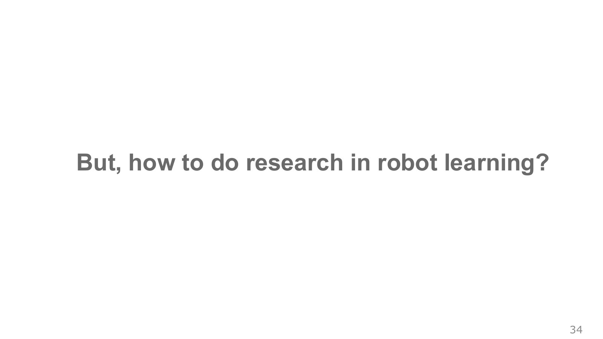

```text
But, how to do research in robot learning?

34
```

## Slide 36

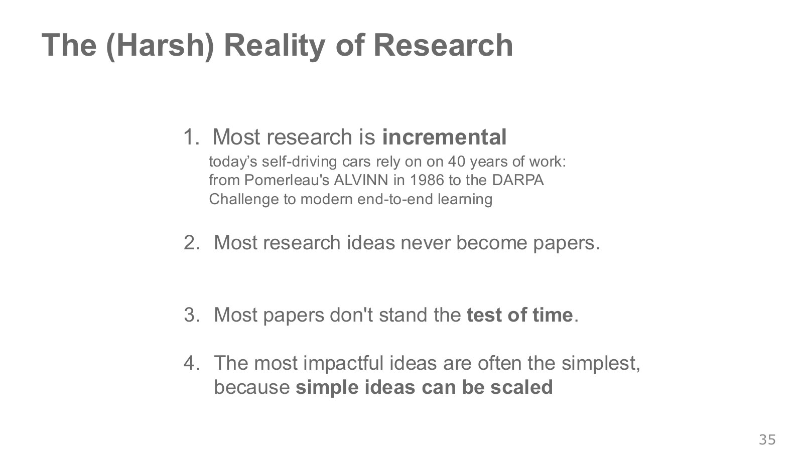

```text
The (Harsh) Reality of Research

1. Most research is incremental

today’s self-driving cars rely on on 40 years of work:
from Pomerleau's ALVINN in 1986 to the DARPA
Challenge to modern end-to-end learning

2. Most research ideas never become papers.

3. Most papers don't stand the test of time.

4. The most impactful ideas are often the simplest,
because simple ideas can be scaled

35
```

## Slide 37

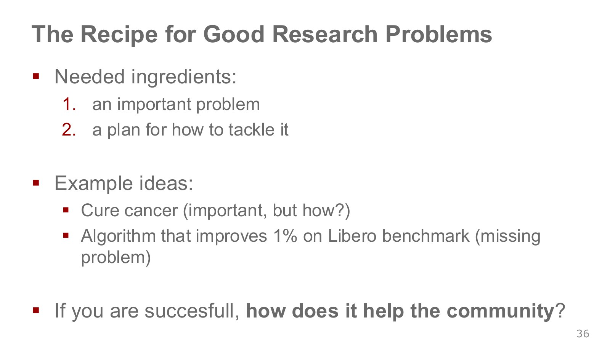

```text
The Recipe for Good Research Problems

» Needed ingredients:
1. animportant problem
2. aplan for how to tackle it

«» Example ideas:
= Cure cancer (important, but how?)

» Algorithm that improves 1% on Libero benchmark (missing
problem)

= If you are succesfull, how does it help the community?
36
```

## Slide 38

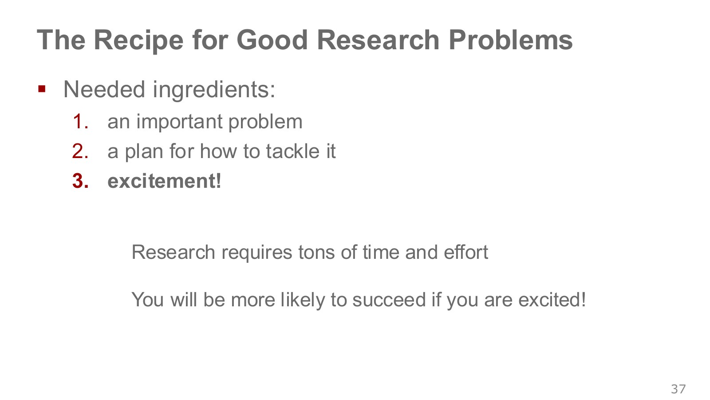

```text
The Recipe for Good Research Problems

» Needed ingredients:
1. animportant problem
2. aplan for how to tackle it
3. excitement!

Research requires tons of time and effort

You will be more likely to succeed if you are excited!

37
```

## Slide 39

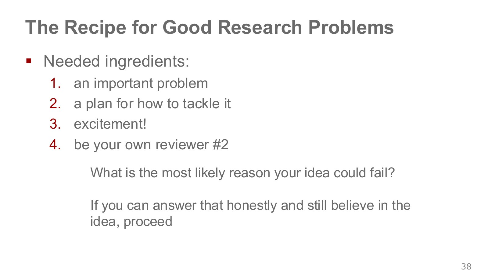

```text
The Recipe for Good Research Problems

» Needed ingredients:
1. animportant problem
2. aplan for how to tackle it
3. excitement!
4. be your own reviewer #2

What is the most likely reason your idea could fail?

If you can answer that honestly and still believe in the
idea, proceed

38
```

## Slide 40

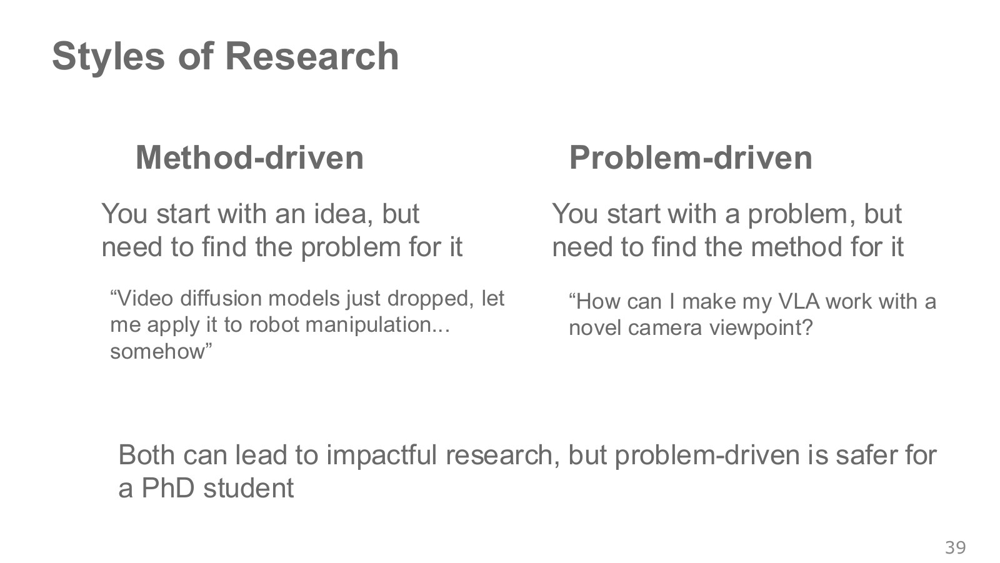

```text
Styles of Research

Method-driven Problem-driven
You start with an idea, but You start with a problem, but
need to find the problem for it need to find the method for it
‘Video diffusion models just dropped, let “How can | make my VLA work with a
me apply it to robot manipulation... novel camera viewpoint?
somehow”

Both can lead to impactful research, but problem-driven is safer for
a PhD student

39
```

## Slide 41

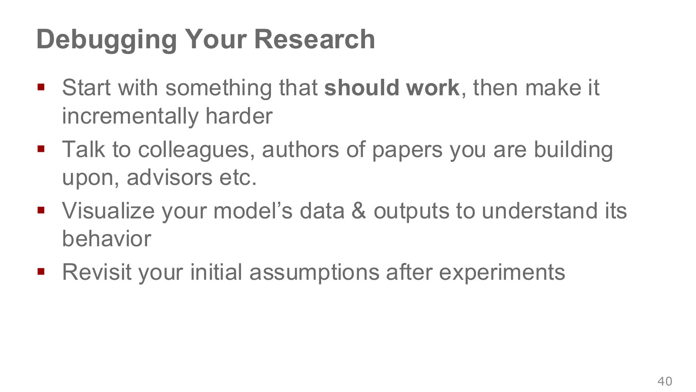

```text
Debugging Your Research

Start with something that should work, then make it
incrementally harder

Talk to colleagues, authors of papers you are building
upon, advisors etc.

Visualize your model’s data & outputs to understand its
behavior

Revisit your initial assumptions after experiments

40
```

## Slide 42

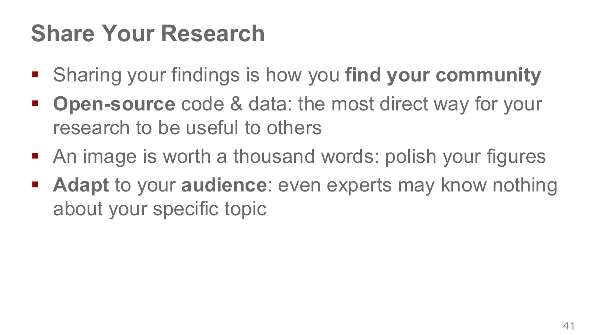

```text
Share Your Research

» Sharing your findings is how you find your community

= Open-source code & data: the most direct way for your
research to be useful to others

« An image is worth a thousand words: polish your figures

= Adapt to your audience: even experts may know nothing
about your specific topic

41
```

## Slide 43

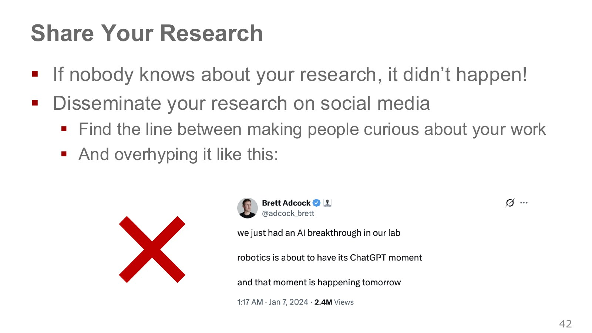

```text
Share Your Research

« If nobody knows about your research, it didn’t happen!

« Disseminate your research on social media
« Find the line between making people curious about your work
# And overhyping it like this:

Brett Adcock @ 4 JJ
@adcock brett

we just had an Al breakthrough in our lab
robotics is about to have its ChatGPT moment

and that moment is happening tomorrow

1:17 AM - Jan 7, 2024 - 2.4M Views

42
```

## Slide 44

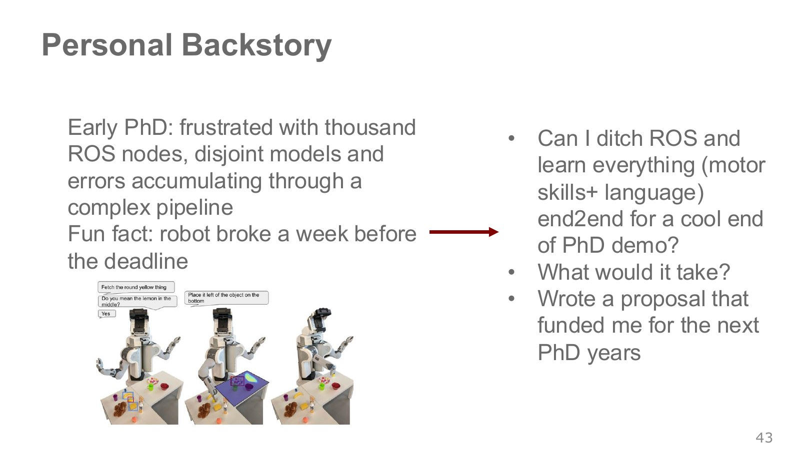

```text
Personal Backstory

Early PhD: frustrated with thousand

ROS nodes, disjoint models and

errors accumulating through a

complex pipeline

Fun fact: robot broke a week before =>
the deadline

Can | ditch ROS and
learn everything (motor
skillst+ language)
end2end for a cool end
of PhD demo?

What would it take?
Wrote a proposal that
funded me for the next
PhD years

43
```

## Slide 45

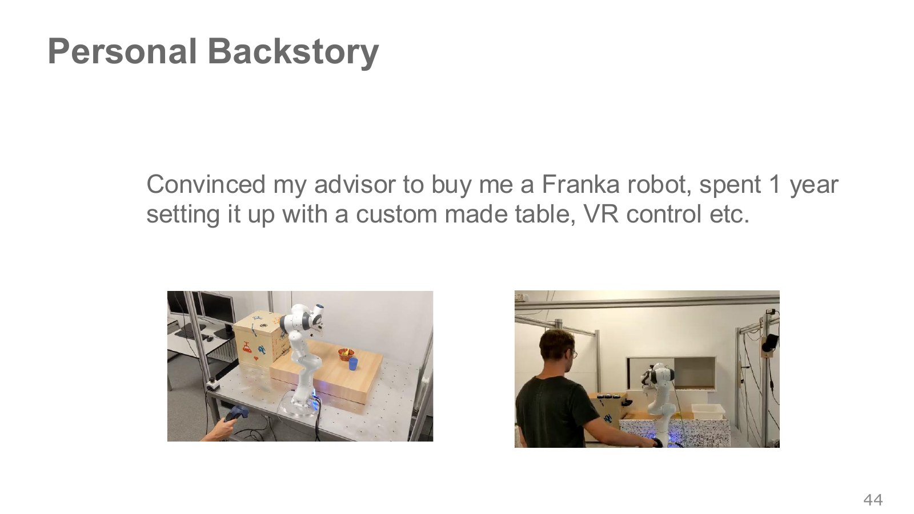

```text
Personal Backstory

Convinced my advisor to buy me a Franka robot, spent 1 year
setting it up with a custom made table, VR control etc.

44
```

## Slide 46

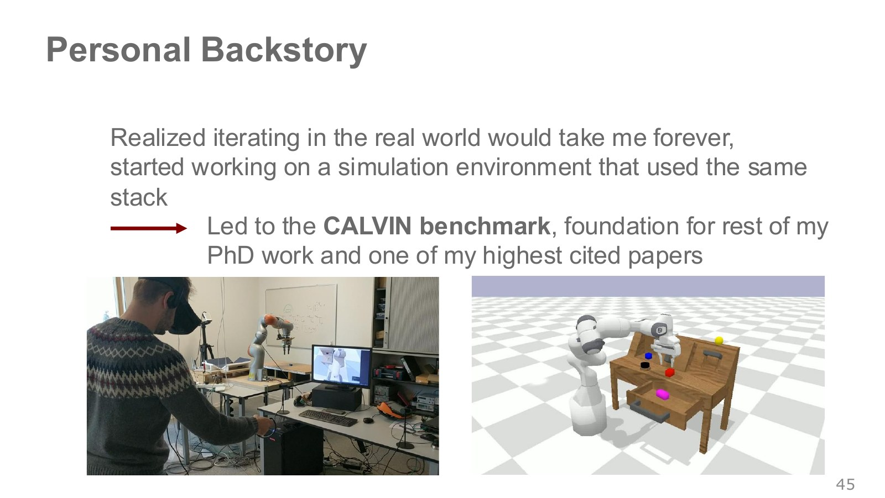

```text
Personal Backstory

Realized iterating in the real world would take me forever,
started working on a simulation environment that used the same

stack
-- Led to the CALVIN benchmark, foundation for rest of my

PhD work and one of my highest cited papers

Te...

45
```

## Slide 47

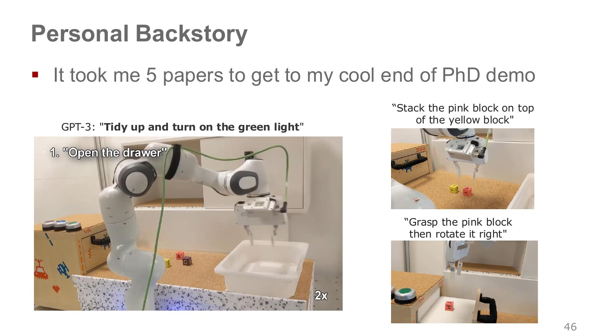

```text
Personal Backstory

« It took me 5 papers to get to my cool end of PhD demo

GPT-3: "Tidy up and turn on the green light"

“Stack the pink block on top
of the yellow block"

“Grasp the pink block
then rotate it right"

46
```

## Slide 48

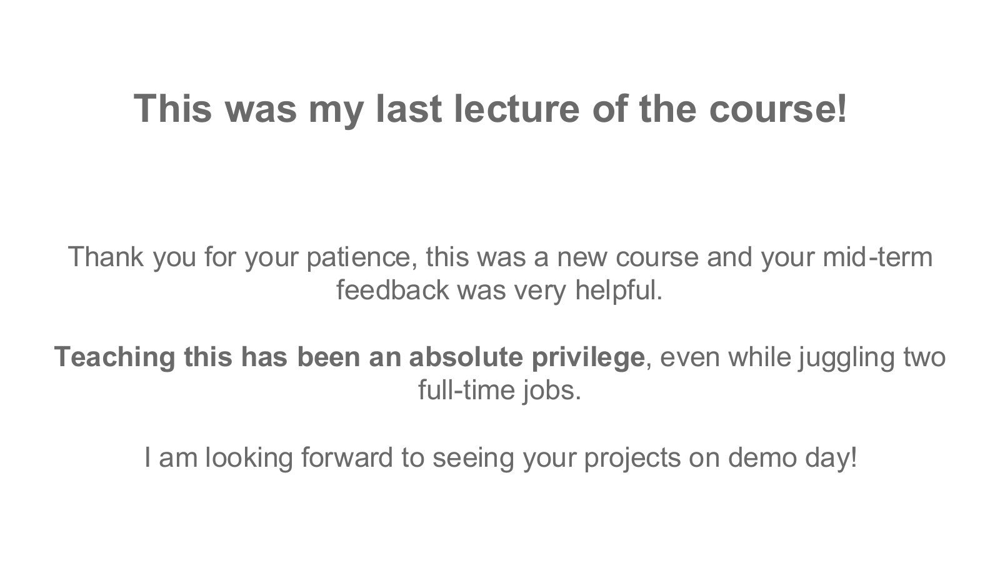

```text
This was my last lecture of the course!

Thank you for your patience, this was a new course and your mid-term
feedback was very helpful.

Teaching this has been an absolute privilege, even while juggling two
full-time jobs.

| am looking forward to seeing your projects on demo day!
```

## Slide 49

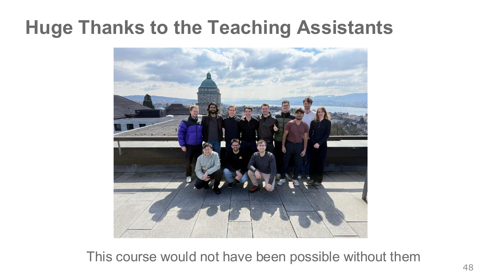

```text
Huge Thanks to the Teaching Assistants

>

This course would not have been possible without them

48
```

## Slide 50

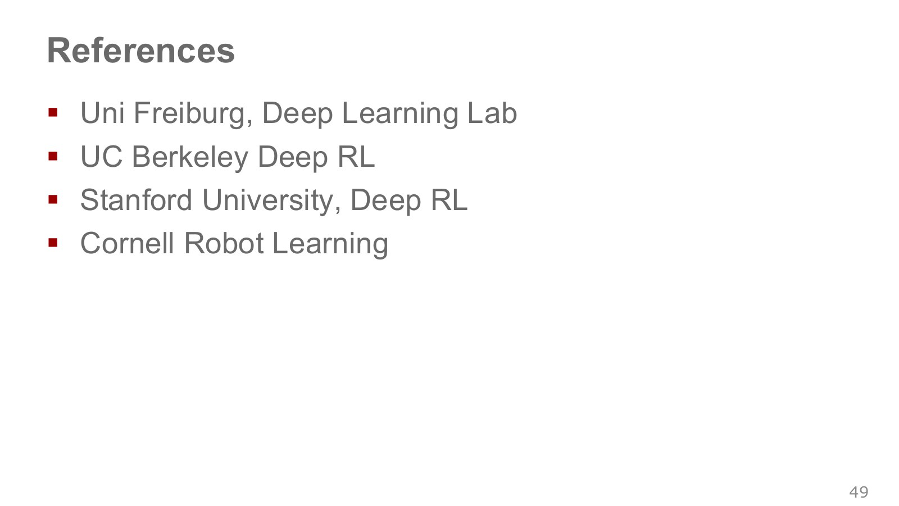

```text
References

# Uni Freiburg, Deep Learning Lab
«" UC Berkeley Deep RL

« Stanford University, Deep RL

« Cornell Robot Learning

49
```

---

[← Course home](../README.md) · [Open optional slide gallery →](../curriculum/week-11-frontiers.md)
